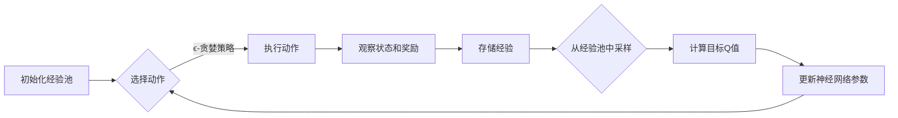

## 一切皆是映射：AI深度强化学习DQN原理入门

作者：禅与计算机程序设计艺术

### 1. 背景介绍

#### 1.1 强化学习：与环境交互，学习最佳策略

强化学习（Reinforcement Learning, RL）是机器学习的一个重要分支，它专注于训练智能体（Agent）在与环境交互的过程中，通过试错学习最佳策略。想象一下，你正在学习骑自行车。你尝试不同的动作，比如踩踏板、控制方向，并根据环境的反馈（例如是否保持平衡）来调整你的行为。经过不断的尝试和调整，你最终学会了如何平稳地骑行。这就是强化学习的基本思想。

#### 1.2 深度学习：赋予强化学习强大的表征能力

深度学习（Deep Learning, DL）是近年来取得突破性进展的另一个机器学习领域。它利用多层神经网络来学习数据的复杂表示，并在图像识别、自然语言处理等领域取得了显著成果。将深度学习引入强化学习，可以赋予智能体更强大的表征能力，使其能够处理更复杂的任务。

#### 1.3 DQN：深度强化学习的里程碑

深度Q网络（Deep Q-Network, DQN）是深度强化学习的里程碑式算法。它将深度学习与强化学习中的Q学习算法相结合，利用深度神经网络来逼近Q函数，从而解决了许多传统强化学习算法难以解决的问题。DQN的出现，为深度强化学习的发展开辟了新的道路。

### 2. 核心概念与联系

#### 2.1 智能体、环境、状态、动作、奖励

在强化学习中，智能体与环境不断交互，以最大化累积奖励。以下是几个核心概念：

- **智能体（Agent）**:  执行动作并与环境交互的学习者。
- **环境（Environment）**:  智能体所处的外部世界，它对智能体的动作做出响应，并提供新的状态和奖励。
- **状态（State）**:  环境的当前情况，它包含了智能体做出决策所需的所有信息。
- **动作（Action）**:  智能体在特定状态下可以采取的操作。
- **奖励（Reward）**:  环境对智能体动作的反馈，它可以是正面的（鼓励）或负面的（惩罚）。

#### 2.2 Q函数：评估动作的价值

Q函数（Q-function）是强化学习中的一个重要概念，它用于评估在特定状态下采取特定动作的长期价值。更具体地说，Q(s, a) 表示在状态 s 下采取动作 a 后，智能体期望获得的累积奖励。

#### 2.3 策略：根据状态选择动作

智能体的策略（Policy）决定了它在每个状态下应该采取哪个动作。一个好的策略应该能够最大化智能体获得的累积奖励。

#### 2.4 DQN：用深度神经网络逼近Q函数

DQN算法的核心思想是利用深度神经网络来逼近Q函数。具体来说，DQN使用一个神经网络来表示Q函数，网络的输入是状态 s，输出是所有可能动作的Q值。通过训练神经网络，DQN可以学习到一个能够准确预测Q值的函数，从而指导智能体做出最优决策。

### 3. 核心算法原理具体操作步骤

#### 3.1 经验回放：打破数据关联性

DQN算法使用经验回放（Experience Replay）机制来解决数据关联性问题。具体来说，DQN将智能体与环境交互的经验（状态、动作、奖励、下一个状态）存储在一个经验池中。在训练过程中，DQN从经验池中随机抽取一批经验样本，用于更新神经网络的参数。这种随机抽样的方式可以打破数据之间的关联性，提高训练效率。

#### 3.2 目标网络：稳定训练过程

DQN算法使用目标网络（Target Network）来稳定训练过程。具体来说，DQN使用两个相同结构的神经网络：一个是主网络，另一个是目标网络。主网络的参数在每次迭代中都会更新，而目标网络的参数则保持不变，每隔一段时间才会将主网络的参数复制到目标网络中。目标网络的作用是提供稳定的Q值目标，避免训练过程出现震荡。

#### 3.3 ϵ-贪婪策略：平衡探索与利用

DQN算法使用ϵ-贪婪策略（ϵ-greedy Policy）来平衡探索与利用。具体来说，在每个状态下，智能体以ϵ的概率随机选择一个动作，以1-ϵ的概率选择Q值最高的动作。ϵ的值通常会随着训练的进行而逐渐减小，这意味着智能体会逐渐从探索转向利用。

#### 3.4 算法流程图



### 4. 数学模型和公式详细讲解举例说明

#### 4.1 Q学习更新规则

Q学习算法的核心是更新规则，它用于更新Q函数的估计值。具体来说，Q学习算法使用以下公式来更新Q(s, a)：

$$ Q(s, a) \leftarrow Q(s, a) + \alpha [r + \gamma \max_{a'} Q(s', a') - Q(s, a)] $$

其中：

-  $s$ 是当前状态
-  $a$ 是当前动作
-  $r$ 是在状态 $s$ 下采取动作 $a$ 后获得的奖励
-  $s'$ 是下一个状态
-  $a'$ 是在状态 $s'$ 下可以采取的動作
-  $\alpha$ 是学习率，它控制着每次更新的步长
-  $\gamma$ 是折扣因子，它决定了未来奖励的重要性

#### 4.2 DQN损失函数

DQN算法使用以下损失函数来训练神经网络：

$$ L(\theta) = \mathbb{E}[(r + \gamma \max_{a'} Q(s', a'; \theta^-) - Q(s, a; \theta))^2] $$

其中：

-  $\theta$ 是主网络的参数
-  $\theta^-$ 是目标网络的参数

#### 4.3 举例说明

假设我们正在训练一个智能体玩游戏。游戏的目标是在迷宫中找到宝藏。智能体的状态是它在迷宫中的位置，动作是它可以移动的方向（上、下、左、右）。当智能体找到宝藏时，它会获得 +1 的奖励；当它撞到墙壁时，它会获得 -1 的奖励。

我们可以使用DQN算法来训练智能体玩这个游戏。首先，我们需要创建一个神经网络来表示Q函数。网络的输入是智能体的状态（迷宫中的位置），输出是所有可能动作的Q值。然后，我们可以使用Q学习算法来训练神经网络。在每次迭代中，智能体会与环境交互，并将经验存储在经验池中。然后，我们会从经验池中随机抽取一批经验样本，并使用这些样本来更新神经网络的参数。

### 5. 项目实践：代码实例和详细解释说明

```python
import gym
import torch
import torch.nn as nn
import torch.optim as optim
import random
from collections import deque

# 定义超参数
BATCH_SIZE = 32
GAMMA = 0.99
EPS_START = 1.0
EPS_END = 0.01
EPS_DECAY = 1000
TARGET_UPDATE = 10
MEMORY_SIZE = 10000

# 定义DQN网络
class DQN(nn.Module):
    def __init__(self, input_dim, output_dim):
        super(DQN, self).__init__()
        self.fc1 = nn.Linear(input_dim, 128)
        self.fc2 = nn.Linear(128, 64)
        self.fc3 = nn.Linear(64, output_dim)

    def forward(self, x):
        x = torch.relu(self.fc1(x))
        x = torch.relu(self.fc2(x))
        x = self.fc3(x)
        return x

# 定义经验回放
class ReplayMemory:
    def __init__(self, capacity):
        self.memory = deque(maxlen=capacity)

    def push(self, state, action, reward, next_state, done):
        self.memory.append((state, action, reward, next_state, done))

    def sample(self, batch_size):
        return random.sample(self.memory, batch_size)

    def __len__(self):
        return len(self.memory)

# 定义智能体
class Agent:
    def __init__(self, input_dim, output_dim):
        self.policy_net = DQN(input_dim, output_dim)
        self.target_net = DQN(input_dim, output_dim)
        self.target_net.load_state_dict(self.policy_net.state_dict())
        self.target_net.eval()
        self.optimizer = optim.Adam(self.policy_net.parameters())
        self.memory = ReplayMemory(MEMORY_SIZE)
        self.steps_done = 0

    def select_action(self, state):
        sample = random.random()
        eps_threshold = EPS_END + (EPS_START - EPS_END) * \
            math.exp(-1. * self.steps_done / EPS_DECAY)
        self.steps_done += 1
        if sample > eps_threshold:
            with torch.no_grad():
                return self.policy_net(state).max(1)[1].view(1, 1)
        else:
            return torch.tensor([[random.randrange(output_dim)]], dtype=torch.long)

    def optimize_model(self):
        if len(self.memory) < BATCH_SIZE:
            return
        transitions = self.memory.sample(BATCH_SIZE)
        batch = Transition(*zip(*transitions))
        non_final_mask = torch.tensor(tuple(map(lambda s: s is not None,
                                              batch.next_state)), dtype=torch.bool)
        non_final_next_states = torch.