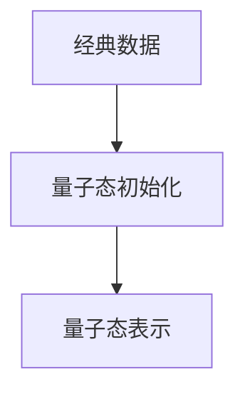
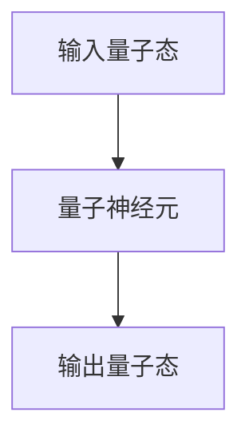

# 一切皆是映射：AI的前沿研究：量子计算与机器学习

作者：禅与计算机程序设计艺术

## 1. 背景介绍

### 1.1 量子计算的崛起

量子计算是利用量子力学原理进行信息处理的计算模式。与经典计算机依赖于比特的二进制逻辑（0和1）不同，量子计算机使用量子比特（qubits），可以同时处于多个状态。这种特性使得量子计算机在处理某些复杂问题时具有显著的优势。

### 1.2 机器学习的进化

机器学习（ML）是人工智能（AI）的核心分支之一，旨在通过数据训练模型，使计算机能够自动进行预测和决策。近年来，随着数据量的爆炸性增长和计算能力的提升，机器学习取得了显著进展，广泛应用于图像识别、自然语言处理、推荐系统等领域。

### 1.3 量子计算与机器学习的融合

量子计算和机器学习的结合被认为是未来计算领域的重要发展方向。量子计算有望解决经典计算机难以处理的大规模数据问题，而机器学习则可以利用量子计算的强大计算能力提升算法性能。本文将深入探讨量子计算与机器学习的核心概念、算法原理、实际应用及未来发展趋势。

## 2. 核心概念与联系

### 2.1 量子比特与经典比特

量子比特（qubits）是量子计算的基本单位，与经典计算中的比特不同，量子比特可以同时处于0和1的叠加态。量子比特的这种特性源于量子力学的叠加原理和纠缠原理，使得量子计算能够并行处理大量信息。

### 2.2 量子门与经典逻辑门

量子门是量子计算中的基本操作单元，类似于经典计算中的逻辑门。常见的量子门包括Hadamard门、CNOT门和Pauli门等。量子门通过操作量子比特的状态，实现量子计算的基本操作。

### 2.3 量子算法与经典算法

量子算法利用量子计算的特性，在某些问题上具有显著的优势。例如，Shor算法可以高效地进行大整数分解，Grover算法可以加速无序数据库的搜索。这些算法在经典计算中难以实现或效率低下，但在量子计算中却表现出强大的计算能力。

### 2.4 量子机器学习

量子机器学习是将量子计算与机器学习相结合的研究领域。它利用量子计算的特性，提升机器学习算法的性能和效率。量子机器学习的研究包括量子支持向量机、量子神经网络、量子强化学习等。

## 3. 核心算法原理具体操作步骤

### 3.1 量子支持向量机（QSVM）

量子支持向量机（QSVM）是量子机器学习中的一种重要算法，用于分类问题。其基本原理是利用量子计算的特性，加速支持向量机的训练过程。

#### 3.1.1 数据预处理

数据预处理是QSVM的第一步，包括数据标准化、特征提取和量子态表示。经典数据需要转换为量子态，以便在量子计算机上进行处理。

#### 3.1.2 量子态初始化

在量子计算机上初始化量子态，将经典数据映射到量子比特的状态。常用的方法是通过量子电路实现数据的量子态表示。



#### 3.1.3 量子内积计算

量子支持向量机的核心是计算量子态之间的内积。量子计算机可以高效地计算量子态的内积，从而加速支持向量机的训练过程。

#### 3.1.4 量子优化

利用量子优化算法（如量子变分算法）进行支持向量机的参数优化。量子优化算法能够高效地搜索参数空间，找到最优的分类边界。

### 3.2 量子神经网络（QNN）

量子神经网络（QNN）是将量子计算与神经网络相结合的一种算法。其基本原理是利用量子计算的并行性和量子态的叠加特性，提升神经网络的训练效率和性能。

#### 3.2.1 量子态表示

将神经网络的输入数据映射到量子态。量子态表示方法包括振幅编码、相位编码等。

#### 3.2.2 量子神经元

量子神经元是QNN的基本单元，通过量子门操作实现神经元的计算。常用的量子门包括Hadamard门、Pauli门等。



#### 3.2.3 量子反向传播

量子反向传播算法用于训练量子神经网络。与经典反向传播算法类似，量子反向传播通过计算梯度，调整量子神经网络的参数，使其输出与目标值接近。

## 4. 数学模型和公式详细讲解举例说明

### 4.1 量子态与量子门

量子态是量子计算的基本单位，可以用数学形式表示为：

$$
|\psi\rangle = \alpha|0\rangle + \beta|1\rangle
$$

其中，$\alpha$ 和 $\beta$ 是复数，满足归一化条件：

$$
|\alpha|^2 + |\beta|^2 = 1
$$

量子门是对量子态进行操作的基本单元，可以用矩阵表示。例如，Hadamard门的矩阵表示为：

$$
H = \frac{1}{\sqrt{2}}
\begin{pmatrix}
1 & 1 \\
1 & -1
\end{pmatrix}
$$

### 4.2 量子支持向量机的数学模型

量子支持向量机的目标是找到一个最优的超平面，将数据分为两类。其数学模型可以表示为：

$$
f(x) = \text{sign}(\sum_{i=1}^N \alpha_i y_i K(x_i, x) + b)
$$

其中，$K(x_i, x)$ 是核函数，$\alpha_i$ 是拉格朗日乘子，$y_i$ 是标签，$b$ 是偏置项。

### 4.3 量子神经网络的数学模型

量子神经网络的数学模型与经典神经网络类似，但其计算过程在量子态空间中进行。量子神经元的输出可以表示为：

$$
|\psi_{\text{out}}\rangle = U|\psi_{\text{in}}\rangle
$$

其中，$U$ 是量子门操作矩阵，$|\psi_{\text{in}}\rangle$ 是输入量子态，$|\psi_{\text{out}}\rangle$ 是输出量子态。

## 5. 项目实践：代码实例和详细解释说明

### 5.1 量子支持向量机代码实例

以下是使用量子计算框架Qiskit实现量子支持向量机的代码示例：

```python
from qiskit import QuantumCircuit, Aer, transpile, assemble
from qiskit.circuit.library import ZZFeatureMap
from qiskit_machine_learning.algorithms import QSVC

# 数据预处理
data = [[0, 0], [1, 1], [1, 0], [0, 1]]
labels = [0, 0, 1, 1]

# 量子态初始化
feature_map = ZZFeatureMap(feature_dimension=2, reps=2)
qc = QuantumCircuit(2)
qc.compose(feature_map, inplace=True)

# 量子支持向量机
backend = Aer.get_backend('qasm_simulator')
qsvc = QSVC(quantum_instance=backend)
qsvc.fit(data, labels)

# 预测
predictions = qsvc.predict(data)
print(predictions)
```

### 5.2 量子神经网络代码实例

以下是使用量子计算框架PennyLane实现量子神经网络的代码示例：

```python
import pennylane as qml
from pennylane import numpy as np

# 量子态表示
def layer(weights):
    qml.RX(weights[0], wires=0)
    qml.RY(weights[1], wires=0)
    qml.RZ(weights[2], wires=0)

# 量子神经网络
dev = qml.device('default.qubit', wires=1)

@qml