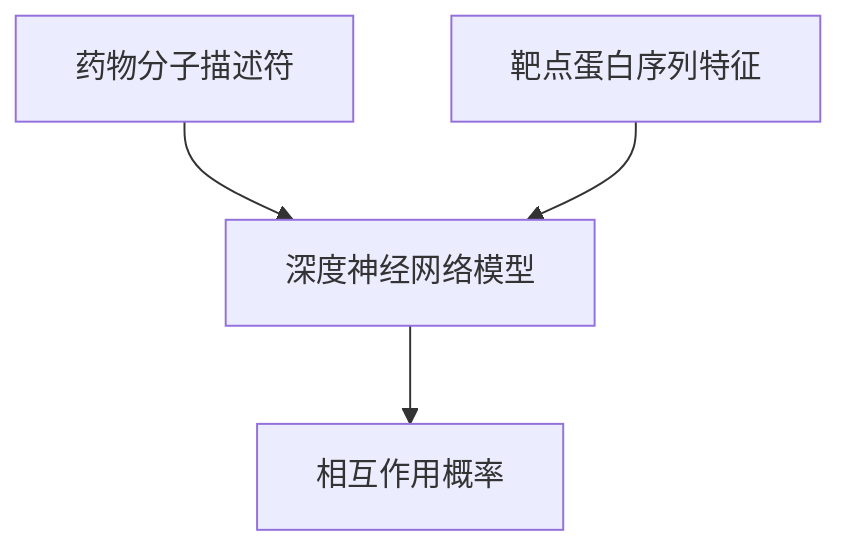

# 一切皆是映射：AI辅助的创新药物发现

作者：禅与计算机程序设计艺术

## 1. 背景介绍

### 1.1 药物发现的历史与挑战

药物发现是一项复杂而昂贵的过程，传统上依赖于大量的实验和长时间的临床试验。自20世纪初以来，药物发现和开发的成本和时间不断增加，平均需要10-15年和超过20亿美元才能将一种新药推向市场。这种高成本和高风险的特性使得制药公司面临巨大的挑战。

### 1.2 人工智能在药物发现中的崛起

随着人工智能（AI）技术的迅猛发展，AI在药物发现中的应用逐渐成为热点。AI能够处理大量数据，发现隐藏在数据中的模式，并预测潜在的药物分子。这种能力使得AI成为药物发现过程中的重要工具，能够显著加速和优化药物发现过程。

### 1.3 AI辅助药物发现的优势

AI在药物发现中的优势主要体现在以下几个方面：

- **数据处理能力**：AI能够处理和分析大量的生物医学数据，包括基因组数据、蛋白质结构数据和化学分子数据。
- **模型预测能力**：AI能够建立复杂的数学模型，预测药物分子的活性和毒性。
- **自动化能力**：AI能够自动化高通量筛选（HTS）和虚拟筛选（VS）过程，提高筛选效率。
- **个性化医疗**：AI能够根据患者的基因组信息，提供个性化的药物治疗方案。

## 2. 核心概念与联系

### 2.1 药物发现的基本流程

药物发现的基本流程包括以下几个步骤：

1. **靶点识别与验证**：确定疾病相关的生物分子靶点，并验证其在疾病中的作用。
2. **先导化合物发现**：通过高通量筛选（HTS）和虚拟筛选（VS）发现具有活性的先导化合物。
3. **先导化合物优化**：通过化学修饰优化先导化合物的活性和药代动力学性质。
4. **临床前研究**：在动物模型中验证候选药物的安全性和有效性。
5. **临床试验**：在人类受试者中进行药物的安全性和有效性测试。

### 2.2 AI在药物发现中的角色

AI在药物发现的各个阶段都发挥着重要作用：

- **靶点识别与验证**：AI通过分析基因组数据和蛋白质相互作用网络，识别潜在的药物靶点。
- **先导化合物发现**：AI通过机器学习和深度学习算法，进行高通量筛选和虚拟筛选，发现具有活性的先导化合物。
- **先导化合物优化**：AI通过分子动力学模拟和量子化学计算，优化先导化合物的结构。
- **临床前研究**：AI通过生物信息学分析，预测候选药物的毒性和药代动力学性质。
- **临床试验**：AI通过数据挖掘和统计分析，优化临床试验设计，提高临床试验的成功率。

### 2.3 主要技术与工具

在AI辅助药物发现中，主要使用的技术和工具包括：

- **机器学习**：用于数据分析和模式识别，包括监督学习、无监督学习和强化学习。
- **深度学习**：用于构建复杂的神经网络模型，处理大规模数据和高维数据。
- **自然语言处理（NLP）**：用于分析生物医学文献和专利，提取有用的信息。
- **分子动力学模拟**：用于模拟分子间的相互作用，预测分子的结构和性质。
- **量子化学计算**：用于计算分子的电子结构，预测分子的反应性和稳定性。

## 3. 核心算法原理具体操作步骤

### 3.1 机器学习在药物发现中的应用

#### 3.1.1 数据预处理

机器学习在药物发现中的第一步是数据预处理。数据预处理包括数据清洗、数据标准化和特征提取。数据清洗是去除数据中的噪声和错误，数据标准化是将数据转换为统一的尺度，特征提取是从原始数据中提取有用的特征。

#### 3.1.2 模型训练与验证

数据预处理完成后，接下来是模型训练与验证。模型训练是使用训练数据集训练机器学习模型，模型验证是使用验证数据集评估模型的性能。常用的机器学习算法包括线性回归、逻辑回归、支持向量机（SVM）、随机森林和神经网络。

#### 3.1.3 模型预测与优化

模型训练与验证完成后，可以使用训练好的模型进行预测。预测结果可以用于指导药物设计和优化。例如，使用训练好的QSAR模型，可以预测新分子的活性和毒性，从而指导分子的合成和优化。

### 3.2 深度学习在药物发现中的应用

#### 3.2.1 神经网络架构设计

深度学习在药物发现中的应用主要是通过构建复杂的神经网络模型。神经网络的架构设计包括选择网络的层数、每层的神经元数、激活函数和损失函数。常用的神经网络架构包括卷积神经网络（CNN）、循环神经网络（RNN）和生成对抗网络（GAN）。

#### 3.2.2 模型训练与优化

神经网络的训练是一个迭代的过程，通过反向传播算法不断调整网络的权重和偏置。模型优化是通过调整超参数（如学习率、批量大小和正则化参数）提高模型的性能。常用的优化算法包括随机梯度下降（SGD）、Adam和RMSprop。

#### 3.2.3 实例：药物-靶点相互作用预测

一个典型的深度学习应用是药物-靶点相互作用预测。通过构建一个深度神经网络模型，可以预测药物分子与靶点蛋白之间的相互作用。输入是药物分子的分子描述符和靶点蛋白的序列特征，输出是相互作用的概率。

## 4. 数学模型和公式详细讲解举例说明

### 4.1 机器学习模型

#### 4.1.1 线性回归模型

线性回归模型是最简单的机器学习模型之一，用于预测连续变量。线性回归模型的数学表达式为：

$$
y = \beta_0 + \beta_1 x_1 + \beta_2 x_2 + \cdots + \beta_n x_n + \epsilon
$$

其中，$y$ 是预测变量，$x_i$ 是特征变量，$\beta_i$ 是回归系数，$\epsilon$ 是误差项。

#### 4.1.2 支持向量机（SVM）

支持向量机（SVM）是一种用于分类和回归的机器学习模型。SVM的基本思想是找到一个最优的超平面，将不同类别的样本分开。SVM的数学表达式为：

$$
f(x) = \text{sign}(\mathbf{w} \cdot \mathbf{x} + b)
$$

其中，$\mathbf{w}$ 是权重向量，$\mathbf{x}$ 是输入向量，$b$ 是偏置。

### 4.2 深度学习模型

#### 4.2.1 神经网络

神经网络是深度学习的基本模型，由多个层次的神经元组成。神经网络的数学表达式为：

$$
y = f(W_n \cdot f(W_{n-1} \cdot \cdots f(W_1 \cdot x + b_1) \cdots + b_{n-1}) + b_n)
$$

其中，$W_i$ 是权重矩阵，$b_i$ 是偏置向量，$f$ 是激活函数。

#### 4.2.2 卷积神经网络（CNN）

卷积神经网络（CNN）是一种专门用于处理图像数据的神经网络模型。CNN的基本结构包括卷积层、池化层和全连接层。卷积层的数学表达式为：

$$
y_{i,j,k} = \sum_{m=0}^{M-1} \sum_{n=0}^{N-1} x_{i+m,j