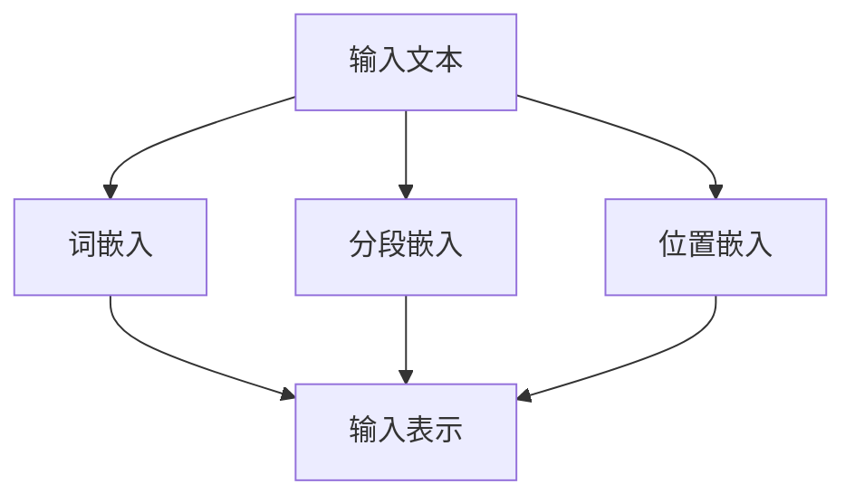

# 一切皆是映射：BERT模型原理及其在文本理解中的应用

## 1.背景介绍

### 1.1 自然语言处理的挑战

自然语言处理（NLP）是人工智能和计算语言学的一个重要分支，旨在实现计算机对人类语言的理解和生成。随着互联网和社交媒体的快速发展，海量的文本数据涌现，如何有效地处理和理解这些数据成为一个巨大的挑战。传统的NLP方法，如基于规则的系统和统计方法，已经难以应对复杂的语言现象和多样化的应用场景。

### 1.2 深度学习在NLP中的崛起

深度学习，尤其是基于神经网络的方法，在过去十年中取得了显著的进展。卷积神经网络（CNN）和循环神经网络（RNN）在图像识别和序列建模等任务中表现出色。然而，这些方法在处理长文本和捕捉上下文信息方面仍存在局限性。为了解决这些问题，Transformer架构应运而生，并迅速成为NLP领域的主流模型。

### 1.3 BERT模型的诞生

BERT（Bidirectional Encoder Representations from Transformers）是由Google在2018年提出的一种预训练语言模型。与传统的单向语言模型不同，BERT采用了双向Transformer架构，能够同时从左到右和从右到左建模文本上下文。BERT的出现极大地提升了各种NLP任务的性能，如问答、文本分类和命名实体识别等。

## 2.核心概念与联系

### 2.1 Transformer架构

Transformer架构由Vaswani等人在2017年提出，是一种基于注意力机制的神经网络模型。与传统的RNN和CNN不同，Transformer完全依赖于注意力机制来捕捉序列中的依赖关系。Transformer由编码器和解码器两个部分组成，编码器负责将输入序列转换为隐藏表示，解码器则根据隐藏表示生成输出序列。

### 2.2 自注意力机制

自注意力机制是Transformer的核心组件，能够在计算每个词的表示时考虑序列中所有其他词。具体来说，自注意力机制通过计算查询（Query）、键（Key）和值（Value）之间的点积来捕捉词与词之间的关系。通过加权求和，模型可以生成包含全局上下文信息的表示。

### 2.3 双向Transformer

传统的语言模型通常是单向的，即只能从左到右或从右到左生成文本表示。BERT采用了双向Transformer架构，能够同时从两个方向建模上下文信息。这使得BERT在捕捉复杂的语言现象和长距离依赖关系方面具有显著优势。

### 2.4 预训练与微调

BERT的成功离不开预训练与微调两个阶段。在预训练阶段，模型在大规模无标注文本数据上进行训练，学习通用的语言表示。在微调阶段，预训练好的模型在特定任务的标注数据上进行训练，以适应具体的应用场景。通过这种方式，BERT能够在各种NLP任务中取得优异的性能。

## 3.核心算法原理具体操作步骤

### 3.1 输入表示

BERT的输入表示由三个部分组成：词嵌入（Token Embeddings）、分段嵌入（Segment Embeddings）和位置嵌入（Position Embeddings）。词嵌入用于表示输入文本中的每个词，分段嵌入用于区分不同的句子，位置嵌入则用于捕捉词在序列中的位置信息。通过将这三种嵌入相加，BERT能够生成包含丰富语义和位置信息的输入表示。



### 3.2 预训练任务

BERT在预训练阶段采用了两种任务：掩码语言模型（Masked Language Model, MLM）和下一句预测（Next Sentence Prediction, NSP）。MLM任务通过随机掩码输入文本中的部分词，并让模型预测这些被掩码的词。NSP任务则通过让模型判断两个句子是否连续出现，以帮助模型理解句子之间的关系。

### 3.3 掩码语言模型

在MLM任务中，输入文本中的一些词会被随机掩码（替换为特殊的[MASK]标记），模型需要根据上下文信息预测这些被掩码的词。例如，对于输入文本“BERT is a [MASK] model”，模型需要预测[MASK]标记对应的词“language”。

### 3.4 下一句预测

在NSP任务中，模型会接收两个句子，并判断它们是否连续出现。例如，对于句子对“BERT is a powerful model. It is widely used in NLP tasks.”，模型需要判断这两个句子是否连续出现。通过这种方式，BERT能够学习句子之间的关系，从而提升在问答和文本生成等任务中的性能。

## 4.数学模型和公式详细讲解举例说明

### 4.1 自注意力机制公式

自注意力机制通过计算查询（Q）、键（K）和值（V）之间的点积来捕捉词与词之间的关系。具体公式如下：

$$
\text{Attention}(Q, K, V) = \text{softmax}\left(\frac{QK^T}{\sqrt{d_k}}\right)V
$$

其中，$Q$、$K$、$V$分别表示查询、键和值的矩阵，$d_k$表示键的维度。通过点积和归一化，模型能够生成包含全局上下文信息的表示。

### 4.2 多头注意力机制

为了提升模型的表达能力，Transformer采用了多头注意力机制。具体来说，多头注意力机制通过并行计算多个自注意力，并将结果拼接在一起。公式如下：

$$
\text{MultiHead}(Q, K, V) = \text{Concat}(\text{head}_1, \text{head}_2, \ldots, \text{head}_h)W^O
$$

其中，每个头的计算公式为：

$$
\text{head}_i = \text{Attention}(QW_i^Q, KW_i^K, VW_i^V)
$$

通过多头注意力机制，模型能够捕捉不同子空间中的信息，从而提升表示能力。

### 4.3 位置编码

由于Transformer不包含递归结构，无法直接捕捉序列中的位置信息。因此，BERT通过位置编码（Position Encoding）来注入位置信息。位置编码的公式如下：

$$
PE_{(pos, 2i)} = \sin\left(\frac{pos}{10000^{2i/d_{\text{model}}}}\right)
$$

$$
PE_{(pos, 2i+1)} = \cos\left(\frac{pos}{10000^{2i/d_{\text{model}}}}\right)
$$

其中，$pos$表示词在序列中的位置，$i$表示维度索引，$d_{\text{model}}$表示模型的维度。通过位置编码，模型能够捕捉词的相对位置信息。

## 5.项目实践：代码实例和详细解释说明

### 5.1 环境准备

在开始项目实践之前，我们需要准备好相关的开发环境和依赖库。我们将使用Python编程语言和Hugging Face的Transformers库来实现BERT模型的训练和应用。

```bash
# 安装Transformers库
pip install transformers
```

### 5.2 加载预训练模型

首先，我们需要加载预训练好的BERT模型和分词器。Hugging Face的Transformers库提供了丰富的预训练模型，方便我们直接使用。

```python
from transformers import BertTokenizer, BertModel

# 加载预训练模型和分词器
tokenizer = BertTokenizer.from_pretrained('bert-base-uncased')
model = BertModel.from_pretrained('bert-base-uncased')
```

### 5.3 文本预处理

在将文本输入到BERT模型之前，我们需要对其进行预处理。具体来说，我们需要将文本转换为模型可以接受的输入格式，包括分词、添加特殊标记和生成输入张量。

```python
# 输入文本
text = "BERT is a powerful model for natural language understanding."

# 分词并生成输入张量
inputs = tokenizer(text, return_tensors='pt')
```

### 5.4 模型推理

加载预训练模型并对输入文本进行预处理后，我们可以进行模型推理，获取文本的表示。

```python
# 模型推理
outputs = model