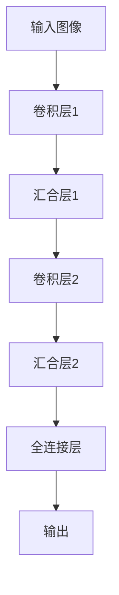
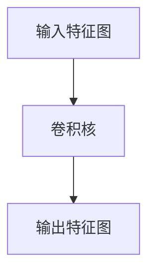
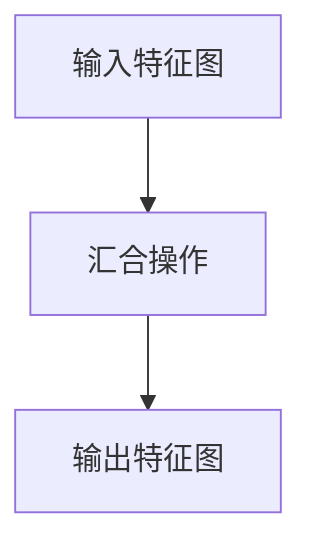

# 一切皆是映射：卷积神经网络(CNN)解密

## 1.背景介绍

### 1.1 计算机视觉的兴起

在过去的几十年里,计算机视觉技术取得了长足的进步。从最初的基本图像处理算法,到今天的深度学习模型,计算机视觉已经渗透到我们生活的方方面面。无论是自动驾驶、面部识别,还是医疗影像诊断,计算机视觉都扮演着重要的角色。

### 1.2 深度学习在计算机视觉中的突破

传统的计算机视觉算法依赖于手工设计的特征提取器,这种方法存在一些局限性。而深度学习模型则能够自动从数据中学习特征表示,大大提高了视觉任务的性能表现。自2012年AlexNet在ImageNet大赛上的出色表现之后,基于深度卷积神经网络(CNN)的模型逐渐主导计算机视觉领域。

### 1.3 CNN的重要性及其应用

卷积神经网络不仅在图像分类任务上取得了巨大成功,在目标检测、语义分割、图像生成等众多视觉任务中也发挥着关键作用。CNN已经成为计算机视觉领域最重要和最广泛使用的模型之一。了解CNN的工作原理和设计思路,对于开发高性能视觉系统至关重要。

## 2.核心概念与联系  

### 2.1 卷积神经网络的基本结构

卷积神经网络是一种前馈神经网络,由多个卷积层和汇合层交替组成。卷积层提取局部特征,汇合层降低分辨率。最后通过全连接层对特征进行分类或回归。



### 2.2 卷积层

卷积层是CNN的核心部分,它通过滑动卷积核在输入特征图上进行卷积运算,提取局部特征。卷积核的权重在训练过程中被学习得到。



### 2.3 汇合层

汇合层通过降低特征图的分辨率,来增大感受野并减少计算量。常用的汇合方式有最大汇合和平均汇合。



### 2.4 非线性激活函数

在卷积层之后,通常会接一个非线性激活函数,如ReLU函数。这使得网络能够学习非线性映射,提高了模型的表达能力。

### 2.5 CNN与传统神经网络的区别

与传统的全连接神经网络相比,CNN利用了输入数据的结构先验(如图像的平移不变性),从而大大减少了需要学习的参数量,降低了过拟合风险。

## 3.核心算法原理具体操作步骤

### 3.1 卷积运算

卷积运算是CNN的核心计算步骤。它通过在输入特征图上滑动卷积核,对每个局部区域进行加权求和,从而提取出新的特征图。数学上可以表示为:

$$
(I * K)(i,j) = \sum_{m}\sum_{n}I(i+m,j+n)K(m,n)
$$

其中$I$是输入特征图, $K$是卷积核, $*$表示卷积运算。

#### 3.1.1 卷积核的设计

卷积核的大小和数量都是可以设计的超参数。较小的卷积核能捕获更细粒度的模式,而较大的卷积核则能整合更大的感受野。叠加多个小卷积核的效果等价于使用一个大卷积核,但参数更少。

#### 3.1.2 卷积步长与填充

卷积步长控制卷积核在输入特征图上滑动的步长。填充则是在输入特征图的边界补零,以保持特征图的空间分辨率不变。

### 3.2 汇合层的操作

汇合层对输入的特征图进行下采样,降低分辨率。最常见的是最大汇合和平均汇合。

#### 3.2.1 最大汇合

最大汇合返回窗口内的最大值,能够保留最显著的特征。数学表达式为:

$$
y_{i,j} = \max_{(i',j')\in R_{i,j}}x_{i',j'}
$$

其中$R_{i,j}$是以$(i,j)$为中心的窗口区域。

#### 3.2.2 平均汇合

平均汇合返回窗口内的平均值,相当于进行了平滑处理。数学表达式为:

$$
y_{i,j} = \frac{1}{|R_{i,j}|}\sum_{(i',j')\in R_{i,j}}x_{i',j'}
$$

### 3.3 反向传播与权重更新

CNN的训练过程采用反向传播算法,根据损失函数对权重进行梯度更新。对于卷积层的权重$W$,更新规则为:

$$
W^{(t+1)} = W^{(t)} - \eta \frac{\partial L}{\partial W^{(t)}}
$$

其中$\eta$是学习率,$L$是损失函数。对于汇合层没有可学习的参数。

### 3.4 常见的CNN架构

LeNet、AlexNet、VGGNet、GoogLeNet、ResNet等是计算机视觉领域中一些经典的CNN架构。它们通过堆叠卷积层、汇合层和全连接层,形成了不同的网络结构。

## 4.数学模型和公式详细讲解举例说明

### 4.1 卷积运算的数学模型

卷积运算是CNN中最核心的运算,我们用一个具体的例子来详细说明它的数学原理。假设输入是一个$5\times 5$的灰度图像,卷积核的大小为$3\times 3$,步长为1,无填充。

输入特征图$I$:

$$
I = \begin{bmatrix}
1 & 0 & 2 & 1 & 3\\
0 & 2 & 1 & 3 & 1\\  
1 & 1 & 0 & 2 & 0\\
3 & 2 & 1 & 0 & 1\\
2 & 0 & 3 & 1 & 2
\end{bmatrix}
$$

卷积核$K$:

$$
K = \begin{bmatrix}
1 & 0 & 1\\
1 & 1 & 0\\
0 & 1 & 1
\end{bmatrix}
$$

输出特征图$O$的计算过程如下:

$$
\begin{align*}
O(0,0) &= \sum_{m}\sum_{n}I(m,n)K(0-m,0-n) \\
       &= 1\times 1 + 0\times 1 + 2\times 0 + 0\times 1 + 2\times 1 + 1\times 0 + 1\times 0 + 1\times 1 + 0\times 1 \\
       &= 1 + 0 + 0 + 0 + 2 + 0 + 0 + 1 + 0 \\
       &= 4
\end{align*}
$$

$$
\begin{align*}
O(0,1) &= \sum_{m}\sum_{n}I(m,n)K(0-m,1-n) \\
       &= 0\times 1 + 2\times 0 + 1\times 1 + 1\times 1 + 3\times 1 + 3\times 0 + 1\times 0 + 1\times 0 + 2\times 1 \\
       &= 0 + 0 + 1 + 1 + 3 + 0 + 0 + 0 + 2 \\
       &= 7
\end{align*}
$$

以此类推,我们可以得到整个输出特征图$O$:

$$
O = \begin{bmatrix}
4 & 7 & 7 & 5 & 3\\
6 & 9 & 8 & 5 & 3\\
6 & 5 & 5 & 3 & 3\\
4 & 4 & 5 & 3 & 4\\
5 & 6 & 6 & 4 & 4
\end{bmatrix}
$$

通过这个例子,我们可以直观地理解卷积运算是如何在输入特征图上滑动卷积核,对局部区域进行加权求和,从而生成新的特征图。卷积运算能够有效地提取输入数据的局部模式和特征。

### 4.2 最大汇合层的数学模型

假设输入特征图$I$的大小为$4\times 4$,汇合窗口的大小为$2\times 2$,步长为2,即不重叠的最大汇合。

$$
I = \begin{bmatrix}
1 & 3 & 2 & 0\\
0 & 2 & 1 & 3\\
4 & 1 & 5 & 2\\
3 & 0 & 1 & 4
\end{bmatrix}
$$

输出特征图$O$的计算过程如下:

$$
\begin{align*}
O(0,0) &= \max_{(i',j')\in R_{0,0}}I(i',j') \\
       &= \max\{1,3,0,2\} \\
       &= 3
\end{align*}
$$

$$
\begin{align*}
O(0,1) &= \max_{(i',j')\in R_{0,1}}I(i',j') \\
       &= \max\{2,0,5,3\} \\
       &= 5
\end{align*}
$$

$$
\begin{align*}
O(1,0) &= \max_{(i',j')\in R_{1,0}}I(i',j') \\
       &= \max\{4,1,3,0\} \\
       &= 4
\end{align*}
$$

$$
\begin{align*}
O(1,1) &= \max_{(i',j')\in R_{1,1}}I(i',j') \\
       &= \max\{5,2,1,4\} \\
       &= 5
\end{align*}
$$

因此,输出特征图为:

$$
O = \begin{bmatrix}
3 & 5\\
4 & 5
\end{bmatrix}
$$

通过这个例子,我们可以看到最大汇合层是如何对输入特征图的非重叠区域取最大值,从而实现了特征图下采样的过程。最大汇合层能够保留最显著的特征,并增大感受野,从而提高模型的鲁棒性。

### 4.3 反向传播的数学模型

CNN的训练过程采用反向传播算法,根据损失函数对权重进行梯度更新。以卷积层为例,我们来推导它的梯度公式。

假设输入特征图为$I$,卷积核权重为$W$,偏置为$b$,输出特征图为$O$。卷积运算的数学表达式为:

$$
O(i,j) = \sum_{m}\sum_{n}I(i+m,j+n)W(m,n) + b
$$

假设损失函数为$L$,我们需要计算$\frac{\partial L}{\partial W}$和$\frac{\partial L}{\partial b}$。根据链式法则,我们有:

$$
\begin{align*}
\frac{\partial L}{\partial W(m,n)} &= \sum_{i}\sum_{j}\frac{\partial L}{\partial O(i,j)}\frac{\partial O(i,j)}{\partial W(m,n)} \\
                                   &= \sum_{i}\sum_{j}\frac{\partial L}{\partial O(i,j)}I(i+m,j+n)
\end{align*}
$$

$$
\frac{\partial L}{\partial b} = \sum_{i}\sum_{j}\frac{\partial L}{\partial O(i,j)}
$$

其中$\frac{\partial L}{\partial O(i,j)}$可以通过反向传播计算得到。有了这些梯度,我们就可以使用优化算法(如SGD)对权重$W$和偏置$b$进行更新。

通过上面的公式推导,我们可以看到CNN的反向传播过程实际上是在计算损失函数相对于每个权重的梯度,并根据这些梯度对权重进行微调,从而逐步降低损失函数的值,提高模型的性能。

## 4.项目实践:代码实例和详细解释说明

为了帮助读者更好地理解CNN的原理和实现,我们提供了一个基于PyTorch的实例项目。这个项目实现了一个简单的CNN模型,用于对MNIST手写数字数据集进行分类。

### 4.1 导入必要的库

```python
import torch
import torch.nn as nn
import torchvision
import torchvision.transforms as