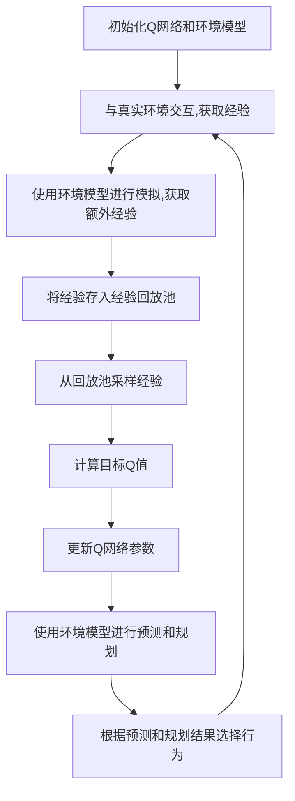

# 一切皆是映射：环境模型在DQN中的应用：预测和规划的作用

## 1.背景介绍

### 1.1 强化学习简介

强化学习(Reinforcement Learning, RL)是机器学习的一个重要分支,旨在让智能体(agent)通过与环境(environment)的交互来学习如何采取最优策略,从而最大化累积奖励。与监督学习不同,强化学习没有提供明确的输入-输出对的标签数据,智能体需要通过试错来探索环境,获取经验并从中学习。

### 1.2 深度强化学习(Deep RL)

随着深度学习(Deep Learning)技术的发展,将深度神经网络应用于强化学习,形成了深度强化学习(Deep Reinforcement Learning, Deep RL)。深度神经网络可以从原始的高维观测数据中自动学习特征表示,从而避免了手工设计特征的需求,大大提高了智能体的性能。

### 1.3 深度Q网络(Deep Q-Network, DQN)

深度Q网络(DQN)是深度强化学习中的一种突破性算法,它使用深度神经网络来近似状态-行为值函数(Q函数),从而解决了传统Q学习在处理高维观测时的困难。DQN的提出极大地推动了深度强化学习在实践中的应用,例如在游戏领域取得了超越人类的成就。

## 2.核心概念与联系

### 2.1 Q学习与Q函数

在强化学习中,Q函数(Q-function)是一个价值函数,用于评估在某个状态下采取某个行为的价值。Q函数的定义为:

$$Q(s,a) = \mathbb{E}\big[r_t + \gamma r_{t+1} + \gamma^2 r_{t+2} + \cdots | s_t = s, a_t = a, \pi\big]$$

其中:
- $s$是当前状态
- $a$是当前行为
- $r_t$是在时间步$t$获得的即时奖励
- $\gamma$是折现因子,用于平衡当前奖励和未来奖励的权重
- $\pi$是智能体采取的策略

Q学习的目标是找到一个最优的Q函数$Q^*(s,a)$,使得在任意状态下采取相应的最优行为,就可以获得最大的期望累积奖励。

### 2.2 DQN中的Q网络

在DQN中,我们使用一个深度神经网络来近似Q函数,该网络被称为Q网络(Q-Network)。Q网络将当前状态$s$作为输入,输出一个向量,其中每个元素对应于在该状态下采取不同行为的Q值估计。通过训练Q网络,我们可以得到一个近似最优的Q函数。

### 2.3 环境模型

环境模型(Environment Model)是指对真实环境的数学描述或模拟,它可以预测在当前状态下采取某个行为会导致什么样的下一个状态和奖励。具有环境模型的优势在于,我们可以使用它来模拟交互过程,从而减少与真实环境交互的需求,加快学习过程。

在DQN中,我们可以将环境模型与Q网络相结合,用于预测和规划,从而提高智能体的性能。这种方法被称为模型based强化学习(Model-Based Reinforcement Learning)。

## 3.核心算法原理具体操作步骤

### 3.1 DQN算法原理

DQN算法的核心思想是使用一个深度神经网络来近似Q函数,并通过与环境交互来更新Q网络的参数,使得Q网络逐渐收敛到最优Q函数。具体步骤如下:

1. 初始化Q网络,其参数可以是随机初始化或者预训练得到的。
2. 初始化经验回放池(Experience Replay Buffer),用于存储智能体与环境交互过程中获得的经验(状态、行为、奖励、下一状态)。
3. 对于每一个时间步:
    - 根据当前Q网络输出的Q值估计,选择一个行为(例如使用$\epsilon$-greedy策略)。
    - 在环境中执行选择的行为,获得下一个状态和即时奖励。
    - 将(状态、行为、奖励、下一状态)的经验存入经验回放池。
    - 从经验回放池中随机采样一个批次的经验。
    - 根据这些经验,计算目标Q值(Target Q-Value),即在下一状态下采取最优行为所能获得的最大Q值。
    - 使用目标Q值和当前Q网络输出的Q值估计之间的差异,计算损失函数。
    - 通过反向传播算法,更新Q网络的参数,使得Q网络输出的Q值估计逐渐接近目标Q值。

通过不断地与环境交互、更新Q网络,DQN算法可以最终找到一个近似最优的Q函数,从而让智能体采取最优策略。

### 3.2 结合环境模型的DQN算法

在传统的DQN算法中,智能体需要与真实环境进行大量的交互才能获得足够的经验进行学习。这种方式不仅效率低下,而且在某些情况下与真实环境交互的代价也可能很高。

为了解决这个问题,我们可以结合环境模型来提高DQN算法的效率。具体步骤如下:

1. 训练一个环境模型,使其能够准确预测在当前状态下采取某个行为会导致什么样的下一个状态和奖励。
2. 在与真实环境交互的同时,也使用环境模型进行模拟交互,从而获取额外的经验。
3. 将来自真实环境和环境模型的经验混合存储在经验回放池中。
4. 在训练Q网络时,从经验回放池中随机采样经验,不区分它们是来自真实环境还是环境模型。

通过这种方式,我们可以显著减少与真实环境交互的需求,从而加快学习过程。同时,由于环境模型的存在,我们也可以使用它进行预测和规划,进一步提高智能体的性能。

### 3.3 基于环境模型的预测和规划

具有环境模型后,我们可以利用它进行预测和规划,从而指导智能体的决策过程。

#### 3.3.1 预测(Prediction)

给定当前状态$s_t$和一系列行为序列$a_t, a_{t+1}, \cdots, a_{t+k}$,环境模型可以预测未来的状态序列$s_{t+1}, s_{t+2}, \cdots, s_{t+k+1}$和对应的奖励序列$r_{t+1}, r_{t+2}, \cdots, r_{t+k+1}$。

通过预测未来的状态和奖励,我们可以评估采取某个行为序列的价值,从而指导智能体选择最优的行为序列。

#### 3.3.2 规划(Planning)

给定当前状态$s_t$,我们可以使用环境模型对不同的行为序列进行模拟,计算其对应的累积奖励,从而找到最优的行为序列。这个过程被称为规划(Planning)。

一种常见的规划算法是蒙特卡罗树搜索(Monte Carlo Tree Search, MCTS),它通过构建一个搜索树来探索不同的行为序列,并根据模拟结果评估每个行为序列的价值。

将规划与Q网络相结合,我们可以获得一种强大的决策机制,即在Q网络提供的基础上,通过规划进一步优化行为序列。

### 3.4 算法流程图

下面是结合环境模型的DQN算法的整体流程图:

## 4.数学模型和公式详细讲解举例说明

在上一节中,我们介绍了DQN算法的核心思想和流程。现在,我们将详细讨论其中涉及的一些数学模型和公式。

### 4.1 Q函数和Bellman方程

如前所述,Q函数$Q(s,a)$表示在状态$s$下采取行为$a$的价值,即能获得的期望累积奖励。Q函数满足以下Bellman方程:

$$Q(s,a) = \mathbb{E}_{s' \sim P}\big[r + \gamma \max_{a'} Q(s',a')\big]$$

其中:
- $s'$是由状态转移概率$P(s'|s,a)$决定的下一个状态
- $r$是立即奖励
- $\gamma$是折现因子,用于平衡当前奖励和未来奖励的权重
- $\max_{a'} Q(s',a')$是在下一状态$s'$下采取最优行为所能获得的最大Q值

这个方程体现了Q函数的递归性质:当前状态的Q值由立即奖励加上下一状态最优Q值的折现和组成。

### 4.2 Q网络训练目标

在DQN中,我们使用一个深度神经网络$Q(s,a;\theta)$来近似真实的Q函数,其中$\theta$是网络的参数。为了训练Q网络,我们需要定义一个损失函数,使得Q网络输出的Q值估计尽可能接近真实的Q值。

一种常见的损失函数是平方损失(Mean Squared Error):

$$\mathcal{L}(\theta) = \mathbb{E}_{(s,a,r,s') \sim D}\big[\big(y - Q(s,a;\theta)\big)^2\big]$$

其中:
- $D$是经验回放池
- $y$是目标Q值(Target Q-Value),定义为$r + \gamma \max_{a'} Q(s',a';\theta^-)$
- $\theta^-$是一个延迟更新的Q网络参数,用于计算目标Q值,以提高训练稳定性

通过最小化这个损失函数,我们可以使Q网络输出的Q值估计逐渐接近目标Q值,从而近似真实的Q函数。

### 4.3 环境模型

环境模型通常由两个部分组成:状态转移模型和奖励模型。

#### 4.3.1 状态转移模型

状态转移模型$P(s'|s,a)$描述了在当前状态$s$下采取行为$a$会导致下一个状态$s'$的概率分布。对于确定性环境,状态转移模型可以用一个确定性函数$f$来表示:

$$s' = f(s,a)$$

对于随机环境,状态转移模型可以用概率密度函数或概率质量函数(对于离散状态空间)来表示。

#### 4.3.2 奖励模型

奖励模型$R(s,a)$描述了在当前状态$s$下采取行为$a$所能获得的即时奖励。对于确定性环境,奖励模型可以用一个确定性函数$g$来表示:

$$r = g(s,a)$$

对于随机环境,奖励模型可以用概率密度函数或概率质量函数来表示。

通过学习状态转移模型和奖励模型,我们可以构建一个完整的环境模型,用于预测和规划。

### 4.4 蒙特卡罗树搜索(MCTS)

蒙特卡罗树搜索(Monte Carlo Tree Search, MCTS)是一种基于环境模型进行规划的有效算法。它通过构建一个搜索树来探索不同的行为序列,并根据模拟结果评估每个行为序列的价值。

MCTS算法的核心思想是在每一个时间步,重复执行以下四个步骤:

1. **选择(Selection)**:从当前节点开始,根据某种策略(如UCB策略)选择一条路径,直到到达一个叶子节点。
2. **扩展(Expansion)**:从叶子节点出发,使用环境模型模拟一步行为,生成一个新的节点。
3. **模拟(Simulation)**:从新节点开始,使用环境模型进行多步模拟,直到达到终止条件(如最大模拟步数或到达终止状态)。
4. **反馈(Backpropagation)**:将模拟得到的累积奖励反馈到搜索树中,更新沿途节点的统计信息。

通过不断重复这个过程,搜索树会逐渐扩展,并且每个节点的统计信息会越来越精确,反映了从该节点出发采取不同行为序列的