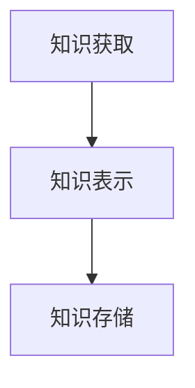

# 专家系统的评价指标：如何衡量系统性能

作者：禅与计算机程序设计艺术

## 1.背景介绍

### 1.1 专家系统的定义与发展

专家系统是一种基于人工智能技术的计算机程序，旨在模拟人类专家在特定领域内的决策过程。这类系统通过知识库和推理机制来解决复杂问题，提供类似于人类专家的解决方案。自20世纪60年代以来，专家系统逐渐发展并广泛应用于医疗诊断、金融分析、工程设计等领域。

### 1.2 专家系统的重要性

随着信息技术的迅猛发展，专家系统在各行各业中的应用越来越广泛。它们不仅能够提高工作效率，还能在某些领域中替代人类专家，减少人为错误。然而，如何评价一个专家系统的性能，确保其在实际应用中的有效性和可靠性，成为了一个亟待解决的问题。

### 1.3 评价指标的必要性

评价指标是衡量专家系统性能的关键工具。通过科学合理的评价指标，我们可以全面了解系统的优缺点，指导系统的优化和改进。本文将深入探讨专家系统的各种评价指标，并提供具体的操作步骤和实际应用案例，帮助读者全面掌握如何衡量专家系统的性能。

## 2.核心概念与联系

### 2.1 知识库

知识库是专家系统的核心组成部分，包含了大量领域知识。这些知识通常以规则、事实和关系的形式存储。知识库的质量直接影响专家系统的性能。

### 2.2 推理机制

推理机制是专家系统的另一重要组成部分，用于从知识库中提取相关信息，进行逻辑推理，生成解决方案。常见的推理机制包括前向推理、后向推理和混合推理。

### 2.3 评价指标的分类

评价指标可以分为多种类型，包括准确性、效率、鲁棒性、可解释性等。不同的指标侧重于专家系统的不同方面，综合使用这些指标可以全面评估系统性能。

### 2.4 评价指标之间的联系

不同评价指标之间存在一定的联系和相互影响。例如，提高系统的准确性可能会增加计算时间，影响系统的效率。因此，在实际应用中，需要综合考虑各个指标，找到最佳平衡点。

## 3.核心算法原理具体操作步骤

### 3.1 构建知识库

#### 3.1.1 知识获取

知识获取是构建知识库的第一步，通常通过专家访谈、文献调研等方式获取领域知识。现代技术还包括数据挖掘和机器学习方法，从大量数据中提取有价值的信息。

#### 3.1.2 知识表示

知识表示是将获取的知识以计算机可以处理的形式存储在知识库中。常见的知识表示方法包括规则表示、语义网络、框架表示等。



### 3.2 推理机制设计

#### 3.2.1 前向推理

前向推理是一种自底向上的推理方法，从已知事实出发，应用规则逐步推导出新的结论。适用于数据驱动的应用场景。

#### 3.2.2 后向推理

后向推理是一种自顶向下的推理方法，从目标结论出发，逆向应用规则，寻找支持该结论的事实。适用于目标驱动的应用场景。

### 3.3 评价指标的计算

#### 3.3.1 准确性

准确性是衡量专家系统在给定问题上的正确解决方案比例。可以通过对比系统输出与专家结论来计算。

$$
Accuracy = \frac{Number\ of\ correct\ predictions}{Total\ number\ of\ predictions}
$$

#### 3.3.2 效率

效率是衡量专家系统在给定时间内处理问题的能力。通常通过系统响应时间和计算资源消耗来评价。

#### 3.3.3 鲁棒性

鲁棒性是衡量专家系统在面对噪声数据或异常情况时的表现。可以通过引入噪声数据进行测试，观察系统性能变化。

## 4.数学模型和公式详细讲解举例说明

### 4.1 准确性计算示例

假设一个医疗诊断专家系统在100个测试病例中，正确诊断了85个病例，那么其准确性计算如下：

$$
Accuracy = \frac{85}{100} = 0.85
$$

### 4.2 效率评估模型

效率评估可以通过计算系统的平均响应时间来进行。假设系统在10次测试中的响应时间分别为$t_1, t_2, ..., t_{10}$，则平均响应时间计算如下：

$$
Average\ Response\ Time = \frac{\sum_{i=1}^{10} t_i}{10}
$$

### 4.3 鲁棒性测试示例

在鲁棒性测试中，我们可以引入一定比例的噪声数据，观察系统的准确性变化。例如，假设在引入10%的噪声数据后，系统准确性下降至80%，则鲁棒性评价如下：

$$
Robustness = \frac{0.85 - 0.80}{0.10} = 0.5
$$

## 5.项目实践：代码实例和详细解释说明

### 5.1 构建简单的专家系统

以下是一个基于Python的简单专家系统示例，使用规则表示和前向推理机制。

```python
class ExpertSystem:
    def __init__(self):
        self.knowledge_base = []
        self.facts = []

    def add_rule(self, rule):
        self.knowledge_base.append(rule)

    def add_fact(self, fact):
        self.facts.append(fact)

    def infer(self):
        new_facts = self.facts[:]
        while True:
            applied = False
            for rule in self.knowledge_base:
                if rule["if"] in new_facts and rule["then"] not in new_facts:
                    new_facts.append(rule["then"])
                    applied = True
            if not applied:
                break
        return new_facts

# 创建专家系统实例
es = ExpertSystem()
es.add_rule({"if": "fever", "then": "flu"})
es.add_rule({"if": "cough", "then": "flu"})
es.add_fact("fever")

# 推理过程
result = es.infer()
print(result)
```

### 5.2 代码解释

上述代码首先定义了一个简单的专家系统类`ExpertSystem`，包括知识库和事实库。通过`add_rule`和`add_fact`方法，可以向系统中添加规则和事实。`infer`方法实现了前向推理机制，不断应用规则，直到无法再推导出新的事实。

### 5.3 实际应用

在实际应用中，可以根据具体需求扩展该专家系统，例如添加更多复杂的规则表示方法和推理机制，以处理更复杂的问题。

## 6.实际应用场景

### 6.1 医疗诊断

专家系统在医疗诊断中有广泛应用，可以帮助医生进行疾病诊断和治疗方案推荐。例如，IBM的Watson系统在癌症诊断和治疗中表现出色。

### 6.2 金融分析

在金融领域，专家系统可以用于股票市场分析、风险评估和投资组合管理。通过对历史数据的分析和推理，提供投资建议和风险预警。

### 6.3 工程设计

在工程设计中，专家系统可以辅助工程师进行设计方案优化和故障诊断。通过对设计规则和经验的编码，实现自动化设计和故障预测。

## 7.工具和资源推荐

### 7.1 开源工具

- **CLIPS**: 一种流行的开源专家系统工具，支持规则表示和推理机制。
- **Drools**: 基于Java的业务规则管理系统，广泛应用于企业级应用中。

### 7.2 在线资源

- **Coursera**: 提供大量人工智能和专家系统相关课程，帮助深入理解和应用专家系统。
- **GitHub**: 丰富的开源项目和代码示例，供学习和参考。

## 8.总结：未来发展趋势与挑战

### 8.1 未来发展趋势

随着人工智能技术的不断进步，专家系统将朝着更加智能化、自动化和人性化的方向发展。深度学习和自然语言处理技术的融合，将进一步提升专家系统的性能和应用范围。

### 8.2 面临的挑战

尽管专家系统在各领域取得了显著成果，但仍面临诸多挑战。例如，知识获取和表示的难题、复杂推理机制的设计、系统鲁棒性和安全性的保障等。解决这些问题需要不断创新和探索。

## 9.附录：常见问题与解答

###