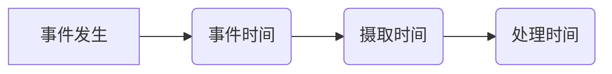
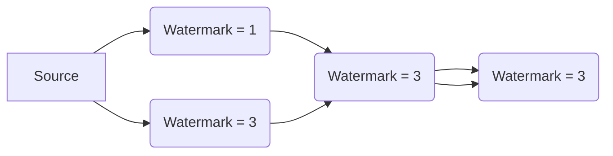

## 1. 背景介绍

### 1.1 从处理时间到事件时间

在大数据领域，数据的价值往往体现在其时效性上。如何及时有效地处理和分析海量数据，成为了众多企业和开发者面临的巨大挑战。传统的数据处理系统通常采用**处理时间**（Processing Time）作为时间度量标准，即数据被系统处理的时间。然而，随着数据规模的爆炸式增长和实时处理需求的不断提高，处理时间已经无法满足许多应用场景的需求。

想象一下，你正在构建一个实时监控系统，用于跟踪网站的用户行为。如果采用处理时间，那么你看到的用户行为数据将滞后于实际发生的时间，这将导致监控结果的失真，无法及时发现和应对问题。

为了解决这个问题，**事件时间**（Event Time）应运而生。事件时间指的是事件实际发生的时间，它独立于数据被处理的时间。采用事件时间能够更准确地反映数据的真实情况，从而提高数据分析和决策的准确性和及时性。

### 1.2 事件时间在流处理中的重要性

在流处理领域，事件时间尤为重要。流处理系统需要实时处理连续不断的数据流，而事件时间能够保证数据按照发生的顺序进行处理，从而确保结果的正确性和一致性。

例如，在一个电商平台的实时推荐系统中，我们需要根据用户的浏览、点击、购买等行为实时更新推荐结果。如果采用处理时间，那么用户的行为数据可能会乱序到达，导致推荐结果不准确。而采用事件时间，则可以保证用户的行为数据按照发生的顺序进行处理，从而提高推荐结果的准确性。

### 1.3 本文目标

本文旨在深入浅出地介绍事件时间的概念、原理以及如何在实际项目中应用事件时间。我们将从以下几个方面展开讨论：

* 事件时间的概念和重要性
* 事件时间和处理时间、摄取时间的区别
* 如何在 Flink 中使用事件时间
* 事件时间相关的 API 和操作
* 事件时间在实际项目中的应用案例

## 2. 核心概念与联系

### 2.1 事件时间、处理时间和摄取时间

* **事件时间（Event Time）**:  事件实际发生的时间，通常由事件本身携带的时间戳表示。
* **处理时间（Processing Time）**:  事件被处理的时间，即事件进入流处理系统并被处理的时间。
* **摄取时间（Ingestion Time）**:  事件进入流处理系统的时间，通常由数据源添加的时间戳表示。

下图展示了事件时间、处理时间和摄取时间的关系：



### 2.2 水印（Watermark）

在实际应用中，由于网络延迟、数据乱序等因素，事件时间并非总是能够准确获取。为了解决这个问题，Flink 引入了**水印**（Watermark）的概念。

水印是嵌入到数据流中的一种特殊标记，它表示到某个时间点为止，所有事件时间小于该时间戳的事件都已经到达。水印的作用是告诉 Flink 系统可以安全地处理到哪个时间点的数据，从而保证结果的正确性。

### 2.3 窗口（Window）

窗口是将无限数据流切割成有限大小的数据集进行处理的一种机制。在事件时间语义下，窗口的划分和计算都是基于事件时间的。

Flink 支持多种类型的窗口，例如：

* **滚动窗口（Tumbling Window）**:  将数据流按照固定时间间隔进行划分，窗口之间没有重叠。
* **滑动窗口（Sliding Window）**:  在滚动窗口的基础上，允许窗口之间存在重叠。
* **会话窗口（Session Window）**:  根据数据流中的事件间隔进行划分，窗口之间没有固定时间间隔。

### 2.4 事件时间在 Flink 中的应用

Flink 提供了丰富的 API 和操作来支持事件时间语义，例如：

* `assignTimestampsAndWatermarks()`：用于为数据流分配时间戳和水印。
* `keyBy()`：根据事件时间的某个字段进行分组。
* `window()`：根据事件时间定义窗口。
* `allowedLateness()`：设置允许事件迟到的最大时间。
* `sideOutputLateData()`：将迟到的事件输出到侧输出流。

## 3. 核心算法原理具体操作步骤

### 3.1  分配时间戳和水印

在 Flink 中使用事件时间，首先需要为数据流分配时间戳和水印。时间戳表示事件发生的事件时间，而水印则用于告诉 Flink 系统可以安全地处理到哪个时间点的数据。

```java
DataStream<Event> stream = ...;

// 为数据流分配时间戳和水印
DataStream<Event> timestampedStream = stream
    .assignTimestampsAndWatermarks(
        WatermarkStrategy
            .<Event>forBoundedOutOfOrderness(Duration.ofSeconds(10))
            .withTimestampAssigner((event, timestamp) -> event.getTimestamp())
    );
```

在上面的代码中，我们使用了 `assignTimestampsAndWatermarks()` 方法来为数据流分配时间戳和水印。`forBoundedOutOfOrderness()` 方法用于指定允许事件乱序的最大时间，这里设置为 10 秒。`withTimestampAssigner()` 方法用于指定从事件中提取时间戳的逻辑，这里直接返回事件的 `timestamp` 字段。

### 3.2  定义窗口

分配时间戳和水印后，就可以根据事件时间定义窗口了。Flink 支持多种类型的窗口，例如滚动窗口、滑动窗口和会话窗口。

```java
// 定义一个 1 分钟的滚动窗口
DataStream<Tuple2<String, Long>> windowedStream = timestampedStream
    .keyBy(Event::getKey)
    .window(TumblingEventTimeWindows.of(Time.minutes(1)));
```

在上面的代码中，我们使用了 `keyBy()` 方法根据事件的 `key` 字段进行分组，然后使用 `window()` 方法定义了一个 1 分钟的滚动窗口。

### 3.3  聚合数据

定义窗口后，就可以对窗口内的数据进行聚合操作了。Flink 提供了丰富的聚合函数，例如 `sum()`、`max()`、`min()` 等。

```java
// 计算每个窗口内每个 key 出现的次数
DataStream<Tuple2<String, Long>> resultStream = windowedStream
    .reduce((a, b) -> new Tuple2<>(a.f0, a.f1 + b.f1));
```

在上面的代码中，我们使用了 `reduce()` 方法对窗口内的数据进行聚合，计算每个窗口内每个 key 出现的次数。

## 4. 数学模型和公式详细讲解举例说明

### 4.1 水印的数学模型

水印可以看作是一个单调递增的函数，它将事件时间映射到水印时间。水印时间表示到该时间点为止，所有事件时间小于该时间戳的事件都已经到达。

$$
Watermark(t) = max\{EventTime(e) | EventTime(e) < t\}
$$

其中，$Watermark(t)$ 表示时间 $t$ 对应的水印时间，$EventTime(e)$ 表示事件 $e$ 的事件时间。

### 4.2 水印的传播

水印在 Flink 中以广播的形式进行传播。每个算子都会维护一个当前水印，当接收到上游算子的水印时，会更新自己的水印。

下图展示了水印的传播过程：



### 4.3 窗口的计算

在事件时间语义下，窗口的划分和计算都是基于事件时间的。当水印时间超过窗口的结束时间时，窗口就会触发计算。

例如，假设我们定义了一个 1 分钟的滚动窗口，当前水印时间为 `2023-05-23 10:01:00`，那么以下事件将会被分配到不同的窗口中：

* 事件时间为 `2023-05-23 10:00:00` 的事件将会被分配到 `[2023-05-23 10:00:00, 2023-05-23 10:01:00)` 窗口中。
* 事件时间为 `2023-05-23 10:00:30` 的事件将会被分配到 `[2023-05-23 10:00:00, 2023-05-23 10:01:00)` 窗口中。
* 事件时间为 `2023-05-23 10:01:00` 的事件将会被分配到 `[2023-05-23 10:01:00, 2023-05-23 10:02:00)` 窗口中。

## 5. 项目实践：代码实例和详细解释说明

### 5.1 模拟数据源

为了演示事件时间的应用，我们首先需要模拟一个数据源，该数据源会产生带有事件时间的事件流。

```java
public class EventSource implements SourceFunction<Event> {

    private volatile boolean isRunning = true;

    @Override
    public void run(SourceContext<Event> ctx) throws Exception {
        Random random = new Random();

        while (isRunning) {
            long timestamp = System.currentTimeMillis();
            String key = "key-" + random.nextInt(10);
            Event event = new Event(timestamp, key, random.nextInt(100));

            // 模拟网络延迟
            Thread.sleep(random.nextInt(500));

            ctx.collect(event);
        }
    }

    @Override
    public void cancel() {
        isRunning = false;
    }
}
```

### 5.2 创建 Flink 程序

接下来，我们创建一个 Flink 程序来读取数据源，并使用事件时间语义进行处理。

```java
public class EventTimeDemo {

    public static void main(String[] args) throws Exception {
        // 创建执行环境
        StreamExecutionEnvironment env = StreamExecutionEnvironment.getExecutionEnvironment();

        // 设置并行度
        env.setParallelism(1);

        // 设置事件时间语义
        env.setStreamTimeCharacteristic(TimeCharacteristic.EventTime);

        // 创建数据源
        DataStream<Event> stream = env.addSource(new EventSource());

        // 为数据流分配时间戳和水印
        DataStream<Event> timestampedStream = stream
            .assignTimestampsAndWatermarks(
                WatermarkStrategy
                    .<Event>forBoundedOutOfOrderness(Duration.ofSeconds(10))
                    .withTimestampAssigner((event, timestamp) -> event.getTimestamp())
            );

        // 定义一个 1 分钟的滚动窗口
        DataStream<Tuple2<String, Long>> windowedStream = timestampedStream
            .keyBy(Event::getKey)
            .window(TumblingEventTimeWindows.of(Time.minutes(1)));

        // 计算每个窗口内每个 key 出现的次数
        DataStream<Tuple2<String, Long>> resultStream = windowedStream
            .reduce((a, b) -> new Tuple2<>(a.f0, a.f1 + b.f1));

        // 打印结果
        resultStream.print();

        // 执行程序
        env.execute("Event Time Demo");
    }
}
```

### 5.3 运行程序

运行程序后，你将会看到类似以下的输出结果：

```
(key-1,10)
(key-3,12)
(key-7,8)
...
```

## 6. 实际应用场景

事件时间在许多实际应用场景中都扮演着至关重要的角色，例如：

* **实时监控**:  监控网站、应用程序或系统的性能指标，并及时发现和解决问题。
* **实时推荐**:  根据用户的实时行为数据，推荐用户可能感兴趣的产品或服务。
* **风险控制**:  实时检测和识别欺诈行为，并采取相应的措施。
* **物联网**:  实时分析来自传感器的数据，并做出相应的控制决策。

## 7. 工具和资源推荐

* **Apache Flink**:  一个开源的分布式流处理框架，提供了丰富的 API 和操作来支持事件时间语义。
* **Apache Kafka**:  一个高吞吐量的分布式消息队列，可以作为 Flink 的数据源或数据汇。
* **Ververica Platform**:  一个基于 Flink 的企业级流处理平台，提供了可视化的开发、部署和运维工具。

## 8. 总结：未来发展趋势与挑战

事件时间是流处理领域的一个重要概念，它能够保证数据按照发生的顺序进行处理，从而确保结果的正确性和一致性。随着实时处理需求的不断提高，事件时间将会得到越来越广泛的应用。

未来，事件时间的发展趋势主要集中在以下几个方面：

* **更精确的水印生成算法**:  现有的水印生成算法在某些场景下还存在一定的局限性，需要开发更精确的水印生成算法来提高结果的准确性。
* **更灵活的事件时间语义**:  现有的事件时间语义还比较简单，需要支持更灵活的事件时间语义来满足更复杂的应用场景。
* **与机器学习的结合**:  将事件时间与机器学习算法相结合，可以开发出更智能的实时应用。

## 9. 附录：常见问题与解答

### 9.1 如何选择合适的水印生成策略？

选择合适的水印生成策略取决于具体的应用场景和数据特征。一般来说，如果事件时间比较有序，可以选择基于时间的watermark生成策略；如果事件时间比较乱序，可以选择基于计数的watermark生成策略。

### 9.2 如何处理迟到的事件？

Flink 提供了多种机制来处理迟到的事件，例如：

* **允许事件迟到**:  可以使用 `allowedLateness()` 方法设置允许事件迟到的最大时间。
* **侧输出迟到的事件**:  可以使用 `sideOutputLateData()` 方法将迟到的事件输出到侧输出流。
* **丢弃迟到的事件**:  如果不关心迟到的事件，可以直接丢弃。

### 9.3 如何监控事件时间的性能？

Flink 提供了丰富的监控指标来监控事件时间的性能，例如：

* **水印延迟**:  表示水印时间与当前处理时间之间的差距。
* **事件延迟**:  表示事件时间与当前处理时间之间的差距。
* **窗口延迟**:  表示窗口触发计算的时间与窗口结束时间之间的差距。


