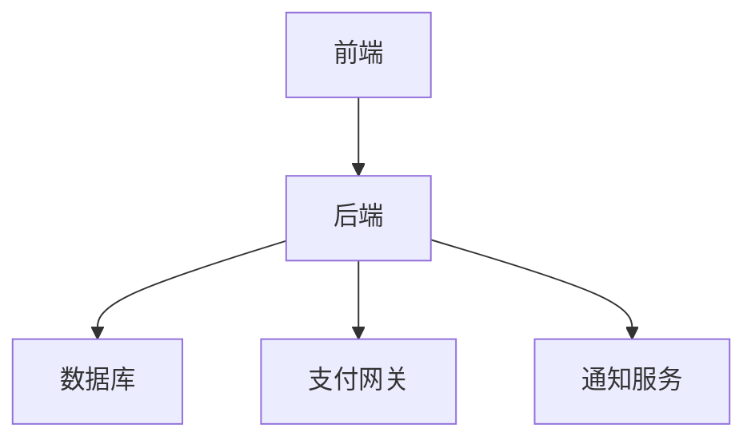
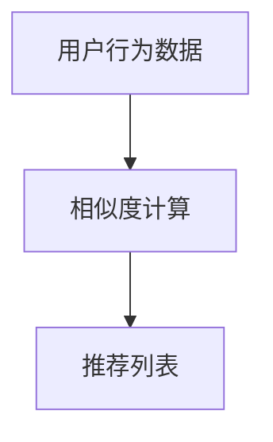
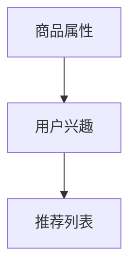
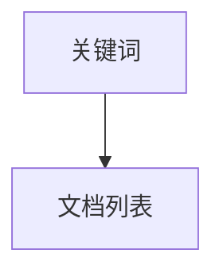

# 二手交易市场系统详细设计与具体代码实现

## 1.背景介绍

### 1.1 二手交易市场的兴起

随着互联网的发展，二手交易市场迅速崛起，成为人们买卖闲置物品的重要途径。它不仅促进了物品的循环利用，还为用户提供了便捷的交易平台。二手交易市场的成功离不开其背后的技术支持和系统设计。

### 1.2 设计二手交易市场系统的必要性

建立一个高效、可靠的二手交易市场系统是确保用户体验和平台安全的关键。本文将详细介绍二手交易市场系统的设计与实现，包括核心概念、算法原理、数学模型、项目实践、实际应用场景、工具和资源推荐等。

## 2.核心概念与联系

### 2.1 系统架构

二手交易市场系统通常由前端、后端和数据库三部分组成。前端负责用户界面展示和交互，后端处理业务逻辑和数据管理，数据库存储用户信息和交易记录。



### 2.2 用户角色

系统中的主要用户角色包括买家、卖家和管理员。买家可以浏览和购买商品，卖家可以发布和管理商品，管理员负责平台的维护和管理。

### 2.3 核心功能

二手交易市场系统的核心功能包括用户注册与登录、商品发布与管理、搜索与筛选、购物车与订单管理、支付与结算、评价与反馈等。

## 3.核心算法原理具体操作步骤

### 3.1 商品推荐算法

为了提高用户体验，二手交易市场系统通常会实现商品推荐功能。常见的推荐算法有协同过滤、基于内容的推荐和混合推荐。

#### 3.1.1 协同过滤

协同过滤根据用户的历史行为和相似用户的行为进行推荐。主要分为基于用户的协同过滤和基于物品的协同过滤。



#### 3.1.2 基于内容的推荐

基于内容的推荐根据商品的属性和用户的兴趣进行推荐。通过分析商品的描述、类别、标签等信息，匹配用户的偏好。



#### 3.1.3 混合推荐

混合推荐结合协同过滤和基于内容的推荐，综合考虑用户行为和商品属性，提供更精准的推荐结果。

### 3.2 搜索与筛选算法

搜索与筛选是二手交易市场系统的重要功能。常见的搜索算法包括倒排索引、TF-IDF、BM25等。筛选算法则根据用户的筛选条件进行数据过滤。

#### 3.2.1 倒排索引

倒排索引是一种高效的文本搜索算法，通过建立关键词到文档的映射，实现快速查找。



#### 3.2.2 TF-IDF

TF-IDF是一种衡量关键词重要性的算法，通过计算词频和逆文档频率，确定关键词在文档中的权重。

$$
\text{TF-IDF}(t,d) = \text{TF}(t,d) \times \text{IDF}(t)
$$

## 4.数学模型和公式详细讲解举例说明

### 4.1 协同过滤数学模型

协同过滤的核心在于计算用户之间或商品之间的相似度。常用的相似度计算方法有皮尔逊相关系数和余弦相似度。

#### 4.1.1 皮尔逊相关系数

皮尔逊相关系数用于衡量两个变量之间的线性关系，其公式为：

$$
r = \frac{\sum (x_i - \bar{x})(y_i - \bar{y})}{\sqrt{\sum (x_i - \bar{x})^2 \sum (y_i - \bar{y})^2}}
$$

#### 4.1.2 余弦相似度

余弦相似度用于衡量两个向量之间的相似度，其公式为：

$$
\text{cosine\_similarity} = \frac{A \cdot B}{||A|| \times ||B||}
$$

### 4.2 TF-IDF数学模型

TF-IDF用于衡量关键词在文档中的重要性，其公式为：

$$
\text{TF}(t,d) = \frac{f_{t,d}}{\sum_{t'} f_{t',d}}
$$

$$
\text{IDF}(t) = \log \frac{N}{|\{d \in D : t \in d\}|}
$$

其中，$f_{t,d}$ 表示词 $t$ 在文档 $d$ 中出现的频率，$N$ 表示文档总数，$|\{d \in D : t \in d\}|$ 表示包含词 $t$ 的文档数。

## 5.项目实践：代码实例和详细解释说明

### 5.1 项目结构

一个典型的二手交易市场系统项目结构如下：

```
second-hand-market/
├── backend/
│   ├── app/
│   ├── config/
│   ├── controllers/
│   ├── models/
│   ├── routes/
│   └── utils/
├── frontend/
│   ├── public/
│   ├── src/
│   ├── components/
│   ├── pages/
│   └── utils/
├── database/
│   ├── migrations/
│   └── seeders/
├── scripts/
├── tests/
└── README.md
```

### 5.2 后端代码实现

#### 5.2.1 用户注册与登录

```javascript
// controllers/authController.js
const bcrypt = require('bcrypt');
const jwt = require('jsonwebtoken');
const User = require('../models/User');

exports.register = async (req, res) => {
    const { username, email, password } = req.body;
    const hashedPassword = await bcrypt.hash(password, 10);
    const user = new User({ username, email, password: hashedPassword });
    await user.save();
    res.status(201).json({ message: 'User registered successfully' });
};

exports.login = async (req, res) => {
    const { email, password } = req.body;
    const user = await User.findOne({ email });
    if (!user) {
        return res.status(400).json({ message: 'User not found' });
    }
    const isMatch = await bcrypt.compare(password, user.password);
    if (!isMatch) {
        return res.status(400).json({ message: 'Invalid credentials' });
    }
    const token = jwt.sign({ userId: user._id }, 'secret', { expiresIn: '1h' });
    res.status(200).json({ token });
};
```

#### 5.2.2 商品发布与管理

```javascript
// controllers/productController.js
const Product = require('../models/Product');

exports.createProduct = async (req, res) => {
    const { title, description, price, category } = req.body;
    const product = new Product({ title, description, price, category, user: req.user.userId });
    await product.save();
    res.status(201).json({ message: 'Product created successfully' });
};

exports.getProducts = async (req, res) => {
    const products = await Product.find();
    res.status(200).json(products);
};

exports.getProductById = async (req, res) => {
    const product = await Product.findById(req.params.id);
    if (!product) {
        return res.status(404).json({ message: 'Product not found' });
    }
    res.status(200).json(product);
};
```

### 5.3 前端代码实现

#### 5.3.1 用户注册与登录页面

```jsx
// src/pages/Register.js
import React, { useState } from 'react';
import axios from 'axios';

const Register = () => {
    const [formData, setFormData] = useState({
        username: '',
        email: '',
        password: ''
    });

    const handleChange = (e) => {
        setFormData({ ...formData, [e.target.name]: e.target.value });
    };

    const handleSubmit = async (e) => {
        e.preventDefault();
        try {
            await axios.post('/api/auth/register', formData);
            alert('User registered successfully');
        } catch (error) {
            console.error(error);
            alert('Error registering user');
        }
    };

    return (
        <form onSubmit={handleSubmit}>
            <input type="text" name="username" onChange={handleChange} placeholder="Username" required />
            <input