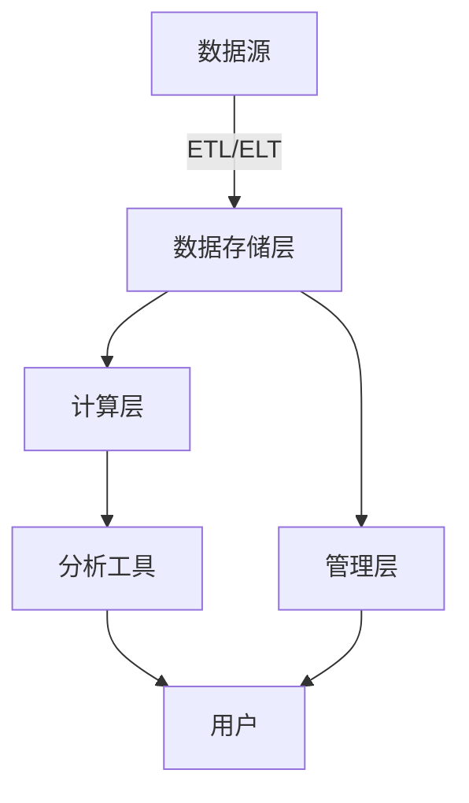

# 云数据仓库:灵活、可扩展的未来趋势

作者：禅与计算机程序设计艺术

## 1. 背景介绍

### 1.1 数据仓库的起源

数据仓库的概念最早出现在20世纪80年代，旨在解决企业中数据存储和分析的问题。传统的数据仓库系统主要依赖于本地硬件和软件，提供了一种集中化的数据存储和管理方式。然而，随着数据量的爆炸性增长和业务需求的不断变化，传统数据仓库的局限性逐渐显现出来。

### 1.2 云计算的兴起

云计算的出现为数据仓库带来了新的可能性。云计算提供了按需访问计算资源的能力，使企业能够更灵活地管理和处理数据。云计算的核心优势在于其可扩展性、弹性和成本效益，这些特点使其成为现代数据仓库的理想平台。

### 1.3 云数据仓库的定义

云数据仓库是一种基于云计算技术的数据仓库解决方案，它利用云平台的计算和存储资源来实现数据的存储、管理和分析。云数据仓库不仅继承了传统数据仓库的优点，还具备更强的灵活性和可扩展性，能够更好地应对现代企业的数据需求。

## 2. 核心概念与联系

### 2.1 数据仓库与数据湖的区别

数据仓库和数据湖是两种常见的数据存储解决方案，但它们在架构和应用场景上有显著的区别。数据仓库通常用于结构化数据的存储和分析，而数据湖则能够存储结构化、半结构化和非结构化数据。云数据仓库可以与数据湖集成，提供更全面的数据管理和分析能力。

### 2.2 云数据仓库的架构

云数据仓库的架构通常包括以下几个核心组件：

- **数据存储层**：负责数据的存储和管理，通常使用云存储服务如Amazon S3、Google Cloud Storage等。
- **计算层**：负责数据的处理和分析，通常使用云计算服务如Amazon Redshift、Google BigQuery等。
- **管理层**：负责数据仓库的配置、监控和管理，通常提供用户友好的界面和API。

以下是云数据仓库架构的Mermaid流程图：



### 2.3 云数据仓库的优势

云数据仓库相较于传统数据仓库具有以下几个显著优势：

- **可扩展性**：能够根据需求动态调整计算和存储资源，避免资源浪费。
- **弹性**：支持按需付费，降低了初始投资成本。
- **高可用性**：利用云平台的冗余和备份机制，确保数据的可靠性和可用性。
- **易于集成**：与其他云服务和工具无缝集成，提供更丰富的数据处理和分析能力。

## 3. 核心算法原理具体操作步骤

### 3.1 ETL与ELT流程

ETL（Extract, Transform, Load）和ELT（Extract, Load, Transform）是数据仓库中常用的数据处理流程。它们的主要区别在于数据转换的时机和位置。

#### 3.1.1 ETL流程

1. **数据提取（Extract）**：从数据源中提取数据。
2. **数据转换（Transform）**：在中间层对数据进行清洗、转换和聚合。
3. **数据加载（Load）**：将转换后的数据加载到数据仓库中。

#### 3.1.2 ELT流程

1. **数据提取（Extract）**：从数据源中提取数据。
2. **数据加载（Load）**：将提取的数据直接加载到数据仓库中。
3. **数据转换（Transform）**：在数据仓库中对数据进行清洗、转换和聚合。

### 3.2 分布式计算

云数据仓库通常采用分布式计算架构来处理大规模数据。分布式计算通过将任务分解为多个子任务，并行处理，从而提高计算效率和处理能力。

#### 3.2.1 MapReduce算法

MapReduce是一种常用的分布式计算模型，主要包括以下两个阶段：

1. **Map阶段**：将输入数据分成多个子任务，并行执行。
2. **Reduce阶段**：将Map阶段的输出结果进行汇总和处理，得到最终结果。

### 3.3 数据分片与分区

数据分片和分区是提高云数据仓库性能的关键技术。分片是将数据水平切分成多个部分，每个部分存储在不同的节点上；分区是将数据垂直切分，根据某些字段进行分组存储。

## 4. 数学模型和公式详细讲解举例说明

### 4.1 数据压缩算法

数据压缩是云数据仓库中常用的技术，用于减少存储空间和传输带宽。常见的数据压缩算法包括Huffman编码、LZ77、LZ78等。

#### 4.1.1 Huffman编码

Huffman编码是一种无损数据压缩算法，通过构建一棵Huffman树，将常见的字符用较短的编码表示，从而达到压缩的目的。

$$
L(C) = \sum_{i=1}^{n} P_i \cdot L_i
$$

其中，$L(C)$ 是编码后的总长度，$P_i$ 是字符 $i$ 的出现概率，$L_i$ 是字符 $i$ 的编码长度。

### 4.2 分布式计算模型

分布式计算模型通过将计算任务分解为多个子任务并行处理，提高了计算效率。以下是分布式计算模型的公式：

$$
T_{total} = T_{map} + T_{reduce} + T_{comm}
$$

其中，$T_{total}$ 是总计算时间，$T_{map}$ 是Map阶段的时间，$T_{reduce}$ 是Reduce阶段的时间，$T_{comm}$ 是通信时间。

## 5. 项目实践：代码实例和详细解释说明

### 5.1 使用Amazon Redshift构建云数据仓库

#### 5.1.1 创建Redshift集群

首先，需要在Amazon Redshift控制台中创建一个新的Redshift集群。以下是创建集群的步骤：

1. 登录Amazon Redshift控制台。
2. 点击“Create cluster”按钮。
3. 配置集群名称、节点类型、节点数量等参数。
4. 点击“Create cluster”按钮完成创建。

#### 5.1.2 数据加载

接下来，需要将数据加载到Redshift集群中。可以使用COPY命令从Amazon S3中加载数据：

```sql
COPY my_table
FROM 's3://my-bucket/my-data'
CREDENTIALS 'aws_access_key_id=YOUR_ACCESS_KEY;aws_secret_access_key=YOUR_SECRET_KEY'
CSV;
```

#### 5.1.3 数据查询

加载数据后，可以使用SQL进行数据查询和分析：

```sql
SELECT column1, column2
FROM my_table
WHERE condition;
```

### 5.2 使用Google BigQuery进行数据分析

#### 5.2.1 创建BigQuery项目

首先，需要在Google Cloud Platform控制台中创建一个新的BigQuery项目。以下是创建项目的步骤：

1. 登录Google Cloud Platform控制台。
2. 点击“Select a project”按钮。
3. 点击“New Project”按钮。
4. 配置项目名称和项目ID。
5. 点击“Create”按钮完成创建。

#### 5.2.2 数据加载

接下来，需要将数据加载到BigQuery中。可以使用以下命令从Google Cloud Storage中加载数据：

```bash
bq load --autodetect --source_format=CSV my_dataset.my_table gs://my-bucket/my-data.csv
```

#### 5.2.3 数据查询

加载数据后，可以使用SQL进行数据查询和分析：

```sql
SELECT column1, column2
FROM `my_project.my_dataset.my_table`
WHERE condition;
```

## 6. 实际应用场景

### 6.1 电子商务

在电子商务领域，云数据仓库可以用于存储和分析用户行为数据、销售数据、库存数据等。通过对这些数据的分析，企业可以优化营销策略、提高用户体验和提升销售业绩。

### 6.2 金融服务

在金融服务领域，云数据仓库可以用于存储和分析交易数据、客户数据、风险数据等。通过对这些数据的分析，金融机构可以进行风险管理、客户细分和欺诈检测等。

### 6.3 医疗健康

在医疗健康领域，云数据仓库可以用于存储和分析患者