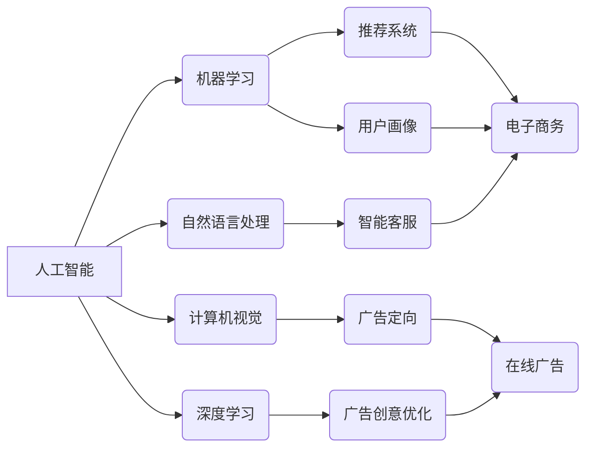

##  1. 背景介绍

###  1.1 电子商务的兴起与挑战

近年来，随着互联网技术的飞速发展和普及，电子商务发展迅猛，已经成为人们生活中不可或缺的一部分。然而，电子商务的快速发展也带来了一系列挑战，例如：

* **信息过载：**海量的商品信息让消费者难以选择，同时也增加了电商平台的推荐难度。
* **个性化需求：** 消费者需求日益个性化，传统的推荐系统难以满足用户多样化的需求。
* **竞争激烈：** 电商平台之间的竞争日益激烈，如何提高用户体验、增强用户粘性成为关键。

### 1.2 人工智能赋能电子商务

人工智能（AI）作为一种新兴技术，近年来取得了突破性进展，为解决电子商务面临的挑战提供了新的思路和方法。人工智能可以通过分析海量数据，挖掘用户行为模式，实现精准推荐、个性化营销、智能客服等功能，从而提升用户体验、提高运营效率、降低成本。

### 1.3 在线广告的现状与挑战

在线广告是电子商务的重要组成部分，也是电商平台重要的盈利模式之一。然而，传统的在线广告也面临着一些挑战，例如：

* **广告效果难以评估：** 传统的广告效果评估方法难以准确衡量广告的真实效果。
* **用户体验不佳：** 生硬的广告推送方式容易引起用户反感，降低用户体验。
* **广告欺诈问题：**  在线广告领域存在着一些欺诈行为，例如点击欺诈、流量作弊等。

### 1.4 人工智能助力在线广告

人工智能可以帮助在线广告解决上述挑战，例如：

* **精准定向：** 通过分析用户数据，实现精准的用户画像和广告定向，提高广告点击率和转化率。
* **程序化交易：**  利用机器学习算法自动进行广告竞价和投放，提高广告投放效率和 ROI。
* **广告创意优化：** 利用深度学习技术自动生成广告文案和创意素材，提高广告吸引力。


## 2. 核心概念与联系

### 2.1 人工智能核心技术

* **机器学习（Machine Learning）：** 通过数据训练算法，使机器能够自动学习和改进，并根据学习到的知识进行预测和决策。
* **深度学习（Deep Learning）：** 一种基于人工神经网络的机器学习方法，能够学习和表示数据的复杂结构，在图像识别、自然语言处理等领域取得了突破性进展。
* **自然语言处理（Natural Language Processing）：** 使计算机能够理解和处理人类语言的技术，包括文本分析、情感分析、机器翻译等。
* **计算机视觉（Computer Vision）：** 使计算机能够“看见”和理解图像的技术，包括图像分类、目标检测、图像分割等。

### 2.2  电子商务与在线广告中的应用

* **推荐系统：** 利用机器学习算法分析用户历史行为数据，预测用户可能感兴趣的商品，并进行个性化推荐。
* **用户画像：**  收集和分析用户的各种数据，构建用户画像，为精准营销和个性化服务提供基础。
* **智能客服：**  利用自然语言处理技术，实现自动化的客户服务，例如自动回复、智能问答等。
* **广告定向：**  根据用户画像和行为数据，将广告投放给目标用户，提高广告转化率。
* **程序化交易：**  利用机器学习算法自动进行广告竞价和投放，提高广告投放效率和 ROI。
* **广告创意优化：**  利用深度学习技术自动生成广告文案和创意素材，提高广告吸引力。

### 2.3 概念联系图



## 3. 核心算法原理具体操作步骤

### 3.1 推荐系统

#### 3.1.1 协同过滤算法

**原理：**  基于用户历史行为数据，计算用户或商品之间的相似度，然后根据相似度进行推荐。

**操作步骤：**

1. 收集用户历史行为数据，例如浏览记录、购买记录、评分记录等。
2. 根据用户历史行为数据，计算用户或商品之间的相似度。常用的相似度计算方法包括余弦相似度、皮尔逊相关系数等。
3. 根据相似度，为目标用户推荐与其兴趣相似的用户购买过的商品，或者为目标商品推荐给购买过相似商品的用户。

**举例说明：**

假设用户 A 购买了商品 1、商品 2 和商品 3，用户 B 购买了商品 2、商品 3 和商品 4。根据用户的购买记录，可以计算出用户 A 和用户 B 之间的相似度较高。因此，可以将用户 B 购买过的商品 4 推荐给用户 A。

#### 3.1.2 基于内容的推荐算法

**原理：**  根据商品的特征信息，计算商品之间的相似度，然后根据相似度进行推荐。

**操作步骤：**

1. 收集商品的特征信息，例如商品标题、商品描述、商品分类等。
2. 对商品的特征信息进行文本分析，提取关键词和特征向量。
3. 根据商品的特征向量，计算商品之间的相似度。
4. 根据相似度，为目标用户推荐与其购买过的商品相似的商品。

**举例说明：**

假设用户 A 购买了一本名为“机器学习”的书籍。根据书籍的标题和描述，可以提取出关键词“机器学习”、“人工智能”等。然后，可以根据这些关键词，搜索其他与“机器学习”相关的书籍，并推荐给用户 A。

### 3.2 用户画像

#### 3.2.1 数据收集

**数据来源：**

* 用户注册信息：例如年龄、性别、地域等。
* 用户行为数据：例如浏览记录、购买记录、搜索记录等。
* 用户社交数据：例如社交账号信息、好友关系等。
* 其他数据：例如用户反馈、问卷调查等。

**数据清洗和预处理：**

* 去除重复数据、缺失数据和异常数据。
* 对数据进行标准化、归一化等处理。

#### 3.2.2  用户标签体系构建

* **标签分类：**  根据业务需求，将用户标签进行分类，例如人口属性标签、兴趣爱好标签、消费能力标签等。
* **标签定义：**  对每个标签进行明确的定义，确保标签的含义清晰、准确。
* **标签权重：**  根据标签的重要性，设置不同的标签权重。

#### 3.2.3 用户画像生成

* **基于规则的画像生成：**  根据预先设定的规则，将用户数据与标签体系进行匹配，生成用户画像。
* **基于模型的画像生成：**  利用机器学习算法，对用户数据进行分析，自动生成用户画像。

### 3.3 智能客服

#### 3.3.1  自然语言理解

* **分词：**  将用户输入的文本分割成词语序列。
* **词性标注：**  对每个词语进行词性标注，例如名词、动词、形容词等。
* **命名实体识别：**  识别文本中的人名、地名、机构名等实体。
* **句法分析：**  分析句子的语法结构，例如主谓宾、定状补等。
* **语义分析：**  理解句子的语义，例如用户意图、情感倾向等。

#### 3.3.2 对话管理

* **对话状态跟踪：**  跟踪对话的当前状态，例如用户当前的意图、对话的历史信息等。
* **对话策略学习：**  根据对话状态和历史信息，选择合适的对话策略，例如回答问题、推荐商品、转人工客服等。
* **对话生成：**  根据对话策略，生成自然流畅的回复文本。

#### 3.3.3  知识库

* **知识图谱：**  构建知识图谱，存储和管理与业务相关的知识。
* **问答对数据库：**  收集和整理常见问题和答案，用于回答用户问题。
* **文档库：**  存储和管理与业务相关的文档，例如产品说明书、操作手册等。

### 3.4 广告定向

#### 3.4.1  目标人群选择

* **人口属性定向：**  根据用户的年龄、性别、地域等人口属性进行定向。
* **兴趣爱好定向：**  根据用户的兴趣爱好、浏览历史、搜索记录等进行定向。
* **行为定向：**  根据用户的购买记录、app 下载记录等行为数据进行定向。
* **设备定向：**  根据用户的设备类型、操作系统、网络环境等进行定向。

#### 3.4.2 广告投放

* **实时竞价（RTB）：**  在用户访问网页或 app 时，实时进行广告竞价，将广告展示给最合适的用户。
* **程序化购买：**  利用机器学习算法，自动进行广告位购买和广告投放。

### 3.5 程序化交易

#### 3.5.1  数据收集和分析

* **广告曝光数据：**  例如广告展示次数、点击次数、转化次数等。
* **用户行为数据：**  例如用户浏览记录、搜索记录、购买记录等。
* **环境数据：**  例如时间、地点、设备类型等。

#### 3.5.2  竞价策略

* **CPM 竞价：**  根据每千次广告展示成本进行竞价。
* **CPC 竞价：**  根据每次广告点击成本进行竞价。
* **CPA 竞价：**  根据每次广告转化成本进行竞价。
* **oCPM 竞价：**  根据预估转化率进行竞价。

#### 3.5.3  广告投放优化

* **预算控制：**  控制广告投放成本，避免超支。
* **频率控制：**  控制广告展示频率，避免用户反感。
* **创意优化：**  根据广告效果数据，不断优化广告创意，提高广告点击率和转化率。

### 3.6 广告创意优化

#### 3.6.1  数据收集和分析

* **广告点击率：**  衡量广告吸引用户点击的程度。
* **广告转化率：**  衡量广告促成用户完成特定目标的程度，例如购买商品、下载 app 等。
* **用户反馈：**  收集用户对广告的反馈，例如点赞、评论、分享等。

#### 3.6.2  创意生成

* **基于规则的创意生成：**  根据预先设定的规则，自动生成广告文案和创意素材。
* **基于模型的创意生成：**  利用深度学习技术，例如生成对抗网络（GAN），自动生成广告文案和创意素材。

#### 3.6.3  创意评估和优化

* **A/B 测试：**  将不同的广告创意进行对比测试，选择效果最好的创意。
* **多臂老虎机算法：**  根据广告效果数据，动态调整不同创意的展示比例，将流量倾斜到效果更好的创意上。


## 4. 数学模型和公式详细讲解举例说明

### 4.1  协同过滤算法

#### 4.1.1  余弦相似度

$$
\cos(\theta) = \frac{\mathbf{a} \cdot \mathbf{b}}{\|\mathbf{a}\| \|\mathbf{b}\|}
$$

其中，$\mathbf{a}$ 和 $\mathbf{b}$ 分别表示用户或商品的特征向量。

**举例说明：**

假设用户 A 的特征向量为 [1, 0, 1]，用户 B 的特征向量为 [0, 1, 1]，则用户 A 和用户 B 之间的余弦相似度为：

$$
\cos(\theta) = \frac{[1, 0, 1] \cdot [0, 1, 1]}{\|[1, 0, 1]\| \|[0, 1, 1]\|} = \frac{1}{\sqrt{2} \sqrt{2}} = 0.5
$$

#### 4.1.2  皮尔逊相关系数

$$
\rho_{X,Y} = \frac{\text{cov}(X,Y)}{\sigma_X \sigma_Y}
$$

其中，$\text{cov}(X,Y)$ 表示变量 $X$ 和 $Y$ 之间的协方差，$\sigma_X$ 和 $\sigma_Y$ 分别表示变量 $X$ 和 $Y$ 的标准差。

**举例说明：**

假设用户 A 对商品 1、商品 2 和商品 3 的评分分别为 5、3 和 4，用户 B 对商品 1、商品 2 和商品 3 的评分分别为 4、2 和 3，则用户 A 和用户 B 之间的皮尔逊相关系数为：

$$
\rho_{A,B} = \frac{\text{cov}([5, 3, 4], [4, 2, 3])}{\sigma_{[5, 3, 4]} \sigma_{[4, 2, 3]}} \approx 0.98
$$


### 4.2  逻辑回归模型

#### 4.2.1  模型公式

$$
P(y=1|x) = \frac{1}{1+e^{-(\beta_0 + \beta_1 x_1 + ... + \beta_n x_n)}}
$$

其中，$P(y=1|x)$ 表示在给定特征 $x$ 的情况下，样本属于类别 1 的概率，$\beta_0, \beta_1, ..., \beta_n$ 是模型参数。

#### 4.2.2  损失函数

$$
L(\beta) = -\frac{1}{m} \sum_{i=1}^m [y_i \log(h_\beta(x_i)) + (1-y_i) \log(1-h_\beta(x_i))]
$$

其中，$m$ 是样本数量，$y_i$ 是第 $i$ 个样本的真实标签，$h_\beta(x_i)$ 是模型对第 $i$ 个样本的预测概率。

#### 4.2.3  梯度下降算法

$$
\beta_j := \beta_j - \alpha \frac{\partial L(\beta)}{\partial \beta_j}
$$

其中，$\alpha$ 是学习率。

**举例说明：**

逻辑回归模型可以用于广告点击率预估。假设有以下广告点击数据：

| 用户ID | 性别 | 年龄 | 广告点击 |
|---|---|---|---|
| 1 | 男 | 25 | 1 |
| 2 | 女 | 30 | 0 |
| 3 | 男 | 28 | 1 |
| 4 | 女 | 26 | 0 |

可以使用逻辑回归模型来预测用户点击广告的概率。模型的输入特征可以是用户的性别和年龄，输出是用户点击广告的概率。通过训练数据，可以学习到模型的参数，然后就可以使用模型来预测新的用户点击广告的概率。

## 5. 项目实践：代码实例和详细解释说明

### 5.1  推荐系统实战

#### 5.1.1 数据集

MovieLens 数据集是一个常用的电影推荐数据集，包含了用户对电影的评分数据。

#### 5.1.2  代码实现

```python
import pandas as pd
from sklearn.metrics.pairwise import cosine_similarity

# 读取数据
ratings = pd.read_csv('ratings.csv')

# 创建用户-电影评分矩阵
user_ratings = ratings.pivot_table(index='userId', columns='movieId', values='rating')

# 计算用户相似度矩阵
user_similarity = cosine_similarity(user_ratings.fillna(0))

# 获取目标用户的 ID
target_user_id = 1

# 获取与目标用户最相似的 k 个用户
k = 10
similar_users = user_similarity[target_user_id].argsort()[-k-1:-1][::-1]

# 获取相似用户评分过的电影
similar_user_movies = user_ratings.iloc[similar_users].dropna(how='all').columns

# 过滤掉目标用户已经评分过的电影
recommendations = similar_user_movies[~similar_user_movies.isin(user_ratings.loc[target_user_id].dropna().index)]

# 打印推荐结果
print(recommendations)
```

#### 5.1.3 代码解释

1. 首先，读取 MovieLens 数据集，并创建一个用户-电影评分矩阵。
2. 然后，使用余弦相似度计算用户之间的相似度矩阵。
3. 接着，获取目标用户的 ID，并找到与目标用户最相似的 k 个用户。
4. 然后，获取相似用户评分过的电影，并过滤掉目标用户已经评分过的电影。
5. 最后，打印推荐结果。

### 5.2  广告点击率预估实战

#### 5.2.1 数据集

criteo 点击率预估数据集是一个常用的广告点击率预估数据集，包含了用户点击广告的数据。

#### 5.2.2 代码实现

```python
import pandas as pd
from sklearn.linear_model import LogisticRegression
from sklearn.model_selection import train_test_split
from sklearn.metrics import roc_auc_score

# 读取数据
data = pd.read_csv('criteo_sample.csv')

# 划分特征和标签
X = data.drop('click', axis=1)
y = data['click']

# 划分训练集和测试集
X_train, X_test, y_train, y_test = train_test_split