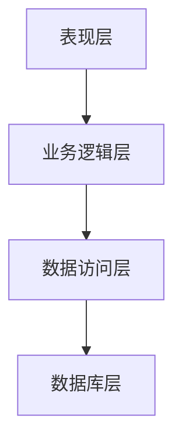

# 人才信息管理系统详细设计与具体代码实现

作者：禅与计算机程序设计艺术

## 1. 背景介绍

### 1.1 问题的提出

在现代企业中，人才管理是至关重要的一环。随着企业规模的扩大和员工数量的增加，传统的人才管理方法已经难以满足需求。如何高效地管理和利用人才信息，成为企业面临的重大挑战。为了应对这一问题，我们需要一个高效、可靠的人才信息管理系统。

### 1.2 现有系统的不足

目前市场上存在的许多人才管理系统存在以下不足：
- 数据孤岛：不同部门、不同系统之间的数据难以共享和整合。
- 功能单一：无法满足企业多样化的人才管理需求。
- 用户体验差：界面复杂、操作繁琐，用户学习成本高。

### 1.3 设计目标

为了克服上述不足，我们设计了一个全新的人才信息管理系统，目标是：
- 数据集中管理，实现信息共享和整合。
- 功能全面，满足企业多样化的人才管理需求。
- 用户友好，界面简洁、操作便捷。

## 2. 核心概念与联系

### 2.1 系统架构

人才信息管理系统的架构设计是整个系统的基础。我们采用分层架构，将系统分为以下几个层次：
- 表现层（UI）：负责与用户交互，提供友好的操作界面。
- 业务逻辑层：处理业务逻辑，执行各种操作和计算。
- 数据访问层：负责与数据库交互，执行数据的增删改查操作。
- 数据库层：存储系统的所有数据。

#### 系统架构图



### 2.2 数据模型

数据模型是系统设计的核心。我们需要定义好各类实体及其属性和关系。主要包括以下几个实体：
- 员工（Employee）：包括员工编号、姓名、性别、出生日期、职位、部门等属性。
- 部门（Department）：包括部门编号、部门名称、上级部门等属性。
- 职位（Position）：包括职位编号、职位名称、职位描述等属性。

### 2.3 数据库设计

数据库设计是系统实现的基础。我们采用关系型数据库来存储系统数据。主要包括以下几个表：
- 员工表（Employee）：存储员工基本信息。
- 部门表（Department）：存储部门基本信息。
- 职位表（Position）：存储职位基本信息。

## 3. 核心算法原理具体操作步骤

### 3.1 数据的增删改查操作

在人才信息管理系统中，数据的增删改查操作是最基本的功能。我们需要设计一套高效的算法来实现这些操作。

#### 数据插入操作

数据插入操作的基本步骤如下：
1. 接收用户输入的数据。
2. 验证数据的合法性。
3. 将数据插入数据库。

#### 数据删除操作

数据删除操作的基本步骤如下：
1. 接收用户输入的删除请求。
2. 验证删除请求的合法性。
3. 从数据库中删除相应的数据。

#### 数据更新操作

数据更新操作的基本步骤如下：
1. 接收用户输入的更新请求。
2. 验证更新请求的合法性。
3. 更新数据库中的相应数据。

#### 数据查询操作

数据查询操作的基本步骤如下：
1. 接收用户输入的查询请求。
2. 验证查询请求的合法性。
3. 从数据库中查询相应的数据。

### 3.2 数据的批量处理

在实际应用中，我们经常需要对大量数据进行批量处理。为了提高效率，我们需要设计一套高效的批量处理算法。

#### 批量插入操作

批量插入操作的基本步骤如下：
1. 接收用户输入的批量数据。
2. 验证批量数据的合法性。
3. 批量插入数据库。

#### 批量删除操作

批量删除操作的基本步骤如下：
1. 接收用户输入的批量删除请求。
2. 验证批量删除请求的合法性。
3. 批量删除数据库中的相应数据。

#### 批量更新操作

批量更新操作的基本步骤如下：
1. 接收用户输入的批量更新请求。
2. 验证批量更新请求的合法性。
3. 批量更新数据库中的相应数据。

#### 批量查询操作

批量查询操作的基本步骤如下：
1. 接收用户输入的批量查询请求。
2. 验证批量查询请求的合法性。
3. 批量查询数据库中的相应数据。

## 4. 数学模型和公式详细讲解举例说明

### 4.1 数据一致性算法

在分布式系统中，数据一致性是一个重要的问题。为了保证数据的一致性，我们采用了分布式事务算法。

#### 分布式事务算法

分布式事务算法的基本原理如下：
1. 将事务分为多个子事务。
2. 使用两阶段提交协议（2PC）来保证所有子事务的一致性。

#### 两阶段提交协议（2PC）

两阶段提交协议的基本步骤如下：
1. 准备阶段：协调者向所有参与者发送准备请求，参与者执行事务并将结果返回给协调者。
2. 提交阶段：如果所有参与者都准备成功，协调者向所有参与者发送提交请求，参与者提交事务；否则，协调者向所有参与者发送回滚请求，参与者回滚事务。

### 4.2 数据压缩算法

为了节省存储空间和提高传输效率，我们采用了数据压缩算法。

#### 数据压缩算法

数据压缩算法的基本原理如下：
1. 对数据进行编码，减少数据的冗余。
2. 将编码后的数据存储或传输。

#### 哈夫曼编码算法

哈夫曼编码算法的基本步骤如下：
1. 统计数据中每个字符出现的频率。
2. 根据字符的频率构建哈夫曼树。
3. 根据哈夫曼树生成编码表。
4. 使用编码表对数据进行编码。

$$
H(X) = - \sum_{i=1}^{n} p(x_i) \log_2 p(x_i)
$$

### 4.3 数据索引算法

为了提高数据查询的效率，我们采用了数据索引算法。

#### 数据索引算法

数据索引算法的基本原理如下：
1. 为数据建立索引，记录数据的位置。
2. 在查询时，通过索引快速定位数据。

#### B+树索引算法

B+树索引算法的基本步骤如下：
1. 为数据构建B+树。
2. 在查询时，通过B+树查找数据的位置。

## 5. 项目实践：代码实例和详细解释说明

### 5.1 环境配置

在开始编写代码之前，我们需要配置开发环境。主要包括以下几个步骤：
1. 安装数据库：选择MySQL作为数据库，安装并配置。
2. 安装开发工具：选择IntelliJ IDEA作为开发工具，安装并配置。
3. 安装依赖库：选择Spring Boot作为框架，安装并配置。

### 5.2 数据库设计

首先，我们需要设计数据库。主要包括以下几个表：
- 员工表（Employee）
- 部门表（Department）
- 职位表（Position）

#### 数据库脚本

```sql
CREATE TABLE Department (
    department_id INT AUTO_INCREMENT PRIMARY KEY,
    department_name VARCHAR(100) NOT NULL,
    parent_department_id INT
);

CREATE TABLE Position (
    position_id INT AUTO_INCREMENT PRIMARY KEY,
    position_name VARCHAR(100) NOT NULL,
    position_description TEXT
);

CREATE TABLE Employee (
    employee_id INT AUTO_INCREMENT PRIMARY KEY,
    employee_name VARCHAR(100) NOT NULL,
    gender ENUM('Male', 'Female'),
    birth_date DATE,
    position_id INT,
    department_id INT,
    FOREIGN KEY (position_id) REFERENCES Position(position_id),
    FOREIGN KEY (department_id) REFERENCES Department(department_id)
);
```

### 5.3 代码实现

接下来，我们开始编写代码。主要包括以下几个模块：
- 表现层（UI）：使用Thymeleaf模板引擎。
- 业务逻辑层：使用Spring Boot框架。
- 数据访问层：使用Spring Data JPA。

#### 表现层代码

```html
<!DOCTYPE html>
<html xmlns:th="http://www.thymeleaf.org">
<head>
    <title>人才信息管理系统</title>
</head>
<body>
    <h1>人才信息管理系统</h1>
    <form action="/employee/add" method="post">
        <label for="name">姓名：</label>
        <input type="text" id="name" name="name" required>
        <br>
        <label for="gender">性别：</label>
        <select id="gender" name="gender">
            <option value="Male">男</option>
            <