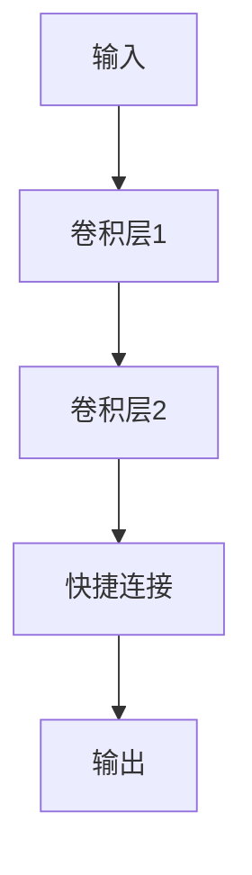

# 从零开始大模型开发与微调：ResNet基础原理与程序设计基础

作者：禅与计算机程序设计艺术

## 1. 背景介绍

### 1.1 深度学习的崛起

深度学习在过去十年间取得了显著的进展，其在计算机视觉、自然语言处理、语音识别等领域的突破性成果令人瞩目。尤其是卷积神经网络（CNN）的发展，使得图像分类、目标检测等任务的性能达到了前所未有的高度。

### 1.2 ResNet的诞生

在众多深度学习模型中，ResNet（Residual Network）是一个里程碑式的模型。由何凯明等人于2015年提出的ResNet，通过引入残差连接（Residual Connection），成功地训练了超过100层的深度网络，极大地缓解了深度网络的退化问题。

### 1.3 本文目标

本文旨在从零开始，详细介绍ResNet的基础原理与程序设计基础，帮助读者理解并实现ResNet模型。同时，本文将涵盖ResNet的核心算法、数学模型、实际应用场景以及相关工具和资源的推荐。

## 2. 核心概念与联系

### 2.1 卷积神经网络（CNN）

卷积神经网络是深度学习中处理图像数据的基础结构。其核心思想是通过卷积运算提取图像的特征。

#### 2.1.1 卷积层

卷积层通过卷积核（filter）与输入图像进行卷积操作，提取局部特征。卷积运算的数学表达式为：

$$
y(i, j) = \sum_{m} \sum_{n} x(i+m, j+n) \cdot w(m, n)
$$

其中，$x$是输入图像，$w$是卷积核，$y$是输出特征图。

#### 2.1.2 池化层

池化层用于降维和减少计算量，常见的池化操作有最大池化（Max Pooling）和平均池化（Average Pooling）。

### 2.2 残差网络（ResNet）

残差网络通过引入残差连接，解决了深度网络中的退化问题。其核心思想是通过残差块（Residual Block）来学习输入和输出之间的残差。

#### 2.2.1 残差块

一个典型的残差块包含两个卷积层和一个快捷连接（Shortcut Connection），其结构如下图所示：



#### 2.2.2 残差连接

残差连接的数学表达式为：

$$
y = F(x, \{W_i\}) + x
$$

其中，$F(x, \{W_i\})$表示卷积层的输出，$x$表示输入。

## 3. 核心算法原理具体操作步骤

### 3.1 预处理数据

在训练ResNet之前，需要对数据进行预处理，包括图像归一化、数据增强等操作。

#### 3.1.1 图像归一化

图像归一化是将像素值缩放到[0, 1]或[-1, 1]范围内，以加速模型收敛。

#### 3.1.2 数据增强

数据增强通过随机裁剪、旋转、翻转等操作，增加数据的多样性，防止过拟合。

### 3.2 构建ResNet模型

构建ResNet模型的核心步骤包括定义残差块、堆叠残差块、添加全连接层等。

#### 3.2.1 定义残差块

```python
import torch
import torch.nn as nn

class ResidualBlock(nn.Module):
    def __init__(self, in_channels, out_channels, stride=1):
        super(ResidualBlock, self).__init__()
        self.conv1 = nn.Conv2d(in_channels, out_channels, kernel_size=3, stride=stride, padding=1)
        self.bn1 = nn.BatchNorm2d(out_channels)
        self.relu = nn.ReLU(inplace=True)
        self.conv2 = nn.Conv2d(out_channels, out_channels, kernel_size=3, stride=1, padding=1)
        self.bn2 = nn.BatchNorm2d(out_channels)

        self.shortcut = nn.Sequential()
        if stride != 1 or in_channels != out_channels:
            self.shortcut = nn.Sequential(
                nn.Conv2d(in_channels, out_channels, kernel_size=1, stride=stride),
                nn.BatchNorm2d(out_channels)
            )

    def forward(self, x):
        out = self.relu(self.bn1(self.conv1(x)))
        out = self.bn2(self.conv2(out))
        out += self.shortcut(x)
        out = self.relu(out)
        return out
```

#### 3.2.2 堆叠残差块

```python
class ResNet(nn.Module):
    def __init__(self, block, layers, num_classes=1000):
        super(ResNet, self).__init__()
        self.in_channels = 64
        self.conv1 = nn.Conv2d(3, 64, kernel_size=7, stride=2, padding=3)
        self.bn1 = nn.BatchNorm2d(64)
        self.relu = nn.ReLU(inplace=True)
        self.maxpool = nn.MaxPool2d(kernel_size=3, stride=2, padding=1)
        self.layer1 = self._make_layer(block, 64, layers[0])
        self.layer2 = self._make_layer(block, 128, layers[1], stride=2)
        self.layer3 = self._make_layer(block, 256, layers[2], stride=2)
        self.layer4 = self._make_layer(block, 512, layers[3], stride=2)
        self.avgpool = nn.AdaptiveAvgPool2d((1, 1))
        self.fc = nn.Linear(512, num_classes)

    def _make_layer(self, block, out_channels, blocks, stride=1):
        layers = []
        layers.append(block(self.in_channels, out_channels, stride))
        self.in_channels = out_channels
        for _ in range(1, blocks):
            layers.append(block(self.in_channels, out_channels))
        return nn.Sequential(*layers)

    def forward(self, x):
        x = self.relu(self.bn1(self.conv1(x)))
        x = self.maxpool(x)
        x = self.layer1(x)
        x = self.layer2(x)
        x = self.layer3(x)
        x = self.layer4(x)
        x = self.avgpool(x)
        x = torch.flatten(x, 1)
        x = self.fc(x)
        return x

def ResNet18():
    return ResNet(ResidualBlock, [2, 2, 2, 2])
```

### 3.3 训练模型

训练模型包括定义损失函数、优化器、训练循环等步骤。

#### 3.3.1 定义损失函数和优化器

```python
import torch.optim as optim

model = ResNet18()
criterion = nn.CrossEntropyLoss()
optimizer = optim.Adam(model.parameters(), lr=0.001)
```

#### 3.3.2 训练循环

```python
num_epochs = 25

for epoch in range(num_epochs):
    model.train()
    running_loss = 0.0
    for i, (inputs, labels) in enumerate(train_loader):
        optimizer.zero_grad()
        outputs = model(inputs)
        loss = criterion(outputs, labels)
        loss.backward()
        optimizer.step()
        running_loss += loss.item()
        if i % 100 == 99:
            print(f'Epoch [{epoch+1}/{num_epochs}], Step [{i+1}/{len(train_loader)}], Loss: {running_loss / 100:.4f}')
            running_loss = 0.0
```

## 4. 数学模型和公式详细讲解举例说明

### 4.1 卷积操作

卷积操作是卷积神经网络的基础，其数学表达式为：

$$
y(i, j) = \sum_{m} \sum_{n} x(i+m, j+n) \cdot w(m, n)
$$

其中，$x$是输入图像，$w$是卷积核，$y$是输出特征图。

### 4.2 残差连接

残差连接的引入是ResNet的核心，其数学表达式为：

$$
y = F(x, \{W_i\}) + x
$$

其中，$F(x, \{W_i\})$表示卷积层的输出，$x$表示输入。

### 4.3 损失函数

在图像分类任务中，常用的损失函数是交叉熵损失，其数学表达式为：

$$
L = -\sum_{i} y_i \log(\hat{y}_i)
$$

其中，$y_i$是实际标签，$\hat{y