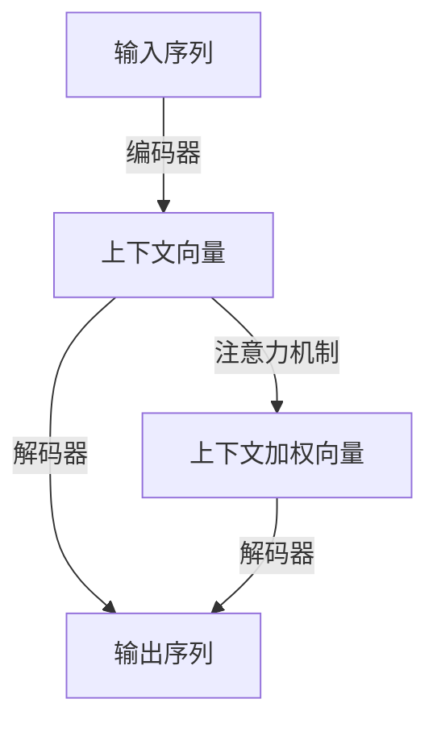

# 从零开始大模型开发与微调：解码器的实现

作者：禅与计算机程序设计艺术

## 1. 背景介绍

### 1.1 大模型的发展历程

在过去的十年中，人工智能领域经历了迅猛的发展。特别是大规模预训练模型（Large Pre-trained Models）的出现，如GPT-3和BERT，极大地推动了自然语言处理（NLP）和其他AI应用的前沿。这些模型通过在海量数据上进行预训练，获得了强大的语言理解和生成能力，并在多种任务中表现出色。

### 1.2 解码器在大模型中的角色

解码器（Decoder）是大模型架构中的关键组件之一，尤其是在生成任务中，如文本生成、翻译和对话系统。解码器的主要职责是根据输入的编码信息生成输出序列。理解和实现高效的解码器是开发和微调大模型的核心步骤。

### 1.3 本文的目标

本文旨在详细阐述从零开始开发和微调大模型中的解码器的过程。我们将探讨解码器的核心概念、算法原理、数学模型、实际项目实践、应用场景、工具和资源推荐，并展望未来的发展趋势与挑战。

## 2. 核心概念与联系

### 2.1 编码器-解码器架构

编码器-解码器（Encoder-Decoder）架构是一种广泛应用于序列到序列（Seq2Seq）任务的深度学习模型。编码器将输入序列转换为固定长度的上下文向量，而解码器则根据该上下文向量生成输出序列。

### 2.2 注意力机制

注意力机制（Attention Mechanism）是提升编码器-解码器模型性能的关键技术。它允许模型在生成每个输出时，动态地关注输入序列的不同部分，从而捕捉到更丰富的上下文信息。

### 2.3 自注意力机制与Transformer

自注意力机制（Self-Attention Mechanism）是Transformer模型的核心组件。Transformer通过多头自注意力机制取代了传统的RNN结构，显著提高了模型的并行计算能力和性能。



## 3. 核心算法原理具体操作步骤

### 3.1 编码器的实现

编码器通常由多个层组成，每层包括一个多头自注意力机制和一个前馈神经网络（Feed-Forward Neural Network）。每一层的输出将作为下一层的输入。

#### 3.1.1 多头自注意力机制

多头自注意力机制通过多个并行的注意力头（Attention Head）来捕捉输入序列中不同部分之间的依赖关系。每个注意力头计算输入序列中每个位置与其他位置的相似度，并生成加权和。

$$
\text{Attention}(Q, K, V) = \text{softmax} \left( \frac{QK^T}{\sqrt{d_k}} \right) V
$$

其中，$Q$、$K$、$V$分别表示查询（Query）、键（Key）和值（Value）矩阵，$d_k$是键向量的维度。

#### 3.1.2 前馈神经网络

前馈神经网络由两个全连接层（Fully Connected Layer）组成，中间通过激活函数进行非线性变换。

$$
\text{FFN}(x) = \text{ReLU}(xW_1 + b_1)W_2 + b_2
$$

### 3.2 解码器的实现

解码器的结构与编码器类似，但它还需要额外处理编码器的输出和生成的输出序列。解码器的每一层包括自注意力机制、编码器-解码器注意力机制和前馈神经网络。

#### 3.2.1 自注意力机制

自注意力机制用于生成输出序列的上下文信息，与编码器中的自注意力机制类似。

#### 3.2.2 编码器-解码器注意力机制

编码器-解码器注意力机制用于将编码器的输出与解码器的输入结合起来，生成更准确的输出。

$$
\text{Attention}(Q, K, V) = \text{softmax} \left( \frac{QK^T}{\sqrt{d_k}} \right) V
$$

其中，$Q$来自解码器的输入，$K$和$V$来自编码器的输出。

#### 3.2.3 前馈神经网络

与编码器中的前馈神经网络相同，解码器中的前馈神经网络用于进一步处理注意力机制的输出。

## 4. 数学模型和公式详细讲解举例说明

### 4.1 多头自注意力机制的数学模型

在多头自注意力机制中，首先将输入序列通过线性变换生成多个查询、键和值矩阵。

$$
Q_i = XW_i^Q, \quad K_i = XW_i^K, \quad V_i = XW_i^V
$$

其中，$W_i^Q$、$W_i^K$和$W_i^V$是可训练的权重矩阵。

然后，计算每个注意力头的输出。

$$
\text{head}_i = \text{Attention}(Q_i, K_i, V_i)
$$

最后，将所有注意力头的输出拼接起来，并通过线性变换生成最终的输出。

$$
\text{MultiHead}(Q, K, V) = \text{Concat}(\text{head}_1, \ldots, \text{head}_h)W^O
$$

### 4.2 前馈神经网络的数学模型

前馈神经网络通过两个全连接层和一个激活函数进行非线性变换。

$$
\text{FFN}(x) = \text{ReLU}(xW_1 + b_1)W_2 + b_2
$$

### 4.3 编码器-解码器注意力机制的数学模型

编码器-解码器注意力机制通过解码器的输入和编码器的输出计算注意力权重，并生成加权和。

$$
\text{Attention}(Q, K, V) = \text{softmax} \left( \frac{QK^T}{\sqrt{d_k}} \right) V
$$

其中，$Q$来自解码器的输入，$K$和$V$来自编码器的输出。

## 5. 项目实践：代码实例和详细解释说明

### 5.1 编码器的实现

以下是一个简单的编码器实现示例，使用PyTorch框架：

```python
import torch
import torch.nn as nn
import torch.nn.functional as F

class MultiHeadAttention(nn.Module):
    def __init__(self, d_model, num_heads):
        super(MultiHeadAttention, self).__init__()
        self.num_heads = num_heads
        self.d_model = d_model

        assert d_model % num_heads == 0

        self.depth = d_model // num_heads

        self.wq = nn.Linear(d_model, d_model)
        self.wk = nn.Linear(d_model, d_model)
        self.wv = nn.Linear(d_model, d_model)

        self.dense = nn.Linear(d_model, d_model)

    def split_heads(self, x, batch_size):
        x = x.view(batch_size, -1, self.num_heads, self.depth)
        return x.permute(0, 2, 1, 3)

    def forward(self, v, k, q, mask):
        batch_size = q.size(0)

        q = self.wq(q)
        k = self.wk(k)
        v = self.wv(v)

        q = self.split_heads(q, batch_size)
        k = self.split_heads(k, batch_size)
        v = self.split_heads(v, batch_size)

        scaled_attention, attention_weights = self.scaled_dot_product_attention(q, k, v, mask)
        scaled_attention = scaled_attention.permute(0, 2, 1, 3).contiguous()
        original_size_attention = scaled_attention.view(batch_size, -1, self.d_model)
        output = self.dense(original_size_attention)

        return output, attention_weights

    def scaled_dot_product_attention(self, q, k, v, mask):
        matmul_qk = torch.matmul(q, k.transpose(-2, -1))
        dk = torch.tensor(k.size()[-1], dtype=torch.float32)
        scaled_attention_logits = matmul_qk / torch.sqrt(dk)

        if mask is not None:
            scaled_attention_logits += (mask * -1e9)

        attention_weights = F.softmax(scaled_attention_logits