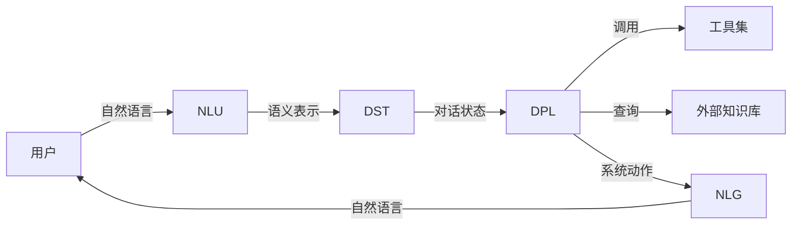
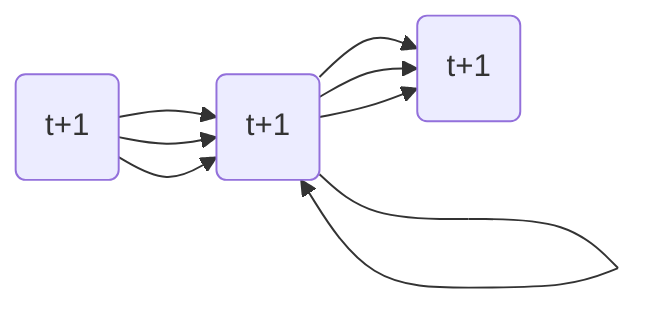
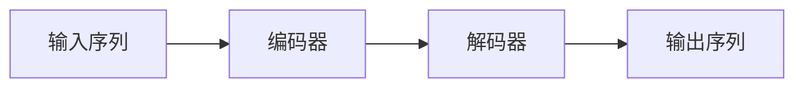

# 从零开始构建LLM智能代理:基础架构和关键组件

作者：禅与计算机程序设计艺术

## 1. 背景介绍

### 1.1  LLM智能代理的兴起

近年来，大型语言模型（LLM）在自然语言处理领域取得了显著的进展，展现出惊人的文本生成、理解和推理能力。然而，将LLM的能力转化为实际应用仍然是一个挑战。LLM智能代理应运而生，它将LLM作为核心大脑，结合其他组件和技术，构建能够执行复杂任务、与用户进行自然交互的智能系统。

### 1.2  LLM智能代理的应用领域

LLM智能代理具有广泛的应用前景，例如：

- **智能客服：** 提供自然、高效的客户服务，解决用户问题，提升用户体验。
- **个性化教育：** 根据学生的学习情况和目标，提供定制化的学习内容和指导。
- **智能助手：** 帮助用户完成日常任务，例如安排日程、预订酒店、查询信息等。
- **创意内容生成：** 辅助创作小说、诗歌、剧本等创意内容。

### 1.3 本文目标

本文旨在提供构建LLM智能代理的基础架构和关键组件的指南，帮助开发者快速入门并构建自己的智能代理应用。

## 2. 核心概念与联系

### 2.1  LLM智能代理架构

一个典型的LLM智能代理架构包含以下核心组件：

- **自然语言理解（NLU）：** 将用户输入的自然语言转换为机器可理解的语义表示。
- **对话状态跟踪（DST）：**  记录和管理对话历史，理解当前对话状态。
- **对话策略学习（DPL）：** 根据对话状态和目标，选择合适的动作或回复。
- **自然语言生成（NLG）：** 将机器生成的语义表示转换为自然流畅的文本输出。
- **外部知识库：** 为LLM提供额外的知识和信息，增强其理解和推理能力。
- **工具集：**  提供执行特定任务的工具，例如查询数据库、调用API等。

### 2.2  组件间联系

这些组件相互协作，形成一个完整的闭环：

1. 用户通过自然语言与智能代理交互。
2. NLU模块将用户输入解析为语义表示。
3. DST模块根据对话历史更新对话状态。
4. DPL模块根据对话状态和目标选择合适的动作，例如查询知识库、调用工具或生成回复。
5. 如果需要，智能代理可以访问外部知识库或工具获取信息或执行操作。
6. NLG模块将系统回复转换为自然语言输出给用户。

### 2.3  核心概念关系图



## 3. 核心算法原理具体操作步骤

### 3.1  自然语言理解（NLU）

NLU模块的目标是将自然语言转换为机器可理解的语义表示。常见的NLU技术包括：

- **意图识别：**  识别用户意图，例如查询信息、预订服务、寻求帮助等。
- **槽位填充：**  提取用户意图相关的关键信息，例如时间、地点、人物等。
- **语义角色标注：**  识别句子中各个成分的语义角色，例如施事者、受事者、时间、地点等。

#### 3.1.1  意图识别

意图识别可以使用基于规则的方法、基于统计机器学习的方法或基于深度学习的方法。

- 基于规则的方法使用预定义的规则来匹配用户输入，例如正则表达式。
- 基于统计机器学习的方法使用机器学习算法，例如支持向量机（SVM）、朴素贝叶斯等，根据标注数据训练分类模型。
- 基于深度学习的方法使用深度神经网络，例如卷积神经网络（CNN）、循环神经网络（RNN）等，自动学习特征并进行分类。

#### 3.1.2  槽位填充

槽位填充可以使用基于规则的方法、基于条件随机场（CRF）的方法或基于深度学习的方法。

- 基于规则的方法使用预定义的规则来提取关键信息，例如正则表达式。
- 基于CRF的方法使用CRF模型来预测每个词的标签，例如时间、地点、人物等。
- 基于深度学习的方法使用深度神经网络，例如循环神经网络（RNN）等，自动学习特征并进行序列标注。

### 3.2  对话状态跟踪（DST）

DST模块的目标是记录和管理对话历史，理解当前对话状态。常见的DST技术包括：

- **基于规则的DST：** 使用预定义的规则来更新对话状态。
- **基于统计机器学习的DST：** 使用机器学习算法，例如隐马尔可夫模型（HMM）、条件随机场（CRF）等，根据对话历史预测当前对话状态。
- **基于深度学习的DST：** 使用深度神经网络，例如循环神经网络（RNN）等，自动学习特征并进行状态预测。

### 3.3  对话策略学习（DPL）

DPL模块的目标是根据对话状态和目标，选择合适的动作或回复。常见的DPL技术包括：

- **基于规则的DPL：** 使用预定义的规则来选择动作或回复。
- **基于强化学习的DPL：** 使用强化学习算法，例如Q-learning、SARSA等，通过与环境交互学习最优策略。
- **基于深度强化学习的DPL：** 使用深度神经网络和强化学习算法，例如深度Q网络（DQN）、策略梯度等，自动学习特征并进行决策。

### 3.4  自然语言生成（NLG）

NLG模块的目标是将机器生成的语义表示转换为自然流畅的文本输出。常见的NLG技术包括：

- **基于模板的NLG：** 使用预定义的模板来生成文本，例如“您好，{用户名}，请问您需要什么帮助？”。
- **基于统计机器翻译的NLG：** 使用机器翻译模型，例如统计机器翻译（SMT）模型，将语义表示翻译成自然语言。
- **基于深度学习的NLG：** 使用深度神经网络，例如循环神经网络（RNN）等，自动学习特征并生成文本。

## 4. 数学模型和公式详细讲解举例说明

### 4.1  循环神经网络（RNN）

RNN是一种专门处理序列数据的神经网络，它可以记住之前的输入，并在当前时间步的输出中体现出来。RNN的结构如下图所示：



其中，$x(t)$ 表示 $t$ 时刻的输入，$h(t)$ 表示 $t$ 时刻的隐藏状态，$y(t)$ 表示 $t$ 时刻的输出。RNN的关键在于隐藏状态 $h(t)$，它可以存储之前所有时间步的信息。

RNN的数学模型可以表示为：

$$
\begin{aligned}
h(t) &= f(W_{xh}x(t) + W_{hh}h(t-1) + b_h) \\
y(t) &= g(W_{hy}h(t) + b_y)
\end{aligned}
$$

其中，$W_{xh}$、$W_{hh}$ 和 $W_{hy}$ 是权重矩阵，$b_h$ 和 $b_y$ 是偏置向量，$f$ 和 $g$ 是激活函数。

### 4.2  Transformer

Transformer是一种基于自注意力机制的神经网络，它可以捕捉序列数据中的长距离依赖关系。Transformer的结构如下图所示：



其中，编码器和解码器都是由多个相同的层堆叠而成，每一层都包含自注意力机制和前馈神经网络。

自注意力机制的原理是计算每个词与其他所有词之间的相关性，从而捕捉词之间的语义关系。自注意力机制的数学模型可以表示为：

$$
\text{Attention}(Q, K, V) = \text{softmax}(\frac{QK^T}{\sqrt{d_k}})V
$$

其中，$Q$、$K$ 和 $V$ 分别表示查询矩阵、键矩阵和值矩阵，$d_k$ 表示键的维度。

## 5. 项目实践：代码实例和详细解释说明

### 5.1  使用Rasa构建简单的LLM智能代理

Rasa是一个开源的对话式AI框架，它可以用于构建基于规则和机器学习的对话系统。

#### 5.1.1  安装Rasa

```
pip install rasa
```

#### 5.1.2  创建Rasa项目

```
rasa init
```

#### 5.1.3  定义NLU模型

在 `nlu.yml` 文件中定义意图和槽位：

```yaml
version: "3.1"

nlu:
- intent: greet
  examples: |
    - hey
    - hello
    - hi
    - good morning
    - good evening
    - hey there

- intent: goodbye
  examples: |
    - bye
    - goodbye
    - see you around
    - see you later

- intent: order_pizza
  examples: |
    - i want to order a pizza
    - can i get a pizza?
    - i'd like to order a pizza please
  slots:
    - pizza_type:
        type: text
    - pizza_size:
        type: text
```

#### 5.1.4  定义对话管理模型

在 `domain.yml` 文件中定义意图、槽位、动作和模板：

```yaml
version: "3.1"

intents:
  - greet
  - goodbye
  - order_pizza

slots:
  pizza_type:
    type: text
    mappings:
    - type: from_entity
      entity: pizza_type
  pizza_size:
    type: text
    mappings:
    - type: from_entity
      entity: pizza_size

actions:
  - utter_greet
  - utter_goodbye
  - utter_ask_pizza_type
  - utter_ask_pizza_size
  - utter_order_confirmation

templates:
  utter_greet:
  - text: "Hello! How can I help you?"

  utter_goodbye:
  - text: "Goodbye!"

  utter_ask_pizza_type:
  - text: "What type of pizza would you like?"

  utter_ask_pizza_size:
  - text: "What size pizza would you like?"

  utter_order_confirmation:
  - text: "OK, I have ordered a {pizza_size} {pizza_type} pizza for you."
```

#### 5.1.5  训练模型

```
rasa train
```

#### 5.1.6  测试模型

```
rasa shell
```

### 5.2  使用LangChain构建更复杂的LLM智能代理

LangChain是一个用于构建LLM应用的框架，它提供了与各种LLM、工具和数据源集成的接口。

#### 5.2.1  安装LangChain

```
pip install langchain
```

#### 5.2.2  使用LangChain调用LLM

```python
from langchain.llms import OpenAI

# 初始化LLM
llm = OpenAI(openai_api_key="YOUR_API_KEY")

# 调用LLM
response = llm("What is the capital of France?")

# 打印回复
print(response)
```

#### 5.2.3  使用LangChain构建问答系统

```python
from langchain.chains import ConversationChain
from langchain.llms import OpenAI

# 初始化LLM
llm = OpenAI(openai_api_key="YOUR_API_KEY")

# 创建对话链
conversation = ConversationChain(llm=llm)

# 开始对话
while True:
    # 获取用户输入
    user_input = input("You: ")

    # 调用对话链
    response = conversation.predict(input=user_input)

    # 打印回复
    print(f"Bot: {response}")
```

## 6. 实际应用场景

### 6.1  智能客服

LLM智能代理可以用于构建智能客服系统，例如：

- 自动回答常见问题
- 提供个性化的产品推荐
- 处理简单的投诉和退款

### 6.2  个性化教育

LLM智能代理可以用于构建个性化教育系统，例如：

- 提供定制化的学习内容和练习
- 根据学生的学习情况调整教学进度
- 提供实时的反馈和指导

### 6.3  智能助手

LLM智能代理可以用于构建智能助手，例如：

- 安排日程
- 预订酒店和机票
- 查询信息

## 7. 工具和资源推荐

### 7.1  LLM模型

- **GPT-3 (Generative Pre-trained Transformer 3):** OpenAI开发的大型语言模型。
- **LaMDA (Language Model for Dialogue Applications):** Google开发的对话生成语言模型。
- **BERT (Bidirectional Encoder Representations from Transformers):** Google开发的用于自然语言理解的预训练模型。

### 7.2  框架和工具

- **Rasa:** 开源的对话式AI框架。
- **LangChain:** 用于构建LLM应用的框架。
- **Hugging Face Transformers:** 用于自然语言处理的预训练模型库。
- **SpaCy:** 用于自然语言处理的Python库。
- **NLTK (Natural Language Toolkit):** 用于自然语言处理的Python库。

## 8. 总结：未来发展趋势与挑战

### 8.1  未来发展趋势

- **更强大的LLM模型：** 随着计算能力的提升和训练数据的增加，LLM模型将会变得更加强大，能够处理更复杂的任务。
- **多模态智能代理：** 未来的LLM智能代理将能够处理多种模态的数据，例如文本、图像、语音等。
- **个性化和情感智能：** LLM智能代理将能够更好地理解用户的个性和情感，提供更加个性化和人性化的服务。

### 8.2  挑战

- **数据偏差：** LLM模型的训练数据可能存在偏差，导致智能代理产生不公平或不准确的结果。
- **可解释性和可信度：** LLM模型的决策过程难以解释，这可能会影响用户的信任度。
- **安全性和隐私：** LLM智能代理可能会被恶意利用，例如生成虚假信息或窃取用户隐私。

## 9. 附录：常见问题与解答

### 9.1  什么是LLM？

LLM是指大型语言模型，它是一种基于深度学习的自然语言处理模型，能够生成自然流畅的文本、理解语言含义并进行推理。

### 9.2  什么是LLM智能代理？

LLM智能代理是一种以LLM为核心大脑的智能系统，它能够执行复杂任务、与用户进行自然交互。

### 9.3  如何构建LLM智能代理？

构建LLM智能代理需要以下步骤：

1. 选择合适的LLM模型。
2. 构建智能代理的架构，包括NLU、DST、DPL和NLG等组件。
3. 收集和标注训练数据。
4. 训练和评估模型。
5. 部署和维护智能代理。


##  ---  END  --- 
