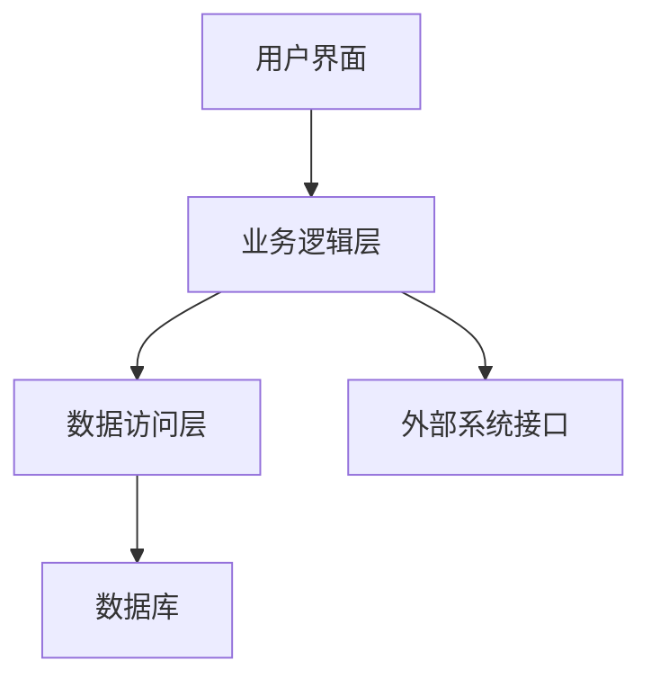

# 企业仓库管理系统详细设计与具体代码实现

作者：禅与计算机程序设计艺术

## 1. 背景介绍

### 1.1 企业仓库管理的挑战

在现代企业中，仓库管理是供应链管理的核心环节之一。仓库管理系统（WMS，Warehouse Management System）的目标是优化库存管理、提高仓库操作效率、降低运营成本。然而，传统的仓库管理面临诸多挑战，包括库存不准确、操作流程不规范、数据孤岛、缺乏实时监控等问题。

### 1.2 WMS的重要性和发展趋势

随着信息技术的发展，WMS逐渐演变为智能化、自动化的系统，集成了物联网（IoT）、人工智能（AI）、大数据分析等先进技术。这些技术的应用不仅提升了仓库管理的效率和准确性，还为企业提供了更强的决策支持能力。

## 2. 核心概念与联系

### 2.1 仓库管理系统的基本概念

仓库管理系统是用于管理和控制仓库日常运营的软件系统。其主要功能包括入库管理、出库管理、库存管理、盘点管理、条码管理、报表分析等。

### 2.2 核心模块及其功能

#### 2.2.1 入库管理

入库管理模块负责处理货物从供应商到达仓库的整个过程，包括收货、验货、上架等操作。

#### 2.2.2 出库管理

出库管理模块负责处理货物从仓库发出到客户的整个过程，包括订单处理、拣货、包装、发货等操作。

#### 2.2.3 库存管理

库存管理模块负责监控和维护仓库内货物的数量和状态，包括库存盘点、库存调拨、库存预警等功能。

#### 2.2.4 报表分析

报表分析模块提供各种统计报表和数据分析功能，帮助企业管理者了解仓库运营情况，做出科学决策。

### 2.3 核心模块之间的联系

各个模块之间相互联系，共同构成一个完整的仓库管理系统。例如，入库管理和库存管理紧密相关，入库操作会直接影响库存数量；出库管理和库存管理也密切相关，出库操作会减少库存数量。

## 3. 核心算法原理具体操作步骤

### 3.1 入库操作步骤

1. **收货**：记录到货信息，包括供应商、货物种类、数量、到货时间等。
2. **验货**：检查货物质量，确认数量是否与订单一致。
3. **上架**：将验收合格的货物放置到指定的仓位，并更新库存信息。

### 3.2 出库操作步骤

1. **订单处理**：接收客户订单，生成出库单。
2. **拣货**：根据出库单，从仓库中拣选相应的货物。
3. **包装**：对拣选的货物进行包装，准备发货。
4. **发货**：将包装好的货物发出，并更新库存信息。

### 3.3 库存管理操作步骤

1. **库存盘点**：定期或不定期对仓库内的货物进行盘点，核对实际库存与系统记录是否一致。
2. **库存调拨**：根据需要，在不同仓位之间调拨货物。
3. **库存预警**：设置库存上下限，当库存数量超出或低于预设值时，系统自动报警。

## 4. 数学模型和公式详细讲解举例说明

### 4.1 库存管理中的数学模型

在库存管理中，常用的数学模型包括经济订货量（EOQ）模型、安全库存模型等。

#### 4.1.1 经济订货量（EOQ）模型

EOQ模型用于确定最优订货数量，使得总成本最低。其公式为：

$$
EOQ = \sqrt{\frac{2DS}{H}}
$$

其中：
- $D$ 是年需求量
- $S$ 是每次订货成本
- $H$ 是单位库存持有成本

#### 4.1.2 安全库存模型

安全库存用于应对需求波动和供应不确定性。其计算公式为：

$$
SS = Z \cdot \sigma_L
$$

其中：
- $Z$ 是服务水平对应的标准正态分布值
- $\sigma_L$ 是需求标准差

### 4.2 举例说明

假设某企业年需求量为10000件，每次订货成本为50元，单位库存持有成本为2元，则其经济订货量为：

$$
EOQ = \sqrt{\frac{2 \times 10000 \times 50}{2}} = \sqrt{500000} = 707 \text{件}
$$

若该企业希望达到95%的服务水平，需求标准差为100件，则其安全库存为：

$$
SS = 1.65 \times 100 = 165 \text{件}
$$

## 5. 项目实践：代码实例和详细解释说明

### 5.1 项目架构设计

#### 5.1.1 系统架构图



### 5.2 代码实例

#### 5.2.1 入库管理代码示例

```python
# 入库管理模块代码示例
class Warehouse:
    def __init__(self):
        self.inventory = {}

    def receive_goods(self, supplier, goods):
        for item, quantity in goods.items():
            if item in self.inventory:
                self.inventory[item] += quantity
            else:
                self.inventory[item] = quantity
        print(f"Received goods from {supplier}: {goods}")

    def inspect_goods(self, goods):
        # 简化的验货逻辑
        return {item: quantity for item, quantity in goods.items() if quantity > 0}

    def store_goods(self, goods):
        for item, quantity in goods.items():
            if item in self.inventory:
                self.inventory[item] += quantity
            else:
                self.inventory[item] = quantity
        print(f"Stored goods: {goods}")

# 示例使用
warehouse = Warehouse()
received_goods = {"itemA": 100, "itemB": 200}
warehouse.receive_goods("SupplierA", received_goods)
inspected_goods = warehouse.inspect_goods(received_goods)
warehouse.store_goods(inspected_goods)
```

#### 5.2.2 出库管理代码示例

```python
# 出库管理模块代码示例
class Warehouse:
    def __init__(self):
        self.inventory = {}

    def process_order(self, order):
        for item, quantity in order.items():
            if item in self.inventory and self.inventory[item] >= quantity:
                self.inventory[item] -= quantity
            else:
                print(f"Insufficient inventory for {item}")
        print(f"Processed order: {order}")

    def pick_goods(self, order):
        return {item: quantity for item, quantity in order.items() if item in self.inventory and self.inventory[item] >= quantity}

    def ship_goods(self, goods):
        print(f"Shipped goods: {goods}")

# 示例使用
warehouse = Warehouse()
warehouse.inventory = {"itemA": 100, "itemB": 200}
order = {"itemA": 50, "itemB": 150}
warehouse.process_order(order)
picked_goods = warehouse.pick_goods(order)
warehouse.ship_goods(picked_goods)
```

### 5.3 详细解释说明

在上述代码示例中，`Warehouse` 类实现了基本的入库和出库管理功能。`receive_goods` 方法用于记录收到的货物，`inspect_goods` 方法用于验货，`store_goods` 方法用于将合格的货物上架。`process_order` 方法用于处理客户订单，`pick_goods` 方法用于拣货，`ship_goods` 方法用于发货。

## 6. 实际应用场景

### 6.1 电子商务仓库管理

电子商务企业通常需要处理大量订单，WMS可以帮助其实现高效的订单处理、库存管理和物流配送。

### 6.2 制造业仓库管理

制造企业需要管理原材料和成品的库存，WMS可以帮助其优化库存水平、提高生产效率。

### 6.3 零售业仓库管理

零售企业需要管理多个门店的库存，WMS可以帮助其实现库存共享、减少缺货和过剩库存。

## 7. 工具和资源推荐

### 7.1 开源WMS系统

- **Odoo**：一个功能强大的开源ERP系统，包含WMS模块。
- **OpenWMS**：一个专注于仓库管理的开源系统。

### 7.2 商业WMS系统

- **SAP EWM**：SAP的扩展仓库管理系统，适用于大型企业。
- **Manhattan W