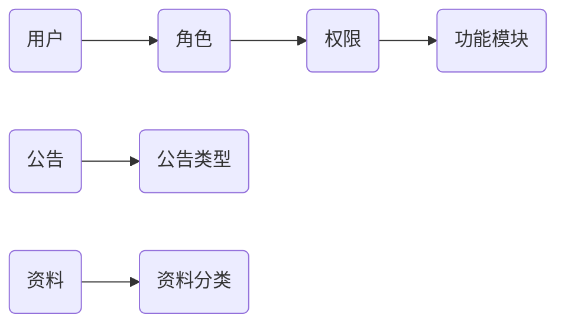
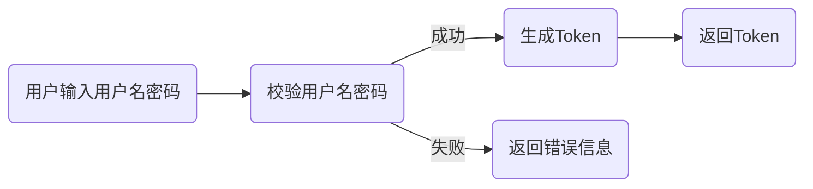
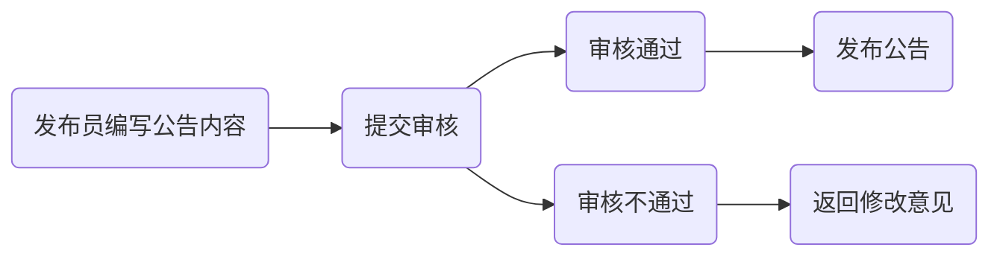
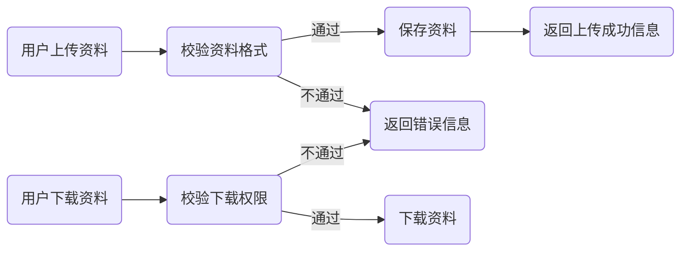

## 企业公告及资料发布系统详细设计与具体代码实现

作者：禅与计算机程序设计艺术

## 1. 背景介绍

### 1.1 信息化时代企业沟通的挑战

在信息化时代，高效、准确、及时的信息传递对于企业的生存和发展至关重要。企业内部需要一个平台来发布公告、通知、新闻等信息，同时还需要一个平台来存储和共享企业内部的各种资料，例如规章制度、培训资料、项目文档等等。传统的沟通方式，例如邮件、电话、会议等，已经难以满足企业日益增长的信息化需求，主要面临以下挑战：

* **信息传递效率低下：**  邮件容易被淹没，电话沟通效率低，会议组织成本高。
* **信息传达不准确：**  口头传达容易失真，邮件内容可能理解偏差。
* **信息难以追溯：**  口头沟通和电话沟通缺乏记录，邮件查找困难。
* **资料管理混乱：**  各种资料分散存储，难以查找和共享。

### 1.2 企业公告及资料发布系统的价值

为了解决上述问题，企业公告及资料发布系统应运而生。该系统旨在为企业提供一个统一的平台，用于发布公告、通知、新闻等信息，以及存储和共享企业内部的各种资料。通过该系统，企业可以实现以下目标：

* **提高信息传递效率：**  通过系统发布信息，可以快速触达目标用户，提高信息传递效率。
* **保证信息传达准确性：**  系统发布的信息内容经过审核，可以保证信息的准确性。
* **实现信息可追溯：**  系统会记录所有信息的发布记录和阅读记录，方便信息追溯。
* **规范资料管理：**  系统提供统一的平台存储和管理企业内部的各种资料，方便资料查找和共享。

### 1.3 本文目标

本文将详细介绍企业公告及资料发布系统的详细设计和具体代码实现，包括系统架构设计、功能模块设计、数据库设计、核心代码实现以及系统部署和运维等方面。通过本文的介绍，读者可以全面了解企业公告及资料发布系统的开发流程和技术细节，为企业开发类似系统提供参考。

## 2. 核心概念与联系

### 2.1 系统用户

系统用户分为以下几种角色：

* **管理员：** 拥有最高权限，可以管理系统的所有功能，包括用户管理、权限管理、公告管理、资料管理等。
* **发布员：** 可以发布公告、通知、新闻等信息。
* **普通用户：** 可以查看公告、通知、新闻等信息，以及下载企业内部资料。

### 2.2 公告类型

系统支持发布多种类型的公告，例如：

* **通知公告：** 用于发布公司内部的通知公告信息。
* **新闻动态：** 用于发布公司最新的新闻动态信息。
* **政策法规：** 用于发布公司内部的政策法规信息。

### 2.3 资料分类

系统支持对企业内部资料进行分类管理，例如：

* **规章制度：** 存储公司内部的各种规章制度。
* **培训资料：** 存储公司内部的各种培训资料。
* **项目文档：** 存储公司内部的各种项目文档。

### 2.4 核心概念关系图



## 3. 核心算法原理具体操作步骤

### 3.1 用户登录认证

#### 3.1.1 流程图



#### 3.1.2 算法原理

系统采用基于 Token 的身份验证机制，用户登录成功后，系统会生成一个 Token 返回给客户端，客户端后续请求接口时需要携带该 Token，系统会验证 Token 的有效性，如果 Token 有效，则允许访问，否则拒绝访问。

#### 3.1.3 具体操作步骤

1. 用户输入用户名和密码，提交登录请求。
2. 系统校验用户名和密码是否正确。
3. 如果用户名和密码正确，则生成一个 Token。
4. 将 Token 返回给客户端。

### 3.2 公告发布流程

#### 3.2.1 流程图



#### 3.2.2 算法原理

系统采用先审核后发布的机制，发布员发布公告需要先提交审核，审核通过后才能正式发布。

#### 3.2.3 具体操作步骤

1. 发布员编写公告内容，选择公告类型，提交审核。
2. 审核员审核公告内容，如果审核通过，则发布公告；如果审核不通过，则返回修改意见。
3. 发布员根据修改意见修改公告内容，重新提交审核。

### 3.3 资料上传下载

#### 3.3.1 流程图



#### 3.3.2 算法原理

系统支持上传和下载各种类型的资料，上传资料时需要校验资料格式，下载资料时需要校验下载权限。

#### 3.3.3 具体操作步骤

**上传资料：**

1. 用户选择要上传的资料，选择资料分类，点击上传按钮。
2. 系统校验资料格式是否符合要求。
3. 如果资料格式符合要求，则保存资料到服务器。
4. 返回上传成功信息。

**下载资料：**

1. 用户选择要下载的资料，点击下载按钮。
2. 系统校验用户是否有下载权限。
3. 如果用户有下载权限，则开始下载资料。
4. 如果用户没有下载权限，则返回错误信息。

## 4. 数学模型和公式详细讲解举例说明

本系统不涉及复杂的数学模型和算法，因此本节略过。

## 5. 项目实践：代码实例和详细解释说明

### 5.1 技术选型

* 后端：Spring Boot
* 数据库：MySQL
* 前端：Vue.js

### 5.2 数据库设计

#### 5.2.1 用户表 (user)

| 字段名 | 数据类型 | 说明 |
|---|---|---|
| id | int | 用户ID，主键自增 |
| username | varchar(255) | 用户名 |
| password | varchar(255) | 密码 |
| role_id | int | 角色ID |

#### 5.2.2 角色表 (role)

| 字段名 | 数据类型 | 说明 |
|---|---|---|
| id | int | 角色ID，主键自增 |
| name | varchar(255) | 角色名称 |

#### 5.2.3 公告表 (announcement)

| 字段名 | 数据类型 | 说明 |
|---|---|---|
| id | int | 公告ID，主键自增 |
| title | varchar(255) | 公告标题 |
| content | text | 公告内容 |
| type | int | 公告类型 |
| creator_id | int | 创建人ID |
| create_time | datetime | 创建时间 |
| status | int | 状态（0：待审核，1：已发布，2：已拒绝） |

#### 5.2.4 资料表 (document)

| 字段名 | 数据类型 | 说明 |
|---|---|---|
| id | int | 资料ID，主键自增 |
| name | varchar(255) | 资料名称 |
| path | varchar(255) | 资料存储路径 |
| type | int | 资料类型 |
| creator_id | int | 创建人ID |
| create_time | datetime | 创建时间 |

### 5.3 核心代码实现

#### 5.3.1 用户登录认证

```java
@RestController
@RequestMapping("/api/auth")
public class AuthController {

    @Autowired
    private UserService userService;

    @Autowired
    private JwtUtils jwtUtils;

    @PostMapping("/login")
    public Result login(@RequestBody UserLoginRequest request) {
        User user = userService.findByUsername(request.getUsername());
        if (user == null || !user.getPassword().equals(request.getPassword())) {
            return Result.error("用户名或密码错误");
        }
        String token = jwtUtils.generateToken(user);
        return Result.success(token);
    }
}
```

#### 5.3.2 公告发布

```java
@RestController
@RequestMapping("/api/announcement")
public class AnnouncementController {

    @Autowired
    private AnnouncementService announcementService;

    @PostMapping("/create")
    public Result create(@RequestBody AnnouncementCreateRequest request) {
        Announcement announcement = new Announcement();
        BeanUtils.copyProperties(request, announcement);
        announcement.setCreatorId(JwtUtils.getUserId());
        announcement.setCreateTime(new Date());
        announcement.setStatus(0); // 待审核
        announcementService.save(announcement);
        return Result.success();
    }
}
```

#### 5.3.3 资料上传

```java
@RestController
@RequestMapping("/api/document")
public class DocumentController {

    @Autowired
    private DocumentService documentService;

    @PostMapping("/upload")
    public Result upload(@RequestParam("file") MultipartFile file,
                         @RequestParam("type") Integer type) throws IOException {
        if (file.isEmpty()) {
            return Result.error("请选择要上传的文件");
        }
        // 校验文件格式
        // ...

        // 保存文件
        String fileName = file.getOriginalFilename();
        String filePath = "/uploads/" + fileName;
        File dest = new File(filePath);
        file.transferTo(dest);

        // 保存文件信息到数据库
        Document document = new Document();
        document.setName(fileName);
        document.setPath(filePath);
        document.setType(type);
        document.setCreatorId(JwtUtils.getUserId());
        document.setCreateTime(new Date());
        documentService.save(document);

        return Result.success();
    }
}
```

## 6. 实际应用场景

企业公告及资料发布系统可以应用于各种类型的企业，例如：

* **大型企业：** 可以用于发布公司内部的通知公告、新闻动态、政策法规等信息，以及存储和共享企业内部的各种资料。
* **中小型企业：** 可以用于发布公司内部的通知公告、新闻动态等信息，以及存储和共享企业内部的常用资料。
* **政府机构：** 可以用于发布政府公告、政策法规、办事指南等信息，以及存储和共享政府内部的各种资料。
* **事业单位：** 可以用于发布单位内部的通知公告、新闻动态等信息，以及存储和共享单位内部的各种资料。

## 7. 工具和资源推荐

* **后端开发框架：** Spring Boot
* **数据库：** MySQL、Oracle、PostgreSQL
* **前端开发框架：** Vue.js、React、Angular
* **代码托管平台：** GitHub、GitLab、Gitee
* **云服务器：** 阿里云、腾讯云、华为云

## 8. 总结：未来发展趋势与挑战

### 8.1 未来发展趋势

* **移动化：** 随着移动互联网的普及，企业公告及资料发布系统需要向移动端发展，方便用户随时随地查看信息和资料。
* **智能化：** 随着人工智能技术的不断发展，企业公告及资料发布系统可以引入智能化功能，例如智能推荐、智能搜索等，提高用户体验。
* **集成化：** 企业公告及资料发布系统可以与其他企业信息化系统进行集成，例如 OA 系统、HR 系统等，实现数据互通，提高办公效率。

### 8.2 面临的挑战

* **安全性：** 企业公告及资料发布系统存储了企业的重要信息和资料，因此安全性至关重要，需要采取有效的措施保障系统安全。
* **易用性：** 企业公告及资料发布系统需要方便用户使用，需要不断优化用户体验，降低用户使用门槛。
* **可扩展性：** 随着企业业务的发展，企业公告及资料发布系统需要具备良好的可扩展性，能够满足企业不断增长的需求。

## 9. 附录：常见问题与解答

### 9.1 如何保证系统安全？

* 采用安全的密码策略，例如密码长度不少于 8 位，必须包含大小写字母、数字和特殊字符等。
* 对用户进行权限控制，不同角色的用户拥有不同的权限，只能访问授权范围内的信息和资料。
* 定期备份系统数据，防止数据丢失。
* 对系统进行安全漏洞扫描，及时修复漏洞。

### 9.2 如何提高系统易用性？

* 采用简洁明了的界面设计，方便用户操作。
* 提供详细的操作说明和帮助文档，方便用户快速上手。
* 收集用户反馈，不断优化系统功能和用户体验。

### 9.3 如何提高系统可扩展性？

* 采用模块化设计，方便系统功能扩展。
* 采用分布式架构，提高系统并发处理能力。
* 使用缓存技术，提高系统响应速度。