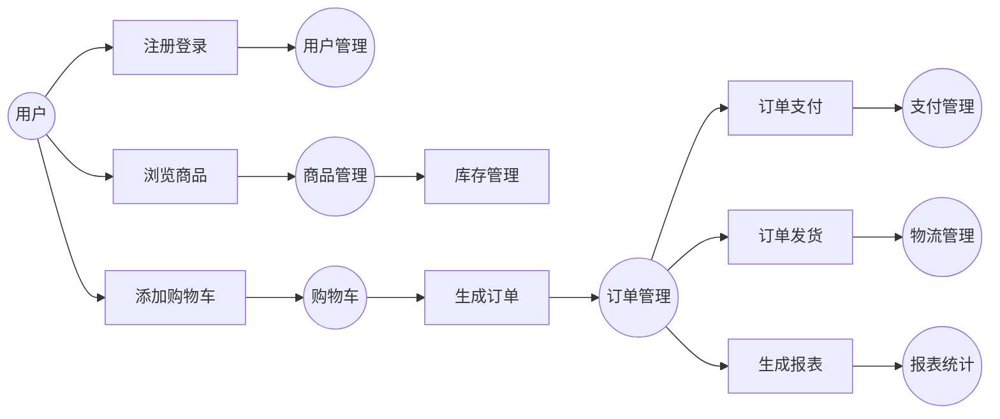

##  企业网上订单系统详细设计与具体代码实现

作者：禅与计算机程序设计艺术

## 1. 背景介绍

### 1.1 电商行业的兴起与发展

近年来，随着互联网技术的快速发展和普及，电子商务行业呈现出爆发式增长态势。越来越多的企业选择将业务拓展到线上，通过建立网上商城、提供在线购物等服务来吸引顾客、提升销售额。企业网上订单系统作为连接商家与客户的桥梁，在电商交易中扮演着至关重要的角色。

### 1.2 传统订单管理模式的弊端

传统的订单管理模式主要依赖人工操作，例如电话、传真、邮件等方式进行订单的接收、处理和跟踪。这种模式存在着诸多弊端：

* **效率低下**: 人工处理订单速度慢，容易出错，且难以应对大量订单的处理需求。
* **成本高昂**: 需要雇佣大量客服人员处理订单，增加了企业的运营成本。
* **信息不透明**: 客户难以实时了解订单状态，商家也难以有效跟踪订单处理进度。
* **数据分析能力弱**: 难以对订单数据进行有效分析，无法为企业经营决策提供数据支持。

### 1.3 企业网上订单系统的优势

为了克服传统订单管理模式的弊端，越来越多的企业开始采用企业网上订单系统。与传统模式相比，企业网上订单系统具有以下优势：

* **提高效率**: 自动化处理订单，减少人工干预，提高订单处理效率。
* **降低成本**: 减少人工成本，提高企业运营效率。
* **提升客户满意度**:  客户可以随时随地在线下单，实时查询订单状态，提升购物体验。
* **数据驱动决策**:  系统可以记录完整的订单数据，为企业提供数据分析支持，帮助企业做出更明智的经营决策。

## 2. 核心概念与联系

### 2.1 系统架构

企业网上订单系统通常采用多层架构设计，例如经典的三层架构：

* **表示层**:  负责与用户进行交互，接收用户请求，展示数据信息。
* **业务逻辑层**:  负责处理业务逻辑，例如订单创建、支付、发货等。
* **数据访问层**: 负责与数据库进行交互，进行数据的增删改查操作。

### 2.2 主要功能模块

企业网上订单系统通常包含以下主要功能模块：

* **用户管理**:  包括用户注册、登录、信息管理等功能。
* **商品管理**: 包括商品分类、商品信息管理、库存管理等功能。
* **购物车**:  用户可以将选购的商品添加到购物车中。
* **订单管理**: 包括订单创建、订单支付、订单查询、订单取消、订单退货等功能。
* **支付管理**:  对接第三方支付平台，实现在线支付功能。
* **物流管理**:  对接物流公司接口，实现订单物流跟踪功能。
* **报表统计**:  提供各种订单统计报表，为企业经营决策提供数据支持。

### 2.3  核心概念联系

下图展示了企业网上订单系统中各个核心概念之间的联系：



## 3. 核心算法原理具体操作步骤

### 3.1 订单生成算法

订单生成算法是企业网上订单系统的核心算法之一，其主要步骤如下：

1. **从购物车中获取商品信息**: 包括商品ID、商品名称、商品数量、商品价格等。
2. **生成订单编号**:  可以使用UUID、雪花算法等方式生成唯一的订单编号。
3. **计算订单总金额**:  根据商品数量和商品价格计算订单总金额。
4. **创建订单**:  将订单信息写入数据库，包括订单编号、用户ID、商品信息、订单总金额、订单状态等。
5. **清空购物车**:  订单生成成功后，清空用户购物车中的商品信息。

### 3.2 订单支付算法

订单支付算法主要涉及与第三方支付平台的对接，其主要步骤如下：

1. **用户选择支付方式**:  例如支付宝、微信支付等。
2. **生成支付订单**:  根据订单信息和选择的支付方式，生成支付订单。
3. **调用第三方支付平台接口**:  将支付订单信息发送给第三方支付平台。
4. **接收支付结果通知**:  第三方支付平台完成支付后，会向系统发送支付结果通知。
5. **更新订单状态**:  根据支付结果通知，更新订单状态为已支付或支付失败。

### 3.3 订单发货算法

订单发货算法主要涉及与物流公司接口的对接，其主要步骤如下：

1. **商家确认订单**:  商家确认订单信息无误后，进行订单发货操作。
2. **选择物流公司**:  根据订单地址和商品信息，选择合适的物流公司。
3. **调用物流公司接口**:  将订单信息和物流信息发送给物流公司。
4. **接收物流状态更新**:  物流公司会定期更新订单物流状态，例如已揽收、已发货、已签收等。
5. **更新订单物流信息**:  根据物流公司返回的物流状态，更新订单物流信息。

## 4. 数学模型和公式详细讲解举例说明

### 4.1 库存管理模型

库存管理模型可以使用经典的经济订货量模型（EOQ）来进行计算，该模型旨在找到最佳的订货量，以最小化库存成本。

**EOQ公式:**

$$EOQ = \sqrt{\frac{2DS}{H}}$$

**其中:**

*  $D$：年需求量
*  $S$：每次订货成本
*  $H$：单位库存持有成本

**举例说明:**

假设某商品年需求量为1000件，每次订货成本为50元，单位库存持有成本为2元，则该商品的经济订货量为：

$$EOQ = \sqrt{\frac{2 * 1000 * 50}{2}} = 100$$

即每次订货量为100件时，可以最小化库存成本。

### 4.2 订单金额计算公式

订单总金额 = 商品单价 * 商品数量 + 运费

**举例说明:**

假设用户购买了2件单价为100元的商品，运费为10元，则订单总金额为：

订单总金额 = 100 * 2 + 10 = 210 元

## 5. 项目实践：代码实例和详细解释说明

### 5.1 技术选型

本项目采用Spring Boot框架进行开发，使用MySQL数据库进行数据存储。

### 5.2 代码实例

**订单实体类:**

```java
@Entity
@Table(name = "orders")
public class Order {

    @Id
    @GeneratedValue(strategy = GenerationType.IDENTITY)
    private Long id;

    @Column(nullable = false)
    private String orderNo;

    @ManyToOne
    @JoinColumn(name = "user_id", nullable = false)
    private User user;

    @OneToMany(mappedBy = "order", cascade = CascadeType.ALL)
    private List<OrderItem> orderItems;

    @Column(nullable = false)
    private BigDecimal totalAmount;

    @Column(nullable = false)
    private OrderStatus orderStatus;

    // 省略 getter 和 setter 方法
}
```

**订单项实体类:**

```java
@Entity
@Table(name = "order_items")
public class OrderItem {

    @Id
    @GeneratedValue(strategy = GenerationType.IDENTITY)
    private Long id;

    @ManyToOne
    @JoinColumn(name = "order_id", nullable = false)
    private Order order;

    @ManyToOne
    @JoinColumn(name = "product_id", nullable = false)
    private Product product;

    @Column(nullable = false)
    private Integer quantity;

    @Column(nullable = false)
    private BigDecimal price;

    // 省略 getter 和 setter 方法
}
```

**订单服务接口:**

```java
public interface OrderService {

    Order createOrder(Order order);

    Order getOrderById(Long orderId);

    Page<Order> getOrdersByUserId(Long userId, Pageable pageable);

    Order updateOrderStatus(Long orderId, OrderStatus orderStatus);
}
```

**订单服务实现类:**

```java
@Service
public class OrderServiceImpl implements OrderService {

    @Autowired
    private OrderRepository orderRepository;

    @Autowired
    private OrderItemRepository orderItemRepository;

    @Override
    @Transactional
    public Order createOrder(Order order) {
        // 生成订单编号
        String orderNo = generateOrderNo();
        order.setOrderNo(orderNo);

        // 计算订单总金额
        BigDecimal totalAmount = BigDecimal.ZERO;
        for (OrderItem orderItem : order.getOrderItems()) {
            totalAmount = totalAmount.add(orderItem.getPrice().multiply(new BigDecimal(orderItem.getQuantity())));
        }
        order.setTotalAmount(totalAmount);

        // 设置订单状态
        order.setOrderStatus(OrderStatus.CREATED);

        // 保存订单
        Order savedOrder = orderRepository.save(order);

        // 保存订单项
        for (OrderItem orderItem : order.getOrderItems()) {
            orderItem.setOrder(savedOrder);
            orderItemRepository.save(orderItem);
        }

        return savedOrder;
    }

    // 省略其他方法的实现
}
```

### 5.3 代码解释

* 订单实体类和订单项实体类使用JPA注解进行映射，与数据库表进行关联。
* 订单服务接口定义了订单相关的业务方法，例如创建订单、查询订单、更新订单状态等。
* 订单服务实现类实现了订单服务接口定义的方法，并使用Spring的声明式事务管理机制保证数据一致性。

## 6. 实际应用场景

企业网上订单系统适用于各种类型的企业，例如：

* **电商平台**:  例如淘宝、京东等。
* **企业官网**:  企业可以通过官网在线销售产品或服务。
* **微信小程序**:  企业可以通过微信小程序搭建在线商城。
* **O2O平台**:  例如美团、饿了么等。

## 7. 工具和资源推荐

### 7.1 开发工具

* **IntelliJ IDEA**:  一款功能强大的Java开发工具。
* **Eclipse**:  另一款常用的Java开发工具。
* **Visual Studio Code**:  一款轻量级的代码编辑器，支持多种编程语言。

### 7.2 数据库

* **MySQL**:  一款开源的关系型数据库管理系统。
* **Oracle**:  一款商业的关系型数据库管理系统。
* **PostgreSQL**:  一款功能强大的开源对象关系型数据库系统。

### 7.3 第三方服务

* **支付宝**:  提供在线支付服务。
* **微信支付**:  提供在线支付服务。
* **顺丰速运**:  提供物流配送服务。

## 8. 总结：未来发展趋势与挑战

### 8.1 未来发展趋势

* **移动化**:  随着智能手机的普及，企业网上订单系统将更加注重移动端的用户体验。
* **智能化**:  人工智能技术将被应用于订单处理、客服机器人等方面，提升系统效率和用户体验。
* **个性化**:  系统将根据用户的购买历史、浏览记录等信息，为用户推荐个性化的商品和服务。

### 8.2 面临的挑战

* **数据安全**:  企业需要加强对用户数据的保护，防止数据泄露和滥用。
* **系统性能**:  随着用户规模的扩大，系统需要具备高并发、高可用的能力。
* **用户体验**:  企业需要不断优化系统界面和功能，提升用户体验。

## 9. 附录：常见问题与解答

### 9.1 如何保证订单数据的安全？

为了保证订单数据的安全，企业可以采取以下措施：

* **数据加密**:  对敏感数据进行加密存储，例如用户密码、支付信息等。
* **访问控制**:  设置严格的用户权限管理机制，限制对敏感数据的访问权限。
* **安全审计**:  记录用户的操作日志，以便于追溯和审计。

### 9.2 如何提高系统的并发处理能力？

为了提高系统的并发处理能力，企业可以采取以下措施：

* **使用缓存**:  将热点数据缓存到内存中，减少数据库访问次数。
* **异步处理**:  将耗时的操作异步处理，例如发送邮件、短信等。
* **负载均衡**:  使用负载均衡技术将请求分发到多台服务器上，提高系统的吞吐量。