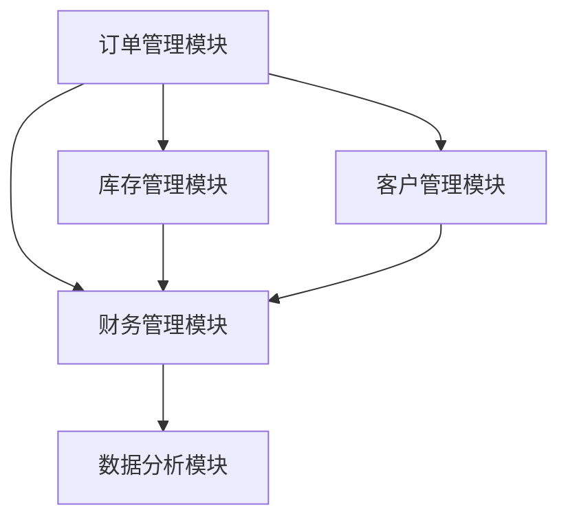

# 企业订单管理系统详细设计与具体代码实现

## 1. 背景介绍

### 1.1 企业订单管理系统的需求

在现代企业运营中，订单管理系统（Order Management System, OMS）是至关重要的一环。它不仅涉及客户订单的接收、处理、发货和售后服务，还包括库存管理、财务结算和数据分析等多个方面。一个高效的订单管理系统可以显著提升企业的运营效率，减少错误，提高客户满意度。

### 1.2 订单管理系统的主要功能

一个全面的订单管理系统通常包括以下主要功能：

- **订单接收与处理**：通过多渠道（如网站、电话、邮件等）接收订单，并进行订单验证和处理。
- **库存管理**：实时更新库存信息，确保库存充足，避免缺货和超卖。
- **发货与物流管理**：生成发货单，安排物流，并跟踪物流状态。
- **财务管理**：处理订单支付，生成发票，并进行财务结算。
- **客户管理**：维护客户信息，提供售后服务，并进行客户关系管理。
- **数据分析与报表**：提供各种数据分析和报表，帮助企业进行决策。

### 1.3 现有系统的不足

许多企业使用的订单管理系统存在以下不足：

- **系统分散**：不同功能模块分散在不同系统中，导致数据不一致和操作复杂。
- **缺乏灵活性**：难以根据企业需求进行定制和扩展。
- **用户体验差**：界面不友好，操作繁琐，影响工作效率。
- **数据安全性差**：数据存储和传输过程中存在安全隐患。

## 2. 核心概念与联系

### 2.1 系统架构

一个高效的企业订单管理系统应采用分层架构设计，主要包括以下几层：

- **表现层（Presentation Layer）**：负责用户界面和用户交互。
- **业务逻辑层（Business Logic Layer）**：处理业务逻辑，执行订单处理、库存管理等功能。
- **数据访问层（Data Access Layer）**：负责与数据库的交互，执行数据的存储和检索。
- **数据库层（Database Layer）**：存储系统的所有数据，包括订单、库存、客户等信息。

### 2.2 核心模块

系统的核心模块包括：

- **订单管理模块**：处理订单的接收、验证、处理和发货。
- **库存管理模块**：管理库存信息，确保库存的准确性。
- **客户管理模块**：维护客户信息，提供售后服务。
- **财务管理模块**：处理订单支付，生成发票，并进行财务结算。
- **数据分析模块**：提供各种数据分析和报表，帮助企业进行决策。

### 2.3 模块之间的联系

各模块之间需要紧密协作，以确保系统的高效运行。例如，订单管理模块需要与库存管理模块实时交互，确保订单处理过程中库存信息的准确性；财务管理模块需要与订单管理模块和客户管理模块交互，确保支付和结算的准确性。



## 3. 核心算法原理具体操作步骤

### 3.1 订单接收与处理

订单接收与处理是订单管理系统的核心功能之一，主要包括以下步骤：

1. **订单接收**：通过多渠道接收订单，并将订单信息存储到数据库中。
2. **订单验证**：验证订单信息的准确性，包括客户信息、商品信息、支付信息等。
3. **库存检查**：检查库存是否充足，确保订单能够及时发货。
4. **订单处理**：生成发货单，安排物流，并更新订单状态。
5. **通知客户**：通过邮件或短信通知客户订单处理状态。

### 3.2 库存管理

库存管理主要包括以下步骤：

1. **库存更新**：实时更新库存信息，包括入库、出库、退货等操作。
2. **库存预警**：设置库存预警值，当库存低于预警值时，系统自动发出警报。
3. **库存盘点**：定期进行库存盘点，确保库存信息的准确性。

### 3.3 财务管理

财务管理主要包括以下步骤：

1. **订单支付**：处理订单支付，支持多种支付方式（如信用卡、支付宝、微信等）。
2. **发票生成**：根据订单信息生成发票，并发送给客户。
3. **财务结算**：进行财务结算，包括收入、支出、利润等。

## 4. 数学模型和公式详细讲解举例说明

### 4.1 库存管理中的安全库存模型

在库存管理中，安全库存（Safety Stock）是一个重要的概念，用于应对需求波动和供应链不确定性。安全库存的计算公式为：

$$
SS = Z \times \sigma \times \sqrt{L}
$$

其中：
- $SS$：安全库存
- $Z$：服务水平对应的标准正态分布的分位数
- $\sigma$：需求的标准差
- $L$：提前期

例如，假设某商品的日需求量为100，标准差为20，提前期为5天，服务水平为95%（对应的$Z$值为1.65），则安全库存为：

$$
SS = 1.65 \times 20 \times \sqrt{5} \approx 73.6
$$

### 4.2 订单处理中的经济订购量模型

经济订购量（Economic Order Quantity, EOQ）是订单处理中的一个重要模型，用于确定最佳订购量，以最小化总成本。EOQ的计算公式为：

$$
EOQ = \sqrt{\frac{2DS}{H}}
$$

其中：
- $D$：年需求量
- $S$：每次订购的固定成本
- $H$：每单位库存的年持有成本

例如，假设某商品的年需求量为1000，每次订购的固定成本为50，每单位库存的年持有成本为2，则经济订购量为：

$$
EOQ = \sqrt{\frac{2 \times 1000 \times 50}{2}} = \sqrt{50000} \approx 223.6
$$

## 5. 项目实践：代码实例和详细解释说明

### 5.1 技术选型

在实现企业订单管理系统时，我们选用了以下技术：

- **前端**：React.js，用于构建用户界面。
- **后端**：Spring Boot，用于处理业务逻辑。
- **数据库**：MySQL，用于存储数据。
- **其他工具**：Redis用于缓存，RabbitMQ用于消息队列，Elasticsearch用于全文搜索。

### 5.2 代码实例

#### 5.2.1 订单接收与处理

以下是一个简单的订单接收与处理的代码示例：

**订单接收（前端代码）**

```javascript
import React, { useState } from 'react';
import axios from 'axios';

const OrderForm = () => {
  const [order, setOrder] = useState({
    customerName: '',
    productId: '',
    quantity: 1,
    paymentMethod: 'credit_card'
  });

  const handleChange = (e) => {
    const { name, value } = e.target;
    setOrder({ ...order, [name]: value });
  };

  const handleSubmit = async (e) => {
    e.preventDefault();
    try {
      const response = await axios.post('/api/orders', order);
      alert('Order placed successfully!');
    } catch (error) {
      console.error('Error placing order:', error);
      alert('Failed to place order.');
    }
  };

  return (
    <form onSubmit={handleSubmit}>
      <label>
        Customer Name:
        <input type="text" name="customerName" value={order.customerName} onChange={handleChange} required />
      </label>
      <label>
        Product ID:
        <input type="text" name="productId" value={order.productId} onChange={handleChange} required />
      </label>
      <label>
        Quantity:
        <input type="number" name="quantity" value={order.quantity} onChange={handleChange} min="1" required />
      </label>
      <label>
        Payment Method:
        <select name="paymentMethod" value={order.paymentMethod} onChange={handleChange}>
          <option value="credit_card">Credit Card</option>
          <option value="paypal">PayPal</option>
        </select>
      </label>
      <button type="submit">Place Order</button>
    </form>
  );
};

export default OrderForm;
```

**订单处理（后端代码）**

```java
