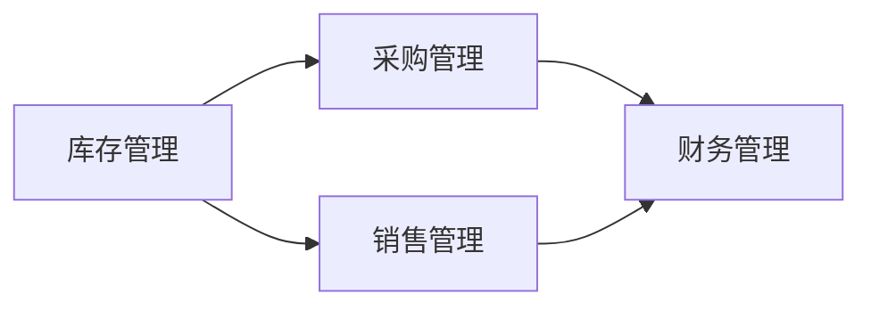

# 企业进销存管理系统详细设计与具体代码实现

作者：禅与计算机程序设计艺术

## 1. 背景介绍

### 1.1 什么是进销存管理系统？

进销存管理系统（Inventory, Purchasing, and Sales Management System，简称ERP系统的一部分）是一种用于管理企业库存、采购和销售的综合性软件系统。它通常包括库存管理、采购管理、销售管理和财务管理等模块。其主要目的是通过信息化手段提高企业的运营效率、降低成本、提高客户满意度。

### 1.2 进销存管理系统的重要性

在现代企业管理中，进销存管理系统扮演着至关重要的角色。它不仅帮助企业实时掌握库存情况，避免库存积压或短缺，还能优化采购和销售流程，提高资金利用率。此外，通过进销存管理系统，企业可以实现对供应链的全面监控和管理，从而提高整体运营效率。

### 1.3 市场需求与发展趋势

随着信息技术的发展和企业管理需求的提升，进销存管理系统的市场需求不断增长。特别是在电子商务和全球化贸易的推动下，企业对高效、智能的进销存管理系统的需求更加迫切。未来，进销存管理系统将朝着智能化、集成化和云端化方向发展。

## 2. 核心概念与联系

### 2.1 库存管理

库存管理是进销存管理系统的核心模块之一。它主要负责管理企业的库存信息，包括库存数量、库存位置、库存状态等。通过库存管理模块，企业可以实时掌握库存情况，避免库存积压或短缺。

### 2.2 采购管理

采购管理模块主要负责企业的采购活动，包括采购申请、采购订单、供应商管理等。通过采购管理模块，企业可以优化采购流程，提高采购效率，降低采购成本。

### 2.3 销售管理

销售管理模块主要负责企业的销售活动，包括销售订单、客户管理、销售报表等。通过销售管理模块，企业可以优化销售流程，提高销售效率，提升客户满意度。

### 2.4 财务管理

财务管理模块主要负责企业的财务活动，包括应收账款、应付账款、财务报表等。通过财务管理模块，企业可以实现对资金的全面管理，提高资金利用率。

### 2.5 模块之间的联系

进销存管理系统的各个模块之间是紧密联系的。例如，库存管理模块需要与采购管理模块和销售管理模块进行数据交互，以实现库存信息的实时更新；财务管理模块需要与采购管理模块和销售管理模块进行数据交互，以实现财务信息的全面管理。



## 3. 核心算法原理具体操作步骤

### 3.1 库存管理算法

#### 3.1.1 库存更新算法

库存更新算法是库存管理模块的核心算法之一。它主要用于在采购入库和销售出库时，实时更新库存数量。

**操作步骤：**
1. 获取当前库存数量。
2. 根据采购入库或销售出库的数量，计算新的库存数量。
3. 更新库存数量。

```python
def update_inventory(item_id, quantity, operation):
    """
    更新库存数量

    :param item_id: 商品ID
    :param quantity: 数量
    :param operation: 操作类型 ('in'表示入库, 'out'表示出库)
    """
    current_quantity = get_current_inventory(item_id)
    if operation == 'in':
        new_quantity = current_quantity + quantity
    elif operation == 'out':
        new_quantity = current_quantity - quantity
    else:
        raise ValueError("Invalid operation type")
    update_inventory_in_db(item_id, new_quantity)
```

### 3.2 采购管理算法

#### 3.2.1 采购优化算法

采购优化算法用于在采购过程中，选择最佳的供应商和采购数量，以实现成本最小化和供应链优化。

**操作步骤：**
1. 获取所有可用供应商及其报价。
2. 根据采购需求，计算每个供应商的总成本。
3. 选择成本最低的供应商和采购数量。

```python
def optimize_purchase(suppliers, demand):
    """
    优化采购

    :param suppliers: 供应商列表，每个供应商包含报价和可供数量
    :param demand: 采购需求数量
    :return: 最佳供应商和采购数量
    """
    best_supplier = None
    min_cost = float('inf')
    for supplier in suppliers:
        total_cost = supplier['price'] * demand
        if total_cost < min_cost:
            min_cost = total_cost
            best_supplier = supplier
    return best_supplier, demand
```

### 3.3 销售管理算法

#### 3.3.1 销售预测算法

销售预测算法用于根据历史销售数据，预测未来的销售趋势和需求。

**操作步骤：**
1. 获取历史销售数据。
2. 使用时间序列分析方法，预测未来的销售量。
3. 根据预测结果，调整销售策略。

```python
import numpy as np
from statsmodels.tsa.holtwinters import ExponentialSmoothing

def forecast_sales(sales_data, periods):
    """
    预测销售量

    :param sales_data: 历史销售数据
    :param periods: 预测周期数
    :return: 预测结果
    """
    model = ExponentialSmoothing(sales_data, trend='add', seasonal='add', seasonal_periods=12)
    fit = model.fit()
    forecast = fit.forecast(periods)
    return forecast
```

### 3.4 财务管理算法

#### 3.4.1 应收账款管理算法

应收账款管理算法用于管理企业的应收账款，确保及时回款。

**操作步骤：**
1. 获取所有未结清的应收账款。
2. 根据账龄，计算每个应收账款的回款概率。
3. 生成催款提醒和回款计划。

```python
def manage_receivables(receivables):
    """
    管理应收账款

    :param receivables: 应收账款列表，每个账款包含金额和账龄
    :return: 催款提醒和回款计划
    """
    reminders = []
    for receivable in receivables:
        probability = calculate_collection_probability(receivable['age'])
        if probability < 0.5:
            reminders.append(generate_reminder(receivable))
    return reminders

def calculate_collection_probability(age):
    """
    计算回款概率

    :param age: 账龄
    :return: 回款概率
    """
    return max(1 - age / 365, 0)

def generate_reminder(receivable):
    """
    生成催款提醒

    :param receivable: 应收账款
    :return: 催款提醒
    """
    return f"Reminder: Please pay {receivable['amount']} within {30 - receivable['age']} days."
```

## 4. 数学模型和公式详细讲解举例说明

### 4.1 库存管理数学模型

库存管理中常用的数学模型包括经济订货量（EOQ）模型和安全库存模型。

#### 4.1.1 经济订货量（EOQ）模型

经济订货量（EOQ）模型用于确定最佳订货数量，以最小化总成本。其公式如下：

$$
EOQ = \sqrt{\frac{2DS}{H}}
$$

其中：
- $D$ 表示年需求量
- $S$ 表示每次订货成本
- $H$ 表示单位库存持有成本

**举例说明：**

假设某企业年需求量为1000件，每次订货成本为50元，单位库存持有成本为2元，则其经济订货量为：

$$
EOQ = \sqrt{\frac{2 \times 1000 \times 50}{2}} = \sqrt{50000} \approx 223.61
$$

### 4.2 采购管理数学模型

采购管理中常用的数学模型包括线性规划模型和折扣采购模型。

#### 4.2.1 线性规划模型

线性规划模型用于在多个约束条件下，优化采购决策。其目标函数和约束条件如下：

$$
\text{Minimize} \quad C = \sum_{i=1}^{n} P_i \times Q_i
$$

$$
\text{Subject to} \quad \sum_{i=1}^{n} Q_i \geq D
$$

其中：
- $C$ 表示总成本
- $P_i$ 表示第 $i$ 个供应商的报价
- $Q_i$ 表示从第 $i$ 个供应商采购的数量
- $D$ 表示采购需求量

**举例说明：**

假设某企业有两个供应商，其报价分别为10元和12元，采购需求量