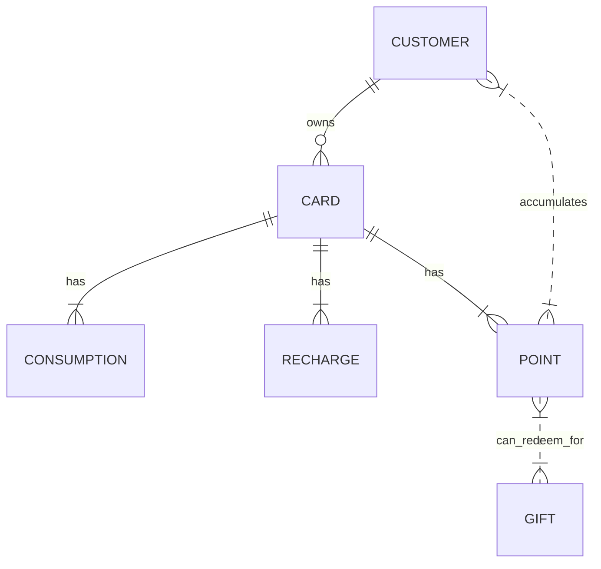

## 1. 背景介绍

### 1.1  会员卡系统的概念与意义

会员卡管理系统，顾名思义，是用于管理会员卡信息、积分、消费记录等数据的软件系统。它在现代商业中扮演着至关重要的角色，其意义主要体现在以下几个方面：

* **提升客户忠诚度**: 会员卡系统可以通过积分、折扣、专属服务等方式激励顾客重复消费，增强顾客粘性。
* **精准营销**:  通过对会员数据的分析，企业可以了解顾客的消费习惯、偏好等信息，从而进行精准的营销活动，提高营销效率。
* **提高运营效率**:  会员卡系统可以自动化处理会员信息管理、积分计算、报表生成等工作，降低人工成本，提高运营效率。
* **数据化运营**:  会员卡系统积累的大量会员数据，可以为企业提供数据支撑，帮助企业进行数据分析、挖掘潜在价值。

### 1.2  系统设计目标

本系统的设计目标是开发一套功能完善、性能稳定、易于维护的会员卡管理系统，满足以下需求：

* 支持多种会员卡类型，如：普通卡、银卡、金卡等。
* 实现会员信息管理，包括：注册、查询、修改、注销等功能。
* 实现会员卡充值、消费、积分、兑换等功能。
* 提供数据统计分析功能，如：会员消费排行、商品销售统计等。
* 系统安全稳定，能够有效保护会员信息安全。

## 2. 核心概念与联系

### 2.1  实体关系图 (ERD)

为了更好地理解系统中各个实体之间的关系，我们首先使用 ERD 图来展示系统的数据模型：



**实体说明:**

* **CUSTOMER**:  会员信息，包括：会员ID、姓名、手机号、生日、地址等。
* **CARD**: 会员卡信息，包括：卡号、类型、状态、余额、积分等。
* **CONSUMPTION**: 消费记录，包括：消费时间、消费金额、消费门店、消费商品等。
* **RECHARGE**: 充值记录，包括：充值时间、充值金额、充值方式等。
* **POINT**: 积分信息，包括：积分余额、获取时间、来源等。
* **GIFT**: 礼品信息，包括：礼品名称、兑换积分等。

### 2.2  核心概念解释

* **会员**: 指的是在商家注册并拥有会员卡的顾客。
* **会员卡**: 是会员身份的象征，用于记录会员信息、积分、消费记录等。
* **积分**: 是会员在消费时获得的奖励，可以用于兑换礼品或享受其他优惠。
* **充值**: 指的是会员向会员卡中存入资金，用于消费或其他用途。
* **消费**: 指的是会员使用会员卡进行支付的行为。
* **报表**:  是指根据系统数据生成的统计分析结果，用于辅助企业决策。

## 3. 核心算法原理具体操作步骤

### 3.1  会员注册

1. 用户提交注册信息，包括：姓名、手机号、生日等。
2. 系统校验手机号是否已注册，如果已注册，则提示用户。
3. 如果手机号未注册，则生成唯一的会员ID和初始密码。
4. 系统为用户创建会员卡，并关联会员ID。
5. 将会员信息和会员卡信息保存到数据库。
6. 系统发送短信通知用户注册成功，并告知初始密码。

### 3.2  会员卡充值

1. 用户选择充值金额和支付方式。
2. 系统调用第三方支付接口完成支付。
3. 支付成功后，系统更新会员卡余额。
4. 系统生成充值记录，并保存到数据库。

### 3.3  会员消费

1. 用户出示会员卡或提供手机号。
2. 系统查询会员卡信息，并校验卡状态是否正常。
3. 用户选择消费商品，并确认消费金额。
4. 系统判断会员卡余额是否充足，如果不足，则提示用户充值。
5. 如果余额充足，则扣除相应金额，并更新会员卡余额。
6. 系统根据消费金额计算积分，并更新会员积分。
7. 系统生成消费记录，并保存到数据库。

## 4. 数学模型和公式详细讲解举例说明

### 4.1  积分计算公式

积分计算公式可以根据不同的业务需求进行设置，例如：

* **按消费金额比例计算**:  $积分 = 消费金额 * 积分比例$，例如：消费1元积1分，积分比例为1。
* **按消费次数计算**: $积分 = 消费次数 * 积分基数$，例如：每消费1次积10分，积分基数为10。
* **阶梯式积分**:  根据不同的消费金额区间设置不同的积分比例，例如：消费100元以内积1倍积分，100-500元积2倍积分，500元以上积3倍积分。

### 4.2  举例说明

假设某会员卡系统的积分计算规则是：消费1元积1分。

* 某会员消费了100元，则该会员可以获得100 * 1 = 100积分。
* 某会员当前积分为500分，消费了200元，则该会员的积分变为500 + 200 * 1 = 700分。

## 5. 项目实践：代码实例和详细解释说明

### 5.1  技术选型

本项目采用 Java 语言开发，使用 Spring Boot 框架构建 RESTful API，数据库采用 MySQL。

**主要技术栈**:

* Spring Boot
* MySQL
* Mybatis
* Lombok
* Swagger

### 5.2  代码实例

**会员实体类**:

```java
@Data
@Entity
@Table(name = "customer")
public class Customer {

    @Id
    @GeneratedValue(strategy = GenerationType.IDENTITY)
    private Long id;

    @Column(nullable = false)
    private String name;

    @Column(nullable = false, unique = true)
    private String mobile;

    @Column
    private Date birthday;

    @OneToOne(mappedBy = "customer", cascade = CascadeType.ALL, fetch = FetchType.LAZY)
    private Card card;
}
```

**会员卡实体类**:

```java
@Data
@Entity
@Table(name = "card")
public class Card {

    @Id
    @GeneratedValue(strategy = GenerationType.IDENTITY)
    private Long id;

    @Column(nullable = false, unique = true)
    private String cardNo;

    @Column(nullable = false)
    private String type;

    @Column(nullable = false)
    private String status;

    @Column(nullable = false)
    private BigDecimal balance;

    @Column(nullable = false)
    private Integer points;

    @OneToOne(fetch = FetchType.LAZY)
    @JoinColumn(name = "customer_id")
    private Customer customer;
}
```

**会员注册接口**:

```java
@RestController
@RequestMapping("/api/v1/customers")
public class CustomerController {

    @Autowired
    private CustomerService customerService;

    @PostMapping
    public ResponseEntity<Customer> createCustomer(@RequestBody Customer customer) {
        Customer createdCustomer = customerService.createCustomer(customer);
        return ResponseEntity.status(HttpStatus.CREATED).body(createdCustomer);
    }
}
```

### 5.3  代码解释

* `@Data` 注解:  使用 Lombok 提供的注解，可以简化代码，自动生成 getter、setter、toString 等方法。
* `@Entity` 注解:  表示该类是一个 JPA 实体类，对应数据库中的一个表。
* `@Table` 注解:  指定实体类对应的表名。
* `@Id` 注解:  表示该字段是主键。
* `@GeneratedValue` 注解:  指定主键的生成策略。
* `@Column` 注解:  指定字段的数据库列名、是否可以为空、是否唯一等属性。
* `@OneToOne` 注解:  表示一对一关系。
* `@JoinColumn` 注解:  指定外键列名。
* `@RestController` 注解:  表示该类是一个 RESTful API 控制器。
* `@RequestMapping` 注解:  指定接口的 URL 路径。
* `@PostMapping` 注解:  表示该方法处理 POST 请求。
* `@RequestBody` 注解:  表示从请求体中获取参数。
* `@Autowired` 注解:  自动注入依赖的 Bean。
* `ResponseEntity` 类:  用于构建 HTTP 响应。
* `HttpStatus` 枚举:  表示 HTTP 状态码。

## 6. 实际应用场景

会员卡管理系统可以应用于各种行业，例如：

* **零售行业**:  超市、商场、便利店等。
* **餐饮行业**:  餐厅、咖啡厅、奶茶店等。
* **美容美发**:  美容院、美发店、美甲店等。
* **健身娱乐**:  健身房、电影院、KTV 等。
* **教育培训**:  培训机构、学校、幼儿园等。

## 7. 工具和资源推荐

* **数据库**: MySQL、PostgreSQL、Oracle 等关系型数据库。
* **开发框架**:  Spring Boot、Django、Flask 等 Web 开发框架。
* **编程语言**:  Java、Python、PHP 等。
* **API 文档工具**:  Swagger、Postman 等。
* **版本控制工具**:  Git、SVN 等。

## 8. 总结：未来发展趋势与挑战

### 8.1  未来发展趋势

* **移动支付**:  随着移动支付的普及，会员卡系统需要与移动支付平台深度融合，提供更加便捷的支付体验。
* **大数据分析**:  会员卡系统积累的大量会员数据，可以通过大数据分析技术挖掘潜在价值，为企业提供决策支持。
* **人工智能**:  人工智能技术可以应用于会员卡系统的各个环节，例如：智能推荐、智能客服等，提升用户体验。

### 8.2  挑战

* **数据安全**:  会员卡系统存储了大量的会员信息，如何保障数据安全是一个重要挑战。
* **系统性能**:  随着会员数量的增加，系统需要具备高并发处理能力，才能保证系统的稳定运行。
* **用户体验**:  会员卡系统需要不断优化用户体验，才能吸引更多用户使用。

## 9. 附录：常见问题与解答

### 9.1  如何保障会员卡系统的安全性？

* 对会员信息进行加密存储。
* 对用户密码进行加盐哈希处理。
* 使用 HTTPS 协议进行数据传输。
* 定期进行安全漏洞扫描和修复。

### 9.2  如何提高会员卡系统的性能？

* 使用缓存技术，减少数据库访问次数。
* 使用消息队列，异步处理耗时操作。
* 对数据库进行分库分表，提高数据库读写性能。
* 使用负载均衡技术，将请求分发到多台服务器处理。

### 9.3  如何提高会员卡系统的用户体验？

* 简化操作流程，方便用户使用。
* 提供丰富的功能，满足用户需求。
* 提供个性化服务，提升用户满意度。
* 及时解决用户问题，提供优质的售后服务。
