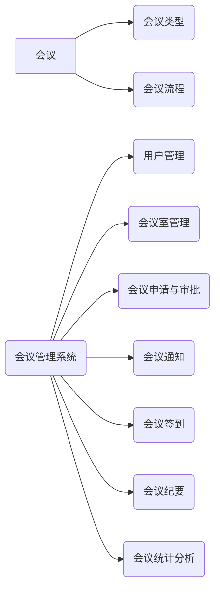

## 1. 背景介绍

### 1.1 会议管理之痛点

在当今快节奏的商业环境中，会议已经成为组织和个人之间进行沟通和协作的重要手段。然而，随着会议数量的激增，传统的会议管理方式也暴露出越来越多的弊端：

* **信息不对称:** 会议信息分散在邮件、聊天工具、文档等多个平台，难以统一管理和查询。
* **协调成本高:** 会议室预订、参会人员邀请、会议通知等环节需要人工协调，效率低下且容易出错。
* **会议效率低:** 会议过程中缺乏有效的记录和跟踪机制，导致会议结论难以落实，会议效率低下。

### 1.2 会议管理系统应运而生

为了解决上述问题，会议管理系统应运而生。会议管理系统旨在通过信息化手段，实现会议全流程的自动化管理，提高会议效率，降低会议成本。

### 1.3 本文目标

本文将从技术角度出发，详细介绍会议管理系统的设计与实现，涵盖系统需求分析、架构设计、数据库设计、核心功能实现、技术选型等方面，并结合实际案例进行分析，旨在为相关领域的开发者提供参考和借鉴。

## 2. 核心概念与联系

### 2.1 会议

会议是指由两个或两个以上的人员，为了达到某个共同的目标，而进行的信息交流和协商的过程。

### 2.2 会议类型

会议类型可以根据不同的标准进行分类，例如：

* **按会议目的:** 例会、专题会议、决策会议、头脑风暴会议等。
* **按会议规模:** 小型会议、中型会议、大型会议等。
* **按会议形式:** 线下会议、线上会议、混合会议等。

### 2.3 会议流程

一个完整的会议流程通常包括以下几个阶段：

* **会议申请:**  发起人提交会议申请，包括会议主题、时间、地点、参会人员等信息。
* **会议审批:**  相关负责人对会议申请进行审批，决定是否批准会议申请。
* **会议准备:**  会议组织者进行会议室预订、会议资料准备、会议通知等工作。
* **会议召开:**  参会人员按时参加会议，进行信息交流和协商。
* **会议纪要:**  会议结束后，记录会议的主要内容和结论。
* **会议跟踪:**  对会议决议进行跟踪落实，确保会议目标的达成。

### 2.4 会议管理系统功能模块

基于上述会议流程，一个完整的会议管理系统通常包含以下功能模块：

* **用户管理:**  管理系统用户，包括用户信息维护、角色权限管理等。
* **会议室管理:**  管理会议室资源，包括会议室信息维护、会议室预订等。
* **会议申请与审批:**  提供会议申请、审批功能，实现会议流程的自动化管理。
* **会议通知:**  通过邮件、短信等方式，及时通知参会人员会议信息。
* **会议签到:**  提供多种签到方式，方便参会人员进行签到。
* **会议纪要:**  提供会议纪要记录、查询功能，方便会议内容的回顾和跟踪。
* **会议统计分析:**  提供会议数据统计分析功能，帮助管理者了解会议情况，优化会议管理流程。

### 2.5 核心概念联系图



## 3. 核心算法原理具体操作步骤

### 3.1 会议室资源调度算法

会议室资源调度是会议管理系统的核心功能之一，需要根据会议申请信息，自动匹配合适的会议室资源。常用的会议室资源调度算法包括：

* **先到先得算法:**  按照会议申请提交的时间顺序，依次分配会议室资源。
* **最优匹配算法:**  根据会议申请的各项条件，例如会议时间、会议人数、会议室设备要求等，计算每个会议室与会议申请的匹配度，选择匹配度最高的会议室进行分配。
* **基于规则的算法:**  根据预先设定的规则，例如部门优先级、会议重要程度等，对会议申请进行优先级排序，然后按照优先级顺序分配会议室资源。

#### 3.1.1 最优匹配算法具体操作步骤

以最优匹配算法为例，具体操作步骤如下：

1. **计算每个会议室与会议申请的时间匹配度:**  根据会议申请的开始时间和结束时间，计算每个会议室在该时间段内的空闲时间比例，空闲时间比例越高，匹配度越高。
2. **计算每个会议室与会议申请的人数匹配度:**  根据会议申请的参会人数，计算每个会议室的容纳人数与参会人数的比例，比例越接近1，匹配度越高。
3. **计算每个会议室与会议申请的设备匹配度:**  根据会议申请的设备要求，例如投影仪、白板等，判断每个会议室是否满足要求，满足要求的会议室匹配度为1，不满足要求的会议室匹配度为0。
4. **计算每个会议室与会议申请的综合匹配度:**  将时间匹配度、人数匹配度、设备匹配度进行加权求和，得到每个会议室与会议申请的综合匹配度。
5. **选择综合匹配度最高的会议室:**  选择综合匹配度最高的会议室，分配给该会议申请。

#### 3.1.2 代码实例

```python
def calculate_time_matching_degree(meeting_room, meeting_request):
    """
    计算会议室与会议申请的时间匹配度。
    """
    # ...

def calculate_capacity_matching_degree(meeting_room, meeting_request):
    """
    计算会议室与会议申请的人数匹配度。
    """
    # ...

def calculate_equipment_matching_degree(meeting_room, meeting_request):
    """
    计算会议室与会议申请的设备匹配度。
    """
    # ...

def calculate_comprehensive_matching_degree(meeting_room, meeting_request):
    """
    计算会议室与会议申请的综合匹配度。
    """
    time_matching_degree = calculate_time_matching_degree(meeting_room, meeting_request)
    capacity_matching_degree = calculate_capacity_matching_degree(meeting_room, meeting_request)
    equipment_matching_degree = calculate_equipment_matching_degree(meeting_room, meeting_request)
    # ...

def allocate_meeting_room(meeting_request):
    """
    分配会议室资源。
    """
    # ...
    best_meeting_room = None
    best_matching_degree = 0
    for meeting_room in meeting_rooms:
        matching_degree = calculate_comprehensive_matching_degree(meeting_room, meeting_request)
        if matching_degree > best_matching_degree:
            best_meeting_room = meeting_room
            best_matching_degree = matching_degree
    # ...
```

### 3.2 会议通知推送机制

会议通知推送机制是会议管理系统的另一个重要功能，需要及时准确地将会议信息通知到参会人员。常用的会议通知推送机制包括：

* **邮件通知:**  将会议信息通过邮件发送给参会人员。
* **短信通知:**  将会议信息通过短信发送给参会人员。
* **即时通讯软件通知:**  将会议信息通过企业微信、钉钉等即时通讯软件发送给参会人员。

#### 3.2.1 基于消息队列的会议通知推送机制

为了提高会议通知推送的效率和可靠性，可以采用基于消息队列的会议通知推送机制。具体操作步骤如下：

1. **会议信息发送:**  当会议信息发生变化时，例如会议创建、会议更新、会议取消等，将会议信息发送到消息队列中。
2. **消息消费:**  消息消费者从消息队列中获取会议信息，并根据会议信息中的参会人员信息，选择合适的通知方式，例如邮件、短信、即时通讯软件等，将会议信息通知给参会人员。

#### 3.2.2 代码实例

```python
# 消息生产者
def send_meeting_notification(meeting_info):
    """
    发送会议通知消息。
    """
    # ...
    message_queue.send(meeting_info)
    # ...

# 消息消费者
def consume_meeting_notification():
    """
    消费会议通知消息。
    """
    # ...
    while True:
        meeting_info = message_queue.receive()
        # ...
        # 根据会议信息中的参会人员信息，选择合适的通知方式，将会议信息通知给参会人员。
        # ...
```

## 4. 数学模型和公式详细讲解举例说明

### 4.1 会议室利用率

会议室利用率是指实际使用会议室的时间占总可使用时间的比例，是衡量会议室资源使用效率的重要指标。

**公式:**

```
会议室利用率 = 实际使用会议室时间 / 总可使用时间 * 100%
```

**举例说明:**

假设某会议室每天可使用时间为8小时，某天该会议室实际使用了6小时，则该会议室当天的利用率为：

```
会议室利用率 = 6 / 8 * 100% = 75%
```

### 4.2 会议平均时长

会议平均时长是指所有会议的总时长除以会议数量，是衡量会议效率的重要指标。

**公式:**

```
会议平均时长 = 所有会议总时长 / 会议数量
```

**举例说明:**

假设某公司一周内共举行了10场会议，总时长为20小时，则该公司的会议平均时长为：

```
会议平均时长 = 20 / 10 = 2小时
```

## 5. 项目实践：代码实例和详细解释说明

### 5.1 技术选型

* **后端开发语言:** Python
* **Web框架:** Django
* **数据库:** MySQL
* **消息队列:** RabbitMQ
* **缓存:** Redis

### 5.2 数据库设计

| 表名 | 字段 | 数据类型 | 说明 |
|---|---|---|---|
| user | id | int | 用户ID，主键 |
| user | username | varchar(255) | 用户名，唯一 |
| user | password | varchar(255) | 密码 |
| user | email | varchar(255) | 邮箱地址 |
| user | role | int | 角色，1：管理员，2：普通用户 |
| meeting_room | id | int | 会议室ID，主键 |
| meeting_room | name | varchar(255) | 会议室名称 |
| meeting_room | location | varchar(255) | 会议室位置 |
| meeting_room | capacity | int | 会议室容纳人数 |
| meeting_request | id | int | 会议申请ID，主键 |
| meeting_request | title | varchar(255) | 会议主题 |
| meeting_request | start_time | datetime | 会议开始时间 |
| meeting_request | end_time | datetime | 会议结束时间 |
| meeting_request | applicant | int | 申请人ID，外键关联user表 |
| meeting_request | attendees | varchar(255) | 参会人员ID列表，逗号分隔 |
| meeting_request | status | int | 状态，1：待审批，2：已审批，3：已拒绝 |

### 5.3 核心代码实现

```python
# views.py

from django.shortcuts import render, redirect
from django.contrib.auth.decorators import login_required
from .models import MeetingRoom, MeetingRequest
from .forms import MeetingRequestForm

# ...

@login_required
def create_meeting_request(request):
    """
    创建会议申请。
    """
    if request.method == 'POST':
        form = MeetingRequestForm(request.POST)
        if form.is_valid():
            meeting_request = form.save(commit=False)
            meeting_request.applicant = request.user
            meeting_request.save()
            # 发送会议申请通知消息
            send_meeting_notification(meeting_request)
            return redirect('meeting_request_list')
    else:
        form = MeetingRequestForm()
    return render(request, 'meeting_management/create_meeting_request.html', {'form': form})

# ...
```

## 6. 实际应用场景

### 6.1 企业内部会议管理

会议管理系统可以应用于企业内部各种类型的会议管理，例如例会、部门会议、项目会议、培训会议等，帮助企业提高会议效率，降低会议成本。

### 6.2 学术会议管理

会议管理系统可以应用于学术会议的管理，例如论文投稿、审稿、会议注册、会议日程安排等，帮助学术会议组织者提高会议组织效率，提升会议质量。

### 6.3 在线会议平台

会议管理系统可以作为在线会议平台的核心功能模块，为用户提供会议创建、会议预订、会议通知、会议签到、会议录制等功能，方便用户进行线上会议。

## 7. 总结：未来发展趋势与挑战

### 7.1 未来发展趋势

* **智能化:**  随着人工智能技术的不断发展，会议管理系统将会朝着更加智能化的方向发展，例如智能会议室推荐、智能会议纪要生成、智能会议分析等。
* **移动化:**  随着移动互联网的普及，会议管理系统将会更加注重移动端的体验，提供更加便捷的移动端会议管理功能。
* **集成化:**  会议管理系统将会与其他企业级应用系统进行更加深度的集成，例如OA系统、CRM系统、HR系统等，实现数据互通，提高协同效率。

### 7.2 面临的挑战

* **数据安全:**  会议管理系统存储了大量的企业机密信息，如何保障数据的安全是一个重要的挑战。
* **用户体验:**  如何设计出操作简单、用户体验良好的会议管理系统，也是一个需要重点关注的问题。
* **技术更新迭代:**  随着技术的不断发展，会议管理系统需要不断进行技术更新迭代，才能保持竞争力。

## 8. 附录：常见问题与解答

### 8.1 如何保证会议信息的安全性？

为了保证会议信息的安全性，可以采取以下措施：

* **数据加密:**  对敏感数据进行加密存储，例如密码、会议内容等。
* **访问控制:**  设置严格的用户权限控制，不同角色的用户只能访问其权限范围内的信息。
* **安全审计:**  记录用户的操作日志，以便于追溯和审计。

### 8.2 如何提高会议室的利用率？

为了提高会议室的利用率，可以采取以下措施：

* **优化会议室资源配置:**  根据实际需求，合理配置会议室资源，避免资源浪费。
* **鼓励线上会议:**  对于一些简单的会议，可以鼓励使用线上会议的方式，减少线下会议室的使用。
* **实施会议室预订制度:**  建立完善的会议室预订制度，避免会议冲突，提高会议室的使用效率。