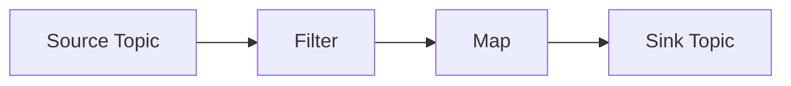

# 使用KafkaStreams构建流式微服务

作者：禅与计算机程序设计艺术

## 1. 背景介绍

### 1.1 微服务架构的兴起

微服务架构是一种将单一应用程序划分为一组小的、独立的服务的架构模式。每个服务运行在其自己的进程中，并通过轻量级的机制（通常是HTTP API）进行通信。这种架构允许开发团队独立地部署和扩展各个服务，进而提高了开发效率和系统的可维护性。

### 1.2 流式处理的需求

在现代应用程序中，实时数据处理的需求日益增加。传统的批处理模式已经不能满足实时数据处理的需求，因此流式处理成为了一种重要的技术。流式处理能够处理连续的数据流，并在数据到达的瞬间进行处理，从而实现实时分析和决策。

### 1.3 KafkaStreams的诞生

KafkaStreams是Apache Kafka生态系统中的一个重要组件，它提供了一个轻量级的库，用于构建具有高吞吐量和低延迟的流处理应用。KafkaStreams结合了Kafka的分布式消息系统和流处理的能力，使得开发者可以轻松地构建流式微服务。

## 2. 核心概念与联系

### 2.1 Apache Kafka简介

Apache Kafka是一个分布式流处理平台，主要用于构建实时数据管道和流应用。Kafka的核心组件包括Producer、Consumer、Broker和Topic。Producer负责发布消息到Kafka的Topic，Consumer从Topic中消费消息，Broker则是Kafka的服务器实例，负责消息的存储和转发。

### 2.2 KafkaStreams简介

KafkaStreams是一个用于构建实时流处理应用的客户端库。它提供了丰富的API，用于定义流处理的逻辑，包括过滤、映射、聚合和连接等操作。KafkaStreams的设计目标是简化流处理应用的开发，并确保高性能和高可用性。

### 2.3 微服务与流处理的结合

微服务架构和流处理的结合使得开发者可以构建具有实时数据处理能力的微服务。通过使用KafkaStreams，开发者可以轻松地将流处理逻辑嵌入到微服务中，从而实现实时数据处理和分析。

## 3. 核心算法原理具体操作步骤

### 3.1 数据流模型

KafkaStreams基于Kafka的主题（Topic）进行数据流处理。每个Topic可以看作是一个有序的消息队列，消息在Topic中按顺序存储。KafkaStreams通过定义流处理拓扑（Topology）来描述数据流的处理逻辑。

### 3.2 拓扑构建

流处理拓扑是由一系列流处理节点（Processor）和边（Edge）组成的有向无环图。每个节点表示一个流处理操作，如过滤、映射或聚合，边则表示数据流的路径。



### 3.3 状态存储

KafkaStreams支持有状态的流处理，通过使用状态存储（State Store）来管理处理过程中产生的中间状态。状态存储可以是内存中的哈希表，也可以是持久化的键值存储，如RocksDB。

### 3.4 容错机制

KafkaStreams通过定期将处理状态和偏移量（Offset）写入Kafka的主题，实现了高可用性和容错性。在发生故障时，KafkaStreams可以从最新的状态和偏移量恢复处理，从而保证数据处理的准确性。

## 4. 数学模型和公式详细讲解举例说明

### 4.1 数据流的数学表示

在数据流处理中，数据流可以表示为一个时间序列 $ D = \{(t_i, v_i)\} $，其中 $ t_i $ 表示时间戳，$ v_i $ 表示数据值。流处理操作可以看作是对时间序列的变换。

### 4.2 滑动窗口聚合

滑动窗口聚合是一种常见的流处理操作，用于在一个固定的时间窗口内对数据进行聚合。设定窗口大小为 $ W $，滑动步长为 $ S $，则滑动窗口聚合的结果可以表示为：

$$
A(t) = \sum_{i=t-W+1}^{t} v_i
$$

其中 $ A(t) $ 表示在时间 $ t $ 的聚合结果。

### 4.3 连接操作

连接操作用于将两个数据流合并为一个数据流。设两个数据流分别为 $ D_1 = \{(t_i, v_i)\} $ 和 $ D_2 = \{(t_j, v_j)\} $，连接操作的结果可以表示为：

$$
D = \{(t_k, (v_i, v_j)) \mid t_i = t_j = t_k \}
$$

其中 $ (v_i, v_j) $ 表示在时间 $ t_k $ 的连接结果。

## 4. 项目实践：代码实例和详细解释说明

### 4.1 环境搭建

首先，我们需要搭建Kafka和KafkaStreams的开发环境。以下是一个简单的环境配置指南：

1. 下载并安装Kafka：
   ```bash
   wget https://archive.apache.org/dist/kafka/2.7.0/kafka_2.12-2.7.0.tgz
   tar -xzf kafka_2.12-2.7.0.tgz
   cd kafka_2.12-2.7.0
   ```
2. 启动Kafka服务：
   ```bash
   bin/zookeeper-server-start.sh config/zookeeper.properties
   bin/kafka-server-start.sh config/server.properties
   ```

### 4.2 项目结构

创建一个新的Maven项目，并添加KafkaStreams的依赖：

```xml
<dependencies>
    <dependency>
        <groupId>org.apache.kafka</groupId>
        <artifactId>kafka-streams</artifactId>
        <version>2.7.0</version>
    </dependency>
</dependencies>
```

### 4.3 代码实例

以下是一个简单的KafkaStreams应用示例，它从一个Topic读取数据，进行过滤和映射操作，然后将结果写入另一个Topic。

```java
import org.apache.kafka.common.serialization.Serdes;
import org.apache.kafka.streams.KafkaStreams;
import org.apache.kafka.streams.StreamsBuilder;
import org.apache.kafka.streams.StreamsConfig;
import org.apache.kafka.streams.kstream.KStream;

import java.util.Properties;

public class StreamProcessingApp {
    public static void main(String[] args) {
        Properties props = new Properties();
        props.put(StreamsConfig.APPLICATION_ID_CONFIG, "stream-processing-app");
        props.put(StreamsConfig.BOOTSTRAP_SERVERS_CONFIG, "localhost:9092");
        props.put(StreamsConfig.DEFAULT_KEY_SERDE_CLASS_CONFIG, Serdes.String().getClass());
        props.put(StreamsConfig.DEFAULT_VALUE_SERDE_CLASS_CONFIG, Serdes.String().getClass());

        StreamsBuilder builder = new StreamsBuilder();
        KStream<String, String> sourceStream = builder.stream("source-topic");
        KStream<String, String> filteredStream = sourceStream.filter((key, value) -> value.contains("important"));
        KStream<String, String> mappedStream = filteredStream.mapValues(value -> value.toUpperCase());
        mappedStream.to("sink-topic");

        KafkaStreams streams = new KafkaStreams(builder.build(), props);
        streams.start();

        Runtime.getRuntime().addShutdownHook(new Thread(streams::close));
    }
}
```

### 4.4 详细解释

1. **配置属性**：配置KafkaStreams应用的属性，包括应用ID、Kafka集群地址和默认的序列化器/反序列化器。
2. **构建拓扑**：使用`StreamsBuilder`定义流处理拓扑，包括从源Topic读取数据、过滤包含特定关键字的数据、将数据转换为大写、将结果写入目标Topic。
3. **启动流处理**：创建`KafkaStreams`实例并启动流处理。

## 5. 实际应用场景

### 5.1 实时监控和报警系统

KafkaStreams可以用于构建实时监控和报警系统。例如，金融机构可以使用KafkaStreams实时监控交易数据，并在检测到异常交易时立即发出报警。

### 5.2 实时推荐系统

电商平台可以使用KafkaStreams构建实时推荐系统。通过分析用户的浏览和购买行为，系统可以实时生成个性化的推荐结果，从而提高用户的购物体验。

### 5.3 实时数据分析

KafkaStreams可以用于实时数据分析。例如，社交媒体平台可以使用KafkaStreams实时分析用户的互动数据，从而了解用户的兴趣和行为模式。

## 6. 工具和资源推荐

### 6.1 Kafka工具

1. **Kafka Manager**：一个开源的Kafka集群管理工具，提供了集群监控、Topic管理和消费者组管理等功能。
2. **Confluent Control Center**：Confluent公司提供的Kafka集群