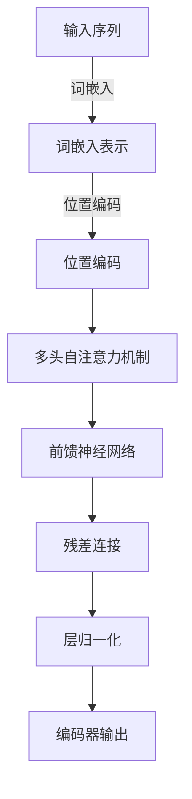

# 使用Transformers解决长文本问题

作者：禅与计算机程序设计艺术

## 1. 背景介绍

### 1.1 长文本处理的挑战

长文本处理在自然语言处理（NLP）领域中一直是一个具有挑战性的问题。传统的序列模型如RNN和LSTM在处理长文本时，容易出现梯度消失和梯度爆炸的问题，这使得它们在捕捉长距离依赖关系时变得不那么有效。随着文本长度的增加，这些问题变得更加显著，导致模型的性能下降。

### 1.2 Transformers的引入

Transformers模型的引入彻底改变了NLP领域的格局。最初由Vaswani等人在2017年提出的Transformer架构，通过自注意力机制（Self-Attention Mechanism）有效地解决了传统序列模型的不足。自注意力机制允许模型在计算每个词的表示时，能够关注到序列中所有其他词的表示，这使得Transformers在处理长文本时表现出色。

### 1.3 目标与意义

本文的目标是深入探讨如何使用Transformers解决长文本问题。我们将详细介绍Transformers的核心概念与原理，展示具体的算法操作步骤，并通过数学模型和公式进行详细讲解。我们还将提供实际项目实践的代码实例，讨论Transformers在不同应用场景中的表现，推荐相关工具和资源，最后总结未来的发展趋势与挑战。

## 2. 核心概念与联系

### 2.1 自注意力机制

自注意力机制是Transformers的核心，它允许模型在计算每个词的表示时，能够关注到序列中所有其他词的表示。具体来说，自注意力机制通过计算输入序列中每个词与其他词之间的相关性（即注意力得分），并根据这些得分对词的表示进行加权求和，从而生成新的表示。

### 2.2 编码器-解码器架构

Transformers采用了编码器-解码器架构，这种架构在机器翻译等任务中表现出色。编码器将输入序列编码成一组隐状态表示，解码器则根据这些隐状态表示生成输出序列。编码器和解码器都由多个层堆叠而成，每一层都包含自注意力机制和前馈神经网络。

### 2.3 位置编码

由于Transformers不具有内置的序列信息，位置编码（Positional Encoding）被引入以提供输入序列中每个词的位置信息。位置编码通过将位置信息与词嵌入相加，使得模型能够区分不同位置的词。

### 2.4 多头注意力机制

多头注意力机制（Multi-Head Attention）通过并行地执行多个自注意力机制，从不同的子空间中提取信息，从而增强模型的表达能力。每个头独立地计算注意力得分和加权求和，最后将这些结果拼接起来并线性变换，生成最终的表示。

### 2.5 残差连接和层归一化

为了缓解深层网络中的梯度消失问题，Transformers引入了残差连接（Residual Connection）和层归一化（Layer Normalization）。残差连接通过直接将输入与输出相加，保留了输入的信息，而层归一化则通过标准化每一层的输出，稳定了训练过程。

## 3. 核心算法原理具体操作步骤

### 3.1 输入预处理

#### 3.1.1 分词与词嵌入

在处理长文本之前，首先需要对文本进行分词，并将每个词转换为词嵌入表示。通常使用预训练的词嵌入模型如Word2Vec、GloVe或BERT来获取词嵌入。

#### 3.1.2 位置编码

将位置编码与词嵌入相加，以提供序列中的位置信息。位置编码可以使用正弦和余弦函数生成。

### 3.2 编码器部分

#### 3.2.1 多头自注意力机制

对于输入序列中的每个词，计算其与序列中所有其他词的注意力得分，并根据这些得分对词的表示进行加权求和。多头自注意力机制通过并行地执行多个自注意力机制，从不同的子空间中提取信息。



#### 3.2.2 前馈神经网络

使用前馈神经网络对自注意力机制的输出进行进一步处理。前馈神经网络由两个线性变换和一个激活函数组成。

#### 3.2.3 残差连接和层归一化

将输入与前馈神经网络的输出相加，并进行层归一化，以稳定训练过程。

### 3.3 解码器部分

#### 3.3.1 掩码多头自注意力机制

解码器中的自注意力机制需要考虑到已生成的部分序列，因此引入了掩码多头自注意力机制（Masked Multi-Head Attention）。掩码多头自注意力机制通过掩盖未来位置的词，确保模型只关注到已生成的部分序列。

#### 3.3.2 编码器-解码器注意力机制

解码器还包含编码器-解码器注意力机制（Encoder-Decoder Attention），它通过计算解码器中的每个词与编码器输出的注意力得分，结合编码器的输出信息生成新的表示。

#### 3.3.3 前馈神经网络与残差连接

与编码器类似，解码器也包含前馈神经网络和残差连接，以进一步处理和稳定输出。

## 4. 数学模型和公式详细讲解举例说明

### 4.1 自注意力机制公式

自注意力机制的核心在于计算注意力得分和加权求和。对于输入序列中的每个词，其表示可以通过以下公式计算：

$$
\text{Attention}(Q, K, V) = \text{softmax}\left(\frac{QK^T}{\sqrt{d_k}}\right)V
$$

其中，$Q$、$K$和$V$分别表示查询、键和值矩阵，$d_k$是键向量的维度。

### 4.2 多头注意力机制公式

多头注意力机制通过并行地执行多个自注意力机制，其公式如下：

$$
\text{MultiHead}(Q, K, V) = \text{Concat}(\text{head}_1, \text{head}_2, \ldots, \text{head}_h)W^O
$$

其中，每个头的计算方式为：

$$
\text{head}_i = \text{Attention}(QW_i^Q, KW_i^K, VW_i^V)
$$

这里，$W_i^Q$、$W_i^K$和$W_i^V$是不同头的参数矩阵，$W^O$是输出的参数矩阵。

### 4.3 前馈神经网络公式

前馈神经网络由两个线性变换和一个激活函数组成，其公式如下：

$$
\text{FFN}(x) = \text{max}(0, xW_1 + b_1)W_2 + b_2
$$

其中，$W_1$和$W_2$是权重矩阵，$b_1$和$b_2$是偏置向量。

### 4.4 位置编码公式

位置编码通过正弦和余弦函数生成，其公式如下：

$$
PE_{(pos, 2i)} = \sin\left(\frac{pos}{10000^{2i/d_{model}}}\right)
$$

$$
PE_{(pos, 2i+1)} = \cos\left(\frac{pos}{10000^{2i/d_{model}}}\right)
$$

其中，$pos$表示位置，$i$表示维度索引，$d_{model}$是模型的维度。

## 5. 项目实践：代码实例和详细解释说明

### 5.1 环境配置

首先，确保已安装必要的库和工具，如TensorFlow或PyTorch，以及Transformers库。

```bash
pip install transformers tensorflow
```

### 5.2 数据预处理

使用Transformers库中的Tokenizer对长文本进行分词和编码。

```python
from transformers import BertTokenizer

tokenizer = BertTokenizer.from_pretrained('bert-base-uncased')
text = "This is a long text that needs to be processed by a Transformer