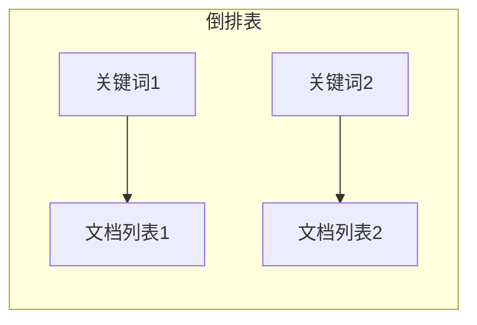

## 信息查询系统详细设计与具体代码实现

作者：禅与计算机程序设计艺术

## 1. 背景介绍

### 1.1 信息爆炸与查询需求

随着互联网和信息技术的飞速发展，全球数据量呈爆炸式增长，人们面临着前所未有的信息过载问题。如何从海量信息中快速、准确地获取所需信息成为亟待解决的难题。信息查询系统应运而生，旨在帮助用户高效地从庞大的数据集中检索目标信息。

### 1.2 信息查询系统的定义与分类

信息查询系统是指能够根据用户需求，从海量数据中检索、提取、分析和展示相关信息的软件系统。根据数据组织方式和查询方式的不同，信息查询系统可以分为以下几类：

* **结构化数据查询系统:**  主要针对存储在关系数据库中的结构化数据，例如企业资源规划系统、客户关系管理系统等。
* **非结构化数据查询系统:** 主要针对文本、图像、音频、视频等非结构化数据，例如搜索引擎、文档管理系统等。
* **半结构化数据查询系统:** 介于结构化和非结构化数据之间，例如XML数据库、JSON数据格式等。

### 1.3 本文研究范围

本文将重点关注基于倒排索引技术的非结构化数据查询系统，探讨其详细设计方案和具体代码实现，并结合实际应用场景进行分析和展望。

## 2. 核心概念与联系

### 2.1 倒排索引

倒排索引（Inverted Index）是一种常用的全文检索数据结构，其核心思想是建立**关键词**到**文档**的映射关系。与传统的正向索引（Forward Index）不同，倒排索引不记录每个文档包含哪些关键词，而是记录每个关键词出现在哪些文档中。

**正向索引:**

| 文档ID | 文档内容                               |
| ------ | ------------------------------------- |
| 1      | 今天天气真好，适合出去玩。                 |
| 2      | 明天要下雨，记得带伞。                     |
| 3      | 我喜欢吃苹果，也喜欢吃香蕉。                 |

**倒排索引:**

| 关键词 | 文档列表 |
| ------ | -------- |
| 今天   | 1        |
| 天气   | 1        |
| 好    | 1        |
| 明天   | 2        |
| 下雨   | 2        |
| 苹果   | 3        |
| 香蕉   | 3        |

### 2.2 倒排索引的构建过程

1. **文档预处理:** 对文本进行分词、去除停用词、词干提取等操作，将文档转换为关键词列表。
2. **建立倒排表:** 遍历所有文档的关键词列表，记录每个关键词出现的文档ID和位置信息，构建倒排表。
3. **排序和合并:** 对每个关键词对应的文档列表进行排序，并合并相同关键词的列表。

### 2.3 倒排索引的查询过程

1. **用户查询预处理:** 对用户输入的查询词进行分词、去除停用词、词干提取等操作。
2. **检索倒排表:** 根据查询词，分别检索对应的倒排表，获取包含该关键词的文档列表。
3. **结果合并和排序:** 对多个关键词的检索结果进行交集、并集等操作，并根据相关性排序，最终返回给用户。

### 2.4 倒排索引的优缺点

**优点:**

* 查询速度快，尤其适用于海量数据的检索。
* 支持复杂的查询操作，例如布尔运算、短语查询、模糊查询等。

**缺点:**

* 构建索引需要耗费大量的存储空间和时间。
* 不适合实时更新，每次更新数据都需要重新构建索引。

## 3. 核心算法原理具体操作步骤

### 3.1 文本预处理

#### 3.1.1 分词

分词是将连续的文本序列按照一定的规则切分为词语的过程。常用的分词算法包括：

* **基于词典的分词:** 使用预先构建好的词典进行匹配，例如正向最大匹配法、逆向最大匹配法等。
* **基于统计的分词:**  利用词语出现的频率和上下文信息进行切分，例如隐马尔可夫模型（HMM）、条件随机场（CRF）等。
* **基于深度学习的分词:** 使用神经网络模型学习文本的语义信息进行切分，例如 BERT、GPT 等。

#### 3.1.2 去除停用词

停用词是指在文本中出现频率很高但没有实际意义的词语，例如“的”、“是”、“在”等。去除停用词可以有效减少索引的大小，提高查询效率。

#### 3.1.3 词干提取

词干提取是将不同形态的词语还原为其词干的过程，例如“playing”还原为“play”。词干提取可以提高查询的召回率，避免漏掉相关信息。

### 3.2 倒排表构建

#### 3.2.1 数据结构设计

倒排表可以使用链表、跳表、B+树等数据结构来实现。其中，B+树是一种常用的索引结构，具有查询效率高、存储空间利用率高等优点。



#### 3.2.2 索引构建流程

1. 读取文档数据，进行文本预处理。
2. 遍历每个文档的关键词列表，构建倒排表。
3. 对每个关键词对应的文档列表进行排序，并合并相同关键词的列表。
4. 将构建好的倒排表写入磁盘文件。

### 3.3 查询处理

#### 3.3.1 查询词处理

对用户输入的查询词进行分词、去除停用词、词干提取等操作，将其转换为关键词列表。

#### 3.3.2 检索倒排表

根据查询词，分别检索对应的倒排表，获取包含该关键词的文档列表。

#### 3.3.3 结果合并和排序

对多个关键词的检索结果进行交集、并集等操作，并根据相关性排序，最终返回给用户。

## 4. 数学模型和公式详细讲解举例说明

### 4.1 TF-IDF

TF-IDF（Term Frequency-Inverse Document Frequency）是一种常用的文本权重计算方法，用于衡量一个词语在文档中的重要程度。

* **词频（TF）：** 指某个词语在文档中出现的频率，计算公式如下：

$$
TF_{t,d} = \frac{f_{t,d}}{\sum_{t' \in d} f_{t',d}}
$$

其中，$f_{t,d}$ 表示词语 $t$ 在文档 $d$ 中出现的次数。

* **逆文档频率（IDF）：** 指包含某个词语的文档数量的倒数的对数，计算公式如下：

$$
IDF_t = log \frac{N}{df_t}
$$

其中，$N$ 表示文档总数，$df_t$ 表示包含词语 $t$ 的文档数量。

* **TF-IDF：**  将词频和逆文档频率相乘，得到词语 $t$ 在文档 $d$ 中的权重，计算公式如下：

$$
TF-IDF_{t,d} = TF_{t,d} \times IDF_t
$$

### 4.2 向量空间模型

向量空间模型（Vector Space Model）是一种常用的文本表示方法，将文档和查询词表示为向量，通过计算向量之间的相似度来衡量文档与查询词的相关性。

假设文档 $d$ 和查询词 $q$ 的向量表示分别为 $\overrightarrow{d}$ 和 $\overrightarrow{q}$，则其相似度可以使用余弦相似度来计算：

$$
sim(\overrightarrow{d}, \overrightarrow{q}) = \frac{\overrightarrow{d} \cdot \overrightarrow{q}}{||\overrightarrow{d}|| \times ||\overrightarrow{q}||}
$$

## 5. 项目实践：代码实例和详细解释说明

### 5.1 Python 代码实现

```python
import math

class InvertedIndex:
    def __init__(self):
        self.index = {}

    def build_index(self, docs):
        for doc_id, doc_content in docs.items():
            # 文本预处理
            terms = self.preprocess(doc_content)
            # 构建倒排表
            for term in terms:
                if term not in self.index:
                    self.index[term] = []
                self.index[term].append(doc_id)

    def search(self, query):
        # 查询词处理
        query_terms = self.preprocess(query)
        # 检索倒排表
        doc_scores = {}
        for term in query_terms:
            if term in self.index:
                for doc_id in self.index[term]:
                    if doc_id not in doc_scores:
                        doc_scores[doc_id] = 0
                    doc_scores[doc_id] += 1
        # 结果排序
        sorted_docs = sorted(doc_scores.items(), key=lambda x: x[1], reverse=True)
        return sorted_docs

    def preprocess(self, text):
        # 分词、去除停用词、词干提取等操作
        # ...
        return terms
```

### 5.2 代码解释

* `InvertedIndex` 类表示倒排索引，包含 `index` 属性存储倒排表。
* `build_index` 方法用于构建倒排索引，接收一个字典类型的参数 `docs`，其中键为文档ID，值为文档内容。
* `search` 方法用于查询，接收一个字符串类型的参数 `query`，返回一个列表类型的结果，包含匹配的文档ID和得分。
* `preprocess` 方法用于文本预处理，接收一个字符串类型的参数 `text`，返回一个列表类型的结果，包含处理后的关键词。

## 6. 实际应用场景

### 6.1 搜索引擎

搜索引擎是倒排索引最典型的应用场景之一。用户输入查询词后，搜索引擎会利用倒排索引快速找到包含该关键词的网页，并根据相关性进行排序，最终将搜索结果展示给用户。

### 6.2 文档检索系统

企业内部的文档管理系统、图书馆的图书检索系统等也经常使用倒排索引技术来实现文档的快速检索。

### 6.3 日志分析系统

日志分析系统可以使用倒排索引技术来快速检索和分析海量的日志数据，帮助运维人员及时发现和解决系统问题。

## 7. 总结：未来发展趋势与挑战

### 7.1 未来发展趋势

* **语义搜索:**  传统的关键词匹配方法难以满足用户日益增长的语义化搜索需求，未来信息查询系统需要更加注重语义理解和推理能力。
* **个性化推荐:**  随着用户数据的积累，信息查询系统可以根据用户的搜索历史、兴趣爱好等信息进行个性化推荐，提高用户体验。
* **多模态搜索:**  未来信息查询系统需要支持文本、图像、音频、视频等多种模态数据的检索，满足用户更加多元化的信息需求。

### 7.2 面临的挑战

* **海量数据的处理:**  随着数据量的不断增长，如何高效地存储、索引和查询海量数据仍然是一个巨大的挑战。
* **实时性的需求:**  用户对信息查询的实时性要求越来越高，如何快速地更新索引、响应用户查询是另一个挑战。
* **数据安全和隐私保护:**  信息查询系统需要保护用户的数据安全和隐私，防止信息泄露和滥用。

## 8. 附录：常见问题与解答

### 8.1 如何评估信息查询系统的性能？

常用的信息查询系统性能评估指标包括：

* **召回率 (Recall):**  指检索到的相关文档数占所有相关文档数的比例。
* **精确率 (Precision):** 指检索到的相关文档数占所有检索到的文档数的比例。
* **F1 值:**  是召回率和精确率的调和平均数，综合考虑了检索结果的全面性和准确性。
* **平均查询响应时间 (Average Query Latency):** 指用户提交查询后，系统返回检索结果所需的平均时间。

### 8.2 如何提高信息查询系统的性能？

* **优化索引结构:**  选择合适的索引结构可以有效提高查询效率，例如使用 B+ 树、倒排索引等。
* **使用缓存:**  将 frequently accessed 数据缓存在内存中可以减少磁盘 I/O 操作，提高查询速度。
* **分布式部署:**  将数据和查询负载分布到多台服务器上可以提高系统的并发处理能力。
* **算法优化:**  不断优化查询算法、排序算法等可以进一步提升系统的性能。