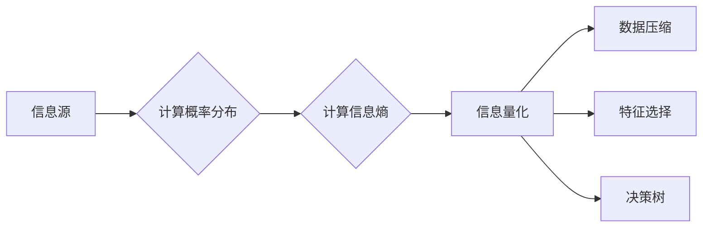

# 信息熵：衡量不确定性，优化信息处理

作者：禅与计算机程序设计艺术

## 1. 背景介绍

### 1.1 信息时代的困惑：如何度量信息？

在信息爆炸的时代，我们每天都被海量的数据包围着。如何从这些数据中提取有价值的信息，成为了一个至关重要的问题。然而，在处理信息之前，我们首先需要解决一个 fundamental 的问题：如何度量信息的多少？信息熵，就为我们提供了一种优雅而强大的工具来解决这个问题。

### 1.2 信息熵的起源：从热力学到信息论

信息熵的概念起源于热力学中的熵，它用来描述系统的混乱程度。1948 年，克劳德·香农在他划时代的论文“通信的数学理论”中，将熵的概念引入到信息论中，并将其定义为信息的不确定性程度。

### 1.3 信息熵的意义：量化信息，优化处理

信息熵的引入，为我们提供了一种量化信息的方式。通过计算信息熵，我们可以：

* **比较不同信息源的价值：** 信息熵越高，代表信息的不确定性越大，包含的信息量也越多。
* **优化信息编码：**  利用信息熵，我们可以设计更高效的编码方案，压缩数据，节省存储空间和传输带宽。
* **指导机器学习算法：**  信息熵被广泛应用于决策树、交叉熵损失函数等机器学习算法中，用于特征选择、模型优化等方面。

## 2. 核心概念与联系

### 2.1 信息熵的定义：量化不确定性

信息熵的定义如下：

$$H(X) = -\sum_{i=1}^{n} p(x_i) \log_2 p(x_i)$$

其中：

* $X$ 表示一个随机变量，可以是文本、图像、音频等任何类型的信息。
* $x_i$ 表示 $X$ 可能取到的第 $i$ 个值。
* $p(x_i)$ 表示 $X$ 取值为 $x_i$ 的概率。
* $\log_2 p(x_i)$ 表示以 2 为底，$p(x_i)$ 的对数。

信息熵的单位是比特（bit）。信息熵越大，代表信息的不确定性越大，包含的信息量也越多。

### 2.2 信息熵的性质：理解信息熵的关键特征

信息熵具有以下几个重要的性质：

* **非负性：**  信息熵永远大于等于 0，当且仅当事件是确定的，概率为 1 时，信息熵等于 0。
* **可加性：**  两个独立事件的信息熵等于它们各自信息熵的和。
* **连续性：**  当事件的概率发生微小变化时，信息熵也会发生连续的变化。
* **对称性：**  交换两个事件的概率，不会改变信息熵的值。

### 2.3 信息熵与其他概念的联系：构建信息论的知识体系

信息熵与信息论中的其他概念，例如：

* **信息量：**  信息量指的是一个事件发生后，所能消除的不确定性的大小。信息量与信息熵成反比。
* **互信息：**  互信息指的是两个随机变量之间共享的信息量的大小。
* **相对熵（KL 散度）：**  相对熵用来衡量两个概率分布之间的差异。

## 3. 核心算法原理具体操作步骤

### 3.1 计算信息熵的步骤：从概率到信息熵

计算信息熵的步骤如下：

1. 确定随机变量 $X$ 所有可能的取值 $x_1, x_2, ..., x_n$。
2. 统计每个取值 $x_i$ 出现的频率 $f(x_i)$。
3. 计算每个取值 $x_i$ 出现的概率 $p(x_i) = \frac{f(x_i)}{\sum_{i=1}^{n} f(x_i)}$。
4. 将概率 $p(x_i)$ 代入信息熵公式，计算信息熵 $H(X)$。

### 3.2 示例：抛硬币问题的信息熵

例如，对于抛硬币问题，随机变量 $X$ 的取值为 {正面，反面}，每个取值出现的概率均为 0.5。

```
p(正面) = 0.5
p(反面) = 0.5
```

根据信息熵公式，可以计算出抛硬币问题的信息熵为：

```
H(X) = - (0.5 * log2(0.5) + 0.5 * log2(0.5)) = 1 bit
```

这表明，抛一次硬币所产生的信息量为 1 bit。

### 3.3 Python 代码实现：将理论应用于实践

```python
import math

def calculate_entropy(data):
  """
  计算信息熵

  Args:
     一个列表，表示随机变量的取值

  Returns:
    信息熵的值
  """

  # 统计每个取值出现的频率
  frequency = {}
  for value in 
    if value in frequency:
      frequency[value] += 1
    else:
      frequency[value] = 1

  # 计算每个取值出现的概率
  probabilities = [float(freq) / len(data) for freq in frequency.values()]

  # 计算信息熵
  entropy = -sum([p * math.log(p, 2) for p in probabilities])

  return entropy
```

## 4. 数学模型和公式详细讲解举例说明

### 4.1 信息熵公式的推导：从不确定性到数学表达

信息熵公式的推导，可以从信息量的定义出发。信息量指的是一个事件发生后，所能消除的不确定性的大小。信息量与事件发生的概率成反比，即事件发生的概率越小，信息量越大。

假设一个事件发生的概率为 $p$，则该事件的信息量可以定义为：

$$I(p) = -\log_2 p$$

对于一个随机变量 $X$，它所有可能的取值为 $x_1, x_2, ..., x_n$，每个取值出现的概率分别为 $p(x_1), p(x_2), ..., p(x_n)$，则 $X$ 的平均信息量，也就是信息熵，可以定义为：

$$H(X) = E[I(p(x))] = -\sum_{i=1}^{n} p(x_i) \log_2 p(x_i)$$

### 4.2 信息熵公式的性质：理解信息熵的关键特征

信息熵公式具有以下几个重要的性质：

* **非负性：**  由于 $0 \le p(x_i) \le 1$，所以 $-\log_2 p(x_i) \ge 0$，因此 $H(X) \ge 0$。
* **可加性：**  假设有两个独立的随机变量 $X$ 和 $Y$，则它们的联合信息熵为：

$$H(X, Y) = -\sum_{x} \sum_{y} p(x, y) \log_2 p(x, y)$$

由于 $X$ 和 $Y$ 相互独立，所以 $p(x, y) = p(x)p(y)$，因此：

$$H(X, Y) = -\sum_{x} \sum_{y} p(x)p(y) \log_2 (p(x)p(y))$$

$$ = -\sum_{x} p(x) \log_2 p(x) -\sum_{y} p(y) \log_2 p(y)$$

$$ = H(X) + H(Y)$$

* **连续性：**  当事件的概率发生微小变化时，信息熵也会发生连续的变化。
* **对称性：**  交换两个事件的概率，不会改变信息熵的值。

### 4.3 信息熵的应用：从理论到实践

信息熵在信息论、计算机科学、机器学习等领域都有着广泛的应用，例如：

* **数据压缩：**  利用信息熵，可以设计更高效的编码方案，压缩数据，节省存储空间和传输带宽。例如，霍夫曼编码就是一种基于信息熵的无损数据压缩算法。
* **特征选择：**  在机器学习中，信息熵可以用来衡量特征的重要性。信息熵越高的特征，代表其包含的信息量越多，对分类或回归任务的贡献越大。
* **决策树：**  决策树是一种常用的分类算法，其核心思想是根据信息熵选择最优的特征进行划分。信息增益就是一种常用的特征选择指标，它表示使用某个特征进行划分后，信息熵的减少量。

## 5. 项目实践：代码实例和详细解释说明

### 5.1 使用 Python 计算文本的信息熵

```python
import math

def calculate_text_entropy(text):
  """
  计算文本的信息熵

  Args:
    text: 文本字符串

  Returns:
    文本的信息熵
  """

  # 统计每个字符出现的频率
  frequency = {}
  for char in text:
    if char in frequency:
      frequency[char] += 1
    else:
      frequency[char] = 1

  # 计算每个字符出现的概率
  probabilities = [float(freq) / len(text) for freq in frequency.values()]

  # 计算信息熵
  entropy = -sum([p * math.log(p, 2) for p in probabilities])

  return entropy

# 示例：计算英文文本的信息熵
text = "This is a test sentence."
entropy = calculate_text_entropy(text)
print("Entropy:", entropy)
```

### 5.2 使用 Scikit-learn 库计算信息增益

```python
from sklearn.tree import DecisionTreeClassifier
from sklearn.datasets import load_iris
from sklearn.model_selection import train_test_split

# 加载数据集
iris = load_iris()
X = iris.data
y = iris.target

# 划分训练集和测试集
X_train, X_test, y_train, y_test = train_test_split(X, y, test_size=0.2)

# 创建决策树模型
tree = DecisionTreeClassifier()

# 训练模型
tree.fit(X_train, y_train)

# 获取特征的重要性
importances = tree.feature_importances_

# 打印特征的重要性
for i, importance in enumerate(importances):
  print("Feature {}: {}".format(i, importance))
```

## 6. 实际应用场景

### 6.1 自然语言处理

* **文本分类：**  信息熵可以用来衡量文本的混乱程度，从而判断文本的类别。
* **机器翻译：**  信息熵可以用来评估机器翻译系统的性能。
* **语音识别：**  信息熵可以用来衡量语音信号的混乱程度，从而提高语音识别的准确率。

### 6.2  计算机视觉

* **图像压缩：**  信息熵可以用来指导图像压缩算法的设计。
* **目标检测：**  信息熵可以用来衡量目标区域的显著性。
* **图像分割：**  信息熵可以用来衡量图像分割结果的质量。

### 6.3  数据挖掘

* **异常检测：**  信息熵可以用来识别数据中的异常点。
* **关联规则挖掘：**  信息熵可以用来衡量规则的有趣程度。
* **聚类分析：**  信息熵可以用来评估聚类结果的质量。

## 7. 工具和资源推荐

### 7.1 Python 库

* **Scikit-learn：**  提供了计算信息熵、信息增益等函数。
* **Scipy：**  提供了计算信息熵、KL 散度等函数。
* **Numpy：**  提供了数组运算、数学函数等功能，可以用来辅助计算信息熵。

### 7.2 在线资源

* **维基百科：**  提供了关于信息熵的详细介绍。
* **Towards Data Science：**  提供了很多关于信息熵的应用案例和教程。
* **Analytics Vidhya：**  提供了很多关于机器学习和数据科学的学习资源，其中也包括信息熵的介绍。

## 8. 总结：未来发展趋势与挑战

### 8.1 信息熵的未来发展趋势

* **更广泛的应用：**  随着信息技术的不断发展，信息熵将会应用到更多的领域。
* **更深入的理论研究：**  信息熵的理论研究将会更加深入，例如量子信息熵等。
* **与其他技术的融合：**  信息熵将会与其他技术，例如机器学习、深度学习等融合，产生新的应用。

### 8.2 信息熵的挑战

* **高维数据的处理：**  对于高维数据，计算信息熵的复杂度会很高。
* **数据稀疏性的问题：**  当数据非常稀疏时，信息熵的计算结果可能不准确。
* **对噪声数据的敏感性：**  信息熵对噪声数据比较敏感。

## 9. 附录：常见问题与解答

### 9.1 信息熵和信息量有什么区别？

信息量指的是一个事件发生后，所能消除的不确定性的大小。信息量与事件发生的概率成反比，即事件发生的概率越小，信息量越大。

信息熵是信息量的期望值，它代表了随机变量所有可能取值的平均信息量。

### 9.2 信息熵有什么应用？

信息熵在信息论、计算机科学、机器学习等领域都有着广泛的应用，例如数据压缩、特征选择、决策树、文本分类、机器翻译、语音识别、图像压缩、目标检测、图像分割、异常检测、关联规则挖掘、聚类分析等。

### 9.3 如何计算信息熵？

计算信息熵的步骤如下：

1. 确定随机变量 $X$ 所有可能的取值 $x_1, x_2, ..., x_n$。
2. 统计每个取值 $x_i$ 出现的频率 $f(x_i)$。
3. 计算每个取值 $x_i$ 出现的概率 $p(x_i) = \frac{f(x_i)}{\sum_{i=1}^{n} f(x_i)}$。
4. 将概率 $p(x_i)$ 代入信息熵公式，计算信息熵 $H(X)$。

### 9.4 信息熵有哪些局限性？

信息熵也存在一些局限性，例如：

* **只考虑了事件发生的概率，没有考虑事件本身的价值。**
* **对于连续型随机变量，需要进行离散化处理才能计算信息熵。**
* **对噪声数据比较敏感。**


## 10.  信息熵的 Mermaid 流程图


