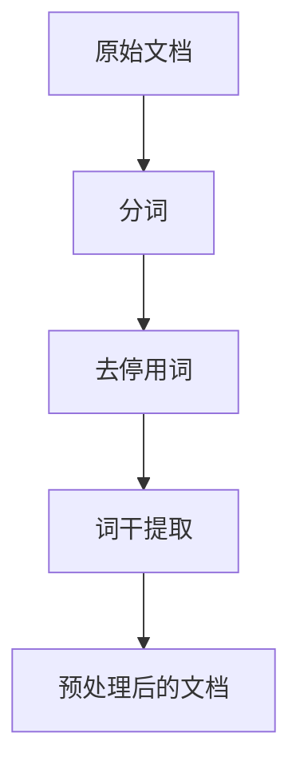
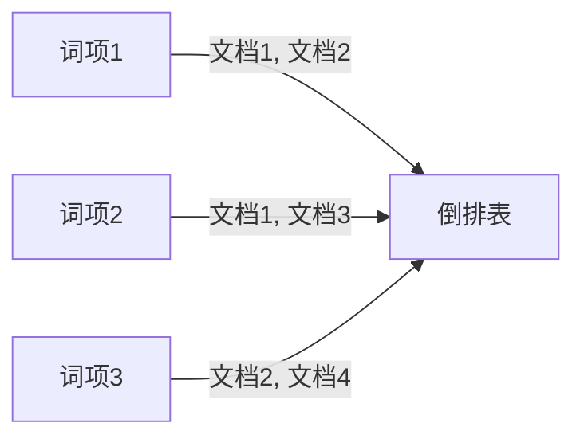
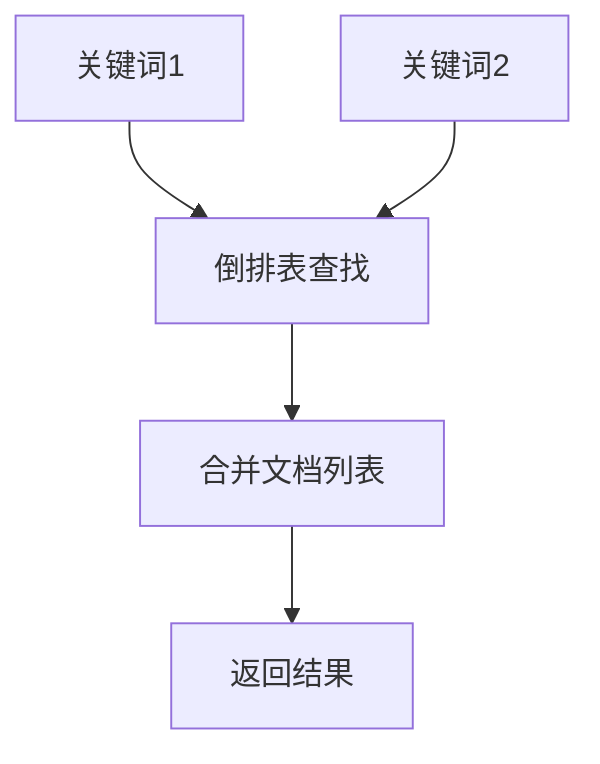

# 倒排索引在社交媒体搜索中的应用案例

作者：禅与计算机程序设计艺术

## 1. 背景介绍

### 1.1 社交媒体搜索的重要性

在当今的数字时代，社交媒体平台已经成为人们交流、获取信息和分享观点的重要渠道。每天，数以亿计的用户在这些平台上发布内容，涵盖了从个人生活到全球新闻的广泛话题。如何在海量信息中快速、准确地找到用户所需的内容，成为了社交媒体平台面临的一个重大挑战。

### 1.2 信息检索技术的发展

信息检索技术的发展，为解决上述问题提供了强有力的支持。从最早的布尔检索，到后来的向量空间模型，再到如今的倒排索引技术，信息检索技术不断演进，以应对不断增长的数据量和用户需求。

### 1.3 倒排索引的引入

倒排索引（Inverted Index）作为一种高效的信息检索技术，被广泛应用于各种搜索引擎中。它通过建立一个从词到文档的映射，使得搜索引擎能够快速找到包含某个关键词的所有文档。本文将详细探讨倒排索引在社交媒体搜索中的应用案例，分析其核心概念、算法原理、数学模型和实际应用。

## 2. 核心概念与联系

### 2.1 倒排索引的基本概念

倒排索引是一种将文档内容进行索引的技术，其核心思想是将文档中的每个词（Term）映射到包含该词的所有文档（Document）。这种映射关系通常存储在一个倒排文件（Inverted File）中，包含词项（Term）和对应的文档列表（Posting List）。

### 2.2 倒排索引与传统索引的区别

传统索引（如正排索引）通常是从文档到词的映射，即每个文档包含哪些词。而倒排索引则是从词到文档的映射，即每个词出现在哪些文档中。倒排索引的优势在于其查询效率高，特别适用于搜索引擎中需要快速检索包含某个关键词的所有文档的场景。

### 2.3 倒排索引在社交媒体中的应用

在社交媒体平台中，用户发布的内容通常是非结构化的文本数据。倒排索引可以帮助平台快速检索包含特定关键词的帖子、评论或用户，提升搜索体验。例如，当用户在搜索框中输入某个关键词时，倒排索引可以迅速返回包含该关键词的所有相关内容。

## 3. 核心算法原理具体操作步骤

### 3.1 构建倒排索引

#### 3.1.1 文档预处理

在构建倒排索引之前，需要对文档进行预处理。预处理步骤包括分词（Tokenization）、去停用词（Stop Words Removal）、词干提取（Stemming）等。



#### 3.1.2 建立词项-文档映射

在预处理后的文档中，提取每个词项，并记录该词项出现在哪些文档中。最终生成一个词项-文档映射表。



### 3.2 查询处理

#### 3.2.1 单词查询

对于单个关键词的查询，只需在倒排表中查找该关键词对应的文档列表，即可返回所有包含该关键词的文档。

#### 3.2.2 多词查询

对于多个关键词的查询，需要对每个关键词分别查找其对应的文档列表，然后对这些文档列表进行合并（如取交集或并集），以返回包含所有关键词的文档。



## 4. 数学模型和公式详细讲解举例说明

### 4.1 倒排索引的数学表示

倒排索引可以用数学公式表示为：

$$
I(t) = \{d_1, d_2, ..., d_n\}
$$

其中，$I(t)$ 表示词项 $t$ 的倒排表，$d_i$ 表示包含词项 $t$ 的文档。

### 4.2 多词查询的数学模型

对于多词查询，假设查询包含 $q_1, q_2, ..., q_k$ 个关键词，则查询结果可以表示为：

$$
R = I(q_1) \cap I(q_2) \cap ... \cap I(q_k)
$$

其中，$R$ 表示包含所有查询词项的文档集合。

### 4.3 评分机制

在实际应用中，查询结果通常需要按照相关性进行排序。常用的评分机制包括TF-IDF（Term Frequency-Inverse Document Frequency）和BM25等。TF-IDF的计算公式为：

$$
\text{TF-IDF}(t, d) = \text{TF}(t, d) \times \text{IDF}(t)
$$

其中，$\text{TF}(t, d)$ 表示词项 $t$ 在文档 $d$ 中的词频，$\text{IDF}(t)$ 表示词项 $t$ 的逆文档频率。

$$
\text{IDF}(t) = \log \frac{N}{|\{d : t \in d\}|}
$$

其中，$N$ 表示文档总数，$|\{d : t \in d\}|$ 表示包含词项 $t$ 的文档数。

## 5. 项目实践：代码实例和详细解释说明

### 5.1 倒排索引的构建

以下是一个简单的Python代码示例，展示如何构建倒排索引：

```python
import re
from collections import defaultdict

# 文档预处理
def preprocess(text):
    text = text.lower()
    text = re.sub(r'\W+', ' ', text)
    tokens = text.split()
    return tokens

# 构建倒排索引
def build_inverted_index(documents):
    inverted_index = defaultdict(set)
    for doc_id, text in enumerate(documents):
        tokens = preprocess(text)
        for token in tokens:
            inverted_index[token].add(doc_id)
    return inverted_index

# 示例文档
documents = [
    "Social media is a powerful tool.",
    "Media platforms enable communication.",
    "Social networks connect people.",
    "People use media to share information."
]

# 构建倒排索引
inverted_index = build_inverted_index(documents)

# 打印倒排索引
for term, doc_ids in inverted_index.items():
    print(f"{term}: {doc_ids}")
```

### 5.2 查询处理

以下是一个简单的Python代码示例，展示如何处理查询：

```python
# 单词查询
def single_word_query(inverted_index, query):
    return inverted_index.get(query, set())

# 多词查询
def multi_word_query(inverted_index, query):
    query_terms = preprocess(query)
    if not query_terms:
        return set()
    
    result = single_word_query(inverted_index, query_terms[0])
    for term in query_terms[1:]:
        result &= single_word_query(inverted_index, term)
    return result

# 示例查询
query = "social media"
result = multi_word_query(inverted_index, query)
print(f"Query result for '{query}': {result}")
```

## 6. 实际应用场景

### 6.1 社交媒体平台

倒排索引广泛应用于各大社交媒体平台，如Facebook、Twitter和Instagram等。这些平台每天处理海量的用户生成内容，通过倒排索引技术，可以快速检索包含特定关键词的帖子、评论和用户。

### 6.2 搜索引擎

搜索引擎（如Google、Bing）是倒排索引的经典应用场景。通过倒排索引，搜索引擎能够高效地处理用户的查询请求，返回相关的网页和内容。

### 6.3 文档管理系统

在企业文档管理系统中，倒排索引可以帮助员工快速找到包含特定关键词的文档，提升工作效率。

## 7. 工具和资源推荐

### 7.1 开源库

- **Apache Lucene**：一个高性能、可扩展的信息检索库，