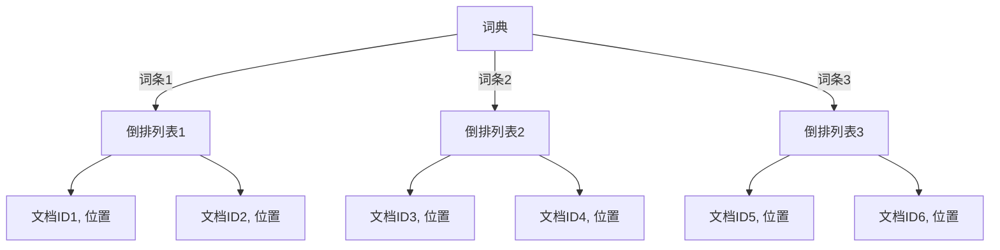

# 倒排索引在科学数据搜索中的应用前景

作者：禅与计算机程序设计艺术

## 1. 背景介绍

### 1.1 科学数据的爆炸性增长

随着科学研究的深入和技术手段的进步，科学数据的生成速度呈现出爆炸性的增长。从天文观测数据到基因组测序数据，再到气象观测数据，科学家们每天都在生成海量的数据。这些数据不仅在数量上巨大，而且在结构上也非常复杂，包含了不同类型的数值、文本、图像和视频等。

### 1.2 数据搜索的重要性

在如此庞大的数据量面前，如何快速、准确地搜索和检索所需的信息成为了科学研究中的一个关键问题。传统的数据库检索方法在处理大规模科学数据时显得力不从心，而倒排索引（Inverted Index）作为一种高效的文本搜索技术，逐渐引起了人们的关注。

### 1.3 倒排索引的基本概念

倒排索引是一种将文档中的词条映射到包含这些词条的文档集合的数据结构。与传统的正向索引不同，倒排索引能够快速地定位包含特定词条的文档，从而大大提高搜索效率。倒排索引在信息检索、搜索引擎和数据挖掘等领域具有广泛的应用前景。

## 2. 核心概念与联系

### 2.1 倒排索引的基本结构

倒排索引主要由两个部分组成：词典（Dictionary）和倒排列表（Inverted List）。词典存储了所有的词条，每个词条对应一个倒排列表，倒排列表中记录了包含该词条的文档ID及其在文档中的位置。



### 2.2 倒排索引与传统索引的比较

传统索引（如B树、哈希表）通常用于数据库中的快速查找操作，但在处理全文搜索时效率较低。倒排索引通过将词条和文档的关系进行反向存储，能够快速定位包含特定词条的文档，从而提高全文搜索的效率。

### 2.3 倒排索引在科学数据中的应用

倒排索引在科学数据搜索中的应用主要体现在以下几个方面：

- **全文检索**：快速检索包含特定关键词的科学文献或数据记录。
- **数据挖掘**：通过关键词组合进行复杂的查询和分析。
- **知识发现**：通过搜索相关文档，发现隐藏在数据中的知识和模式。

## 3. 核心算法原理具体操作步骤

### 3.1 构建倒排索引

构建倒排索引的过程包括以下几个步骤：

1. **文档预处理**：对文档进行分词、去停用词、词干提取等预处理操作。
2. **词典构建**：将所有词条存储到词典中。
3. **倒排列表生成**：为每个词条生成对应的倒排列表，记录包含该词条的文档ID及其位置。

### 3.2 查询处理

倒排索引的查询处理过程包括以下几个步骤：

1. **查询解析**：将查询字符串分词，并查找每个词条对应的倒排列表。
2. **倒排列表合并**：根据查询的逻辑操作（如AND、OR），合并多个倒排列表。
3. **结果排序**：根据文档的相关性评分，对查询结果进行排序。

### 3.3 更新和维护

倒排索引的更新和维护是一个复杂的过程，主要包括以下几个方面：

1. **新增文档**：将新文档中的词条插入到词典中，并更新对应的倒排列表。
2. **删除文档**：从倒排列表中移除被删除文档的ID。
3. **索引压缩**：对倒排索引进行压缩，以减少存储空间和提高查询效率。

## 4. 数学模型和公式详细讲解举例说明

### 4.1 倒排索引的数学模型

倒排索引的数学模型可以表示为一个二元组 $(D, T)$，其中 $D$ 是文档集合，$T$ 是词条集合。对于每个词条 $t \in T$，存在一个倒排列表 $L_t$，其中包含所有包含词条 $t$ 的文档ID及其位置。

$$
L_t = \{(d, p) \mid d \in D, p \in \text{positions}(d, t)\}
$$

### 4.2 相关性评分

在倒排索引中，相关性评分用于衡量文档与查询的匹配程度。常用的相关性评分模型包括TF-IDF（词频-逆文档频率）和BM25（最佳匹配模型25）。

#### TF-IDF模型

TF-IDF模型的基本公式如下：

$$
\text{TF-IDF}(t, d) = \text{TF}(t, d) \times \text{IDF}(t)
$$

其中，$\text{TF}(t, d)$ 表示词条 $t$ 在文档 $d$ 中的词频，$\text{IDF}(t)$ 表示词条 $t$ 的逆文档频率。

$$
\text{TF}(t, d) = \frac{f_{t,d}}{\sum_{t' \in d} f_{t',d}}
$$

$$
\text{IDF}(t) = \log \frac{N}{|\{d \in D \mid t \in d\}|}
$$

#### BM25模型

BM25模型的基本公式如下：

$$
\text{BM25}(t, d) = \sum_{t \in q} \frac{\text{IDF}(t) \cdot (k_1 + 1) \cdot \text{TF}(t, d)}{\text{TF}(t, d) + k_1 \cdot (1 - b + b \cdot \frac{|d|}{\text{avgdl}})}
$$

其中，$k_1$ 和 $b$ 是调节参数，$|d|$ 表示文档 $d$ 的长度，$\text{avgdl}$ 表示文档集合的平均长度。

### 4.3 示例说明

假设我们有以下三个文档：

- 文档1：The quick brown fox
- 文档2：The quick brown dog
- 文档3：The lazy dog

经过分词和去停用词处理后，我们得到以下词条集合：

- 词条集合：{quick, brown, fox, dog, lazy}

构建倒排索引后，我们得到以下倒排列表：

- quick: {1, 2}
- brown: {1, 2}
- fox: {1}
- dog: {2, 3}
- lazy: {3}

现在，我们对查询 "quick brown" 进行处理：

1. 查询解析：quick, brown
2. 倒排列表合并：{1, 2} ∩ {1, 2} = {1, 2}
3. 结果排序：根据相关性评分，对文档1和文档2进行排序。

## 5. 项目实践：代码实例和详细解释说明

### 5.1 构建倒排索引的Python代码实例

```python
import re
from collections import defaultdict

# 文档集合
documents = [
    "The quick brown fox",
    "The quick brown dog",
    "The lazy dog"
]

# 分词和去停用词处理
def preprocess(text):
    stopwords = set(["the"])
    words = re.findall(r'\w+', text.lower())
    return [word for word in words if word not in stopwords]

# 构建倒排索引
def build_inverted_index(documents):
    inverted_index = defaultdict(list)
    for doc_id, text in enumerate(documents):
        words = preprocess(text)
        for word in words:
            inverted_index[word].append(doc_id)
    return inverted_index

# 打印倒排索引
inverted_index = build_inverted_index(documents)
for word, doc_ids in inverted_index.items():
    print(f"{word}: {doc_ids}")
```

### 5.2 查询处理的Python代码实例

```python
# 查询解析
def query_inverted_index(query, inverted_index):
