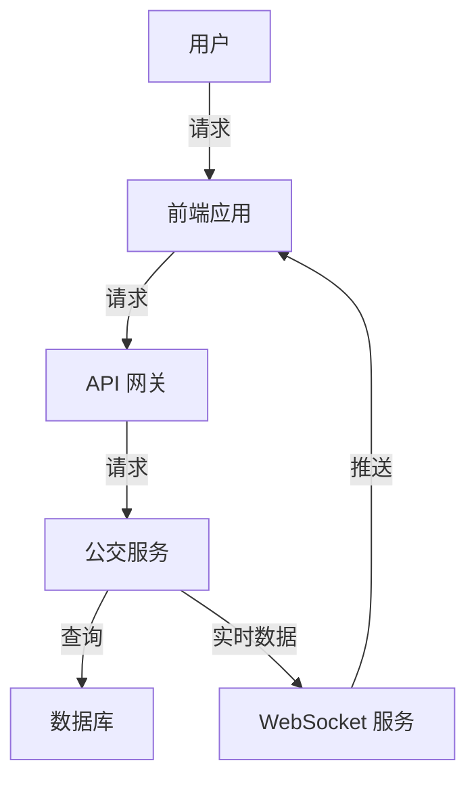

# 公交查询系统详细设计与具体代码实现

作者：禅与计算机程序设计艺术

## 1.背景介绍

### 1.1 公交查询系统的意义

随着城市化进程的加快，公共交通系统在城市生活中的作用越来越重要。为了提高公交系统的使用效率，方便市民出行，公交查询系统应运而生。一个高效的公交查询系统不仅可以为市民提供实时的公交信息，还可以优化公交线路，减少等待时间，提高公交系统的整体运营效率。

### 1.2 项目的目标

本项目的目标是设计并实现一个功能完善的公交查询系统。该系统应具备以下功能：
- 实时查询公交车到站时间
- 查询公交线路和站点信息
- 提供换乘方案
- 实时显示公交车位置

### 1.3 技术栈选择

为了实现上述功能，本项目将使用以下技术栈：
- 前端：React.js
- 后端：Node.js + Express.js
- 数据库：MongoDB
- 实时数据：WebSocket

## 2.核心概念与联系

### 2.1 系统架构

公交查询系统的整体架构如下图所示：



### 2.2 数据流与交互

系统的核心数据流与交互过程如下：
1. 用户通过前端应用发起查询请求。
2. 前端应用将请求发送到API网关。
3. API网关将请求转发到公交服务。
4. 公交服务查询数据库获取相关数据。
5. 公交服务通过WebSocket服务推送实时数据到前端应用。
6. 前端应用将数据展示给用户。

## 3.核心算法原理具体操作步骤

### 3.1 公交到站时间预测

公交到站时间预测是公交查询系统的核心功能之一。其算法原理如下：
1. 获取公交车的实时位置数据。
2. 根据公交车当前速度和行驶路线，预测到达各个站点的时间。
3. 将预测结果返回给前端应用。

### 3.2 换乘方案计算

换乘方案计算的具体步骤如下：
1. 用户输入起点和终点。
2. 系统查询所有可能的公交线路。
3. 计算各个换乘方案的总时间和距离。
4. 根据用户偏好（如最短时间、最少换乘次数等）推荐最佳换乘方案。

### 3.3 实时位置更新

实时位置更新的具体操作步骤如下：
1. 公交车通过GPS设备实时上传位置数据。
2. WebSocket服务接收位置数据并存储到数据库。
3. WebSocket服务将位置数据推送到前端应用。
4. 前端应用实时更新公交车的位置。

## 4.数学模型和公式详细讲解举例说明

### 4.1 公交到站时间预测模型

公交到站时间预测可以使用以下数学模型：

$$
T_{arrival} = T_{current} + \frac{D_{remaining}}{V_{average}}
$$

其中：
- $T_{arrival}$ 是公交车到达某站点的预计时间
- $T_{current}$ 是当前时间
- $D_{remaining}$ 是公交车到达该站点的剩余距离
- $V_{average}$ 是公交车的平均速度

### 4.2 换乘方案优化模型

换乘方案优化可以使用图论中的最短路径算法。假设公交线路图为一个有向图 $G = (V, E)$，其中 $V$ 是站点集合，$E$ 是线路集合。每条边 $e \in E$ 有一个权重 $w(e)$，表示从一个站点到另一个站点所需的时间。则换乘方案优化问题可以表示为：

$$
\min \sum_{e \in P} w(e)
$$

其中 $P$ 是从起点到终点的路径集合。

## 5.项目实践：代码实例和详细解释说明

### 5.1 前端实现

```javascript
// App.js
import React, { useState, useEffect } from 'react';
import axios from 'axios';
import { Map, Marker } from 'react-leaflet';

function App() {
  const [busData, setBusData] = useState([]);
  const [route, setRoute] = useState(null);

  useEffect(() => {
    const fetchBusData = async () => {
      const response = await axios.get('/api/bus');
      setBusData(response.data);
    };
    fetchBusData();
  }, []);

  return (
    <div>
      <Map center={[51.505, -0.09]} zoom={13}>
        {busData.map(bus => (
          <Marker key={bus.id} position={[bus.lat, bus.lng]} />
        ))}
      </Map>
      <RouteSelector onSelect={setRoute} />
      {route && <RouteDetails route={route} />}
    </div>
  );
}

export default App;
```

### 5.2 后端实现

```javascript
// server.js
const express = require('express');
const mongoose = require('mongoose');
const WebSocket = require('ws');

const app = express();
const port = 3000;

mongoose.connect('mongodb://localhost:27017/bus', { useNewUrlParser: true, useUnifiedTopology: true });

const busSchema = new mongoose.Schema({
  id: String,
  lat: Number,
  lng: Number,
  route: String,
  timestamp: Date,
});

const Bus = mongoose.model('Bus', busSchema);

app.get('/api/bus', async (req, res) => {
  const buses = await Bus.find();
  res.json(buses);
});

const server = app.listen(port, () => {
  console.log(`Server running on port ${port}`);
});

const wss = new WebSocket.Server({ server });

wss.on('connection', ws => {
  ws.on('message', async message => {
    const busData = JSON.parse(message);
    const bus = new Bus(busData);
    await bus.save();
    wss.clients.forEach(client => {
      if (client.readyState === WebSocket.OPEN) {
        client.send(JSON.stringify(busData));
      }
    });
  });
});
```

### 5.3 数据库设计

```javascript
// models/Bus.js
const mongoose = require('mongoose');

const busSchema = new mongoose.Schema({
  id: String,
  lat: Number,
  lng: Number,
  route: String,
  timestamp: Date,
});

module.exports = mongoose.model('Bus', busSchema);
```

## 6.实际应用场景

### 6.1 城市公交系统

公交查询系统可以应用于城市公交系统，为市民提供实时的公交信息，优化出行方案，提高出行效率。

### 6.2 校园巴士系统

在大学校园中，公交查询系统可以帮助学生和教职工实时查询校内巴士的运行情况，合理安排出行时间。

### 6.3 企业班车系统

企业可以使用公交查询系统为员工提供班车服务，实时查询班车位置和到站时间，提高员工的出行便利性。

## 7.工具和资源推荐

### 7.1 开发工具

- Visual Studio Code：一款功能强大的代码编辑器，支持多种编程语言和插件。
- Postman：用于测试API接口的工具，方便调试和测试后端服务。

### 7.2 文档资源

- React.js 官方文档：https://reactjs.org/docs/getting-started.html
- Node.js 官方文档：https://nodejs.org/en/docs/
- MongoDB 官方文档：https://docs.mongodb.com/

## 8.总结：未来发展趋势与挑战

### 8.1 未来发展趋势

随着物联网和大数据技术的不断发展，公交查询系统将会变得更加智能化和精准化。未来，公交查询系统将能够结合更多的数据源，如天气、交通状况等，提供更加个性化的出行建议。

### 8.2 面临的挑战

尽管公交查询系统有着广阔的应用前景，但在实际应用中仍然面临一些挑战，如数据的实时性和准确性问题、系统的扩展性和稳定性问题等。这些问题需要在系统设计和实现过程中充分考虑，并不断优化改进。

## 9.附录：常见问题与解答

### 9.1 如何保证数据的实时性？

为了保证数据的实时性，可以使用WebSocket技术实现服务器与客户端的双向通信，实时推送公交车的位置信息。同时，公交车需要配备GPS设备，实时上传位置数据。

### 9.2 如何优化系统性能？

优化系统性能的方法包括：
- 使用缓存技术，减少数据库查询次数
- 优化数据库查询语句，提高查询效率
- 使用负载均衡技术，分散服务器压力

### 9.3 如何提高系统的扩展性？

