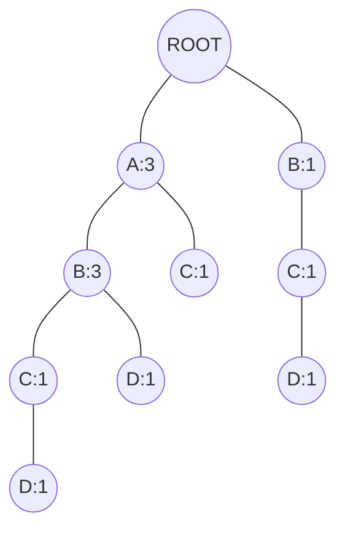
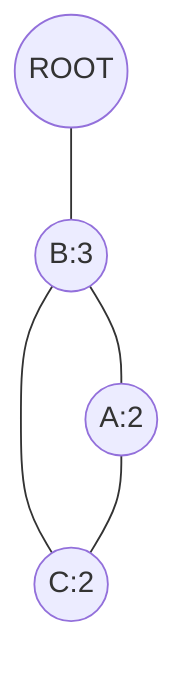
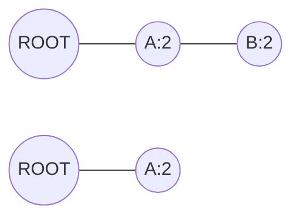

# 关联规则挖掘：发现数据中的隐藏关系

作者：禅与计算机程序设计艺术

## 1. 背景介绍

### 1.1 大数据时代的数据挖掘需求

在当今大数据时代,海量的数据正以前所未有的速度不断产生和累积。然而,真正有价值的信息往往隐藏在这些看似杂乱无章的数据之中。如何从海量数据中发现有用的信息和知识,已经成为各行各业面临的重要课题。数据挖掘技术应运而生,它可以帮助我们从大规模数据中自动或半自动地发现先前未知的、有趣的、可解释的且有实际价值的模式和知识。

### 1.2 关联规则挖掘的重要性

在众多数据挖掘技术中,**关联规则挖掘**(Association Rule Mining)是一种重要而常用的方法。它旨在从大规模事务数据集中发掘项之间有趣的关联关系或相关性。通过关联规则挖掘,我们可以发现隐藏在数据背后的有价值信息,如购物篮分析、商品推荐、医疗诊断、Web 日志分析等。

### 1.3 关联规则挖掘的应用领域

关联规则挖掘在零售、电商、金融、医疗、社交网络等诸多领域有着广泛应用,为企业和机构提供有力的决策支持。例如:

- 零售业:通过分析消费者的购物篮数据,发现商品之间的关联规则,进行商品的优化布局和捆绑销售。
- 电商平台:利用用户浏览、收藏、购买的历史数据,发掘用户的购买模式,实现个性化商品推荐。  
- 金融领域:在银行信贷、信用卡交易数据中挖掘风险关联规则,评估客户信用,预防金融欺诈。
- 医疗健康:分析电子病历数据,发现疾病的并发症和用药关联模式,辅助临床诊断与治疗。
- 社交网络:挖掘用户之间的社交关系,发现用户群体的共同兴趣爱好,进行精准营销。

本文将全面介绍关联规则挖掘的基本概念、核心算法、数学模型、代码实践、应用场景等,帮助读者系统地掌握这一强大的数据挖掘技术。

## 2. 核心概念与联系

### 2.1 关联规则的定义与表示

关联规则是一种用于描述数据项之间有趣关联关系的知识表示形式。形式化地,关联规则可表示为蕴含式 $X \Rightarrow Y$,其中 $X$ 和 $Y$ 是两个不相交的项集,分别称为前件(antecedent)和后件(consequent)。该规则表示在包含项集 $X$ 的事务中,往往也会包含项集 $Y$。

一些常用的概念:

- **项(item)**: 数据的基本单元,通常表示一个商品、特征或属性。用小写字母 $a, b, c$ 等表示。   
- **项集(itemset)**: 项的集合,用大写字母 $X, Y, Z$ 等表示。$k$-项集表示包含 $k$ 个项的项集。  
- **事务(transaction)**: 包含一组项的集合,通常对应数据库中的一条记录或一个样本。
- **事务数据库(transactional database)**: 包含大量事务的数据集合。

Table 1 是一个事务数据库示例:

|TID|Items|
|---|-----|
|T1 |{A,B}|
|T2 |{B,C,D}|  
|T3 |{A,B,D}|
|T4 |{A,B,C}|
|T5 |{A,C,D}|

### 2.2 关联规则的评价指标  

为了评估关联规则的有趣程度和实用价值,引入了一些重要指标:

1. **支持度(support)**:  

   项集 $X$ 的支持度 $sup(X)$ 定义为包含 $X$ 的事务占总事务数的比例。如果 $sup(X) \geq min\_sup$,则称 $X$ 为频繁项集。同样,关联规则 $X \Rightarrow Y$ 的支持度为包含 $X \cup Y$ 的事务占总事务数的比例。

   $sup(X \Rightarrow Y) = \frac{|X \cup Y|}{N}$

2. **置信度(confidence)**: 

   关联规则 $X \Rightarrow Y$ 的置信度 $conf(X \Rightarrow Y)$ 定义为包含 $X$ 的事务中,同时也包含 $Y$ 的事务所占的比例。即在先决条件 $X$ 出现的情况下,后续 $Y$ 出现的概率。
   
   $conf(X \Rightarrow Y) = \frac{sup(X \cup Y)}{sup(X)}$

3. **提升度(lift)**:  

   提升度衡量了 $X$ 与 $Y$ 的相关性。提升度大于1表示正相关,小于1表示负相关,等于1表示两者独立。

   $lift(X \Rightarrow Y) = \frac{sup(X \cup Y)}{sup(X) \times sup(Y)}$ 

### 2.3 频繁项集与关联规则生成

关联规则挖掘通常分为两个主要步骤:

1. **频繁项集生成**: 找到满足最小支持度阈值的所有频繁项集。这个步骤是关联规则挖掘的基础和核心,计算开销也最大。
2. **关联规则生成**: 由频繁项集生成满足最小置信度的强关联规则。通过频繁项集可以直接计算每个关联规则的支持度和置信度。

频繁项集挖掘是整个挖掘过程的瓶颈,后面将重点介绍几种经典的频繁项集挖掘算法。

## 3. 核心算法原理与操作步骤

### 3.1 Apriori算法

Apriori算法是关联规则挖掘中最经典和应用最广泛的算法。它基于一个先验原理:频繁项集的所有非空子集必然也是频繁的。利用这一性质,Apriori 算法使用逐层搜索的迭代方法来挖掘所有频繁项集。

#### 3.1.1 算法流程

1. **连接步**: 产生 $k$ 项候选集 $C_k$。将频繁 $(k-1)$-项集 $L_{k-1}$ 与自身连接,得到候选 $k$-项集 $C_k$。   

2. **剪枝步**: 删除 $C_k$ 中的非频繁项集。根据先验原理,若 $C_k$ 的某个 $(k-1)$-子集不在 $L_{k-1}$ 中,则该候选集不可能是频繁的,将其删去。 

3. **支持度计数**: 扫描事务数据库 $D$,计算 $C_k$ 中每个候选项集的支持度计数。

4. **频繁项集生成**: 将支持度不小于 $min\_sup$ 的候选项集加入 $L_k$。  

5. 重复以上步骤,直到无法再生成新的频繁项集。所有频繁项集的并集即为最终结果。

#### 3.1.2 算法优化

Apriori算法存在一些性能瓶颈,如需要多次扫描数据库、产生大量候选项集等。一些常用的优化策略包括:

- **哈希树与剪枝**: 使用哈希技术来快速计数,并在生成候选集时提前剪枝。
- **事务压缩**: 去除非频繁项,缩短事务,减少扫描时间。 
- **分割conquered**: 将数据集划分为多个分区,各自并行挖掘,再合并结果。
- **抽样**: 在数据子集上挖掘,再在完整数据上验证。
- **动态计数**: 在生成候选项集的同时计数支持度,减少扫描次数。

### 3.2 FP-growth算法

FP-growth算法不生成候选项集,只需扫描数据库两遍即可挖掘所有频繁项集,大大提高了效率。其核心数据结构是 FP-tree(频繁模式树),可以高度压缩数据集。

#### 3.2.1 算法流程

1. 扫描数据库,得到每个项的支持度计数,去掉非频繁的1-项集。   

2. 根据支持度降序对频繁项排序,扫描数据库构建 FP-tree。对每个事务,先按项的支持度降序排序,再将事务压缩插入 FP-tree。   

3. 对 FP-tree 进行挖掘。从频繁1-项集开始,不断构建各频繁项的**条件模式基(conditional pattern base)**和**条件FP树(conditional FP-tree)**,递归挖掘各条件FP树,得到所有频繁项集。

#### 3.2.2 FP-tree 结构与构建

FP-tree 是一个带头表的前缀树结构,包含一个空根节点和众多前缀子树。树中每个节点包含三个域:项名称、支持度计数、节点链接。

1. 创建空根节点。 
2. 对每个事务,防止支持度降序排序其频繁项。以此次序逐一将各项插入树中。   
- 若当前项与某已有分支的前缀路径匹配,则支持度计数加1;
- 否则,创建一个新分支节点,支持度置1。  
3. 在头表中登记各频繁项,并用节点链接将相同项的节点穿起来,便于快速访问。

Example 1. 构建 FP-tree   

考虑 Table 1 所示的事务数据库,设最小支持度为2。首先,得到频繁1-项集及其支持度(Table 2):

|Item|Support count|
|----|-------------|
|A   |4          |
|B   |4            |
|C   |3            |
|D   |3            |

扫描事务数据库,构建FP-tree (Figure 1):   

#### 3.2.3 条件模式基与条件FP树

为了挖掘FP-tree,引入两个重要概念:

- **条件模式基**: 所有以某频繁项结尾的路径前缀集合。每个前缀的支持度等于其末尾项在这些路径中出现的次数。

- **条件FP树**: 以某频繁项为后缀的条件模式基所构成的FP树,支持度阈值等于原数据库的阈值。条件FP树可以递归地挖掘,避免生成候选集。

Example 2. 条件模式基与条件FP树挖掘  

基于Example 1构建的FP-tree,挖掘过程如下:  

首先,找出以项D结尾的所有前缀路径:
$\{\{A,B,C:1\},\{B,C:1\},\{A,B:1\}\}$  

D的条件模式基为:
$\{\{A:1,B:1,C:1\},\{B:1,C:1\},\{A:1,B:1\}\}$

由D的条件模式基构造条件FP树(Figure 2):

接着,可在该条件FP树上递归挖掘频繁模式:$\{B,D:3\},\{B,C,D:2\},\{A,B,D:2\},\{A,B,C,D:1\}$。

类似地,可得项 C 和 B 的条件FP树(Figure 3,4),完成所有频繁项集的挖掘。

最终得到的所有频繁项集为:
$\{A:4,B:4,C:3,D:3,AB:4,AC:3,AD:2,BC:2,BD:3,CD:2,ABC:2,ABD:2,ACD:1,BCD:2,ABCD:1\}$

## 4. 数学模型与公式详解

### 4.1 支持度与置信度的数学定义

给定事务数据库 $D$,令 $X,Y$ 为两个项集, $N$ 为数据库中事务总数。

- 项集 $X$ 的