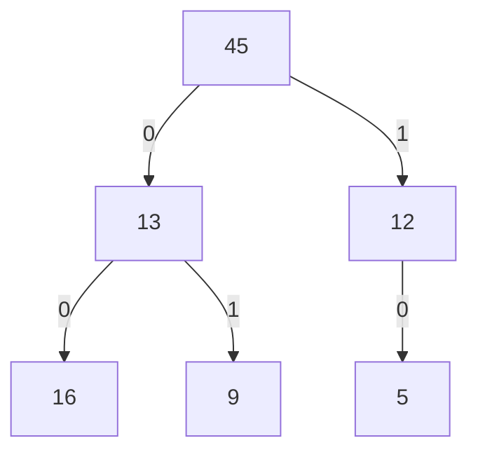

# 内存紧张?探讨Flink内存压缩和内存对象重用策略

作者：禅与计算机程序设计艺术

## 1. 背景介绍

### 1.1 Flink简介

Apache Flink 是一个用于分布式流处理和批处理的开源框架。它能够处理无界和有界数据流，提供高吞吐量、低延迟的数据流处理能力。Flink 的核心优势在于其强大的状态管理和容错机制，使其成为大数据处理领域的首选工具之一。

### 1.2 内存管理的重要性

在大数据处理环境中，内存管理是一个至关重要的方面。内存的有效使用直接影响到系统的性能和稳定性。尤其是在流处理框架中，数据流的无界性和高吞吐量要求系统具备高效的内存管理策略。

### 1.3 Flink的内存挑战

Flink 作为一个高性能的流处理框架，其内存管理面临着诸多挑战。主要包括：

- **内存消耗大**：处理大规模数据时，内存需求剧增。
- **垃圾回收频繁**：频繁的对象创建和销毁导致垃圾回收频繁，影响性能。
- **内存泄漏风险**：不当的内存管理可能导致内存泄漏，影响系统稳定性。

## 2. 核心概念与联系

### 2.1 内存压缩

内存压缩是一种通过减少数据在内存中的占用空间来提高内存利用率的技术。它通常包括数据压缩和对象压缩两种形式。数据压缩通过压缩算法减少数据体积，而对象压缩则通过减少对象头部信息和字段来节省内存。

### 2.2 内存对象重用

内存对象重用是指在程序运行过程中重复使用已经分配的对象，而不是每次都创建新的对象。这种策略可以减少垃圾回收的频率，提高内存利用效率。

### 2.3 Flink中的内存管理策略

Flink 在内存管理方面采用了多种策略，包括：

- **内存分配与释放**：Flink 对内存的分配和释放进行了优化，以减少垃圾回收的影响。
- **内存池化**：通过内存池化技术，Flink 能够重用内存对象，减少内存分配和释放的开销。
- **内存压缩**：Flink 通过数据压缩和对象压缩技术，减少内存占用，提高内存利用率。

## 3. 核心算法原理具体操作步骤

### 3.1 内存压缩算法

#### 3.1.1 数据压缩算法

数据压缩算法是通过减少数据的冗余来降低其存储空间的技术。常见的算法包括：

- **Huffman 编码**：一种基于频率的无损压缩算法。
- **LZ77**：一种基于滑动窗口的无损压缩算法。
- **Snappy**：一种高效的压缩算法，广泛应用于大数据处理。

#### 3.1.2 对象压缩算法

对象压缩算法主要通过减少对象头部信息和字段来节省内存。常见的方法包括：

- **对象池化**：将相同类型的对象放入池中，重复使用。
- **对象内联**：将小对象直接嵌入到其包含对象中，减少对象头部开销。

### 3.2 内存对象重用策略

#### 3.2.1 对象池化

对象池化是一种通过维护对象池来重用对象的技术。其步骤包括：

1. **对象创建**：当需要一个新对象时，首先检查对象池中是否有可用对象。
2. **对象获取**：如果有可用对象，则从池中获取；否则，创建一个新对象。
3. **对象释放**：使用完对象后，将其放回对象池中，以备下次使用。

#### 3.2.2 对象内联

对象内联是一种通过将小对象嵌入其包含对象中来减少内存开销的技术。其步骤包括：

1. **对象分析**：分析对象结构，确定哪些小对象可以内联。
2. **对象重构**：将小对象的字段直接嵌入包含对象中，减少对象头部开销。

## 4. 数学模型和公式详细讲解举例说明

### 4.1 数据压缩的数学模型

数据压缩的效率可以通过压缩比来衡量，压缩比定义如下：

$$
\text{Compression Ratio} = \frac{\text{Original Size}}{\text{Compressed Size}}
$$

压缩比越大，表示压缩效果越好。

### 4.2 对象池化的数学模型

对象池化的效率可以通过内存利用率来衡量，内存利用率定义如下：

$$
\text{Memory Utilization} = \frac{\text{Used Memory}}{\text{Allocated Memory}}
$$

内存利用率越高，表示内存使用越高效。

### 4.3 示例：Huffman 编码

假设有一组字符及其出现频率，如下表所示：

| 字符 | 频率 |
|------|------|
| A    | 45   |
| B    | 13   |
| C    | 12   |
| D    | 16   |
| E    | 9    |
| F    | 5    |

通过 Huffman 编码，可以构建如下编码树：



编码结果如下：

| 字符 | 编码 |
|------|------|
| A    | 0    |
| B    | 10   |
| C    | 11   |
| D    | 100  |
| E    | 101  |
| F    | 110  |

## 5. 项目实践：代码实例和详细解释说明

### 5.1 数据压缩示例

以下是一个使用 Snappy 压缩算法的示例代码：

```java
import org.xerial.snappy.Snappy;

public class SnappyCompressionExample {
    public static void main(String[] args) {
        try {
            String input = "This is a sample string to be compressed";
            byte[] compressed = Snappy.compress(input.getBytes("UTF-8"));
            byte[] uncompressed = Snappy.uncompress(compressed);

            System.out.println("Original: " + input);
            System.out.println("Compressed: " + new String(compressed, "UTF-8"));
            System.out.println("Uncompressed: " + new String(uncompressed, "UTF-8"));
        } catch (Exception e) {
            e.printStackTrace();
        }
    }
}
```

### 5.2 对象池化示例

以下是一个简单的对象池化示例代码：

```java
import java.util.concurrent.ConcurrentLinkedQueue;

public class ObjectPool<T> {
    private ConcurrentLinkedQueue<T> pool = new ConcurrentLinkedQueue<>();
    private int maxSize;

    public ObjectPool(int maxSize) {
        this.maxSize = maxSize;
    }

    public T borrowObject() {
        T object = pool.poll();
        if (object == null) {
            // Create a new object if pool is empty
            object = createNewObject();
        }
        return object;
    }

    public void returnObject(T object) {
        if (pool.size() < maxSize) {
            pool.offer(object);
        }
    }

    private T createNewObject() {
        // Implement object creation logic
        return null;
    }
}
```

## 6. 实际应用场景

### 6.1 大规模数据处理

在大规模数据处理场景中，内存压缩和对象重用策略可以显著提高系统的内存利用率和性能。例如，在实时数据流处理系统中，内存压缩可以减少数据在内存中的占用空间，提高系统的吞吐量。

### 6.2 高并发应用

在高并发应用场景中，对象池化策略可以减少对象的创建和销毁频率，降低垃圾回收的开销，从而提高系统的响应速度和稳定性。

### 6.3 数据库缓存

在数据库缓存场景中，内存压缩和对象重用策略可以有效减少缓存数据的内存占用，提高缓存命中率和系统性能。

## 7. 工具和资源推荐

### 7.1 内存分析工具

- **VisualVM**：一个集成的性能分析工具，可以用于监控和分析 Java 应用的内存使用情况。
- **YourKit**：一个强大的性能分析工具，提供详细的内存分析和垃圾回收分析功能。

### 7.2 压缩库

- **Snappy**：一个高效的压缩库，适用于大数据处理场景。
- **LZ