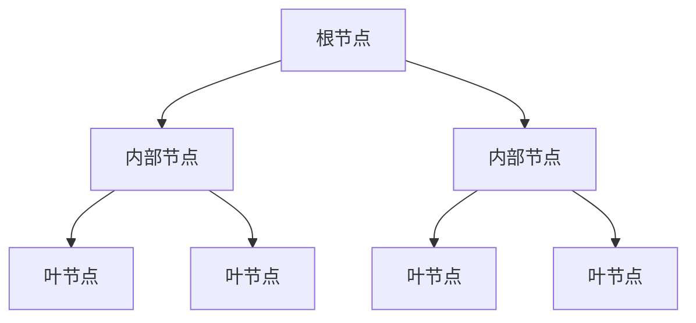

# 决策树算法的奥秘:从零开始理解

## 1.背景介绍

### 1.1 什么是决策树算法?

决策树算法是一种常用的机器学习算法,属于监督学习中的分类算法。它通过构建一个树状结构模型,根据特征属性的不同取值对实例进行分类。决策树模型具有可解释性强、可视化、处理数值型和类别型数据等优点,被广泛应用于金融风控、医疗诊断、广告推荐等领域。

### 1.2 决策树算法的发展历程

决策树算法最早可追溯到20世纪60年代,当时主要应用于决策理论领域。20世纪后期,随着机器学习和数据挖掘的兴起,决策树算法被引入并大量使用。经典的决策树算法有ID3、C4.5和CART等。近年来,随着数据量的爆炸式增长和计算能力的提高,决策树算法也不断得到改进和优化。

## 2.核心概念与联系  

### 2.1 决策树模型

决策树是一种树状结构模型,由节点(node)和分支(branch)组成。根节点(root node)代表对整个样本集合做判断,内部节点(internal node)代表对样本子集做判断,叶节点(leaf node)给出实例的分类结果。



### 2.2 信息增益与增益率

决策树算法的核心是选择最优特征进行分裂,这需要一个度量标准来评估分裂的效果。常用的度量标准有信息增益(Information Gain)和增益率(Gain Ratio)。

信息增益衡量获得信息的增量,定义为:

$$\text{Gain}(S, A) = \text{Ent}(S) - \sum_{v\in\text{Values}(A)} \frac{|S_v|}{|S|} \text{Ent}(S_v)$$

其中$\text{Ent}(S)$是集合$S$的熵,反映了$S$的纯度。

增益率在信息增益的基础上,对可取值数目较多的特征有一定惩罚,定义为:

$$\text{GainRatio}(S, A) = \frac{\text{Gain}(S, A)}{\text{IV}(A)}$$

其中$\text{IV}(A)$是特征$A$的固有值(Intrinsic Value)。

### 2.3 决策树算法分类

按生成树的方式,主要有:

- ID3: 使用信息增益作为特征选择标准,容易过拟合
- C4.5: 在ID3基础上使用增益率,能处理连续值和缺失值
- CART: 生成二叉树,适用于分类和回归任务

按树的类型,主要有:

- 分类树: 叶节点给出实例类别
-回归树: 叶节点给出实例数值

## 3.核心算法原理具体操作步骤

我们以经典的ID3算法为例,介绍决策树的生成过程:

输入:训练数据集$D$,特征集$A$

输出:决策树$T$

1) 创建根节点
2) 对于根节点:
    a. 若$D$中所有实例属于同一类别$C$,则将根节点标记为$C$,返回
    b. 若$A$为空,则将根节点标记为$D$中实例数最多的类别,返回
    c. 否则,计算每个特征的信息增益,选择信息增益最大的特征$A_g$
3) 以$A_g$为根节点,对其每个值$a_i$:
    a. 分割$D$为若干非空子集$D_i$
    b. 以$D_i$为训练集,递归调用步骤1),构建子树
4) 返回决策树$T$

该算法的核心步骤是选择最优特征进行分裂,通过递归的方式生成整棵决策树。

## 4.数学模型和公式详细讲解举例说明

### 4.1 信息熵

信息熵(Entropy)反映了随机变量的不确定性,定义为:

$$\text{Ent}(X) = -\sum_{i=1}^{n}p_i\log_2p_i$$

其中$p_i$是随机变量$X$取值为$x_i$的概率。

对于一个数据集$D$,设有$K$个类别,每个类别$C_k$有$p_k$个实例,则$D$的信息熵为:

$$\text{Ent}(D) = -\sum_{k=1}^{K}\frac{|C_k|}{|D|}\log_2\frac{|C_k|}{|D|}$$

熵越大,纯度越低;熵为0,表示集合中所有实例属于同一类别。

例如,设有10个实例,其中正例5个,负例5个,则熵为:

$$\text{Ent}(D) = -\frac{5}{10}\log_2\frac{5}{10} - \frac{5}{10}\log_2\frac{5}{10} = 1$$

### 4.2 信息增益

信息增益(Information Gain)衡量使用某个特征进行分裂所获得的信息增量。

对于特征$A$,假设其可取值为$\{a_1, a_2, \dots, a_V\}$,根据$A$的不同值将$D$分割为$\{D_1, D_2, \dots, D_V\}$,则$A$对$D$的信息增益为:

$$\begin{align*}
\text{Gain}(D, A) &= \text{Ent}(D) - \sum_{j=1}^{V}\frac{|D_j|}{|D|}\text{Ent}(D_j)\\
                 &= \text{Ent}(D) - \sum_{j=1}^{V}\frac{|D_j|}{|D|}\left(-\sum_{k=1}^{K}\frac{|D_{jk}|}{|D_j|}\log_2\frac{|D_{jk}|}{|D_j|}\right)
\end{align*}$$

其中$D_{jk}$表示属于第$k$类的实例子集。

信息增益越大,使用该特征分裂后,纯度提高得越多。

例如,设有10个样本,特征$A$有两个值$\{a_1, a_2\}$,分裂后数据如下:

| $A$ | 正例 | 负例 |
|-----|------|------|
| $a_1$ | 3    | 2    |
| $a_2$ | 2    | 3    |

则特征$A$的信息增益为:

$$\begin{align*}
\text{Gain}(D, A) &= 1 - \left(\frac{5}{10}\left(-\frac{3}{5}\log_2\frac{3}{5} - \frac{2}{5}\log_2\frac{2}{5}\right) + \frac{5}{10}\left(-\frac{2}{5}\log_2\frac{2}{5} - \frac{3}{5}\log_2\frac{3}{5}\right)\right)\\
                  &= 0.971
\end{align*}$$

### 4.3 增益率

增益率(Gain Ratio)在信息增益的基础上,对可取值数目较多的特征有一定惩罚,定义为:

$$\text{GainRatio}(D, A) = \frac{\text{Gain}(D, A)}{\text{IV}(A)}$$

其中$\text{IV}(A)$是特征$A$的固有值(Intrinsic Value),表示对$A$进行编码所需的平均信息量,定义为:

$$\text{IV}(A) = -\sum_{j=1}^{V}\frac{|D_j|}{|D|}\log_2\frac{|D_j|}{|D|}$$

增益率实际上是对信息增益进行了一种归一化处理,避免由于特征取值过多而偏向选择该特征。

例如,假设上例中的特征$A$有3个取值$\{a_1, a_2, a_3\}$,数据分布如下:

| $A$ | 正例 | 负例 |
|-----|------|------|
| $a_1$ | 3    | 2    |
| $a_2$ | 1    | 2    | 
| $a_3$ | 1    | 1    |

则$A$的固有值为:

$$\text{IV}(A) = -\frac{5}{10}\log_2\frac{5}{10} - \frac{3}{10}\log_2\frac{3}{10} - \frac{2}{10}\log_2\frac{2}{10} = 1.557$$

增益率为:

$$\text{GainRatio}(D, A) = \frac{0.971}{1.557} = 0.624$$

## 4.项目实践:代码实例和详细解释说明

下面给出一个使用Python和Scikit-learn库实现的决策树分类器示例:

```python
from sklearn.datasets import load_iris
from sklearn.tree import DecisionTreeClassifier
from sklearn.model_selection import train_test_split
from sklearn.metrics import accuracy_score

# 加载iris数据集
iris = load_iris()
X, y = iris.data, iris.target

# 划分训练测试集
X_train, X_test, y_train, y_test = train_test_split(X, y, test_size=0.2, random_state=42)

# 创建决策树分类器
clf = DecisionTreeClassifier(criterion='gini', max_depth=3)

# 训练模型
clf.fit(X_train, y_train)

# 预测测试集
y_pred = clf.predict(X_test)

# 计算准确率
accuracy = accuracy_score(y_test, y_pred)
print(f'Accuracy: {accuracy:.2f}')
```

这个示例使用了著名的iris数据集,创建了一个最大深度为3的决策树分类器,并计算了模型在测试集上的准确率。

其中`criterion`参数指定了用于选择特征的指标,可选`gini`(基尼系数)或`entropy`(信息增益)。`max_depth`参数限制了树的最大深度,以防止过拟合。

我们可以通过`clf.feature_importances_`查看各特征的重要性,通过`export_graphviz`函数导出树的可视化结构。

```python
import graphviz

# 导出决策树可视化
dot_data = export_graphviz(clf, out_file=None,
                            feature_names=iris.feature_names,
                            class_names=iris.target_names,
                            filled=True, rounded=True)

graph = graphviz.Source(dot_data)
graph.render("iris_tree")
```

上述代码会生成一个`iris_tree.pdf`文件,其中展示了决策树的结构。

## 5.实际应用场景

决策树算法由于其简单性和可解释性,在各个领域都有广泛应用,包括但不限于:

### 5.1 金融风控

在信用卡欺诈检测、贷款审批等场景中,决策树能够根据客户的历史信息(如年龄、收入、信用记录等)对客户的违约风险进行评估,为风控决策提供参考。

### 5.2 医疗诊断

利用患者的症状、体征、检查结果等特征,决策树可以对疾病进行诊断,辅助医生做出判断。在一些紧急情况下,快速诊断至关重要。

### 5.3 营销策略

通过分析顾客的人口统计学特征、购买习惯,决策树可以对顾客进行细分,制定个性化的营销策略,提高营销效果。

### 5.4 图像识别

决策树也可以应用于图像识别领域,将图像特征(如颜色、纹理等)输入决策树模型,对图像进行分类。

## 6.工具和资源推荐  

### 6.1 流行的机器学习库

- Scikit-learn: Python中常用的机器学习库,提供了决策树的实现
- XGBoost: 一种高效的梯度提升树算法库,在很多竞赛中表现优异
- LightGBM: 另一种高效的梯度提升树框架,对内存使用较少

### 6.2 可视化工具

- Graphviz: 开源的图形可视化软件,可用于展示决策树结构
- Orange: 一款开源的数据挖掘和机器学习工具,提供了直观的决策树可视化界面

### 6.3 在线学习资源

- 《机器学习》(Mitchell): 经典的机器学习入门教材,对决策树算法有较为详细的介绍
- 《模式分类》(Duda等): 经典的模式识别教材,包含了决策树的数学理论基础
- 机器学习课程(吴恩达、林轩田等): 在Coursera、网易云课堂等MOOC平台上的热门公开课

## 7.总结:未来发展趋势与挑战

决策树算法虽然具有可解释性强、简单高效等优点,但也存在一些缺陷和挑战:

- 容易过