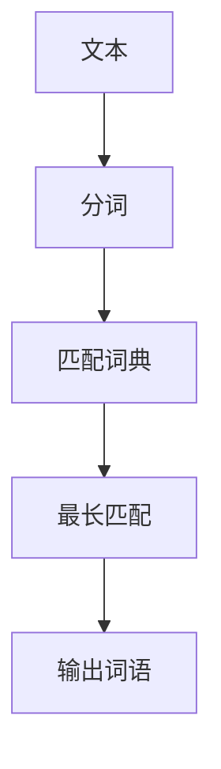
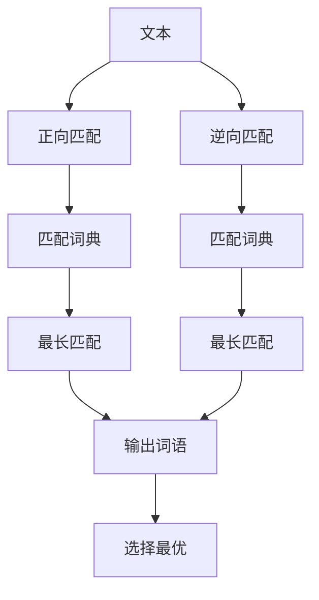
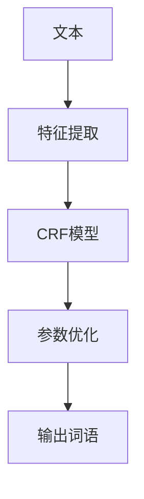
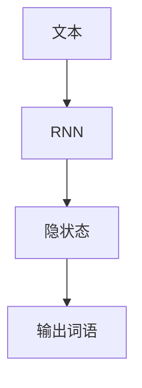
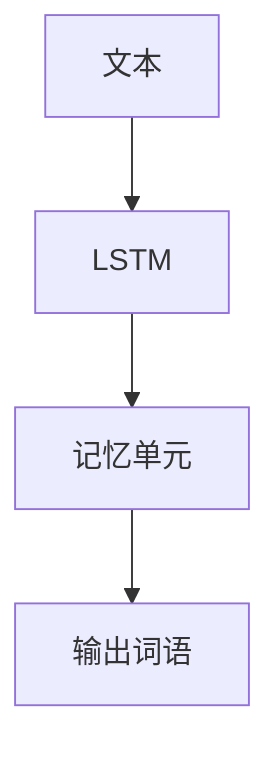
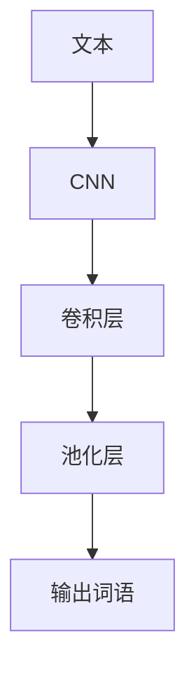

# 分词算法在网络舆情分析中的应用探索

作者：禅与计算机程序设计艺术

## 1. 背景介绍

### 1.1 网络舆情分析的意义

网络舆情分析是指通过对互联网海量信息的采集、处理和分析，及时掌握公众对某一事件、人物或现象的看法和态度。随着互联网的普及，社交媒体、新闻网站、论坛等平台上每天都会产生大量的文本数据，这些数据中蕴含着丰富的舆情信息。通过有效的舆情分析，可以帮助政府、企业和个人更好地了解公众的情绪和意见，从而做出更为科学和合理的决策。

### 1.2 分词算法的作用

在进行网络舆情分析时，文本数据的预处理是一个至关重要的环节。由于中文文本没有明显的单词边界，分词成为文本预处理的首要步骤。分词算法的质量直接影响后续的情感分析、主题识别和趋势预测等任务的效果。本文将深入探讨分词算法在网络舆情分析中的应用，介绍其核心概念、算法原理、数学模型、实际应用场景以及未来的发展趋势。

## 2. 核心概念与联系

### 2.1 分词的定义

分词是指将连续的文本字符串按照一定的规则切分成一个个独立的词语的过程。在中文处理中，分词是基础性工作，因为中文文本中词与词之间没有空格分隔，直接进行文本分析会遇到很多困难。

### 2.2 网络舆情分析的流程

网络舆情分析通常包括以下几个步骤：

1. 数据采集：从互联网中获取大量的文本数据。
2. 数据预处理：包括分词、去除停用词、词性标注等。
3. 情感分析：分析文本的情感倾向，如正面、负面或中性。
4. 主题识别：识别文本中讨论的主要话题。
5. 趋势预测：根据历史数据预测未来的舆情走势。

### 2.3 分词与舆情分析的关系

分词是舆情分析的基础步骤，分词的准确性直接影响后续的情感分析和主题识别的效果。高质量的分词可以提高文本特征提取的准确性，从而提升整个舆情分析系统的性能。

## 3. 核心算法原理具体操作步骤

### 3.1 基于规则的分词算法

基于规则的分词算法主要通过预定义的词典和规则进行分词。常见的方法包括正向最大匹配（MM）、逆向最大匹配（RMM）和双向最大匹配（BMM）。

#### 3.1.1 正向最大匹配（MM）

正向最大匹配算法从左到右扫描文本，尽可能匹配最长的词语。

#### 3.1.2 逆向最大匹配（RMM）

逆向最大匹配算法从右到左扫描文本，尽可能匹配最长的词语。

#### 3.1.3 双向最大匹配（BMM）

双向最大匹配算法结合正向和逆向匹配的结果，选择分词结果最优的一种。

### 3.2 基于统计的分词算法

基于统计的分词算法利用机器学习和统计模型，通过大量的训练数据自动学习分词规则。常见的方法包括隐马尔可夫模型（HMM）和条件随机场（CRF）。

#### 3.2.1 隐马尔可夫模型（HMM）

隐马尔可夫模型是一种统计模型，通过观察序列推断隐藏的状态序列。HMM在分词中的应用包括状态转移概率和观测概率的计算。

$$
P(O| \lambda) = \sum_{all \, Q} P(O|Q, \lambda) P(Q| \lambda)
$$

#### 3.2.2 条件随机场（CRF）

条件随机场是一种无向图模型，通过定义特征函数来建模序列数据。CRF在分词中的应用包括特征提取和参数优化。

### 3.3 基于深度学习的分词算法

基于深度学习的分词算法利用神经网络模型，通过大量的训练数据自动学习分词规则。常见的方法包括循环神经网络（RNN）、长短期记忆网络（LSTM）和卷积神经网络（CNN）。

#### 3.3.1 循环神经网络（RNN）

RNN是一种能够处理序列数据的神经网络，通过隐状态传递信息。RNN在分词中的应用包括输入序列的编码和输出序列的解码。

#### 3.3.2 长短期记忆网络（LSTM）

LSTM是一种改进的RNN，通过引入记忆单元解决长距离依赖问题。LSTM在分词中的应用包括输入序列的编码和输出序列的解码。

#### 3.3.3 卷积神经网络（CNN）

CNN是一种能够提取局部特征的神经网络，通过卷积层和池化层进行特征提取。CNN在分词中的应用包括输入序列的特征提取和输出序列的生成。

## 4. 数学模型和公式详细讲解举例说明

### 4.1 隐马尔可夫模型（HMM）

隐马尔可夫模型由初始状态概率、状态转移概率和观测概率组成。在分词中，我们可以将词语视为隐藏状态，将字符视为观测值。

$$
P(O| \lambda) = \sum_{all \, Q} P(O|Q, \lambda) P(Q| \lambda)
$$

其中，$O$ 表示观测序列，$Q$ 表示隐藏状态序列，$\lambda$ 表示模型参数。

#### 4.1.1 初始状态概率

初始状态概率表示序列开始时处于某个状态的概率。

$$
\pi_i = P(q_1 = S_i)
$$

#### 4.1.2 状态转移概率

状态转移概率表示从一个状态转移到另一个状态的概率。

$$
A_{ij} = P(q_{t+1} = S_j | q_t = S_i)
$$

#### 4.1.3 观测概率

观测概率表示在某个状态下观测到某个值的概率。

$$
B_j(k) = P(O_t = v_k | q_t = S_j)
$$

### 4.2 条件随机场（CRF）

条件随机场通过特征函数来建模序列数据。在分词中，我们可以定义特征函数来描述字符之间的关系。

$$
P(Y|X) = \frac{1}{Z(X)} \exp \left( \sum_{k} \lambda_k f_k(Y, X) \right)
$$

其中，$Y$ 表示标签序列，$X$ 表示观测序列，$\lambda_k$ 表示特征函数的权重，$f_k$ 表示特征函数，$Z(X)$ 表示归一化因子。

#### 4.2.1 特征函数

特征函数用于描述观测序列和标签序列之间的关系。

$$
f_k(Y, X) = \sum_{t} f_k(y_{