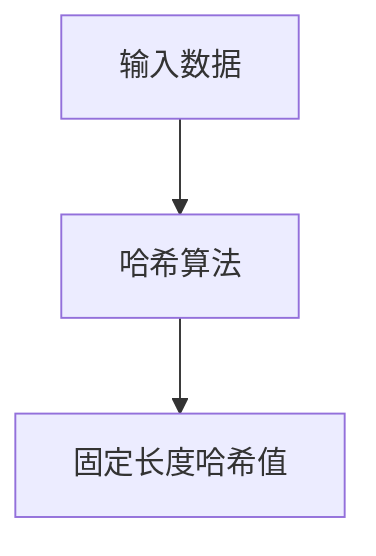
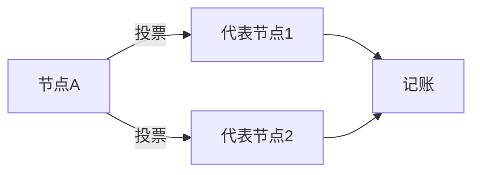

# 区块链与数据可信原理与代码实战案例讲解

作者：禅与计算机程序设计艺术

## 1. 背景介绍

### 1.1 区块链的起源与发展

区块链技术的起源可以追溯到2008年，当时中本聪（Satoshi Nakamoto）发表了一篇论文《比特币：一种点对点的电子现金系统》，提出了一种去中心化的数字货币系统。比特币的成功不仅引起了金融界的关注，也让区块链这一底层技术逐渐进入大众视野。区块链技术的发展迅速，从最初的比特币区块链到现在的以太坊、超级账本等多种区块链平台，区块链技术已经在多个领域得到应用。

### 1.2 数据可信的概念与重要性

在信息化社会中，数据的可信性至关重要。数据可信性不仅关系到数据的准确性和完整性，还关系到数据的来源和不可篡改性。传统的数据存储和传输方式难以保证数据的绝对可信，数据篡改和伪造的问题时有发生。区块链技术通过其独特的分布式账本和共识机制，为数据的可信性提供了一种全新的解决方案。

### 1.3 区块链在数据可信中的应用

区块链技术在数据可信领域的应用主要体现在以下几个方面：
- **数据不可篡改性**：区块链通过链式结构和哈希算法，确保数据一旦写入区块链，就无法被篡改。
- **数据透明性**：区块链的公开账本使得数据的变更可以被所有参与者追踪和验证。
- **数据安全性**：区块链的分布式存储和加密技术提高了数据的安全性，降低了数据被篡改和泄露的风险。
- **数据溯源性**：区块链可以记录数据的完整生命周期，从而实现数据的全程溯源。

## 2. 核心概念与联系

### 2.1 区块链的基本概念

#### 2.1.1 区块

区块是区块链的基本组成单元，每个区块包含若干条交易记录和一个指向前一个区块的哈希值。区块由区块头和区块体组成，区块头包含区块的元数据，如时间戳、前一个区块的哈希值和默克尔根等，区块体则包含具体的交易数据。

#### 2.1.2 链

链是由区块按照时间顺序依次连接而成的结构。每个区块通过其头部的哈希值指向前一个区块，从而形成一条不可篡改的链条。链的结构确保了数据的完整性和不可篡改性。

#### 2.1.3 共识机制

共识机制是区块链系统中各节点达成一致的协议。常见的共识机制包括工作量证明（PoW）、权益证明（PoS）、委托权益证明（DPoS）等。共识机制的设计直接影响区块链系统的安全性、性能和去中心化程度。

### 2.2 数据可信的核心概念

#### 2.2.1 数据完整性

数据完整性指的是数据在传输和存储过程中没有被篡改或丢失。区块链通过其链式结构和哈希算法，确保数据一旦写入区块链，就无法被篡改，从而保证了数据的完整性。

#### 2.2.2 数据透明性

数据透明性指的是数据的变更可以被所有参与者追踪和验证。区块链的公开账本使得所有参与者都可以查看和验证数据的变更，从而提高了数据的透明性。

#### 2.2.3 数据安全性

数据安全性指的是数据在存储和传输过程中不被未授权的用户访问和篡改。区块链通过加密技术和分布式存储，提高了数据的安全性，降低了数据被篡改和泄露的风险。

### 2.3 区块链与数据可信的联系

区块链技术通过其独特的分布式账本和共识机制，为数据的可信性提供了一种全新的解决方案。区块链的链式结构和哈希算法确保了数据的不可篡改性，公开账本提高了数据的透明性，加密技术和分布式存储提高了数据的安全性，从而实现了数据的全程溯源。

## 3. 核心算法原理具体操作步骤

### 3.1 哈希算法

哈希算法是区块链技术的基础，通过哈希算法可以将任意长度的数据映射为固定长度的哈希值。常见的哈希算法包括SHA-256、MD5等。在区块链中，哈希算法主要用于生成区块的哈希值和交易的哈希值，从而保证数据的完整性和不可篡改性。

#### 3.1.1 哈希算法的基本原理

哈希算法通过将输入数据进行一系列复杂的运算，生成一个固定长度的哈希值。哈希值具有以下几个特性：
- **固定长度**：无论输入数据的长度是多少，生成的哈希值长度都是固定的。
- **唯一性**：不同的输入数据生成的哈希值是不同的。
- **不可逆性**：无法通过哈希值反推出输入数据。
- **抗碰撞性**：很难找到两个不同的输入数据生成相同的哈希值。

#### 3.1.2 哈希算法在区块链中的应用

在区块链中，哈希算法主要用于以下几个方面：
- **生成区块哈希值**：每个区块包含前一个区块的哈希值，从而形成链式结构，保证数据的不可篡改性。
- **生成交易哈希值**：每笔交易在写入区块链之前都会生成一个哈希值，用于验证交易的完整性和不可篡改性。
- **生成默克尔树**：区块链中的交易数据通过哈希算法生成默克尔树，从而提高数据的验证效率。



### 3.2 共识机制

共识机制是区块链系统中各节点达成一致的协议。常见的共识机制包括工作量证明（PoW）、权益证明（PoS）、委托权益证明（DPoS）等。

#### 3.2.1 工作量证明（PoW）

工作量证明是一种通过计算复杂数学问题来达成共识的机制。节点需要进行大量的计算工作才能找到一个符合要求的哈希值，从而获得记账权。PoW的优点是安全性高，但缺点是计算量大，能源消耗高。

#### 3.2.2 权益证明（PoS）

权益证明是一种通过持有代币的数量和时间来达成共识的机制。节点根据其持有的代币数量和时间获得记账权。PoS的优点是能耗低，但缺点是可能导致富者愈富的情况。

#### 3.2.3 委托权益证明（DPoS）

委托权益证明是一种通过选举代表节点来达成共识的机制。代币持有者可以将其投票权委托给代表节点，由代表节点进行记账。DPoS的优点是效率高，但缺点是去中心化程度较低。



### 3.3 智能合约

智能合约是一种运行在区块链上的自执行程序，可以在满足特定条件时自动执行合约条款。智能合约通过编程语言编写，并部署在区块链上，具有自动化、透明和不可篡改的特点。

#### 3.3.1 智能合约的基本原理

智能合约通过编程语言编写，并部署在区块链上。合约条款在满足特定条件时自动执行，不需要第三方的干预。智能合约的执行结果记录在区块链上，具有透明和不可篡改的特点。

#### 3.3.2 智能合约的应用场景

智能合约可以应用于多个领域，如金融、供应链管理、物联网等。在金融领域，智能合约可以实现自动化的支付和结算；在供应链管理中，智能合约可以实现自动化的物流和库存管理；在物联网中，智能合约可以实现设备之间的自动化交互。

```mer