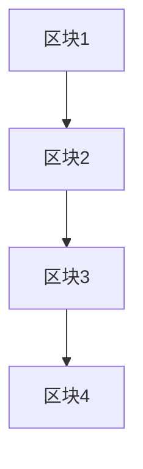

# 区块链与数据可信原理与代码实战案例讲解

作者：禅与计算机程序设计艺术

## 1.背景介绍

### 1.1 区块链的诞生与发展
区块链技术最早于2008年由中本聪在其比特币白皮书中提出。作为一种分布式账本技术，区块链通过去中心化、不可篡改和透明的特点，解决了传统中心化系统中信任和安全的问题。随着比特币的成功，区块链技术迅速扩展到其他领域，如金融、供应链、物联网等。

### 1.2 数据可信性的挑战
在现代数字社会中，数据的可信性是一个关键问题。传统的中心化数据管理方式容易受到单点故障、数据篡改和隐私泄露的威胁。区块链技术的出现为解决这些问题提供了一种新的思路，通过其独特的架构和共识机制，区块链可以确保数据的完整性和透明性，从而提升数据的可信性。

### 1.3 本文的目标
本文旨在深入探讨区块链技术在数据可信性方面的应用。我们将从区块链的核心概念、算法原理、数学模型、实际代码实现、应用场景、工具和资源等多个方面进行详细讲解，帮助读者全面理解区块链技术及其在数据可信性中的作用。

## 2.核心概念与联系

### 2.1 区块链的基本结构
区块链由一系列按时间顺序链接的区块组成。每个区块包含若干交易记录、前一个区块的哈希值和一个时间戳。区块链的基本结构如下图所示：



### 2.2 去中心化与共识机制
区块链的去中心化特性意味着没有单一的中央控制节点，所有节点都可以参与数据验证和记录。这种去中心化通过共识机制得以实现。常见的共识机制包括工作量证明（PoW）、权益证明（PoS）和委托权益证明（DPoS）等。

### 2.3 数据不可篡改性
区块链的不可篡改性源于其链式结构和哈希函数的应用。每个区块的哈希值不仅依赖于其自身的数据，还包括前一个区块的哈希值。因此，一旦某个区块的数据被篡改，其后的所有区块的哈希值都会发生变化，导致整个链条的断裂。

### 2.4 智能合约
智能合约是区块链上的一种特殊程序，它们可以在满足特定条件时自动执行预定义的操作。智能合约的引入使得区块链不仅仅是一个分布式账本，更成为一个去中心化的计算平台。

## 3.核心算法原理具体操作步骤

### 3.1 哈希函数
哈希函数是区块链技术的核心算法之一。哈希函数将任意长度的输入映射为固定长度的输出，并且具有抗碰撞性和单向性。常见的哈希算法包括SHA-256和SHA-3。

### 3.2 工作量证明（PoW）
工作量证明是一种通过计算复杂数学问题来验证交易的共识机制。其核心步骤如下：
1. 节点收集待验证的交易。
2. 节点计算一个满足特定条件的哈希值（即找到一个Nonce值，使得哈希值满足一定的前导零数量）。
3. 其他节点验证该哈希值的正确性。
4. 验证通过后，节点将区块添加到区块链中。

### 3.3 权益证明（PoS）
权益证明是另一种共识机制，其核心思想是通过持有的代币数量和持有时间来决定节点的记账权。其核心步骤如下：
1. 节点根据持有的代币数量和时间计算出权益。
2. 系统随机选择一个具有较高权益的节点进行记账。
3. 其他节点验证该节点的记账是否正确。
4. 验证通过后，节点将区块添加到区块链中。

## 4.数学模型和公式详细讲解举例说明

### 4.1 哈希函数
哈希函数 $H$ 将输入 $x$ 映射为固定长度的输出 $H(x)$。对于SHA-256算法，其输出长度为256位。哈希函数的数学性质包括：
- 抗碰撞性：对于任意不同的输入 $x_1$ 和 $x_2$，有 $H(x_1) \neq H(x_2)$。
- 单向性：给定 $y$，找到 $x$ 使得 $H(x) = y$ 是计算上不可行的。

### 4.2 工作量证明（PoW）
工作量证明的核心在于找到一个Nonce值 $n$，使得哈希值 $H(x || n)$ 满足特定的前导零数量 $d$。其数学公式如下：
$$
H(x || n) < 2^{256-d}
$$
其中，$x$ 为待验证的交易数据，$||$ 表示字符串连接操作，$d$ 为难度目标。

### 4.3 权益证明（PoS）
在权益证明中，节点的选择概率 $P_i$ 与其持有的代币数量 $s_i$ 和持有时间 $t_i$ 成正比。其数学公式如下：
$$
P_i = \frac{s_i \times t_i}{\sum_{j=1}^{N} s_j \times t_j}
$$
其中，$N$ 为系统中的总节点数。

### 4.4 智能合约的执行
智能合约的执行可以看作是一种状态转换函数 $f$，其输入为当前状态 $S$ 和交易 $T$，输出为新的状态 $S'$。其数学公式如下：
$$
S' = f(S, T)
$$
智能合约的执行过程确保了交易的自动化和透明性。

## 5.项目实践：代码实例和详细解释说明

### 5.1 基于Python的简单区块链实现

#### 5.1.1 区块类的定义
```python
import hashlib
import json
from time import time

class Block:
    def __init__(self, index, previous_hash, timestamp, data, hash):
        self.index = index
        self.previous_hash = previous_hash
        self.timestamp = timestamp
        self.data = data
        self.hash = hash

    def to_dict(self):
        return {
            'index': self.index,
            'previous_hash': self.previous_hash,
            'timestamp': self.timestamp,
            'data': self.data,
            'hash': self.hash
        }
```

#### 5.1.2 生成创世区块
```python
def create_genesis_block():
    return Block(0, "0", int(time()), "Genesis Block", calculate_hash(0, "0", int(time()), "Genesis Block"))

def calculate_hash(index, previous_hash, timestamp, data):
    value = str(index) + previous_hash + str(timestamp) + data
    return hashlib.sha256(value.encode('utf-8')).hexdigest()
```

#### 5.1.3 添加新块
```python
def create_new_block(previous_block, data):
    index = previous_block.index + 1
    timestamp = int(time())
    previous_hash = previous_block.hash
    hash = calculate_hash(index, previous_hash, timestamp, data)
    return Block(index, previous_hash, timestamp, data, hash)
```

### 5.2 智能合约示例

#### 5.2.1 基于Solidity的简单智能合约
```solidity
pragma solidity ^0.8.0;

contract SimpleStorage {
    uint256 public storedData;

    function set(uint256 x) public {
        storedData = x;
    }

    function get() public view returns (uint256) {
        return storedData;
    }
}
```

#### 5.2.2 部署和调用智能合约
```python
from web3 import Web3

# 连接到以太坊节点
web3 = Web3(Web3.HTTPProvider('http://localhost:8545'))

# 合约ABI和地址
abi = '[{"constant":false,"inputs":[{"name":"x","type":"uint256"}],"name":"set","outputs":[],"payable":false,"stateMutability":"nonpayable","type":"function"},{"constant":true,"inputs":[],"name":"get","outputs":[{"name":"","type":"uint256"}],"payable":false,"stateMutability":"view","type":"function"}]'
address = '0xYourContractAddress'

# 合约实例
contract = web3.eth.contract(address=address, abi=abi)

# 调用合约方法
tx_hash = contract.functions.set(42).transact({'from': web3.eth.accounts