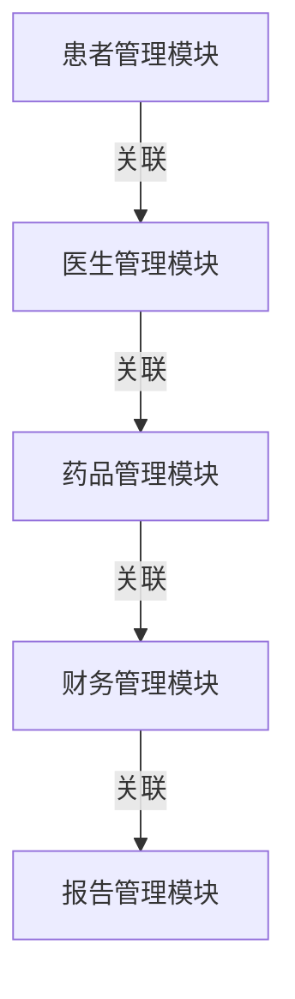

# 医院信息管理系统详细设计与具体代码实现

作者：禅与计算机程序设计艺术

## 1.背景介绍

### 1.1 医院信息管理系统的定义
医院信息管理系统（Hospital Information Management System, HIMS）是一种集成的系统，旨在管理医院的各类信息，包括患者数据、医疗记录、药品库存、财务信息等。HIMS的主要目标是提高医院的运营效率，提升医疗服务质量，确保患者数据的安全和隐私。

### 1.2 医院信息管理系统的重要性
随着医疗行业的数字化转型，HIMS在现代医院中的作用变得越来越重要。它不仅能够帮助医院实现信息化管理，还能提高医生的工作效率，减少医疗错误，改善患者体验。HIMS的应用能够显著提升医院的整体运营水平，推动医疗行业的发展。

### 1.3 目前医院信息管理系统的现状
目前，许多医院已经开始采用HIMS，但系统的成熟度和功能完备性参差不齐。一些医院的信息管理系统仍然存在数据孤岛、系统不兼容、用户界面不友好等问题。为了更好地满足医院的需求，开发一个功能全面、易于使用、安全可靠的HIMS显得尤为重要。

## 2.核心概念与联系

### 2.1 HIMS的基本组成部分
一个完整的HIMS通常包括以下几个核心模块：
- **患者管理模块**：用于管理患者的基本信息、医疗记录、预约信息等。
- **医生管理模块**：用于管理医生的基本信息、排班信息、工作记录等。
- **药品管理模块**：用于管理药品的库存、采购、使用记录等。
- **财务管理模块**：用于管理医院的财务信息，包括收费、报销、财务报表等。
- **报告管理模块**：用于生成各种统计报告，帮助医院进行数据分析和决策支持。

### 2.2 各模块之间的联系
各个模块之间的数据是相互关联的。例如，医生管理模块中的排班信息会影响患者管理模块中的预约信息；药品管理模块中的库存信息会影响医生的处方开具。因此，HIMS需要一个强大的数据管理和通信机制，确保各模块之间的数据能够实时同步、无缝衔接。

### 2.3 数据安全与隐私保护
在HIMS中，数据安全与隐私保护是至关重要的。系统需要采用多层次的安全措施，包括数据加密、访问控制、日志审计等，确保患者的敏感信息不会被泄露或篡改。

## 3.核心算法原理具体操作步骤

### 3.1 数据存储与管理
HIMS中的数据存储通常采用关系型数据库，如MySQL、PostgreSQL等。数据表的设计需要充分考虑到各模块之间的关联性和数据一致性。



### 3.2 数据同步与通信
为了实现各模块之间的数据同步，HIMS需要一个高效的数据通信机制。常用的方法包括消息队列（如RabbitMQ、Kafka）、微服务架构等。

### 3.3 访问控制与权限管理
HIMS需要对不同用户的访问权限进行严格控制。可以采用基于角色的访问控制（Role-Based Access Control, RBAC）模型，根据用户的角色分配不同的权限。

### 3.4 数据加密与安全传输
为了保护患者的敏感信息，HIMS需要采用数据加密技术，如AES、RSA等。同时，系统中的数据传输需要使用安全的通信协议，如HTTPS。

## 4.数学模型和公式详细讲解举例说明

### 4.1 数据库设计中的范式
在设计HIMS的数据库时，需要遵循数据库设计的范式（Normalization）。常用的范式包括第一范式（1NF）、第二范式（2NF）、第三范式（3NF）等。

$$
\text{1NF: 所有字段值必须是原子值}
$$

$$
\text{2NF: 满足1NF，且每个非主属性完全依赖于候选键}
$$

$$
\text{3NF: 满足2NF，且每个非主属性不传递依赖于候选键}
$$

### 4.2 数据加密算法
在HIMS中，常用的数据加密算法包括对称加密算法（如AES）和非对称加密算法（如RSA）。

#### 4.2.1 对称加密算法（AES）
AES（Advanced Encryption Standard）是一种常用的对称加密算法，具有较高的安全性和效率。

$$
E(K, P) = C \quad \text{(加密)}
$$

$$
D(K, C) = P \quad \text{(解密)}
$$

其中，$E$ 表示加密函数，$D$ 表示解密函数，$K$ 表示密钥，$P$ 表示明文，$C$ 表示密文。

#### 4.2.2 非对称加密算法（RSA）
RSA是一种常用的非对称加密算法，适用于数据传输中的密钥交换。

$$
C = M^e \mod n
$$

$$
M = C^d \mod n
$$

其中，$e$ 和 $d$ 分别是公钥和私钥的指数，$n$ 是模数，$M$ 是明文，$C$ 是密文。

## 5.项目实践：代码实例和详细解释说明

### 5.1 项目结构
在实际项目中，我们可以采用Spring Boot框架来构建HIMS。项目的基本结构如下：

```
hospital-management-system
├── src
│   ├── main
│   │   ├── java
│   │   │   └── com
│   │   │       └── hospital
│   │   │           ├── controller
│   │   │           ├── model
│   │   │           ├── repository
│   │   │           ├── service
│   │   │           └── HospitalManagementSystemApplication.java
│   │   └── resources
│   │       ├── application.properties
│   │       └── templates
└── pom.xml
```

### 5.2 数据库设计
以下是HIMS中部分数据表的设计：

```sql
CREATE TABLE Patient (
    id INT PRIMARY KEY AUTO_INCREMENT,
    name VARCHAR(100) NOT NULL,
    dob DATE NOT NULL,
    address VARCHAR(255),
    phone VARCHAR(20),
    email VARCHAR(100),
    created_at TIMESTAMP DEFAULT CURRENT_TIMESTAMP,
    updated_at TIMESTAMP DEFAULT CURRENT_TIMESTAMP ON UPDATE CURRENT_TIMESTAMP
);

CREATE TABLE Doctor (
    id INT PRIMARY KEY AUTO_INCREMENT,
    name VARCHAR(100) NOT NULL,
    specialty VARCHAR(100),
    phone VARCHAR(20),
    email VARCHAR(100),
    created_at TIMESTAMP DEFAULT CURRENT_TIMESTAMP,
    updated_at TIMESTAMP DEFAULT CURRENT_TIMESTAMP ON UPDATE CURRENT_TIMESTAMP
);

CREATE TABLE Appointment (
    id INT PRIMARY KEY AUTO_INCREMENT,
    patient_id INT NOT NULL,
    doctor_id INT NOT NULL,
    appointment_date DATETIME NOT NULL,
    status VARCHAR(50),
    created_at TIMESTAMP DEFAULT CURRENT_TIMESTAMP,
    updated_at TIMESTAMP DEFAULT CURRENT_TIMESTAMP ON UPDATE CURRENT_TIMESTAMP,
    FOREIGN KEY (patient_id) REFERENCES Patient(id),
    FOREIGN KEY (doctor_id) REFERENCES Doctor(id)
);
```

### 5.3 控制器层代码示例
以下是患者管理模块中部分控制器代码示例：

```java
package com.hospital.controller;

import com.hospital.model.Patient;
import com.hospital.service.PatientService;
import org.springframework.beans.factory.annotation.Autowired;
import org.springframework.web.bind.annotation.*;

import java.util.List;

@RestController
@RequestMapping("/patients")
public class PatientController {

    @Autowired
    private PatientService patientService;

    @GetMapping
    public List<Patient> getAllPatients() {
        return patientService.getAllPatients();
    }

    @GetMapping("/{id}")
    public Patient getPatientById(@PathVariable int id) {
        return patientService.getPatientById(id);
    }

    @PostMapping
    public Patient createPatient(@RequestBody Patient patient) {
        return patientService.createPatient(patient);
    }

    @PutMapping("/{id}")
    public Patient updatePatient(@PathVariable int id, @RequestBody Patient patient) {
        return patientService.updatePatient(id, patient);
    }

    @DeleteMapping("/{id}")
    public void deletePatient(@PathVariable int id) {
        patientService.deletePatient(id);
    }
}
```

### 5.4 服务层代码示例
以下是患者管理模块中部分服务层代码示例：

```java
package com.hospital.service;

import com.hospital.model.Patient;
import com.hospital.repository.PatientRepository;
import org.springframework.beans.factory.annotation.Autowired;
import org.springframework.stereotype.Service;

import java.util.List;

@Service
public class PatientService {

    @Autowired
    private PatientRepository