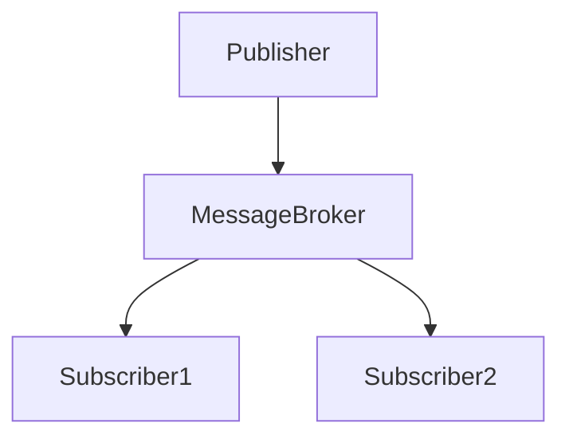
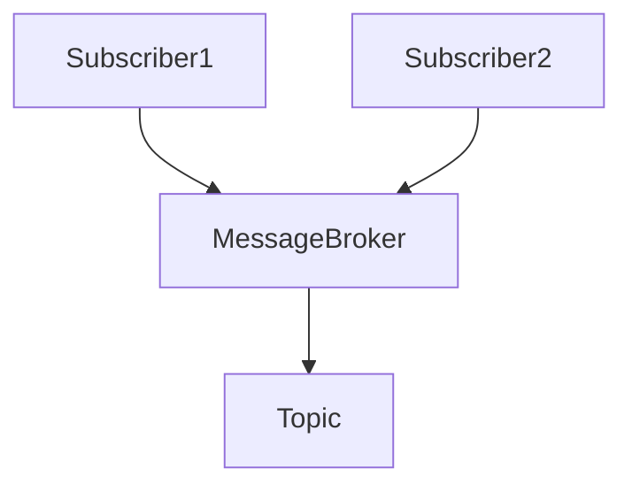
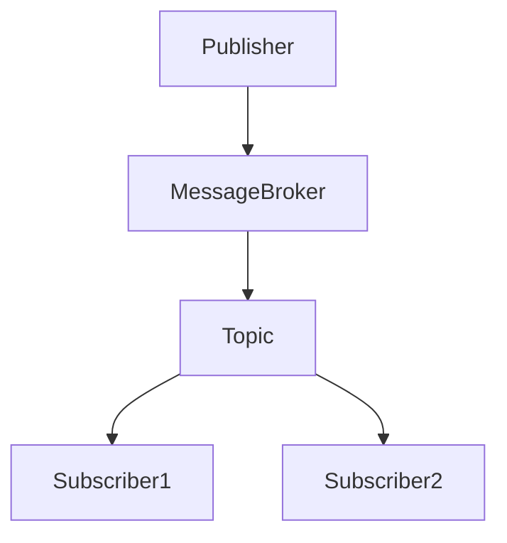

# 发布订阅模式与监控：构建可观察系统

作者：禅与计算机程序设计艺术

## 1. 背景介绍

### 1.1 什么是发布订阅模式

发布订阅模式（Publish-Subscribe Pattern），简称Pub-Sub模式，是一种消息传递模式，允许发送者（发布者）和接收者（订阅者）之间进行异步通信。发布者将消息发布到特定的主题（Topic），而订阅者则对这些主题进行订阅，从而接收相关的消息。

### 1.2 发布订阅模式的起源与发展

发布订阅模式起源于分布式系统中的消息传递需求。随着互联网和企业级应用的快速发展，系统的复杂度不断增加，传统的点对点通信模式难以满足高并发、高可用和松耦合的需求。发布订阅模式因其解耦性和灵活性，逐渐成为构建现代分布式系统的核心模式之一。

### 1.3 发布订阅模式在现代系统中的重要性

在现代系统中，发布订阅模式广泛应用于微服务架构、事件驱动架构、实时数据处理和监控系统中。通过发布订阅模式，系统可以实现组件间的松耦合，提高系统的可扩展性和可维护性。同时，发布订阅模式还为系统的可观察性提供了基础，便于监控和故障排查。

## 2. 核心概念与联系

### 2.1 发布者与订阅者

发布者（Publisher）是消息的生产者，负责将消息发送到特定的主题。订阅者（Subscriber）是消息的消费者，通过订阅主题来接收发布者发送的消息。

### 2.2 主题与消息代理

主题（Topic）是消息的分类标识，发布者将消息发布到特定的主题，订阅者通过订阅主题来接收消息。消息代理（Message Broker）是发布订阅模式中的中间件，负责管理主题和消息的传递。

### 2.3 事件驱动架构

事件驱动架构（Event-Driven Architecture，EDA）是一种设计模式，系统通过事件进行通信和协调。发布订阅模式是事件驱动架构的重要实现方式，通过事件的发布和订阅，实现系统的松耦合和异步通信。

### 2.4 可观察性

可观察性（Observability）是指系统能够提供足够的信息，使开发者和运维人员能够监控和分析系统的运行状态。发布订阅模式为系统的可观察性提供了基础，通过对消息的监控和分析，可以及时发现和解决系统问题。

## 3. 核心算法原理具体操作步骤

### 3.1 发布消息

发布者通过消息代理将消息发布到特定的主题，消息代理负责将消息分发给所有订阅该主题的订阅者。



### 3.2 订阅主题

订阅者通过消息代理订阅特定的主题，消息代理负责将该主题的所有消息推送给订阅者。



### 3.3 消息传递与处理

消息代理接收到发布者的消息后，将消息存储在对应的主题队列中，并根据订阅者的订阅信息，将消息推送给订阅者。订阅者接收到消息后，进行相应的处理。



### 3.4 异步通信与容错机制

发布订阅模式通过异步通信实现系统的松耦合，发布者和订阅者无需直接通信，从而提高系统的容错能力。消息代理可以实现消息的持久化和重试机制，确保消息的可靠传递。

## 4. 数学模型和公式详细讲解举例说明

### 4.1 消息传递模型

发布订阅模式中的消息传递可以用数学模型来描述。设 $P$ 表示发布者，$S$ 表示订阅者，$T$ 表示主题，$M$ 表示消息，$B$ 表示消息代理。

消息传递过程可以表示为：
$$
P \xrightarrow{M} B \xrightarrow{T} S
$$

### 4.2 消息队列与延迟

设 $Q_T$ 表示主题 $T$ 的消息队列，$D$ 表示消息传递的延迟时间。

消息队列的长度 $L$ 可以表示为：
$$
L = \sum_{i=1}^{n} M_i
$$

消息传递的延迟时间 $D$ 可以表示为：
$$
D = \frac{L}{\lambda}
$$
其中，$\lambda$ 表示消息处理的速率。

### 4.3 可观察性指标

可观察性指标包括消息传递的延迟、消息丢失率和系统的吞吐量等。

消息丢失率 $R$ 可以表示为：
$$
R = \frac{N_{lost}}{N_{total}}
$$
其中，$N_{lost}$ 表示丢失的消息数量，$N_{total}$ 表示总消息数量。

系统的吞吐量 $T$ 可以表示为：
$$
T = \frac{N_{processed}}{t}
$$
其中，$N_{processed}$ 表示处理的消息数量，$t$ 表示时间。

## 5. 项目实践：代码实例和详细解释说明

### 5.1 使用RabbitMQ实现发布订阅模式

RabbitMQ是一种流行的消息代理，可以用于实现发布订阅模式。下面是一个使用RabbitMQ实现发布订阅模式的示例代码。

#### 5.1.1 安装RabbitMQ

首先，安装RabbitMQ：

```bash
sudo apt-get update
sudo apt-get install rabbitmq-server
```

#### 5.1.2 发布者代码示例

```python
import pika

# 连接到RabbitMQ服务器
connection = pika.BlockingConnection(pika.ConnectionParameters('localhost'))
channel = connection.channel()

# 声明一个主题
channel.exchange_declare(exchange='logs', exchange_type='fanout')

# 发布消息
message = "Hello World!"
channel.basic_publish(exchange='logs', routing_key='', body=message)
print(" [x] Sent %r" % message)

# 关闭连接
connection.close()
```

#### 5.1.3 订阅者代码示例

```python
import pika

# 连接到RabbitMQ服务器
connection = pika.BlockingConnection(pika.ConnectionParameters('localhost'))
channel = connection.channel()

# 声明一个主题
channel.exchange_declare(exchange='logs', exchange_type='fanout')

# 创建一个临时队列
result = channel.queue_declare(queue='', exclusive=True)
queue_name = result.method.queue

# 绑定队列到主题
channel.queue_bind(exchange='logs', queue=queue_name)

print(' [*] Waiting for messages. To exit press CTRL+C')

# 回调函数处理消息
def callback(ch, method, properties, body):
    print(" [x] Received %r" % body)

# 订阅消息
channel.basic_consume(queue=queue_name, on_message_callback=callback, auto_ack=True)

# 开始消费
channel.start_consuming()
```

### 5.2 使用Kafka实现发布订阅模式

Kafka是一种高吞吐量的分布式消息系统，也可以用于实现发布订阅模式。下面是一个使用Kafka实现发布订阅模式的示例代码。

#### 5.2.1 安装Kafka

首先，安装Kafka：

```bash
wget https://downloads.apache.org/kafka/2.8.0/kafka_2.13-2.8.0.tgz
tar -xzf kafka_2.13-2.8.0.tgz
cd kafka_2.13-2.8.0
```

#### 5.2.2 启动Kafka服务器

```bash
bin/zookeeper-server-start.sh config/zookeeper.properties
bin/kafka-server-start.sh config/server.properties
```

#### 5.2.3 发布者代码示例

```python
from kafka import KafkaProducer

producer = KafkaProducer(bootstrap_servers='localhost:9092')

# 发布消息
producer.send('my-topic', b'Hello, World!')
producer.flush()
```

#### 5.2.4 订阅者代码示例

```python
from kafka import KafkaConsumer

consumer = KafkaConsumer('my-topic', bootstrap_servers='localhost:9092')

# 订阅消息
for message in consumer:
    print(f"Received message: {message.value.decode('utf-8')}")
```

## 6. 实际应用场景

### 6.1 微服务架构

在微服务架构中，发布订阅模式可以用于服务之间的通信。通过发布订阅模式，各个微服务可以独立发布和订阅消息，实现松