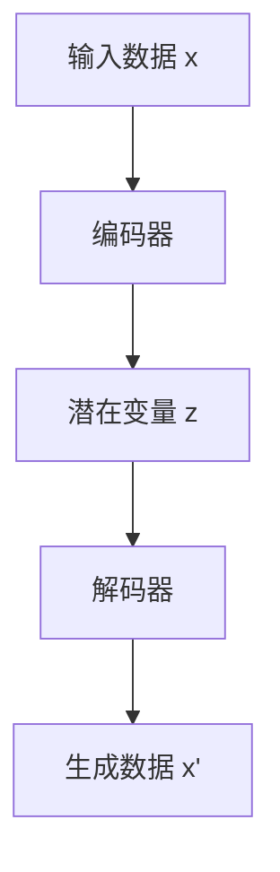

# 变分自编码器(VAE)原理与代码实战案例讲解

作者：禅与计算机程序设计艺术

## 1.背景介绍

### 1.1 什么是自编码器

自编码器（Autoencoder）是一种用于无监督学习的神经网络模型，旨在通过降低维度和去噪来学习数据的有效表示。自编码器的结构通常包括一个编码器（Encoder）和一个解码器（Decoder），其中编码器将输入数据压缩到一个低维的潜在空间，而解码器则从该潜在空间重构出原始数据。

### 1.2 变分自编码器的诞生

尽管自编码器在降维和特征学习方面表现出色，但它们在生成数据方面存在一定的局限性。变分自编码器（Variational Autoencoder, VAE）在2013年由Kingma和Welling提出，旨在解决这些局限性。VAE通过引入概率和变分推断的概念，不仅能够学习数据的有效表示，还能生成新的数据样本。

### 1.3 VAE的应用场景

VAE在图像生成、自然语言处理、异常检测等领域有广泛的应用。例如，在图像生成领域，VAE可以生成逼真的人脸图像；在自然语言处理领域，VAE可以生成连贯的句子；在异常检测中，VAE可以识别出与训练数据分布不同的异常数据。

## 2.核心概念与联系

### 2.1 概率图模型

VAE的核心思想是将数据生成过程建模为一个概率图模型。具体来说，假设存在一个潜在变量 $z$，它生成观测数据 $x$。我们希望通过学习，使得模型能够从潜在变量 $z$ 中生成与观测数据 $x$ 相似的数据。

### 2.2 变分推断

直接计算后验分布 $p(z|x)$ 是非常困难的，因此我们引入变分推断的方法。变分推断通过引入一个近似分布 $q(z|x)$，使得 $q(z|x)$ 近似于真实的后验分布 $p(z|x)$。我们通过最小化 $q(z|x)$ 和 $p(z|x)$ 之间的差异（通常使用Kullback-Leibler散度）来优化模型。

### 2.3 证据下界（ELBO）

为了优化模型，我们引入了证据下界（Evidence Lower Bound, ELBO）。ELBO是变分自编码器的优化目标，它由两部分组成：重构误差和KL散度。重构误差衡量从潜在变量 $z$ 生成数据 $x$ 的误差，而KL散度衡量 $q(z|x)$ 与 $p(z)$ 之间的差异。

### 2.4 生成过程与重构过程

VAE的生成过程包括两个步骤：首先从先验分布 $p(z)$ 中采样潜在变量 $z$，然后通过解码器生成数据 $x$。重构过程则是通过编码器将数据 $x$ 映射到潜在空间 $z$，再通过解码器重构数据 $x$。

## 3.核心算法原理具体操作步骤

### 3.1 变分自编码器的结构

变分自编码器的结构可以分为编码器和解码器两个部分。编码器将输入数据 $x$ 映射到潜在空间 $z$，解码器则从潜在空间 $z$ 生成数据 $x$。具体结构如下：



### 3.2 编码器的设计

编码器的目标是将输入数据 $x$ 映射到潜在变量 $z$。在VAE中，编码器不仅仅输出一个潜在变量 $z$，而是输出潜在变量的均值 $\mu$ 和方差 $\sigma$。具体步骤如下：

1. 输入数据 $x$ 通过神经网络得到均值向量 $\mu$ 和方差向量 $\sigma$。
2. 使用 $\mu$ 和 $\sigma$ 计算出潜在变量 $z$。

### 3.3 解码器的设计

解码器的目标是从潜在变量 $z$ 生成数据 $x'$。具体步骤如下：

1. 从潜在变量 $z$ 中采样。
2. 将采样结果通过神经网络生成数据 $x'$。

### 3.4 训练过程

VAE的训练过程包括以下步骤：

1. 前向传播：输入数据 $x$ 通过编码器得到潜在变量的均值 $\mu$ 和方差 $\sigma$，再通过解码器得到重构数据 $x'$。
2. 计算损失函数：损失函数包括重构误差和KL散度。
3. 反向传播：通过反向传播算法更新模型参数。

## 4.数学模型和公式详细讲解举例说明

### 4.1 变分推断的目标

变分推断的目标是最小化近似分布 $q(z|x)$ 和真实后验分布 $p(z|x)$ 之间的差异。我们通过最小化KL散度来实现这一目标：

$$
\text{KL}(q(z|x) \| p(z|x)) = \int q(z|x) \log \frac{q(z|x)}{p(z|x)} dz
$$

### 4.2 证据下界（ELBO）

为了优化模型，我们引入证据下界（ELBO）作为优化目标。ELBO由重构误差和KL散度组成：

$$
\text{ELBO} = \mathbb{E}_{q(z|x)}[\log p(x|z)] - \text{KL}(q(z|x) \| p(z))
$$

### 4.3 重构误差

重构误差衡量从潜在变量 $z$ 生成数据 $x$ 的误差。我们通常使用均方误差（MSE）来衡量重构误差：

$$
\text{MSE} = \frac{1}{N} \sum_{i=1}^N (x_i - x'_i)^2
$$

### 4.4 KL散度

KL散度衡量近似分布 $q(z|x)$ 和先验分布 $p(z)$ 之间的差异。对于高斯分布，KL散度可以表示为：

$$
\text{KL}(q(z|x) \| p(z)) = -\frac{1}{2} \sum_{j=1}^J (1 + \log(\sigma_j^2) - \mu_j^2 - \sigma_j^2)
$$

## 5.项目实践：代码实例和详细解释说明

### 5.1 环境准备

在开始代码实现之前，我们需要准备好开发环境。我们使用Python和TensorFlow来实现变分自编码器。

```python
import tensorflow as tf
from tensorflow.keras import layers, models
import numpy as np
```

### 5.2 数据准备

我们使用MNIST数据集作为示例数据集。MNIST数据集包含手写数字的灰度图像，每张图像的大小为28x28像素。

```python
(x_train, _), (x_test, _) = tf.keras.datasets.mnist.load_data()
x_train = x_train.astype('float32') / 255.0
x_test = x_test.astype('float32') / 255.0
x_train = np.reshape(x_train, (-1, 28, 28, 1))
x_test = np.reshape(x_test, (-1, 28, 28, 1))
```

### 5.3 编码器的实现

编码器将输入数据 $x$ 映射到潜在变量的均值 $\mu$ 和方差 $\sigma$。

```python
latent_dim = 2

encoder_inputs = tf.keras.Input(shape=(28, 28, 1))
x = layers.Conv2D(32, 3, activation='relu', strides=2, padding='same')(encoder_inputs)
x = layers.Conv2D(64, 3, activation='relu', strides=2, padding='same')(x)
x = layers.Flatten()(x)
x = layers.Dense(16, activation='relu')(x)
z_mean = layers.Dense(latent_dim, name='z_mean')(x)
z_log_var = layers.Dense(latent_dim, name='z_log_var')(x)

encoder = tf.keras.Model(encoder_inputs, [z_mean, z_log_var], name='encoder')
encoder.summary()
```

### 5.4 采样层的实现

采样层从潜在变量的均值和方差中采样。

```python
class Sampling(layers.Layer):
    def call(self, inputs):
        z_mean, z_log_var = inputs
       