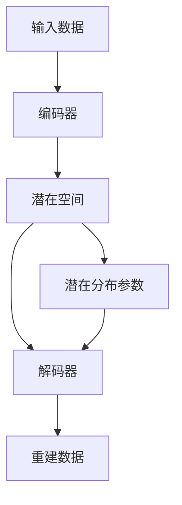

# 变分自编码器:发现潜在真理的奥秘

作者：禅与计算机程序设计艺术

## 1.背景介绍

### 1.1 深度学习的崛起

在过去的十年中，深度学习彻底改变了许多领域，从计算机视觉到自然语言处理，无一例外。其核心在于神经网络的强大表达能力，能够从大量数据中学习和提取复杂的特征。然而，传统的神经网络模型在处理高维数据时存在一定的局限性，特别是在生成模型领域。

### 1.2 生成模型的挑战

生成模型旨在从数据中学习其分布，并能够生成与训练数据相似的新数据。这在图像生成、文本生成和语音合成等领域具有广泛的应用。然而，传统的生成模型如GAN（生成对抗网络）虽然在生成质量上表现优异，但在训练稳定性和解释性方面存在问题。

### 1.3 变分自编码器的出现

变分自编码器（Variational Autoencoder, VAE）作为一种生成模型，通过将概率图模型与深度学习结合，提供了一种新的解决方案。VAE不仅能够生成高质量的数据，还能够提供数据的潜在表示，使得数据的结构和生成过程更加透明和可解释。

## 2.核心概念与联系

### 2.1 自编码器基础

自编码器是一种无监督学习的神经网络，用于学习数据的有效编码。其结构包括编码器和解码器两个部分：

- **编码器**：将输入数据映射到一个潜在空间（latent space）。
- **解码器**：从潜在空间重建输入数据。

### 2.2 变分推断

变分推断是一种近似推断方法，用于复杂概率模型中的后验分布估计。通过引入变分分布，我们可以将难以计算的后验分布转化为优化问题，从而进行高效的近似推断。

### 2.3 变分自编码器的核心思想

VAE结合了自编码器和变分推断的思想，其核心在于通过变分推断学习数据的潜在分布。在VAE中，编码器不仅学习数据的潜在表示，还学习潜在表示的分布参数（如均值和方差）。解码器则根据这些分布参数生成新的数据。



## 3.核心算法原理具体操作步骤

### 3.1 编码器的构建

编码器的任务是将输入数据映射到潜在空间，并输出潜在分布参数。具体步骤如下：

1. **输入数据** $x$。
2. **神经网络** $f_{\phi}(x)$ 提取特征，输出潜在分布参数 $\mu$ 和 $\sigma$。
3. **潜在表示** $z$ 通过重参数技巧（reparameterization trick）采样得到：$z = \mu + \sigma \cdot \epsilon$，其中 $\epsilon \sim N(0, I)$。

### 3.2 解码器的构建

解码器的任务是根据潜在表示 $z$ 生成重建数据 $\hat{x}$。具体步骤如下：

1. **潜在表示** $z$ 作为输入。
2. **神经网络** $g_{\theta}(z)$ 生成重建数据 $\hat{x}$。

### 3.3 变分下界的优化

为了训练VAE，我们需要最大化变分下界（Variational Lower Bound, ELBO），其目标函数为：

$$
\mathcal{L}(\theta, \phi; x) = \mathbb{E}_{q_{\phi}(z|x)}[\log p_{\theta}(x|z)] - D_{KL}(q_{\phi}(z|x) || p(z))
$$

其中，第一项是重建损失，衡量重建数据与输入数据的差异；第二项是KL散度，衡量潜在分布与先验分布的差异。

## 4.数学模型和公式详细讲解举例说明

### 4.1 重参数技巧

重参数技巧是VAE中的关键技术，用于实现可微分的采样过程。其核心思想是将随机变量的采样过程转化为确定性函数：

$$
z = \mu + \sigma \cdot \epsilon, \quad \epsilon \sim N(0, I)
```

通过这种方式，我们可以将采样过程的梯度传递到编码器的参数 $\phi$，从而进行有效的优化。

### 4.2 变分下界的推导

变分下界的目标是最大化数据的对数似然。通过引入变分分布 $q_{\phi}(z|x)$，我们可以将难以计算的后验分布转化为优化问题：

$$
\log p(x) \geq \mathbb{E}_{q_{\phi}(z|x)}[\log p_{\theta}(x|z)] - D_{KL}(q_{\phi}(z|x) || p(z))
```

其中，$p_{\theta}(x|z)$ 是解码器生成数据的概率分布，$q_{\phi}(z|x)$ 是编码器的变分分布，$p(z)$ 是潜在变量的先验分布（通常为标准正态分布）。

### 4.3 具体实例

假设我们有一个简单的二维数据集，目标是通过VAE学习其潜在表示并生成新的数据。具体步骤如下：

1. **初始化模型参数** $\theta$ 和 $\phi$。
2. **构建编码器** $f_{\phi}(x)$，输出潜在分布参数 $\mu$ 和 $\sigma$。
3. **构建解码器** $g_{\theta}(z)$，生成重建数据 $\hat{x}$。
4. **优化变分下界** $\mathcal{L}(\theta, \phi; x)$，更新模型参数。

## 4.项目实践：代码实例和详细解释说明

### 4.1 数据准备

首先，我们需要准备训练数据集。这里我们使用MNIST数据集作为示例：

```python
import torch
from torchvision import datasets, transforms

transform = transforms.Compose([
    transforms.ToTensor(),
    transforms.Normalize((0.5,), (0.5,))
])

train_dataset = datasets.MNIST(root='./data', train=True, transform=transform, download=True)
train_loader = torch.utils.data.DataLoader(dataset=train_dataset, batch_size=64, shuffle=True)
```

### 4.2 模型构建

接下来，我们构建VAE的编码器和解码器：

```python
import torch.nn as nn
import torch.nn.functional as F

class Encoder(nn.Module):
    def __init__(self, input_dim, hidden_dim, latent_dim):
        super(Encoder, self).__init__()
        self.fc1 = nn.Linear(input_dim, hidden_dim)
        self.fc2_mu = nn.Linear(hidden_dim, latent_dim)
        self.fc2_logvar = nn.Linear(hidden_dim, latent_dim)

    def forward(self, x):
        h = F.relu(self.fc1(x))
        mu = self.fc2_mu(h)
        logvar = self.fc2_logvar(h)
        return mu, logvar

class Decoder(nn.Module):
    def __init__(self, latent_dim, hidden_dim, output_dim):
        super(Decoder, self).__init__()
        self.fc1 = nn.Linear(latent_dim, hidden_dim)
        self.fc2 = nn.Linear(hidden_dim, output_dim)

    def forward(self, z):
        h = F.relu(self.fc1(z))
        x_hat = torch.sigmoid(self.fc2(h))
        return x_hat
```

### 4.3 损失函数和优化器

定义VAE的损失函数和优化器：

```python
def loss_function(x, x_hat, mu, logvar):
    BCE = F.binary_cross_entropy(x_hat, x, reduction='sum')
    KLD = -0.5 * torch.sum(1 + logvar - mu.pow(2) - logvar.exp())
    return BCE + KLD

encoder = Encoder(input_dim=784, hidden_dim=400, latent_dim=20)
decoder = Decoder(latent_dim=20, hidden_dim=400, output_dim=784)

optimizer = torch.optim.Adam(list(encoder.parameters()) + list(decoder.parameters()), lr=1e-3)
```

### 4.4 模型训练

训练VAE模型：

```python
num_epochs = 10

for epoch in range(num_epochs):
    for batch_idx, (data, _) in enumerate(train_loader):
        data = data.view(-1, 784)
        optimizer.zero_grad()

        mu, logvar = encoder(data)
        std = torch.exp(0.5 * logvar)
        epsilon = torch.randn_like(std)
        z = mu + std * epsilon

        recon_data = decoder(z)
        loss = loss_function(data, recon_data