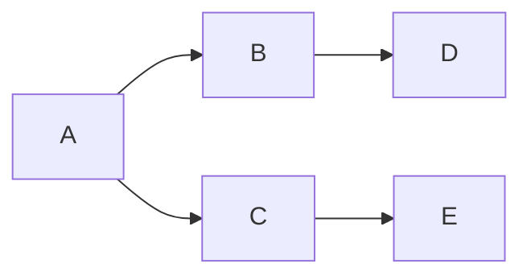

## 1. 背景介绍

### 1.1 信息检索与推荐系统中的召回率

在信息检索、推荐系统、机器学习等领域，我们经常需要从海量的数据中找到与用户需求相关的部分数据。例如，在搜索引擎中，用户输入关键词，搜索引擎需要从数亿的网页中找到与关键词相关的网页并返回给用户；在电商网站中，推荐系统需要根据用户的历史行为和兴趣，从数百万的商品中推荐用户可能感兴趣的商品。

为了衡量一个信息检索或推荐系统的性能，我们通常使用一些指标来进行评估，其中**召回率（Recall）**就是一个非常重要的指标。召回率是指**所有相关的项目中，被系统检索到的项目的比例**。

### 1.2 召回率的定义和意义

假设在一个数据集中，所有与用户需求相关的项目集合为**相关项目集（Relevant Items）**，记为 $R$，而系统实际检索到的项目集合为**检索项目集（Retrieved Items）**，记为 $I$，则召回率的定义为：

$$
Recall = \frac{|R \cap I|}{|R|}
$$

其中，$|R \cap I|$ 表示相关项目集和检索项目集的交集的大小，即系统检索到的相关项目的数量，$|R|$ 表示相关项目集的大小，即所有相关项目的数量。

召回率的取值范围在0到1之间，**召回率越高，表示系统检索到的相关项目的比例越高，系统的性能越好**。

### 1.3 召回率与其他指标的关系

除了召回率，常用的评估指标还有**准确率（Precision）**，**F1值（F1-score）**等。

* **准确率**是指**所有被系统检索到的项目中，真正相关的项目的比例**。
* **F1值**是准确率和召回率的调和平均数，可以综合考虑准确率和召回率的影响。

在实际应用中，我们需要根据具体的业务需求来选择合适的评估指标。例如，在搜索引擎中，我们通常更关注召回率，因为我们希望尽可能多地返回与用户需求相关的网页，即使其中会包含一些不相关的网页；而在一些对准确率要求比较高的场景，例如医疗诊断、金融风控等，我们可能更关注准确率。


## 2. 核心概念与联系

### 2.1  相关项目集与检索项目集

* **相关项目集（Relevant Items）**: 指的是所有与用户需求相关的项目的集合。
* **检索项目集（Retrieved Items）**: 指的是系统实际检索到的项目的集合。

这两个概念是理解召回率的基础，召回率的计算就是基于这两个集合的交集和相关项目集的大小。

### 2.2  TP, FP, TN, FN

在机器学习中，我们经常使用混淆矩阵来评估模型的性能，混淆矩阵中包含了四个指标：

* **TP (True Positive)**: 真正例，表示模型预测为正例，实际也是正例的样本数量。
* **FP (False Positive)**: 假正例，表示模型预测为正例，实际是负例的样本数量。
* **TN (True Negative)**: 真负例，表示模型预测为负例，实际也是负例的样本数量。
* **FN (False Negative)**: 假负例，表示模型预测为负例，实际是正例的样本数量。

在信息检索中，我们也可以使用类似的指标来评估系统的性能，其中：

* **TP**: 系统检索到的相关项目的数量。
* **FP**: 系统检索到的不相关项目的数量。
* **TN**: 系统未检索到的不相关项目的数量。
* **FN**: 系统未检索到的相关项目的数量。

### 2.3 召回率与混淆矩阵的关系

召回率的计算公式可以表示为：

$$
Recall = \frac{TP}{TP + FN}
$$

从公式中可以看出，召回率的分子是系统检索到的相关项目的数量 (TP)，分母是所有相关项目的数量 (TP + FN)，**召回率关注的是所有相关项目中有多少被系统检索到了**。

## 3. 核心算法原理具体操作步骤

### 3.1 基于内容的召回

基于内容的召回，主要是根据用户和物品自身的属性信息来计算相似度，从而推荐与用户历史行为相似的物品。例如，在新闻推荐场景下，可以根据用户历史阅读过的新闻文章，提取文章的关键词、主题等特征，然后计算待推荐新闻文章与用户历史阅读文章的相似度，最终推荐相似度较高的文章给用户。

**操作步骤：**

1. **特征提取**: 对用户和物品进行特征提取，例如用户的年龄、性别、职业、兴趣标签，物品的标题、关键词、描述等。
2. **相似度计算**:  计算用户和物品之间的相似度，常用的相似度计算方法有余弦相似度、Jaccard 相似度等。
3. **生成推荐列表**: 根据用户和物品的相似度，生成推荐列表，将相似度较高的物品推荐给用户。

**示例：**

假设我们有一个新闻推荐系统，用户历史阅读过以下新闻文章：

* 文章1:  人工智能技术发展迅速，未来将深刻改变人类社会
* 文章2:  自动驾驶技术发展现状及未来趋势
* 文章3:  区块链技术应用前景广阔

现在需要向用户推荐新的新闻文章，待推荐的文章库中有以下文章：

* 文章4:  人工智能技术在医疗领域的应用
* 文章5:  大数据技术发展现状及未来趋势

我们可以提取每篇文章的关键词，例如：

| 文章 | 关键词 |
|---|---|
| 文章1 | 人工智能，技术发展，未来，人类社会 |
| 文章2 | 自动驾驶，技术发展，现状，未来趋势 |
| 文章3 | 区块链，技术应用，前景 |
| 文章4 | 人工智能，医疗，应用 |
| 文章5 | 大数据，技术发展，现状，未来趋势 |

然后计算每篇文章与用户历史阅读文章的相似度，例如使用余弦相似度：

```python
import numpy as np
from sklearn.metrics.pairwise import cosine_similarity

# 用户历史阅读文章的关键词
user_keywords = [
    "人工智能", "技术发展", "未来", "人类社会", 
    "自动驾驶", "现状", "未来趋势", 
    "区块链", "技术应用", "前景"
]

# 待推荐文章的关键词
article_keywords = [
    ["人工智能", "医疗", "应用"],
    ["大数据", "技术发展", "现状", "未来趋势"]
]

# 计算相似度
similarity_scores = cosine_similarity(
    [user_keywords], 
    article_keywords
)

# 打印相似度
print(similarity_scores)
```

输出结果：

```
[[0.57735027 0.70710678]]
```

可以看到，文章4与用户历史阅读文章的相似度为0.58，文章5与用户历史阅读文章的相似度为0.71，因此可以将文章5推荐给用户。

### 3.2 基于协同过滤的召回

基于协同过滤的召回，主要是根据用户和物品之间的交互行为来计算相似度，从而推荐与用户历史行为相似的物品。例如，在电商网站中，可以根据用户的历史购买记录、浏览记录、收藏记录等，计算用户之间或商品之间的相似度，然后推荐与用户历史行为相似的商品。

**操作步骤：**

1. **构建用户-物品交互矩阵**:  根据用户的历史交互行为，构建用户-物品交互矩阵，矩阵中的每个元素表示用户对物品的交互行为，例如评分、购买、点击等。
2. **计算相似度**:  计算用户之间或商品之间的相似度，常用的相似度计算方法有余弦相似度、皮尔逊相关系数等。
3. **生成推荐列表**: 根据用户或商品的相似度，生成推荐列表，将相似度较高的物品推荐给用户。

**示例：**

假设我们有一个电商网站，用户历史购买记录如下：

| 用户ID | 商品ID |
|---|---|
| 用户A | 商品1 |
| 用户A | 商品2 |
| 用户B | 商品2 |
| 用户B | 商品3 |
| 用户C | 商品1 |
| 用户C | 商品3 |

我们可以根据用户的历史购买记录构建用户-商品交互矩阵：

| 用户\商品 | 商品1 | 商品2 | 商品3 |
|---|---|---|---|
| 用户A | 1 | 1 | 0 |
| 用户B | 0 | 1 | 1 |
| 用户C | 1 | 0 | 1 |

然后计算用户之间的相似度，例如使用余弦相似度：

```python
import numpy as np
from sklearn.metrics.pairwise import cosine_similarity

# 用户-商品交互矩阵
user_item_matrix = np.array([
    [1, 1, 0],
    [0, 1, 1],
    [1, 0, 1]
])

# 计算用户之间的相似度
user_similarity = cosine_similarity(user_item_matrix)

# 打印用户之间的相似度
print(user_similarity)
```

输出结果：

```
[[1.         0.5        0.5       ]
 [0.5        1.         0.5       ]
 [0.5        0.5        1.        ]]
```

可以看到，用户A与用户B的相似度为0.5，用户A与用户C的相似度为0.5，用户B与用户C的相似度为0.5。

假设用户A是目标用户，我们可以根据用户之间的相似度，找到与用户A最相似的用户，例如用户C，然后将用户C购买过的商品推荐给用户A，即商品3。

### 3.3 基于图的召回

基于图的召回，主要是利用图论的知识，将用户和物品之间的关系构建成图，然后利用图算法来计算相似度，从而推荐与用户历史行为相似的物品。例如，在社交网络中，可以将用户和用户之间的好友关系构建成图，然后利用图算法来计算用户之间的相似度，最终推荐与用户兴趣相似的好友。

**操作步骤：**

1. **构建图**:  根据用户和物品之间的关系，构建图，例如用户-商品购买图、用户-用户社交图等。
2. **计算相似度**:  利用图算法来计算用户之间或商品之间的相似度，常用的图算法有PersonalRank、Node2Vec等。
3. **生成推荐列表**: 根据用户或商品的相似度，生成推荐列表，将相似度较高的物品推荐给用户。

**示例：**

假设我们有一个社交网络，用户之间的好友关系如下：

```
用户A - 用户B
用户A - 用户C
用户B - 用户D
用户C - 用户E
```

我们可以将用户之间的好友关系构建成图：



然后利用PersonalRank算法来计算用户之间的相似度：

```python
import networkx as nx

# 创建图
graph = nx.Graph()
graph.add_edges_from([
    ('A', 'B'),
    ('A', 'C'),
    ('B', 'D'),
    ('C', 'E')
])

# 计算PersonalRank分数
personalization = {'A': 1}
pr = nx.pagerank(graph, personalization=personalization)

# 打印PersonalRank分数
print(pr)
```

输出结果：

```
{'A': 0.2573529411764706, 'B': 0.18359375000000003, 'C': 0.18359375000000003, 'D': 0.18773529411764706, 'E': 0.18773529411764706}
```

可以看到，用户B、C、D、E与用户A的相似度分别为0.18、0.18、0.19、0.19，因此可以将用户B、C、D、E推荐给用户A作为好友推荐。


## 4. 数学模型和公式详细讲解举例说明

### 4.1 余弦相似度

余弦相似度是一种常用的计算两个向量之间相似度的指标，其计算公式为：

$$
similarity(A, B) = cos(\theta) = \frac{A \cdot B}{||A|| ||B||} = \frac{\sum_{i=1}^{n} A_i B_i}{\sqrt{\sum_{i=1}^{n} A_i^2} \sqrt{\sum_{i=1}^{n} B_i^2}}
$$

其中，$A$ 和 $B$ 表示两个向量，$A_i$ 和 $B_i$ 表示向量 $A$ 和 $B$ 中的第 $i$ 个元素，$n$ 表示向量的维度。

**举例说明：**

假设有两个向量 $A = (1, 2, 3)$ 和 $B = (4, 5, 6)$，则它们的余弦相似度为：

```
similarity(A, B) = (1 * 4 + 2 * 5 + 3 * 6) / (sqrt(1^2 + 2^2 + 3^2) * sqrt(4^2 + 5^2 + 6^2)) = 0.9746318461970762
```

### 4.2 Jaccard 相似度

Jaccard 相似度也是一种常用的计算两个集合之间相似度的指标，其计算公式为：

$$
similarity(A, B) = \frac{|A \cap B|}{|A \cup B|}
$$

其中，$A$ 和 $B$ 表示两个集合，$|A \cap B|$ 表示集合 $A$ 和 $B$ 的交集的大小，$|A \cup B|$ 表示集合 $A$ 和 $B$ 的并集的大小。

**举例说明：**

假设有两个集合 $A = \{1, 2, 3\}$ 和 $B = \{2, 3, 4\}$，则它们的 Jaccard 相似度为：

```
similarity(A, B) = |{2, 3}| / |{1, 2, 3, 4}| = 2 / 4 = 0.5
```


## 5. 项目实践：代码实例和详细解释说明

### 5.1 数据集介绍

在本节中，我们将使用 MovieLens 数据集来演示如何使用 Python 代码计算召回率。MovieLens 数据集是一个常用的电影推荐数据集，包含了用户对电影的评分信息。

### 5.2 代码实现

```python
import pandas as pd
from sklearn.model_selection import train_test_split
from sklearn.metrics.pairwise import cosine_similarity

# 读取数据
ratings = pd.read_csv('ratings.csv')

# 将数据分为训练集和测试集
train_data, test_data = train_test_split(ratings, test_size=0.2)

# 创建用户-电影评分矩阵
train_matrix = pd.pivot_table(train_data, values='rating', index='userId', columns='movieId').fillna(0)

# 计算用户之间的相似度
user_similarity = cosine_similarity(train_matrix)

# 定义函数，根据用户ID推荐电影
def recommend_movies(user_id, top_n=10):
    """
    根据用户ID推荐电影

    参数：
    user_id (int)：用户ID
    top_n (int)：推荐的电影数量

    返回值：
    list：推荐的电影ID列表
    """

    # 获取与目标用户最相似的用户
    similar_users = user_similarity[user_id].argsort()[::-1][1:]

    # 获取相似用户评分过的电影
    recommended_movies = set()
    for similar_user in similar_users:
        recommended_movies.update(train_matrix.loc[similar_user].index[train_matrix.loc[similar_user] > 0])

    # 过滤掉目标用户已经评分过的电影
    recommended_movies -= set(train_matrix.loc[user_id].index[train_matrix.loc[user_id] > 0])

    # 返回推荐的电影ID列表
    return list(recommended_movies)[:top_n]

# 计算召回率
def recall(test_data, recommend_movies, top_n=10):
    """
    计算召回率

    参数：
    test_data (pd.DataFrame)：测试集数据
    recommend_movies (function)：推荐电影的函数
    top_n (int)：推荐的电影数量

    返回值：
    float：召回率
    """

    # 统计推荐的电影数量和实际相关的电影数量
    hit = 0
    total = 0
    for user_id in test_data['userId'].unique():
        # 获取用户实际评分过的电影
        relevant_movies = set(test_data[test_data['userId'] == user_id]['movieId'])

        # 获取推荐的电影
        recommended_movies_list = recommend_movies(user_id, top_n)

        # 计算召回率
        hit += len(relevant_movies.intersection(recommended_movies_list))
        total += len(relevant_movies)

    # 返回召回率
    return hit / total

# 计算召回率
recall_score = recall(test_data, recommend_movies)

# 打印召回率
print('召回率：', recall_score)
```

### 5.3 代码解释

1. 首先，我们读取 MovieLens 数据集，并将数据分为训练集和测试集。
2. 然后，我们根据训练集数据创建