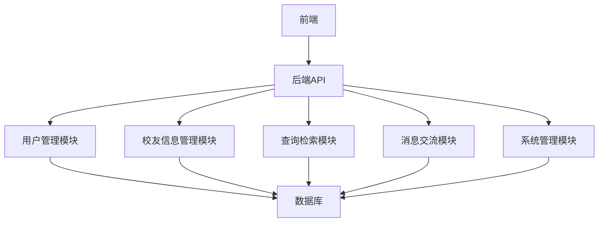

# 同学录校友录系统详细设计与具体代码实现

## 1.背景介绍

### 1.1 项目背景
在信息化时代，校友录和同学录系统成为了学校和校友之间保持联系的重要工具。这类系统不仅能够记录和管理校友的信息，还能促进校友之间的交流与合作。随着技术的发展，传统的纸质同学录逐渐被电子化系统所取代，这不仅提高了信息管理的效率，也极大地丰富了系统的功能。

### 1.2 需求分析
为了设计一个高效、可靠且易于使用的同学录校友录系统，我们需要详细分析用户需求。主要需求包括：
- 用户注册和登录功能
- 校友信息的录入和管理
- 基于不同条件的校友信息查询
- 校友之间的消息交流
- 系统管理员对系统的管理和维护

### 1.3 系统目标
本系统的目标是设计并实现一个功能全面、用户体验良好且易于维护的同学录校友录系统。具体目标包括：
- 提供安全可靠的用户认证机制
- 支持多维度的校友信息管理
- 实现高效的查询和检索功能
- 提供便捷的校友交流平台
- 支持系统的可扩展性和维护性

## 2.核心概念与联系

### 2.1 系统架构概述
同学录校友录系统的核心架构包括前端、后端和数据库三大部分。前端负责用户界面的展示和交互，后端处理业务逻辑和数据操作，数据库用于存储校友信息和系统数据。

### 2.2 核心模块
系统的核心模块包括：
- 用户管理模块：处理用户注册、登录和权限管理
- 校友信息管理模块：录入、编辑和删除校友信息
- 查询检索模块：基于不同条件查询校友信息
- 消息交流模块：校友之间的消息发送和接收
- 系统管理模块：系统配置和维护

### 2.3 模块之间的联系
各模块之间通过API接口进行通信，前端通过调用后端API实现功能，后端通过数据库操作实现数据存储和查询。以下是系统架构的Mermaid流程图：



## 3.核心算法原理具体操作步骤

### 3.1 用户注册与登录
用户注册和登录是系统的基础功能，涉及用户信息的录入和认证。具体操作步骤如下：
1. 用户通过前端提交注册信息（用户名、密码、邮箱等）。
2. 后端接收注册信息，进行数据校验（如用户名是否已存在）。
3. 校验通过后，将用户信息存入数据库，并返回注册成功消息。
4. 用户登录时，前端提交用户名和密码。
5. 后端验证用户名和密码，验证通过后生成并返回用户会话Token。

### 3.2 校友信息管理
校友信息管理包括信息的录入、编辑和删除。具体操作步骤如下：
1. 用户通过前端提交校友信息（姓名、毕业年份、联系方式等）。
2. 后端接收信息，进行数据校验（如必填项是否填写）。
3. 校验通过后，将校友信息存入数据库，并返回操作成功消息。
4. 用户可以通过前端提交请求，编辑或删除校友信息。
5. 后端接收请求，进行相应的数据库操作，并返回操作结果。

### 3.3 查询检索
查询检索功能实现基于不同条件的校友信息查询。具体操作步骤如下：
1. 用户通过前端提交查询条件（如姓名、毕业年份等）。
2. 后端接收查询条件，生成相应的数据库查询语句。
3. 执行查询语句，从数据库中检索符合条件的校友信息。
4. 将查询结果返回前端，并展示给用户。

### 3.4 消息交流
消息交流功能实现校友之间的消息发送和接收。具体操作步骤如下：
1. 用户通过前端提交消息内容和接收者信息。
2. 后端接收消息，进行数据校验（如接收者是否存在）。
3. 校验通过后，将消息存入数据库，并通知接收者。
4. 接收者登录系统后，可以查看并回复消息。

### 3.5 系统管理
系统管理功能包括系统配置和维护。具体操作步骤如下：
1. 系统管理员通过前端提交配置或维护请求。
2. 后端接收请求，进行相应的系统操作（如备份数据库、更新配置等）。
3. 操作完成后，返回操作结果给管理员。

## 4.数学模型和公式详细讲解举例说明

### 4.1 用户认证模型
用户认证涉及密码的加密和验证。常用的加密算法包括SHA-256和bcrypt。假设我们使用SHA-256进行密码加密，具体公式如下：

$$
H(p) = SHA256(p)
$$

其中，$H(p)$ 是密码 $p$ 的哈希值。用户登录时，通过比较存储的哈希值和输入密码的哈希值来验证用户身份。

### 4.2 数据库查询优化
为了提高查询效率，我们可以使用索引和查询优化技术。假设我们需要查询某个毕业年份的校友信息，可以使用如下SQL语句：

```sql
SELECT * FROM alumni WHERE graduation_year = '2024';
```

为了提高查询效率，我们可以在 `graduation_year` 字段上创建索引：

```sql
CREATE INDEX idx_graduation_year ON alumni (graduation_year);
```

这样可以显著提高查询速度。

### 4.3 消息交流模型
消息交流涉及消息的存储和检索。假设我们使用消息队列来实现消息的异步传递，具体模型如下：

$$
M = (S, R, T)
$$

其中，$M$ 是消息，$S$ 是发送者，$R$ 是接收者，$T$ 是消息内容。消息存储在队列中，接收者可以异步获取消息。

## 5.项目实践：代码实例和详细解释说明

### 5.1 用户注册与登录

#### 5.1.1 用户注册代码实例

```python
# 用户注册API
from flask import Flask, request, jsonify
from werkzeug.security import generate_password_hash
import sqlite3

app = Flask(__name__)

def init_db():
    conn = sqlite3.connect('alumni.db')
    c = conn.cursor()
    c.execute('''CREATE TABLE IF NOT EXISTS users
                 (id INTEGER PRIMARY KEY AUTOINCREMENT,
                 username TEXT UNIQUE,
                 password TEXT,
                 email TEXT)''')
    conn.commit()
    conn.close()

@app.route('/register', methods=['POST'])
def register():
    data = request.get_json()
    username = data['username']
    password = generate_password_hash(data['password'])
    email = data['email']
    
    conn = sqlite3.connect('alumni.db')
    c = conn.cursor()
    try:
        c.execute("INSERT INTO users (username, password, email) VALUES (?, ?, ?)",
                  (username, password, email))
        conn.commit()
        return jsonify({'message': 'User registered successfully!'}), 201
    except sqlite3.IntegrityError:
        return jsonify({'message': 'Username already exists!'}), 400
    finally:
        conn.close()

if __name__ == '__main__':
    init_db()
    app.run(debug=True)
```

#### 5.1.2 用户登录代码实例

```python
# 用户登录API
from flask import Flask, request, jsonify
from werkzeug.security import check_password_hash
import sqlite3
import jwt
import datetime

app = Flask(__name__)
app.config['SECRET_KEY'] = 'your_secret_key'

@app.route('/login', methods=['POST'])
def login():
    data = request.get_json()
    username = data['username']
    password = data['password']
    
    conn = sqlite3.connect('alumni.db')
    c = conn.cursor()
    c.execute("SELECT * FROM users WHERE username = ?", (username,))
    user = c.fetchone()
    conn.close()
    
    if user and check_password_hash(user[2], password):
        token = jwt.encode({'username': username, 'exp': datetime.datetime.utcnow() + datetime.timedelta(hours=1)},
                           app.config['SECRET_KEY'])
        return jsonify({'token': token}), 200
    else:
        return jsonify({'message': 'Invalid credentials!'}), 401

if __name__ == '__main__':
    app.run(debug=True)
```

### 5.2 校友信息管理

#### 5.2.1 校友信息录入代码实例

```python
# 校友信息录入API
from flask import Flask, request, jsonify
import sqlite3

app = Flask(__name