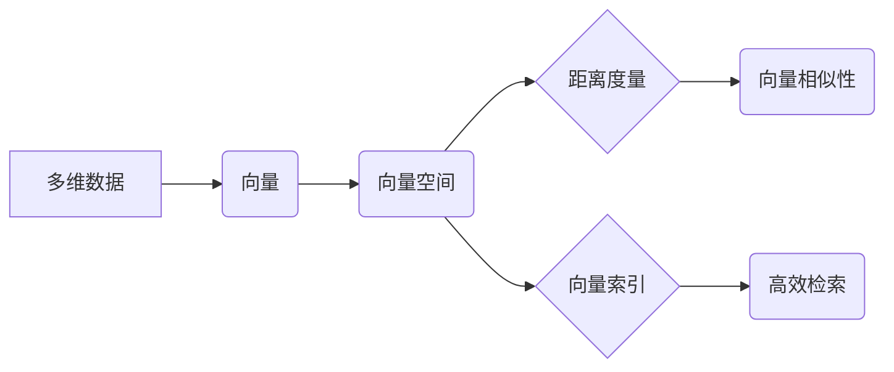

# 向量数据库基础：存储和检索多维数据的科学

作者：禅与计算机程序设计艺术

## 1. 背景介绍

### 1.1 从标量到向量：数据表示的进化

在信息技术发展的早期，我们主要处理的是结构化数据，例如数字、文本和日期。这些数据可以用关系型数据库轻松管理，每个数据点都是一个独立的实体。然而，随着互联网和多媒体技术的兴起，我们开始面对越来越多的非结构化数据，例如图像、音频、视频和传感器数据。这些数据通常被称为“多维数据”，因为它们包含多个维度或特征。

为了有效地存储和检索多维数据，我们需要一种新的数据库管理方法。传统的基于标量值的关系型数据库在处理多维数据时效率低下，因为它们无法有效地处理数据点之间的相似性。这时，向量数据库应运而生。

### 1.2 向量数据库：释放多维数据的潜力

向量数据库是一种专门用于存储、索引和查询向量的数据库管理系统。与将数据存储为行和列的关系型数据库不同，向量数据库将数据表示为多维空间中的向量。每个向量代表一个数据点，其维度对应于数据的不同特征。

向量数据库的核心优势在于它能够高效地计算向量之间的距离和相似度。这使得我们能够执行各种基于相似性的查询，例如：

* **最近邻搜索 (Nearest Neighbor Search):** 查找与给定向量最相似的向量。
* **范围搜索 (Range Search):** 查找距离给定向量特定范围内的所有向量。
* **相似性搜索 (Similarity Search):** 查找与给定向量满足特定相似性标准的所有向量。

### 1.3 应用场景：从人工智能到数据科学

向量数据库在各个领域都有广泛的应用，包括：

* **人工智能 (AI):** 用于存储和检索机器学习模型的训练数据、特征向量和嵌入向量。
* **自然语言处理 (NLP):** 用于存储和查询文本数据的向量表示，例如词嵌入和句子嵌入。
* **计算机视觉 (CV):** 用于存储和检索图像和视频数据的特征向量，例如人脸识别和目标检测。
* **推荐系统:** 用于存储和查询用户和商品的向量表示，以便进行个性化推荐。
* **数据分析:** 用于探索和分析多维数据集，例如客户细分和异常检测。

## 2. 核心概念与联系

### 2.1 向量：多维数据的基石

在向量数据库中，数据被表示为**向量**。向量是一个有序的数字列表，每个数字代表数据点在特定维度上的值。例如，一个表示图像的向量可能包含图像中每个像素的红色、绿色和蓝色值。

```
# 一个表示 RGB 图像的向量
image_vector = [255, 0, 0, 0, 255, 0, 0, 0, 255]
```

### 2.2 向量空间：数据的几何表示

所有可能的向量构成了一个**向量空间**。向量空间可以是二维的、三维的，甚至是更高维的。在向量空间中，每个向量都可以看作是一个点，其坐标由向量的各个维度决定。

### 2.3 距离度量：衡量向量相似性的关键

为了比较向量之间的相似性，我们需要一种方法来衡量它们之间的距离。常用的距离度量包括：

* **欧几里得距离 (Euclidean Distance):** 这是最常见的距离度量，它计算两点之间的直线距离。
* **曼哈顿距离 (Manhattan Distance):**  它计算两点之间沿着坐标轴移动的距离。
* **余弦相似度 (Cosine Similarity):** 它衡量两个向量之间的夹角的余弦值。

### 2.4 向量索引：加速向量搜索的利器

为了高效地检索向量，向量数据库使用**索引**来组织数据。索引是一种数据结构，它可以加速特定类型的查询。常用的向量索引包括：

* **树状索引 (Tree-based Index):** 例如 KD 树和 Ball 树，它们将向量空间递归地划分成多个子空间。
* **哈希索引 (Hashing-based Index):** 例如局部敏感哈希 (LSH)，它将相似的向量映射到相同的哈希桶中。
* **图索引 (Graph-based Index):** 例如 HNSW 和 Annoy，它们构建一个近似最近邻图来加速搜索。

### 2.5 核心概念关系图



## 3. 核心算法原理具体操作步骤

### 3.1 k 近邻搜索 (k-NN)

k 近邻搜索是向量数据库中最常见的查询类型之一。它用于查找与给定查询向量最相似的 k 个向量。

#### 3.1.1 算法步骤

1. **计算查询向量与数据库中所有向量之间的距离。**
2. **根据距离对向量进行排序。**
3. **返回距离最近的 k 个向量。**

#### 3.1.2  操作示例

假设我们有一个包含三个向量的数据库：

```
vector1 = [1, 2, 3]
vector2 = [4, 5, 6]
vector3 = [7, 8, 9]
```

我们想要找到与查询向量 `query_vector = [2, 3, 4]` 最相似的 2 个向量。

1. **计算距离：**

```
distance(query_vector, vector1) = sqrt((2-1)^2 + (3-2)^2 + (4-3)^2) = sqrt(3)
distance(query_vector, vector2) = sqrt((2-4)^2 + (3-5)^2 + (4-6)^2) = sqrt(12)
distance(query_vector, vector3) = sqrt((2-7)^2 + (3-8)^2 + (4-9)^2) = sqrt(75)
```

2. **排序：**

```
[vector1, vector2, vector3] (按距离升序排列)
```

3. **返回：**

```
[vector1, vector2]
```

### 3.2  范围搜索

范围搜索用于查找距离给定查询向量特定范围内的所有向量。

#### 3.2.1 算法步骤

1. **计算查询向量与数据库中所有向量之间的距离。**
2. **选择距离小于或等于指定范围的向量。**

#### 3.2.2 操作示例

使用与 k 近邻搜索相同的示例数据，假设我们想要查找距离 `query_vector = [2, 3, 4]` 不超过 `radius = 4` 的所有向量。

1. **计算距离：** (与 k 近邻搜索相同)
2. **选择：**

```
[vector1, vector2] (距离小于或等于 4)
```

## 4. 数学模型和公式详细讲解举例说明

### 4.1 欧几里得距离

欧几里得距离是向量空间中最常用的距离度量之一。它计算两点之间的直线距离。

#### 4.1.1 公式

给定两个 n 维向量  $ \mathbf{a} = (a_1, a_2, ..., a_n) $ 和 $ \mathbf{b} = (b_1, b_2, ..., b_n) $，它们的欧几里得距离定义为：

$$ d(\mathbf{a}, \mathbf{b}) = \sqrt{\sum_{i=1}^{n} (a_i - b_i)^2} $$

#### 4.1.2 举例说明

假设我们有两个二维向量 $ \mathbf{a} = (1, 2) $ 和 $ \mathbf{b} = (4, 6) $。它们的欧几里得距离为：

$$ d(\mathbf{a}, \mathbf{b}) = \sqrt{(1-4)^2 + (2-6)^2} = \sqrt{9 + 16} = 5 $$

### 4.2 余弦相似度

余弦相似度是另一种常用的向量相似性度量方法。它衡量两个向量之间夹角的余弦值。

#### 4.2.1 公式

给定两个 n 维向量  $ \mathbf{a} = (a_1, a_2, ..., a_n) $ 和 $ \mathbf{b} = (b_1, b_2, ..., b_n) $，它们的余弦相似度定义为：

$$ \cos(\theta) = \frac{\mathbf{a} \cdot \mathbf{b}}{\|\mathbf{a}\| \|\mathbf{b}\|} = \frac{\sum_{i=1}^{n} a_i b_i}{\sqrt{\sum_{i=1}^{n} a_i^2} \sqrt{\sum_{i=1}^{n} b_i^2}} $$

其中 $ \theta $ 是两个向量之间的夹角。

#### 4.2.2 举例说明

假设我们有两个三维向量 $ \mathbf{a} = (1, 2, 2) $ 和 $ \mathbf{b} = (3, 0, 4) $。它们的余弦相似度为：

$$ \cos(\theta) = \frac{1 \cdot 3 + 2 \cdot 0 + 2 \cdot 4}{\sqrt{1^2 + 2^2 + 2^2} \sqrt{3^2 + 0^2 + 4^2}} = \frac{11}{\sqrt{9} \sqrt{25}} = \frac{11}{15} $$


## 5. 项目实践：代码实例和详细解释说明

### 5.1 使用 Faiss 进行 k 近邻搜索

Faiss 是 Facebook AI Research 开发的一个用于高效相似性搜索和密集向量聚类的库。它包含多种搜索算法，包括 k 近邻搜索。

#### 5.1.1 安装 Faiss

```bash
pip install faiss-cpu
```

#### 5.1.2 代码示例

```python
import faiss
import numpy as np

# 定义维度和数据库大小
dimension = 128
database_size = 10000

# 生成随机向量数据
database = np.random.rand(database_size, dimension).astype('float32')

# 创建索引
index = faiss.IndexFlatL2(dimension)

# 添加向量到索引
index.add(database)

# 定义查询向量
query_vector = np.random.rand(1, dimension).astype('float32')

# 执行 k 近邻搜索
k = 10
distances, indices = index.search(query_vector, k)

# 打印结果
print(f"最相似的 {k} 个向量的索引：{indices}")
print(f"它们与查询向量之间的距离：{distances}")
```

#### 5.1.3 代码解释

1. 首先，我们导入 `faiss` 和 `numpy` 库。
2. 然后，我们定义维度 `dimension` 和数据库大小 `database_size`。
3. 接下来，我们使用 `np.random.rand` 函数生成随机向量数据。
4. 我们使用 `faiss.IndexFlatL2` 创建一个使用 L2 距离的扁平索引。
5. 我们使用 `index.add` 方法将向量添加到索引中。
6. 我们定义一个随机查询向量 `query_vector`。
7. 我们使用 `index.search` 方法执行 k 近邻搜索，指定 `k` 值为 10。
8. 最后，我们打印最相似的 10 个向量的索引和它们与查询向量之间的距离。

## 6. 实际应用场景

### 6.1 图像搜索

在图像搜索中，我们可以使用向量数据库来存储和检索图像的特征向量。当用户上传一张图片时，我们可以提取图片的特征向量，并在向量数据库中查找与其最相似的图片。

### 6.2 语义搜索

在语义搜索中，我们可以使用向量数据库来存储和检索文本的语义向量。当用户输入一个查询词时，我们可以将其转换为语义向量，并在向量数据库中查找与其语义最相似的文本。

### 6.3 推荐系统

在推荐系统中，我们可以使用向量数据库来存储和检索用户和商品的特征向量。我们可以根据用户的历史行为和兴趣生成用户的特征向量，并根据商品的属性生成商品的特征向量。然后，我们可以使用向量数据库来查找与用户特征向量最相似的商品特征向量，从而向用户推荐他们可能感兴趣的商品。

## 7. 总结：未来发展趋势与挑战

### 7.1 未来发展趋势

* **更高的性能和可扩展性：** 随着数据量的不断增长，我们需要更高性能和可扩展性的向量数据库来处理海量数据。
* **更丰富的查询功能：** 未来，我们需要支持更丰富的查询功能，例如模糊搜索、多模态搜索和时空搜索。
* **与机器学习平台的更紧密集成：** 向量数据库将与机器学习平台更紧密地集成，以支持更复杂的机器学习应用。

### 7.2 面临的挑战

* **高维数据的诅咒：** 随着数据维度的增加，向量数据库的性能和准确性会下降。
* **索引构建和维护的成本：** 构建和维护高效的向量索引可能非常耗时且成本高昂。
* **数据安全和隐私：** 存储和查询敏感数据时，需要确保数据的安全性和隐私。

## 8. 附录：常见问题与解答

### 8.1 什么是向量数据库？

向量数据库是一种专门用于存储、索引和查询向量的数据库管理系统。与将数据存储为行和列的关系型数据库不同，向量数据库将数据表示为多维空间中的向量。

### 8.2 向量数据库有哪些应用场景？

向量数据库在各个领域都有广泛的应用，包括人工智能、自然语言处理、计算机视觉、推荐系统和数据分析。

### 8.3 向量数据库有哪些优点？

* **高效的相似性搜索：** 向量数据库可以高效地执行各种基于相似性的查询，例如最近邻搜索、范围搜索和相似性搜索。
* **支持高维数据：** 向量数据库可以有效地存储和检索高维数据。
* **可扩展性：** 向量数据库可以扩展到处理数十亿甚至数万亿个向量。

### 8.4 向量数据库有哪些局限性？

* **高维数据的诅咒：** 随着数据维度的增加，向量数据库的性能和准确性会下降。
* **索引构建和维护的成本：** 构建和维护高效的向量索引可能非常耗时且成本高昂。
* **数据安全和隐私：** 存储和查询敏感数据时，需要确保数据的安全性和隐私。
