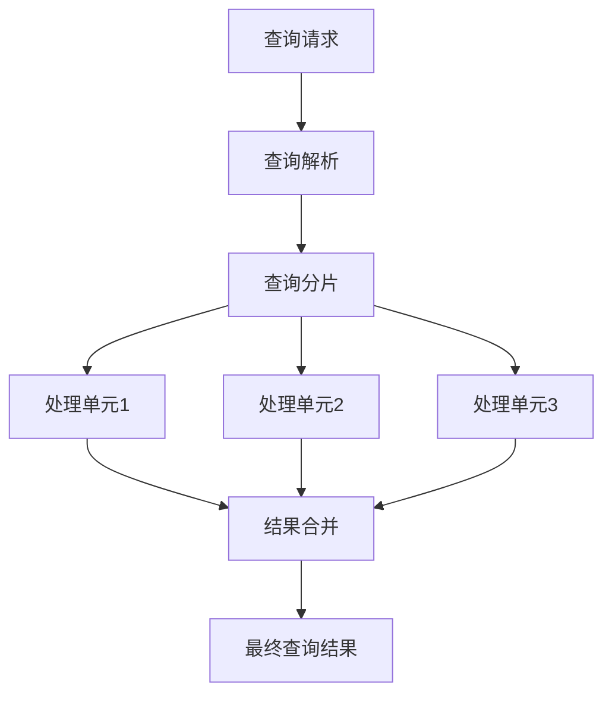

# 向量数据库的并行查询处理：提高数据检索速度

作者：禅与计算机程序设计艺术

## 1. 背景介绍

### 1.1 向量数据库的兴起

随着大数据和人工智能技术的迅猛发展，向量数据库(Vector Database)逐渐成为处理和存储高维数据的重要工具。向量数据库能够高效地处理大量向量数据，例如图像特征、文本嵌入和用户行为数据。这些数据通常需要进行快速相似性搜索，以支持推荐系统、图像识别和自然语言处理等应用。

### 1.2 并行查询处理的重要性

在向量数据库中，查询处理的效率直接影响到系统的整体性能。由于向量数据的高维特性，传统的数据库查询方法难以满足高效检索的需求。并行查询处理技术通过将查询任务分解并分发到多个处理单元，从而显著提高查询速度，成为解决这一问题的关键。

### 1.3 本文目的

本文旨在深入探讨向量数据库的并行查询处理技术，分析其核心概念、算法原理、数学模型，并通过具体的项目实践和代码实例，展示其实际应用场景和工具资源，最后展望其未来发展趋势与挑战。

## 2. 核心概念与联系

### 2.1 向量数据库简介

向量数据库是一种专门用于存储和查询高维向量数据的数据库。其核心功能包括向量的存储、索引和相似性搜索。向量数据库通常采用高效的索引结构，如KD树、LSH(Locality Sensitive Hashing)和IVF(Inverted File)等，以支持快速的相似性检索。

### 2.2 并行查询处理概述

并行查询处理是指将查询任务分解为多个子任务，并行地在多个处理单元上执行，从而加快查询速度。并行查询处理可以在多个层面上实现，包括数据分片、索引分片和查询分片等。其核心思想是通过并行化提高查询处理的吞吐量和响应速度。

### 2.3 向量数据库与并行查询的结合

向量数据库与并行查询处理的结合能够显著提升高维数据的检索效率。通过将向量数据和索引结构进行分片，并行地处理查询请求，可以在大规模数据集上实现快速的相似性搜索。这种结合不仅提高了查询速度，还增强了系统的扩展性和容错能力。

## 3. 核心算法原理具体操作步骤

### 3.1 数据分片策略

数据分片是并行查询处理的基础。将向量数据分片可以有效地分散查询负载，避免单点瓶颈。常见的数据分片策略包括：

- **水平分片**：将数据按行分片，每个分片包含部分行数据。
- **垂直分片**：将数据按列分片，每个分片包含部分列数据。
- **混合分片**：结合水平分片和垂直分片，根据数据特性进行优化分片。

### 3.2 索引分片策略

索引分片是提高查询效率的关键。将索引结构分片可以使查询在多个索引上并行执行。常见的索引分片策略包括：

- **基于哈希的分片**：使用哈希函数将向量数据分配到不同的索引分片。
- **基于范围的分片**：根据向量值的范围进行分片，每个分片包含一定范围内的向量数据。
- **混合分片**：结合哈希分片和范围分片，根据查询特性进行优化分片。

### 3.3 查询分片策略

查询分片是并行查询处理的核心。将查询请求分片可以使多个处理单元并行执行查询任务。常见的查询分片策略包括：

- **基于数据分片的查询分片**：将查询请求分发到包含相关数据分片的处理单元。
- **基于索引分片的查询分片**：将查询请求分发到包含相关索引分片的处理单元。
- **混合查询分片**：结合数据分片和索引分片，根据查询特性进行优化分片。

### 3.4 并行查询处理流程

并行查询处理的具体流程如下：

1. **查询解析**：将查询请求解析为多个子查询。
2. **查询分片**：根据数据分片和索引分片策略，将子查询分发到多个处理单元。
3. **并行执行**：在多个处理单元上并行执行子查询。
4. **结果合并**：将多个子查询的结果合并为最终查询结果。



## 4. 数学模型和公式详细讲解举例说明

### 4.1 向量相似性度量

向量数据库中的相似性搜索通常基于向量之间的相似性度量。常见的相似性度量包括：

- **欧氏距离**：用于度量两个向量之间的直线距离，适用于低维向量数据。
$$
d(\mathbf{u}, \mathbf{v}) = \sqrt{\sum_{i=1}^n (u_i - v_i)^2}
$$

- **余弦相似度**：用于度量两个向量之间的夹角，适用于高维向量数据。
$$
\text{cosine\_similarity}(\mathbf{u}, \mathbf{v}) = \frac{\mathbf{u} \cdot \mathbf{v}}{\|\mathbf{u}\| \|\mathbf{v}\|}
$$

- **曼哈顿距离**：用于度量两个向量之间的绝对距离，适用于稀疏向量数据。
$$
d(\mathbf{u}, \mathbf{v}) = \sum_{i=1}^n |u_i - v_i|
$$

### 4.2 并行查询处理的数学模型

并行查询处理可以通过以下数学模型进行描述：

- **查询分片模型**：假设查询请求 $Q$ 被分解为 $k$ 个子查询 $Q_1, Q_2, \ldots, Q_k$，每个子查询在不同的处理单元上并行执行。
$$
Q = \bigcup_{i=1}^k Q_i
$$

- **查询执行时间模型**：假设每个子查询的执行时间为 $T_i$，并行查询处理的总执行时间 $T$ 为所有子查询执行时间的最大值。
$$
T = \max(T_1, T_2, \ldots, T_k)
$$

- **查询加速比模型**：假设串行查询处理的执行时间为 $T_s$，并行查询处理的执行时间为 $T_p$，查询加速比 $S$ 为串行执行时间与并行执行时间的比值。
$$
S = \frac{T_s}{T_p}
$$

### 4.3 举例说明

假设一个向量数据库包含1000万个高维向量数据，查询请求需要在这些数据中找到与给定向量最相似的前10个向量。通过并行查询处理，可以将查询请求分解为10个子查询，每个子查询在100万个向量数据上执行相似性搜索。假设每个子查询的执行时间为10秒，并行查询处理的总执行时间为：

$$
T = \max(10, 10, \ldots, 10) = 10 \text{秒}
$$

而串行查询处理的执行时间为：

$$
T_s = 10 \times 10 = 100 \text{秒}
$$

查询加速比为：

$$
S = \frac{100}{10} = 10
$$

通过并行查询处理，可以将查询速度提高10倍，显著提升向量数据库的检索效率。

## 5. 项目实践：代码实例和详细解释说明

### 5.1 环境配置

在实际项目中，我们可以使用Python编程语言和开源的向量数据库库，如Faiss和Annoy，来实现并行查询处理。以下是环境配置步骤：

```bash
# 安装必要的库
pip install faiss-cpu
pip install annoy
```

### 5.2 数据生成

首先，我们生成一组高维向量数据作为示例数据集：

```python
import numpy as np

# 生成1000万个高维向量数据
num_vectors =