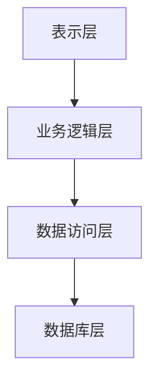

# 商场销售管理系统详细设计与具体代码实现

作者：禅与计算机程序设计艺术

## 1. 背景介绍

### 1.1 商场销售管理的重要性

在现代商业环境中，商场销售管理系统（Mall Sales Management System, MSMS）在提升销售效率、优化库存管理、提高客户满意度等方面起着至关重要的作用。随着电子商务和大数据技术的普及，传统的销售管理方式已经无法满足日益复杂的市场需求。因此，设计和实现一个高效、智能的销售管理系统成为了每一个商场运营者的必修课。

### 1.2 当前市场现状

当前市场上存在许多销售管理系统，但大多数系统存在功能单一、扩展性差、用户体验不佳等问题。为了满足商场多样化的需求，我们需要设计一个具有高度灵活性、可扩展性和良好用户体验的销售管理系统。

### 1.3 设计目标与挑战

本系统的设计目标包括：

- 提供全面的销售数据管理功能
- 实现智能库存管理
- 支持多渠道销售
- 提供实时的数据分析和报表功能
- 确保系统的安全性和稳定性

挑战主要包括：

- 数据量大且复杂
- 实时性要求高
- 系统的可扩展性和兼容性

## 2. 核心概念与联系

### 2.1 系统架构

商场销售管理系统的架构设计应遵循分层原则，主要包括以下几个层次：

- **表示层（Presentation Layer）**：负责与用户交互，提供友好的用户界面。
- **业务逻辑层（Business Logic Layer）**：处理业务逻辑，包括销售管理、库存管理等。
- **数据访问层（Data Access Layer）**：负责与数据库交互，进行数据的存储和检索。
- **数据库层（Database Layer）**：存储系统的数据，包括商品信息、销售记录、库存数据等。



### 2.2 关键模块

商场销售管理系统主要包括以下几个关键模块：

- **商品管理模块**：管理商品信息，包括商品的添加、修改、删除等操作。
- **销售管理模块**：管理销售记录，包括销售订单的生成、修改、查询等操作。
- **库存管理模块**：管理库存信息，包括库存的添加、修改、查询等操作。
- **客户管理模块**：管理客户信息，包括客户的添加、修改、查询等操作。
- **报表管理模块**：生成各种销售报表和统计数据，支持数据的导出和打印。

### 2.3 模块之间的联系

各模块之间通过业务逻辑层进行交互，数据访问层提供统一的数据接口，确保数据的一致性和完整性。

## 3. 核心算法原理具体操作步骤

### 3.1 销售预测算法

销售预测是商场销售管理系统中的重要功能之一。通过对历史销售数据进行分析，可以预测未来一段时间的销售情况，从而指导库存管理和销售策略。

#### 3.1.1 数据预处理

数据预处理包括数据清洗、数据归一化、特征提取等步骤。数据清洗可以去除数据中的噪声和异常值，数据归一化可以将数据转换到同一量纲上，特征提取可以提取出对预测有用的特征。

#### 3.1.2 模型选择

常用的销售预测模型包括时间序列模型（如ARIMA）、机器学习模型（如支持向量机、随机森林）和深度学习模型（如LSTM）。

#### 3.1.3 模型训练

模型训练包括选择合适的训练集和测试集、调整模型参数、评估模型性能等步骤。可以使用交叉验证的方法来评估模型的泛化能力。

#### 3.1.4 模型预测

模型训练完成后，可以使用训练好的模型对未来的销售情况进行预测。预测结果可以用于指导库存管理和销售策略。

### 3.2 库存管理算法

库存管理算法主要包括库存优化、库存预警等功能。

#### 3.2.1 库存优化

库存优化算法可以根据销售预测结果和库存情况，计算出最优的库存量，避免库存过多或过少的情况。常用的库存优化算法包括经济订货量（EOQ）模型、动态库存模型等。

#### 3.2.2 库存预警

库存预警算法可以根据库存情况和销售预测结果，实时监控库存状态，当库存量低于安全库存量时，发出预警信号，提醒补货。

## 4. 数学模型和公式详细讲解举例说明

### 4.1 销售预测模型

#### 4.1.1 ARIMA模型

ARIMA（AutoRegressive Integrated Moving Average）模型是一种常用的时间序列预测模型。其数学表达式为：

$$
Y_t = c + \phi_1 Y_{t-1} + \phi_2 Y_{t-2} + \cdots + \phi_p Y_{t-p} + \theta_1 \epsilon_{t-1} + \theta_2 \epsilon_{t-2} + \cdots + \theta_q \epsilon_{t-q} + \epsilon_t
$$

其中，$Y_t$ 是时间 $t$ 的观测值，$c$ 是常数项，$\phi_i$ 是自回归系数，$\theta_i$ 是移动平均系数，$\epsilon_t$ 是噪声项。

#### 4.1.2 LSTM模型

LSTM（Long Short-Term Memory）模型是一种常用的深度学习模型，适用于处理时间序列数据。其基本结构包括输入门、遗忘门、输出门和记忆单元。LSTM的数学表达式为：

$$
f_t = \sigma(W_f \cdot [h_{t-1}, x_t] + b_f)
$$

$$
i_t = \sigma(W_i \cdot [h_{t-1}, x_t] + b_i)
$$

$$
o_t = \sigma(W_o \cdot [h_{t-1}, x_t] + b_o)
$$

$$
C_t = f_t * C_{t-1} + i_t * \tanh(W_C \cdot [h_{t-1}, x_t] + b_C)
$$

$$
h_t = o_t * \tanh(C_t)
$$

其中，$f_t$ 是遗忘门，$i_t$ 是输入门，$o_t$ 是输出门，$C_t$ 是记忆单元，$h_t$ 是隐藏状态，$W$ 和 $b$ 是权重和偏置，$\sigma$ 是激活函数。

### 4.2 库存优化模型

#### 4.2.1 经济订货量（EOQ）模型

EOQ模型是一种经典的库存优化模型，其数学表达式为：

$$
EOQ = \sqrt{\frac{2DS}{H}}
$$

其中，$D$ 是年需求量，$S$ 是每次订货成本，$H$ 是年持有成本。

#### 4.2.2 动态库存模型

动态库存模型可以根据销售预测结果和库存情况，实时调整库存量。其数学表达式为：

$$
I_t = I_{t-1} + Q_t - D_t
$$

其中，$I_t$ 是时间 $t$ 的库存量，$Q_t$ 是时间 $t$ 的订货量，$D_t$ 是时间 $t$ 的需求量。

## 5. 项目实践：代码实例和详细解释说明

### 5.1 系统架构设计

#### 5.1.1 表示层设计

表示层主要负责与用户交互，提供友好的用户界面。可以使用前端框架如React、Vue.js等实现。

```javascript
// React示例代码
import React from 'react';
import { BrowserRouter as Router, Route, Switch } from 'react-router-dom';
import Home from './components/Home';
import Product from './components/Product';
import Sales from './components/Sales';
import Inventory from './components/Inventory';

function App() {
  return (
    <Router>
      <Switch>
        <Route path="/" exact component={Home} />
        <Route path="/product" component={Product} />
        <Route path="/sales" component={Sales} />
        <Route path="/inventory" component={Inventory} />
      </Switch>
    </Router>
  );
}

export default App;
```

#### 5.1.2 业务逻辑层设计

业务逻辑层主要处理业务逻辑，可以使用Node.js、Spring Boot等后端框架实现。

```javascript
// Node.js示例代码
const express = require('express');
const app = express();
const bodyParser = require('body-parser');

app.use(bodyParser.json());

app.post('/api/product', (req, res