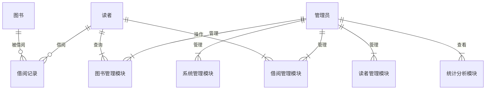

##  图书管理系统设计与实现

**作者：禅与计算机程序设计艺术**

## 1. 背景介绍

### 1.1 图书管理系统概述

图书管理系统是现代图书馆不可或缺的一部分，其核心功能是实现对图书馆馆藏资源的高效管理，包括图书的采购、编目、借阅、归还、查询、统计等。随着信息技术的快速发展，传统的纸质图书管理模式已经无法满足现代图书馆的需求，基于计算机和网络技术的图书管理系统应运而生。

### 1.2 图书管理系统发展历程

图书管理系统的发展经历了从人工管理到计算机管理，再到网络化管理的演变过程：

* **人工管理阶段**:  主要依靠人工记录和管理图书信息，效率低下且容易出错。
* **计算机管理阶段**: 利用计算机存储和处理图书信息，提高了管理效率和准确性。
* **网络化管理阶段**:  基于互联网技术，实现图书信息的共享和远程访问，为读者提供更加便捷的服务。

### 1.3 图书管理系统意义

* **提高图书馆管理效率**:  自动化处理繁琐的图书管理流程，节省人力成本。
* **提升读者借阅体验**:  提供便捷的图书查询、借阅、续借等服务，提高读者满意度。
* **促进图书馆资源共享**:  实现图书信息的互联互通，促进资源共享。
* **推动图书馆数字化转型**:  为图书馆数字化建设提供基础支撑。

## 2. 核心概念与联系

### 2.1 系统用户

* **管理员**:  负责系统管理、用户管理、图书管理、借阅管理等操作。
* **读者**:  可以通过系统查询图书信息、借阅图书、归还图书、续借图书等。

### 2.2  核心实体

* **图书**:  包括图书的基本信息（如书名、作者、出版社、ISBN等）和库存信息（如馆藏数量、可借阅数量等）。
* **读者**:  包括读者的基本信息（如姓名、学号/工号、联系方式等）和借阅信息（如已借阅图书、借阅历史等）。
* **借阅记录**:  记录每笔图书借阅信息，包括借阅时间、归还时间、借阅状态等。

### 2.3 核心功能模块

* **系统管理模块**:  提供用户管理、权限管理、系统设置等功能。
* **图书管理模块**:  提供图书的添加、删除、修改、查询、导入导出等功能。
* **读者管理模块**:  提供读者的添加、删除、修改、查询、导入导出等功能。
* **借阅管理模块**:  提供图书借阅、归还、续借、预约等功能。
* **统计分析模块**:  提供图书借阅情况、读者借阅情况等统计分析功能。

### 2.4 核心概念关系图



## 3. 核心算法原理具体操作步骤

### 3.1 图书搜索算法

#### 3.1.1  线性查找

* **原理**:  从头到尾遍历图书列表，逐一比较目标图书与列表中图书的信息。
* **操作步骤**:
    1. 从图书列表的第一个元素开始遍历。
    2. 将当前图书信息与目标图书信息进行比较。
    3. 若匹配成功，则返回当前图书信息；否则，继续遍历下一个元素。
    4. 若遍历完整个列表仍未找到匹配的图书，则返回空值。
* **适用场景**:  图书数量较少，对搜索效率要求不高的情况下。

#### 3.1.2  二分查找

* **原理**:  针对已排序的图书列表，每次将搜索范围缩小一半，直到找到目标图书或搜索范围为空。
* **操作步骤**:
    1. 定义搜索范围的左边界 `left` 和右边界 `right`，初始值为列表的第一个元素和最后一个元素。
    2. 当 `left <= right` 时，执行以下操作：
        * 计算中间位置 `mid = (left + right) / 2`。
        * 比较目标图书信息与 `mid` 位置图书信息的大小：
            * 若相等，则返回 `mid` 位置图书信息。
            * 若目标图书信息小于 `mid` 位置图书信息，则将 `right` 更新为 `mid - 1`，继续在左半部分搜索。
            * 若目标图书信息大于 `mid` 位置图书信息，则将 `left` 更新为 `mid + 1`，继续在右半部分搜索。
    3. 若 `left > right`，则表示未找到匹配的图书，返回空值。
* **适用场景**:  图书数量较多，且图书列表已排序的情况下，搜索效率较高。

### 3.2  借阅管理算法

#### 3.2.1  借阅操作

* **操作步骤**:
    1. 检查读者账号状态是否正常。
    2. 检查图书库存是否充足。
    3. 创建借阅记录，记录借阅时间、应还时间等信息。
    4. 更新图书库存信息，将可借阅数量减1。
    5. 更新读者借阅信息，将借阅记录添加到读者借阅列表中。
* **异常处理**:
    * 读者账号状态异常，则拒绝借阅。
    * 图书库存不足，则提示读者预约或选择其他图书。

#### 3.2.2  归还操作

* **操作步骤**:
    1. 检查借阅记录是否存在。
    2. 更新借阅记录，记录归还时间、逾期天数等信息。
    3. 更新图书库存信息，将可借阅数量加1。
    4. 更新读者借阅信息，将借阅记录从读者借阅列表中移除。
* **异常处理**:
    * 借阅记录不存在，则提示读者联系管理员处理。

#### 3.2.3  续借操作

* **操作步骤**:
    1. 检查借阅记录是否存在。
    2. 检查图书是否被其他读者预约。
    3. 更新借阅记录，将应还时间延长。
* **异常处理**:
    * 借阅记录不存在，则提示读者联系管理员处理。
    * 图书已被其他读者预约，则拒绝续借。

## 4. 数学模型和公式详细讲解举例说明

### 4.1 图书借阅率计算

* **公式**:  图书借阅率 = 某段时间内图书借阅次数 / 某段时间内图书总数 * 100%
* **举例说明**:  假设某图书馆2023年4月份共有图书10000册，该月图书借阅次数为5000次，则该图书馆2023年4月份的图书借阅率为 5000 / 10000 * 100% = 50%。

### 4.2 读者借阅排行榜

* **算法**:  统计每位读者在某段时间内的图书借阅次数，按照借阅次数从高到低排序，取前 N 名读者。
* **举例说明**:  假设某图书馆需要统计2023年4月份读者借阅排行榜前10名，则可以按照以下步骤进行：
    1. 统计每位读者在2023年4月份的图书借阅次数。
    2. 按照借阅次数从高到低对读者进行排序。
    3. 取排序结果的前10名读者，作为读者借阅排行榜前10名。

## 5. 项目实践：代码实例和详细解释说明

### 5.1  技术选型

* **编程语言**:  Java
* **数据库**:  MySQL
* **Web框架**:  Spring Boot
* **前端框架**:  Vue.js

### 5.2  数据库设计

```sql
-- 图书表
CREATE TABLE book (
  id INT PRIMARY KEY AUTO_INCREMENT,
  name VARCHAR(255) NOT NULL,
  author VARCHAR(255) NOT NULL,
  publisher VARCHAR(255) NOT NULL,
  isbn VARCHAR(20) NOT NULL,
  total_quantity INT NOT NULL,
  available_quantity INT NOT NULL
);

-- 读者表
CREATE TABLE reader (
  id INT PRIMARY KEY AUTO_INCREMENT,
  name VARCHAR(255) NOT NULL,
  student_id VARCHAR(20) DEFAULT NULL,
  phone VARCHAR(20) DEFAULT NULL,
  email VARCHAR(255) DEFAULT NULL
);

-- 借阅记录表
CREATE TABLE borrow_record (
  id INT PRIMARY KEY AUTO_INCREMENT,
  book_id INT NOT NULL,
  reader_id INT NOT NULL,
  borrow_date DATE NOT NULL,
  due_date DATE NOT NULL,
  return_date DATE DEFAULT NULL,
  FOREIGN KEY (book_id) REFERENCES book(id),
  FOREIGN KEY (reader_id) REFERENCES reader(id)
);
```

### 5.3  核心代码实现

#### 5.3.1  图书借阅功能

```java
@Service
public class BorrowService {

    @Autowired
    private BookRepository bookRepository;

    @Autowired
    private ReaderRepository readerRepository;

    @Autowired
    private BorrowRecordRepository borrowRecordRepository;

    public void borrowBook(Long bookId, Long readerId) {
        // 检查图书库存是否充足
        Book book = bookRepository.findById(bookId)
                .orElseThrow(() -> new ResourceNotFoundException("Book not found"));
        if (book.getAvailableQuantity() <= 0) {
            throw new BadRequestException("Book is not available");
        }

        // 创建借阅记录
        BorrowRecord borrowRecord = new BorrowRecord();
        borrowRecord.setBook(book);
        borrowRecord.setReader(readerRepository.findById(readerId)
                .orElseThrow(() -> new ResourceNotFoundException("Reader not found")));
        borrowRecord.setBorrowDate(LocalDate.now());
        borrowRecord.setDueDate(LocalDate.now().plusMonths(1));
        borrowRecordRepository.save(borrowRecord);

        // 更新图书库存信息
        book.setAvailableQuantity(book.getAvailableQuantity() - 1);
        bookRepository.save(book);
    }
}
```

## 6. 实际应用场景

### 6.1  公共图书馆

* 图书馆可以利用图书管理系统对馆藏资源进行高效管理，为读者提供便捷的借阅服务。

### 6.2  高校图书馆

* 高校图书馆可以利用图书管理系统为学生和教师提供丰富的图书资源和便捷的借阅服务，支持教学和科研工作。

### 6.3  企业图书馆

* 企业图书馆可以利用图书管理系统管理企业内部的图书资源，为员工提供学习和知识分享的平台。

## 7. 总结：未来发展趋势与挑战

### 7.1  未来发展趋势

* **智能化**:  利用人工智能技术，实现图书的自动分类、编目、推荐等功能。
* **数字化**:  将纸质图书数字化，提供电子书借阅服务。
* **移动化**:  开发移动端应用，方便读者随时随地借阅图书。
* **云计算**:  将图书管理系统部署到云平台，实现资源的弹性扩展和按需使用。

### 7.2  挑战

* **海量数据管理**:  随着图书馆馆藏资源的不断增加，如何高效管理海量数据是一个挑战。
* **数据安全**:  图书管理系统存储着大量的读者信息和图书信息，如何保障数据安全是一个重要问题。
* **用户体验**:  如何提供更加便捷、高效、人性化的用户体验是图书管理系统需要不断改进的方向。

## 8. 附录：常见问题与解答

### 8.1  如何注册账号？

* 读者可以凭有效证件到图书馆服务台进行注册。

### 8.2  忘记密码怎么办？

* 读者可以通过系统提供的“忘记密码”功能进行密码重置。

### 8.3  借阅图书后如何归还？

* 读者可以在借阅期限内将图书归还至图书馆指定地点。

### 8.4  如何查询图书信息？

* 读者可以通过图书馆网站或移动端应用查询图书信息。
