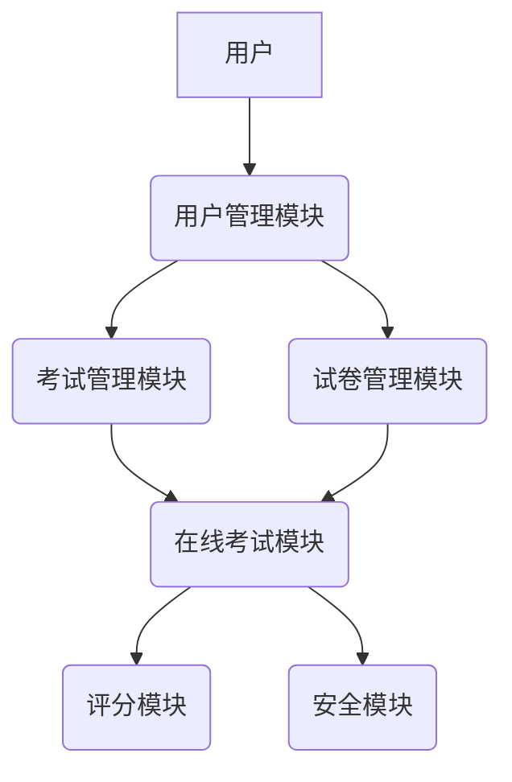

# 在线考试系统设计与实现

## 1. 背景介绍

### 1.1 在线考试系统的需求与重要性

随着互联网技术的快速发展和教育领域的不断创新,在线考试系统已经成为现代教育评估的重要组成部分。与传统的纸笔考试相比,在线考试系统具有诸多优势,如高效便捷、自动评分、数据分析等。它可以显著降低考试组织和管理的成本,提高考试过程的公平性和透明度。

在当前的教育形势下,在线考试系统具有以下重要意义:

1. **扩大覆盖范围**:在线考试系统可以突破地理位置的限制,让更多的学生参与到考试中来,实现教育资源的共享。
2. **提高效率**:自动化评分和数据分析能够大幅减少人工的工作量,提高考试管理和评估的效率。
3. **保障公平性**:通过系统化的管理和监控,在线考试系统可以确保考试过程的公平性和安全性。
4. **降低成本**:相比传统纸笔考试,在线考试系统可以显著降低考试组织和管理的成本。
5. **环保节约**:在线考试系统无需大量印刷和运输试卷,有助于环境保护和资源节约。

### 1.2 在线考试系统的发展历程

在线考试系统的发展可以追溯到20世纪90年代初期。早期的在线考试系统主要应用于一些专业领域的认证考试,如计算机等级考试、外语水平测试等。随着互联网技术的不断进步,在线考试系统也在不断发展和完善。

近年来,在线考试系统得到了广泛的应用和推广,覆盖了从小学到大学的各个教育阶段。特别是在疫情期间,在线考试系统发挥了重要作用,确保了教育教学的持续进行。同时,人工智能、大数据等新技术的融入,也为在线考试系统带来了新的发展机遇。

## 2. 核心概念与联系

### 2.1 在线考试系统的架构

一个典型的在线考试系统通常由以下几个核心模块组成:

1. **用户管理模块**:负责管理考生、教师和管理员等不同类型用户的注册、登录和权限管理。
2. **试卷管理模块**:用于教师创建、编辑和管理试卷,包括题目的添加、修改和组卷等功能。
3. **考试管理模块**:负责考试的发布、安排和监控,包括考试时间、地点、参与人员等信息的管理。
4. **在线考试模块**:为考生提供在线答题的界面,包括题目展示、答案提交和计时器等功能。
5. **评分模块**:自动评分考生的答案,并生成成绩报告和统计分析数据。
6. **安全模块**:确保考试过程的公平性和安全性,防止作弊行为发生。

这些模块通过良好的设计和集成,构建了一个完整的在线考试系统。下面是一个简化的系统架构示意图:



### 2.2 在线考试系统的关键技术

在线考试系统的实现涉及多种技术,包括但不限于:

1. **Web开发技术**:如HTML、CSS、JavaScript等前端技术,以及Java、Python、Node.js等后端技术,用于构建系统的用户界面和服务器端逻辑。
2. **数据库技术**:如MySQL、PostgreSQL、MongoDB等,用于存储和管理考试相关数据。
3. **网络通信技术**:如HTTP、WebSocket等,用于实现考生和服务器之间的实时通信和数据传输。
4. **安全技术**:如加密、身份认证、防火墙等,用于保护系统的安全性和防止作弊行为。
5. **人工智能技术**:如自然语言处理、计算机视觉等,可用于智能评分、作弊检测等功能。
6. **大数据技术**:如Hadoop、Spark等,用于处理和分析海量考试数据,挖掘有价值的信息。

这些技术的有机结合和合理应用,是实现高效、安全、智能的在线考试系统的关键所在。

## 3. 核心算法原理具体操作步骤

### 3.1 自动评分算法

自动评分是在线考试系统的核心功能之一,它可以显著提高评分效率,减轻教师的工作负担。常见的自动评分算法包括:

#### 3.1.1 字符串匹配算法

对于填空题、简答题等主观题型,字符串匹配算法可以用于比对考生答案与标准答案的相似度。常见的字符串匹配算法有:

1. **编辑距离算法**:计算两个字符串之间的编辑距离,即通过插入、删除和替换操作将一个字符串转换为另一个字符串所需的最小操作次数。
2. **N-gram算法**:将字符串分解为长度为N的子串,然后比较两个字符串中共享的N-gram数量,作为相似度的度量。

这些算法可以结合同义词词典、语义相似度等技术,提高评分的准确性。

#### 3.1.2 自然语言处理算法

对于主观题型,自然语言处理算法可以更深入地理解考生答案的语义信息,从而进行更准确的评分。常见的自然语言处理算法包括:

1. **词向量表示**:将文本表示为向量形式,如Word2Vec、GloVe等,用于捕捉词与词之间的语义关系。
2. **序列建模**:使用循环神经网络(RNN)、长短期记忆网络(LSTM)等模型,对文本进行序列建模和语义理解。
3. **注意力机制**:通过注意力机制,模型可以自动关注答案中的关键信息,提高评分的准确性。

这些算法需要大量的训练数据和计算资源,但可以显著提高主观题型的评分质量。

#### 3.1.3 评分策略

除了具体的算法,评分策略也是自动评分的重要组成部分。常见的评分策略包括:

1. **全匹配策略**:要求考生答案与标准答案完全匹配,适用于客观题型。
2. **部分匹配策略**:根据答案与标准答案的相似度给予部分分数,适用于主观题型。
3. **加权策略**:对不同题目或题目部分赋予不同的权重,反映它们的重要性。
4. **评分矩阵**:预先定义一个评分矩阵,根据答案的特征给予相应的分数。

评分策略的选择取决于具体的题型和评分要求,通常需要结合人工经验和数据分析进行优化。

### 3.2 作弊检测算法

为了确保在线考试的公平性和安全性,作弊检测是一个关键的环节。常见的作弊检测算法包括:

#### 3.2.1 行为分析算法

通过分析考生的操作行为,如键盘输入、鼠标移动、页面切换等,可以检测出一些异常行为,从而识别出潜在的作弊行为。常见的行为分析算法有:

1. **统计建模**:建立考生正常行为的统计模型,任何偏离该模型的行为都被视为异常。
2. **规则引擎**:预先定义一系列作弊行为规则,如频繁切换窗口、长时间无操作等,一旦触发规则即判定为作弊。
3. **机器学习模型**:使用监督或无监督的机器学习模型,从历史数据中学习作弊行为的模式。

这些算法需要收集大量的行为数据进行训练和优化,并且需要不断更新以应对新的作弊手段。

#### 3.2.2 环境监控算法

通过监控考生的环境,如声音、视频等,可以进一步检测作弊行为。常见的环境监控算法包括:

1. **声音分析**:通过麦克风采集环境声音,分析是否存在异常声音,如他人交流声等。
2. **视频分析**:通过摄像头捕捉考生的视频画面,分析是否存在作弊行为,如观看参考资料、他人协助等。
3. **人脸识别**:确保考场中的人员与注册的考生一致,防止代考行为发生。

这些算法需要结合计算机视觉、语音识别等技术,并且需要注意隐私保护和数据安全问题。

#### 3.2.3 网络监控算法

在网络层面,也可以采取一些措施来防止作弊行为,如:

1. **IP地址限制**:限制同一IP地址下只能有一个考生进行考试,防止多人同时参与。
2. **网络流量分析**:监控考生的网络流量,检测是否访问了非法网站或资源。
3. **设备指纹识别**:通过收集设备的硬件信息和软件环境,识别出每台设备的唯一标识,防止考生使用多台设备作弊。

这些算法需要与网络安全技术紧密结合,并且要平衡监控力度和隐私权的关系。

### 3.3 综合应用

在实际的在线考试系统中,通常需要综合应用多种算法,形成一个完整的解决方案。例如:

1. 对于客观题型,可以采用字符串匹配算法进行自动评分,同时结合行为分析算法和网络监控算法防止作弊。
2. 对于主观题型,可以使用自然语言处理算法进行语义理解和评分,并结合环境监控算法防止作弊。
3. 在评分策略方面,可以根据题型和难度采用不同的评分矩阵和加权策略。
4. 针对不同的作弊手段,可以灵活组合多种作弊检测算法,形成多层防护体系。

此外,算法的选择和参数调优需要结合大量的历史数据和人工经验,通过持续的迭代优化,不断提高系统的准确性和鲁棒性。

## 4. 数学模型和公式详细讲解举例说明

### 4.1 编辑距离算法

编辑距离算法是一种常用的字符串相似度计算方法,它计算将一个字符串转换为另一个字符串所需的最小编辑操作次数。常见的编辑操作包括插入、删除和替换。

设有两个字符串 $s_1$ 和 $s_2$,其长度分别为 $m$ 和 $n$,我们定义一个 $(m+1) \times (n+1)$ 的矩阵 $D$,其中 $D_{i,j}$ 表示将 $s_1$ 的前 $i$ 个字符转换为 $s_2$ 的前 $j$ 个字符所需的最小编辑距离。

$$
D_{i,j} = \begin{cases}
i & \text{if } j = 0 \\
j & \text{if } i = 0 \\
D_{i-1,j-1} & \text{if } s_1[i] = s_2[j] \\
1 + \min(D_{i-1,j}, D_{i,j-1}, D_{i-1,j-1}) & \text{if } s_1[i] \neq s_2[j]
\end{cases}
$$

其中,第一行和第一列分别表示将空字符串转换为另一个字符串所需的操作次数。当两个字符相同时,编辑距离不变;当两个字符不同时,需要进行插入、删除或替换操作,取这三种操作的最小值加1。

最终,编辑距离即为矩阵 $D$ 的最后一个元素 $D_{m,n}$。

例如,计算字符串 "intention" 和 "execution" 的编辑距离:

```
     e x e c u t i o n
   0 1 2 3 4 5 6 7 8 9
 0 1 2 3 4 5 6 7 8 9 8
i 2 1 2 3 4 5 6 7 8 9
n 3 2 3 2 3 4 5 6 7 8
t 4 3 2 3 4 3 4 5 6 7
e 5 4 3 2 3 4 5 4 5 6
n 6 5 4 3 4 5 6 5 6 7
t 7 6 5 4 5 6 7 