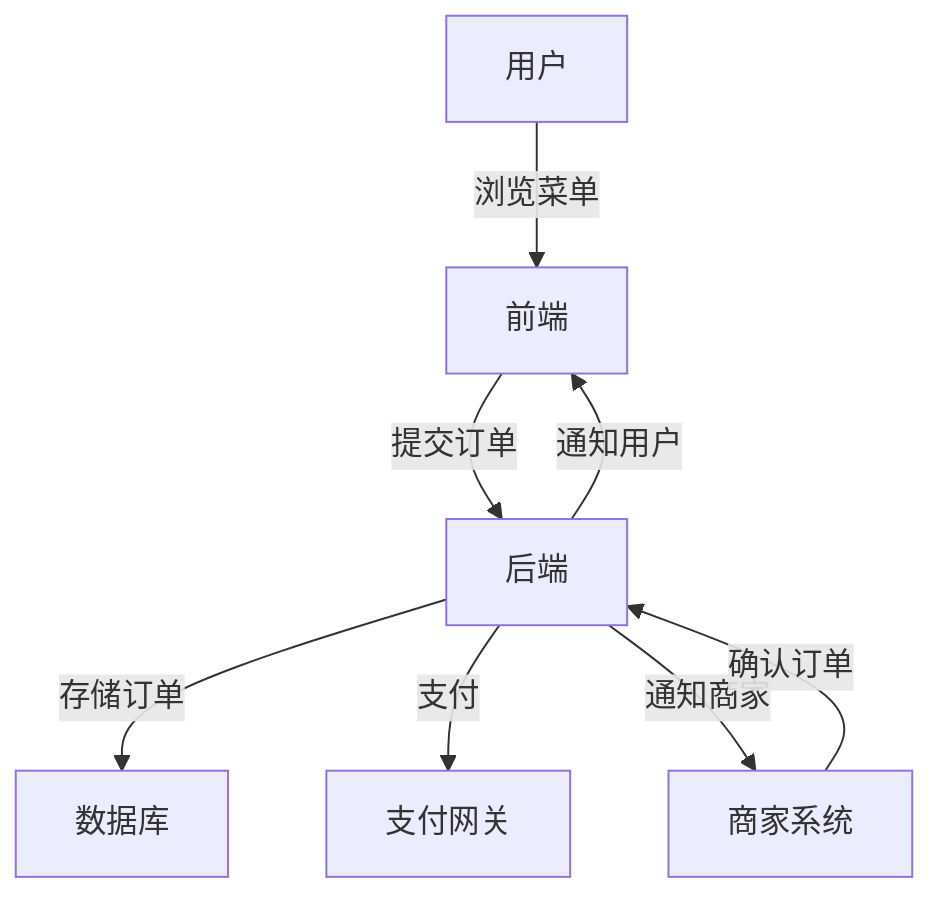

# 在线订餐系统详细设计与具体代码实现

作者：禅与计算机程序设计艺术

## 1.背景介绍

### 1.1 在线订餐系统的兴起

随着互联网技术的迅猛发展，在线订餐系统成为了现代生活中不可或缺的一部分。无论是外卖平台、餐厅自营的订餐系统，还是企业内部的员工餐饮管理系统，在线订餐系统都极大地提升了用户体验和运营效率。

### 1.2 市场需求与挑战

市场对在线订餐系统的需求日益增长，但同时也面临着诸多挑战，如高并发处理、实时数据同步、安全性保障、用户友好性等。这些挑战要求我们在设计和实现系统时，必须考虑到系统的高可用性、扩展性和安全性。

### 1.3 本文目标

本文旨在详细介绍一个在线订餐系统的设计与实现，包括系统架构、核心算法、数学模型、实际代码示例、应用场景、工具和资源推荐，以及未来的发展趋势与挑战。通过本文，读者将能够深入了解在线订餐系统的各个方面，并掌握相关的技术和实现方法。

## 2.核心概念与联系

### 2.1 系统架构

在线订餐系统的架构通常包括前端、后端、数据库和第三方服务。下图展示了一个典型的在线订餐系统架构：



### 2.2 前端技术

前端主要负责用户交互和界面展示，常用的技术包括HTML、CSS、JavaScript及其框架（如React、Vue.js、Angular）。前端需要与后端进行数据交互，通常通过RESTful API或GraphQL实现。

### 2.3 后端技术

后端负责业务逻辑处理、数据存储和第三方服务集成。常用的后端技术包括Node.js、Java、Python等编程语言及其框架（如Express、Spring Boot、Django）。后端需要处理高并发请求，保证系统的稳定性和性能。

### 2.4 数据库

数据库是系统的数据存储中心，常用的数据库包括关系型数据库（如MySQL、PostgreSQL）和NoSQL数据库（如MongoDB、Redis）。数据库设计需要考虑数据一致性、查询性能和扩展性。

### 2.5 第三方服务

在线订餐系统通常需要集成第三方服务，如支付网关（支付宝、微信支付）、短信网关、地图服务等。这些服务提供了系统所需的额外功能，提升了用户体验。

## 3.核心算法原理具体操作步骤

### 3.1 用户身份验证

用户身份验证是在线订餐系统的基础，常用的身份验证方法包括用户名密码验证、OAuth2.0、JWT等。以下是基于JWT的用户身份验证流程：

1. 用户通过前端提交用户名和密码。
2. 后端验证用户名和密码的正确性。
3. 验证通过后，后端生成JWT，并将其返回给前端。
4. 前端将JWT存储在本地（如LocalStorage）。
5. 后续请求中，前端将JWT附加在请求头中，后端验证JWT的有效性。

### 3.2 菜单管理

菜单管理包括菜单的增删改查操作，以及菜单项的分类和价格管理。以下是菜单管理的操作步骤：

1. 商家通过后端管理界面添加或修改菜单项。
2. 后端将菜单项信息存储在数据库中。
3. 前端通过API请求获取菜单项信息，并展示给用户。
4. 用户选择菜单项并提交订单。

### 3.3 订单处理

订单处理是在线订餐系统的核心，包括订单的创建、支付、确认和配送等步骤。以下是订单处理的操作步骤：

1. 用户在前端选择菜单项并提交订单。
2. 后端接收订单请求，生成订单记录并存储在数据库中。
3. 后端调用支付网关进行支付处理。
4. 支付成功后，后端通知商家系统进行订单确认。
5. 商家确认订单后，通知配送员进行配送。
6. 配送员将订单送达用户，并更新订单状态。

### 3.4 实时数据同步

实时数据同步是确保系统各部分数据一致性的关键。常用的方法包括WebSocket、消息队列（如Kafka、RabbitMQ）等。以下是基于WebSocket的实时数据同步流程：

1. 前端与后端建立WebSocket连接。
2. 后端在数据变更时，通过WebSocket向前端推送数据。
3. 前端接收到数据后，更新界面显示。

## 4.数学模型和公式详细讲解举例说明

### 4.1 订单总价计算

订单总价计算是在线订餐系统的基础功能，公式如下：

$$
\text{订单总价} = \sum_{i=1}^{n} (\text{菜单项价格}_i \times \text{数量}_i) + \text{配送费}
$$

其中，$n$为订单中的菜单项数量，$\text{菜单项价格}_i$为第$i$个菜单项的价格，$\text{数量}_i$为第$i$个菜单项的数量，$\text{配送费}$为订单的配送费用。

### 4.2 优惠券折扣计算

优惠券折扣计算是提升用户体验的重要功能，公式如下：

$$
\text{折扣总价} = \text{订单总价} - \text{优惠金额}
$$

其中，$\text{优惠金额}$根据优惠券的类型和规则计算，如满减、折扣等。

### 4.3 配送路径优化

配送路径优化是提高配送效率的关键，常用的方法包括Dijkstra算法、A*算法等。以下是Dijkstra算法的基本步骤：

1. 初始化起点到各节点的最短距离为无穷大，起点到自身的距离为0。
2. 将起点加入已访问节点集合。
3. 从未访问节点中选择距离起点最近的节点，加入已访问节点集合。
4. 更新该节点的邻接节点的最短距离。
5. 重复步骤3和4，直到所有节点都被访问。

## 5.项目实践：代码实例和详细解释说明

### 5.1 前端代码示例

以下是一个基于React的前端代码示例，用于展示菜单项和提交订单：

```javascript
import React, { useState, useEffect } from 'react';
import axios from 'axios';

const Menu = () => {
  const [menuItems, setMenuItems] = useState([]);
  const [order, setOrder] = useState([]);

  useEffect(() => {
    axios.get('/api/menu').then(response => {
      setMenuItems(response.data);
    });
  }, []);

  const addToOrder = (item) => {
    setOrder([...order, item]);
  };

  const submitOrder = () => {
    axios.post('/api/order', { items: order }).then(response => {
      alert('Order submitted successfully!');
    });
  };

  return (
    <div>
      <h1>Menu</h1>
      <ul>
        {menuItems.map(item => (
          <li key={item.id}>
            {item.name} - ${item.price}
            <button onClick={() => addToOrder(item)}>Add to Order</button>
          </li>
        ))}
      </ul>
      <button onClick={submitOrder}>Submit Order</button>
    </div>
  );
};

export default Menu;
```

### 5.2 后端代码示例

以下是一个基于Node.js和Express的后端代码示例，用于处理菜单和订单请求：

```javascript
const express = require('express');
const bodyParser = require('body-parser');
const app = express();
const port = 3000;

app.use(bodyParser.json());

let menuItems = [
  { id: 1, name: 'Pizza', price: 10 },
  { id: 2, name: 'Burger', price: 8 },
  { id: 3, name: 'Pasta', price: 12 },
];

let orders = [];

app.get('/api/menu', (req, res) => {
  res.json(menuItems);
});

app.post('/api/order', (req, res) => {
  const order = req.body;
  orders.push(order);
  res.status(201).send('Order submitted successfully!');
});

app.listen(port, () => {
  console.log(`Server running at http://localhost:${port}`);
});
```

### 5.3 数据库设计

以下是一个基于MySQL的数据库设计示例，包括菜单项表和订单表：

```sql
CREATE TABLE `menu_items` (
  `id` int(11) NOT NULL AUTO_INCREMENT