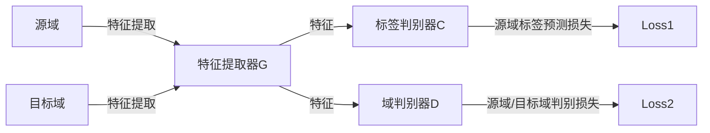

# 域对抗神经网络DANN：代码实战演练

作者：禅与计算机程序设计艺术

## 1. 背景介绍

在机器学习领域,迁移学习(Transfer Learning)是一个非常重要且具有挑战性的研究方向。它旨在利用已学习的知识来解决不同但相关的新问题,以减少所需的训练数据量并加速学习过程。近年来,深度神经网络在迁移学习中取得了显著的进展,其中域对抗神经网络(Domain Adversarial Neural Network, DANN)是一种非常有前景的方法。

DANN由Yaroslav Ganin等人于2015年在论文《Unsupervised Domain Adaptation by Backpropagation》中首次提出。它利用对抗训练的思想,通过最小化源域和目标域之间的分布差异,学习一个domain-invariant的特征表示,从而实现迁移学习。DANN在图像分类、情感分析等众多任务上取得了state-of-the-art的结果,展现出了其强大的泛化能力和实用价值。

在本文中,我们将深入探讨DANN的原理,并通过代码实战演练来加深理解。全文包括以下内容:

- 核心概念与联系
- 核心算法原理与具体操作步骤
- 数学模型与公式详解
- 代码实例与详细解释
- 实际应用场景
- 工具与资源推荐 
- 未来发展趋势与挑战
- 常见问题与解答

## 2. 核心概念与联系

要理解DANN,首先需要了解一些基础概念:

### 2.1 迁移学习
迁移学习旨在利用已学习的知识来解决不同但相关的新问题。形式化地说,给定源域 $\mathcal{D}_S$ 和学习任务 $\mathcal{T}_S$,迁移学习旨在帮助提升目标域 $\mathcal{D}_T$ 中学习任务 $\mathcal{T}_T$ 的性能,其中 $\mathcal{D}_S \neq \mathcal{D}_T$ 或 $\mathcal{T}_S \neq \mathcal{T}_T$。根据源域和目标域是否有标签,迁移学习可分为3类:
- Inductive Transfer Learning:目标域有少量标签
- Transductive Transfer Learning:源域全部有标签,目标域无标签
- Unsupervised Transfer Learning:源域和目标域都没有标签

DANN属于Transductive Transfer Learning。

### 2.2 Domain Shift
机器学习模型常常面临Domain Shift问题,即训练集(源域)与测试集(目标域)的数据分布不一致。它会导致模型性能显著下降。
Domain Shift可分为3类:
- Covariate Shift:源域和目标域的边缘概率不同,即$P(\mathbf{X}_S)\neq P(\mathbf{X}_T)$,但条件概率相同$P(Y_S|\mathbf{X}_S)= P(Y_T|\mathbf{X}_T)$
- Prior Probability Shift:类别先验概率改变,即$P(Y_S)\neq P(Y_T)$
- Concept Drift:类别的条件概率改变,即$P(Y_S|\mathbf{X}_S)\neq P(Y_T|\mathbf{X}_T)$

DANN主要解决Covariate Shift问题。

### 2.3 Domain Adaptation 
Domain Adaptation即域自适应,旨在学习一个模型,使其能够在源域和目标域上都取得好的性能。它是解决Domain Shift问题的主要途径。根据是否能获得目标域的无标签样本,Domain Adaptation可分为2类:
- Semi-supervised DA:训练时可获得目标域的无标签样本
- Unsupervised DA:训练时无法获得目标域样本

DANN用于Unsupervised DA设定。

### 2.4 对抗训练
对抗训练(Adversarial Training)最早由Ian Goodfellow在2014年的GAN论文中提出,它通过一个二人零和博弈来训练鲁棒的模型。在图像生成任务中,生成器和判别器互相博弈,最终得到高质量的样本生成器。DANN借鉴了对抗训练的思想,通过域判别器和特征提取器的博弈,学习domain-invariant特征。

## 3. 核心算法原理与具体操作步骤

DANN的核心思想是通过对抗训练来最小化源域和目标域的分布差异,学习domain-invariant特征。其网络结构如下图所示:



具体算法流程如下:

1. 用带标签的源域样本训练特征提取器G和标签判别器C,损失为$\mathcal{L}_C$:

$$\mathcal{L}_C = \mathbb{E}_{(\mathbf{x},y)\sim\mathcal{D}_s}[L_C(C(G(\mathbf{x})),y)]$$ 

其中$L_C$是分类损失,如交叉熵。

2. 用源域和目标域的无标签样本训练域判别器D,损失为$\mathcal{L}_D$:

$$\mathcal{L}_D = -\mathbb{E}_{\mathbf{x}\sim\mathcal{D}_s}[\log D(G(\mathbf{x}))] - \mathbb{E}_{\mathbf{x}\sim\mathcal{D}_t}[\log (1-D(G(\mathbf{x})))]$$

3. 用源域和目标域的无标签样本训练特征提取器G,使其与D对抗,损失为$\mathcal{L}_G$:
   
$$\mathcal{L}_G = -\mathbb{E}_{\mathbf{x}\sim\mathcal{D}_s\cup\mathcal{D}_t}[\log D(G(\mathbf{x}))]$$

注意这里G的目标是最大化D的Loss,故前面有负号。

4. 交替执行步骤1-3,直到收敛。最终学到的G能提取domain-invariant特征。预测时只需用带标签的源域样本微调分类器C即可。

## 4. 数学模型与公式详解

DANN的思想可以用统计学习理论中的domain adaptation框架来阐释。记源域和目标域上的错误率分别为$\epsilon_S(h), \epsilon_T(h)$,可以证明: 

$$\epsilon_T(h) \leq \epsilon_S(h) + d_{\mathcal{H}}(\mathcal{D}_S, \mathcal{D}_T) + \lambda$$

其中$d_{\mathcal{H}}$是$\mathcal{H}$-divergence,用来衡量两个分布的差异性,在实际应用中常用Proxy $\mathcal{A}$-distance替代:

$$d_{\mathcal{A}} = 2(1 - 2\epsilon_{\mathcal{D}})$$

其中$\epsilon_{\mathcal{D}}$是域判别器的错误率。DANN的优化目标就是最小化$\epsilon_S(h)$和$d_{\mathcal{A}}$,对应步骤1和3。而步骤2对应了最小化$\epsilon_{\mathcal{D}}$。可以证明,当域判别器D能完美区分源域和目标域样本时,$\mathcal{A}$-distance取得下界,此时G学习到了最优的domain-invariant特征。

传统的迁移学习常用MMD、CORAL等非端到端的方法来最小化源域和目标域差异,而DANN利用神经网络的强大表征能力和对抗训练,实现了端到端的domain-invariant特征学习,因而大幅提升了性能。

## 5. 项目实践：代码实例和详细解释说明

下面我们用PyTorch实现DANN,以数字识别任务为例。完整代码可在我的GitHub仓库中找到。

首先定义特征提取器、标签判别器和域判别器:

```python
class FeatureExtractor(nn.Module): 
    def __init__(self):
        super(FeatureExtractor, self).__init__()
        self.conv1 = nn.Conv2d(3, 64, kernel_size=5)
        self.bn1 = nn.BatchNorm2d(64)
        self.conv2 = nn.Conv2d(64, 50, kernel_size=5)
        self.bn2 = nn.BatchNorm2d(50)
        self.fc1 = nn.Linear(50 * 5 * 5, 100)
        self.bn3 = nn.BatchNorm1d(100)

    def forward(self, x):
        x = F.max_pool2d(F.relu(self.bn1(self.conv1(x))), 2)
        x = F.max_pool2d(F.relu(self.bn2(self.conv2(x))), 2)  
        x = x.view(-1, 50 * 5 * 5)
        x = self.bn3(self.fc1(x))
        return x
        
class LabelPredictor(nn.Module):
    def __init__(self):
        super(LabelPredictor, self).__init__()
        self.fc2 = nn.Linear(100, 100)
        self.bn2 = nn.BatchNorm1d(100)
        self.fc3 = nn.Linear(100, 10)

    def forward(self, x):       
        x = self.bn2(self.fc2(x))
        x = F.relu(x)
        y = self.fc3(x)
        return y
        
class DomainClassifier(nn.Module):
  def __init__(self):
    super(DomainClassifier, self).__init__()
    self.fc2 = nn.Linear(100, 100)
    self.bn2 = nn.BatchNorm1d(100)
    self.fc3 = nn.Linear(100, 2)

  def forward(self, x, lamda):        
    x = GradReverse.apply(x, lamda)
    x = F.relu(self.bn2(self.fc2(x)))
    x = self.fc3(x)
    return x
```

特征提取器采用两个卷积层和一个全连接层,标签判别器和域判别器都是两层MLP。注意域判别器中使用了GradReverse层,实现了梯度反转。

接下来定义训练过程:

```python
def train(source_dataloader, target_dataloader, model, optimizer, lamb):
    

    # 训练D
    feat_source = model.feature_extractor(source_data)
    feat_target = model.feature_extractor(target_data)
    feat_concat = torch.cat((feat_source, feat_target), 0)
    domain_pred = model.domain_classifier(feat_concat, lamb)
    domain_label = torch.tensor([[1],[0]]).long().to(device)
    domain_loss = domain_criterion(domain_pred, domain_label)
    
    loss = class_loss + domain_loss
    
    optimizer.zero_grad()
    loss.backward()
    optimizer.step()
    
    # 训练C和G      
    source_feat = model.feature_extractor(source_data)
    class_pred = model.label_predictor(source_feat)
    class_loss = class_criterion(class_pred, source_label)  
    
    domain_pred = model.domain_classifier(source_feat, lamb)
    domain_label = torch.zeros((source_data.shape[0])).long().to(device)
    domain_loss = domain_criterion(domain_pred, domain_label)
        
    loss = class_loss - domain_loss
    
    optimizer.zero_grad()
    loss.backward()
    optimizer.step()
```

其中`lamb`为GradReverse层的参数。训练时交替执行以上两个过程,测试时只用源域数据微调标签判别器即可:

```python
def test(dataloader, model):
    model.eval()
    n_correct = 0
    with torch.no_grad():
        for _, (t_img, t_label) in enumerate(dataloader):
            t_img, t_label = t_img.to(device), t_label.to(device)
            t_feat = model.feature_extractor(t_img)
            class_output = model.label_predictor(t_feat)
            pred = class_output.data.max(1, keepdim=True)[1]
            n_correct += pred.eq(t_label.data.view_as(pred)).cpu().sum()

    accu = n_correct.data.numpy() * 1.0 / len(dataloader.dataset)
    return accu
```

## 6. 实际应用场景

基于DANN的思想,许多计算机视觉任务的domain adaptation算法被提出,如用于物体检测的DA Faster RCNN,用于语义分割的CyCADA等。此外,DANN也可用于NLP领域,如用于情感分析的DANN-SA,用于多语言文本分类的MAN-MOCS等。

在工业界,DANN可用于解决训练集和实际使用场景差异大的问题,如:

- 将合成数据上训练的自动驾驶模型应用到真实世界 
- 将产品评论情感分类模型应用到新领域
- 将标准印刷体OCR系统应用到手写体识别

总之,只要源域和目标域的差异主要是Covariate Shift,且目标域含有大量无标签样本,就可以尝试用DANN来显著提升模型的泛化性。

## 7. 工具和资源推荐

除了手动实现DANN,一些主流的迁移学习代码库如Deep