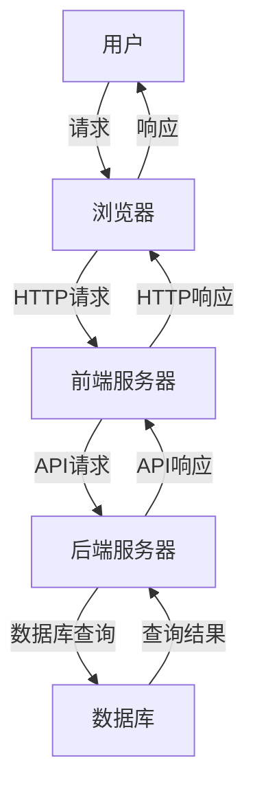

# 基于BS模式的服装进销存管理系统详细设计与具体代码实现

作者：禅与计算机程序设计艺术

## 1. 背景介绍

### 1.1 服装行业的现状与挑战
服装行业一直以来都是一个竞争激烈且快速变化的市场。随着电商的兴起和全球化的加剧，服装企业面临着越来越多的挑战，如库存管理、销售渠道多样化、客户需求快速变化等。为了在这种环境中保持竞争力，企业需要高效的进销存管理系统来优化库存、提高销售效率和降低运营成本。

### 1.2 BS模式的优势
BS（Browser-Server）模式，即浏览器-服务器模式，是一种常见的网络应用架构模式。相比于传统的CS（Client-Server）模式，BS模式具有以下优势：
- **部署方便**：用户只需通过浏览器访问，无需安装客户端软件。
- **维护简单**：系统的更新和维护集中在服务器端，减少了维护成本。
- **跨平台**：浏览器作为客户端，具有良好的跨平台性，适用于各种操作系统。

### 1.3 服装进销存管理系统的需求分析
一个高效的服装进销存管理系统应具备以下功能：
- **库存管理**：实时监控库存数量，支持库存预警和自动补货。
- **采购管理**：管理采购订单，跟踪采购进度，支持供应商管理。
- **销售管理**：管理销售订单，跟踪销售业绩，支持多渠道销售。
- **报表分析**：生成各种统计报表，提供数据分析支持决策。

## 2. 核心概念与联系

### 2.1 进销存管理系统的核心概念
- **库存管理**：包括入库、出库、库存调整等操作，确保库存数据的准确性。
- **采购管理**：处理采购订单的创建、审核、入库等流程，确保物料及时供应。
- **销售管理**：处理销售订单的创建、审核、出库等流程，确保销售数据的准确性。
- **报表分析**：通过数据分析和报表生成，帮助企业进行经营决策。

### 2.2 BS模式的核心技术
- **前端技术**：HTML、CSS、JavaScript、Vue.js、React等，用于构建用户界面。
- **后端技术**：Java、Spring Boot、Node.js、Express等，用于处理业务逻辑和数据交互。
- **数据库**：MySQL、PostgreSQL、MongoDB等，用于存储和管理数据。
- **API接口**：RESTful API、GraphQL等，用于前后端数据交互。

### 2.3 核心概念之间的联系
在一个BS模式的服装进销存管理系统中，前端负责用户界面的展示和用户操作的处理，后端负责业务逻辑的处理和数据的管理，数据库负责数据的存储和查询。前后端通过API接口进行数据交互，共同完成系统的各项功能。

## 3. 核心算法原理具体操作步骤

### 3.1 库存管理算法
库存管理算法的核心是确保库存数据的准确性和实时性。主要操作步骤如下：
1. **入库操作**：当新商品到货时，系统生成入库单，并更新库存数量。
2. **出库操作**：当商品销售或调拨时，系统生成出库单，并更新库存数量。
3. **库存调整**：当发现库存数据不准确时，系统允许进行库存调整操作，确保库存数据的准确性。

### 3.2 采购管理算法
采购管理算法的核心是确保物料的及时供应和采购数据的准确性。主要操作步骤如下：
1. **采购订单生成**：根据库存预警或需求计划，生成采购订单。
2. **采购订单审核**：采购订单生成后，需要经过审核流程，确保采购的合理性。
3. **入库操作**：采购到货后，生成入库单，并更新库存数量。

### 3.3 销售管理算法
销售管理算法的核心是确保销售数据的准确性和销售流程的顺畅。主要操作步骤如下：
1. **销售订单生成**：根据客户需求，生成销售订单。
2. **销售订单审核**：销售订单生成后，需要经过审核流程，确保销售的合理性。
3. **出库操作**：销售订单审核通过后，生成出库单，并更新库存数量。

### 3.4 报表分析算法
报表分析算法的核心是通过数据分析，生成各种统计报表，帮助企业进行经营决策。主要操作步骤如下：
1. **数据采集**：从库存、采购、销售等模块采集数据。
2. **数据处理**：对采集的数据进行清洗、过滤、聚合等处理。
3. **报表生成**：根据处理后的数据，生成各种统计报表。

## 4. 数学模型和公式详细讲解举例说明

### 4.1 库存预警模型
库存预警模型用于预测库存不足的情况，并及时发出预警。常用的库存预警模型有以下几种：

#### 4.1.1 安全库存模型
安全库存模型的核心公式为：
$$
S_s = d \times L + z \times \sigma \times \sqrt{L}
$$
其中：
- $S_s$ 为安全库存量
- $d$ 为日均需求量
- $L$ 为订货提前期
- $z$ 为服务水平对应的标准正态分布值
- $\sigma$ 为日需求量的标准差

#### 4.1.2 经济订货量模型
经济订货量模型的核心公式为：
$$
EOQ = \sqrt{\frac{2DS}{H}}
$$
其中：
- $EOQ$ 为经济订货量
- $D$ 为年需求量
- $S$ 为每次订货的固定成本
- $H$ 为单位库存的年持有成本

### 4.2 销售预测模型
销售预测模型用于预测未来的销售量，常用的销售预测模型有以下几种：

#### 4.2.1 移动平均模型
移动平均模型的核心公式为：
$$
F_t = \frac{1}{n} \sum_{i=0}^{n-1} D_{t-i}
$$
其中：
- $F_t$ 为第 $t$ 期的预测值
- $n$ 为移动平均的周期
- $D_{t-i}$ 为第 $t-i$ 期的实际需求量

#### 4.2.2 指数平滑模型
指数平滑模型的核心公式为：
$$
F_t = \alpha D_{t-1} + (1 - \alpha) F_{t-1}
$$
其中：
- $F_t$ 为第 $t$ 期的预测值
- $\alpha$ 为平滑系数（0 < $\alpha$ < 1）
- $D_{t-1}$ 为第 $t-1$ 期的实际需求量
- $F_{t-1}$ 为第 $t-1$ 期的预测值

### 4.3 实例讲解
假设某服装企业的日均需求量为100件，订货提前期为5天，服务水平为95%（对应的 $z$ 值为1.65），日需求量的标准差为20件。则其安全库存量为：
$$
S_s = 100 \times 5 + 1.65 \times 20 \times \sqrt{5} \approx 582
$$
即该企业的安全库存量应为582件。

## 5. 项目实践：代码实例和详细解释说明

### 5.1 系统架构设计
系统架构设计是系统开发的基础，本文采用BS模式，系统架构如下：



### 5.2 前端代码示例
前端采用Vue.js框架，以下是一个简单的库存管理页面的代码示例：

```javascript
<template>
  <div>
    <h1>库存管理</h1>
    <table>
      <tr>
        <th>商品名称</th>
        <th>库存数量</th>
        <th>操作</th>
      </tr>
      <tr v-for="item in inventory" :key="item.id">
        <td>{{ item.name }}</td>
        <td>{{ item.quantity }}</td>
        <td>
          <button @click="adjustInventory(item.id)">调整库存</button>
        </td>
      </tr>
    </table>
  </div>
</template>

<script>
