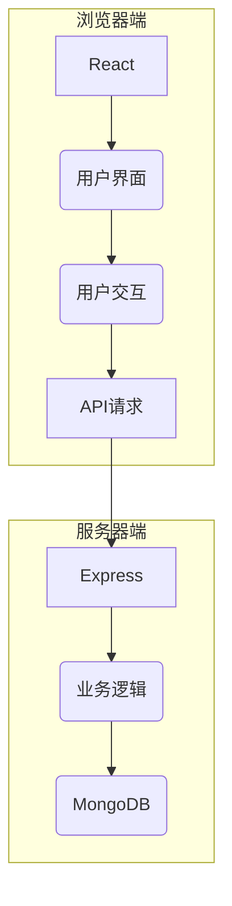

# 基于BS考试系统详细设计与具体代码实现

## 1. 背景介绍

### 1.1 考试系统的重要性

在当今信息化时代,考试系统已经成为教育领域不可或缺的重要组成部分。传统的纸笔考试模式存在诸多弊端,如耗费大量人力物力、难以保证考试公平公正、成绩统计效率低下等。因此,构建一个高效、安全、可靠的在线考试系统势在必行。

### 1.2 BS架构介绍  

BS架构(Browser/Server架构)是一种常见的软件系统架构模式,它将整个系统划分为浏览器端(Browser)和服务器端(Server)两部分。浏览器端负责显示界面和收集用户输入,服务器端负责处理业务逻辑和数据存储。BS架构具有跨平台、易部署、易维护等优点,非常适合构建在线考试系统。

## 2. 核心概念与联系

### 2.1 考试系统核心概念

- **考生(Examinee)**: 参加考试的人员。
- **考试(Exam)**: 由一定数量的试题组成的考核活动。
- **试题(Question)**: 用于考核知识点的具体问题。
- **考场(Examination Room)**: 考生参加考试的虚拟空间。
- **监考(Invigilation)**: 确保考试过程公平公正的管理措施。

### 2.2 核心概念之间的关系

考试系统的核心是围绕考试这一活动展开的。考生在指定的考场参加特定的考试,考试由一系列试题组成,监考措施确保整个过程的公平公正性。这些概念相互关联、相互作用,共同构建了完整的考试系统。

## 3. 核心算法原理具体操作步骤  

### 3.1 用户身份认证算法

考试系统需要对不同身份的用户(如考生、监考员等)进行严格的身份认证。一种常见的身份认证算法是基于哈希的密码存储与验证算法,具体步骤如下:

1. **密码哈希化存储**: 在用户注册时,将用户输入的原始密码使用安全的哈希算法(如SHA-256)进行哈希运算,只存储哈希值而不存储原始密码。
2. **密码验证**: 在用户登录时,将用户输入的密码进行相同的哈希运算,并与存储的哈希值进行比对,如果相同则认证通过。

该算法的优点是即使数据库被攻破,也无法获取用户的原始密码,提高了系统的安全性。

### 3.2 试题随机排列算法

为了防止考生之间相互作弊,需要对每个考生的试题顺序进行随机排列。一种高效的算法是Fisher-Yates洗牌算法,具体步骤如下:

```python
import random

def shuffle(questions):
    for i in range(len(questions)-1, 0, -1):
        j = random.randint(0, i)
        questions[i], questions[j] = questions[j], questions[i]
    return questions
```

该算法的时间复杂度为O(n),能够高效地对试题列表进行随机排列。

### 3.3 考试时间管理算法

考试时间的管理是考试系统的核心功能之一。一种常见的算法是基于服务器时间戳的时间管理算法,具体步骤如下:

1. 考生开始答题时,服务器记录当前时间戳作为起始时间戳。
2. 每次考生提交答案时,服务器计算当前时间戳与起始时间戳的差值,作为已用时间。
3. 如果已用时间超过规定的考试时长,则禁止考生继续作答。

该算法能够精确地控制考试时间,确保考试公平公正。

## 4. 数学模型和公式详细讲解举例说明

### 4.1 信息熵模型

在考试系统中,我们可以使用信息熵模型来评估试题的难易程度。信息熵公式如下:

$$H(X) = -\sum_{i=1}^{n}P(x_i)\log_2 P(x_i)$$

其中,X是一个离散的随机变量,取值为$x_1,x_2,...,x_n$,P(x)是X取值为x的概率。

对于某个特定的试题,我们可以将其答对和答错看作两个事件,概率分别为p和1-p。将这两个概率代入信息熵公式,我们得到:

$$H = -p\log_2 p - (1-p)\log_2 (1-p)$$

当p=0或p=1时,信息熵H=0,表示该试题太容易或太难。当p=0.5时,信息熵H达到最大值1,表示该试题难度适中。因此,我们可以利用信息熵的值来衡量试题的难易程度,并据此调整试题的分布。

### 4.2 项目响应分析模型

考试系统需要评估项目响应的质量,以确保良好的用户体验。我们可以使用项目响应分析(IRT)模型来量化项目响应的质量。IRT模型中的一个核心概念是项目特征曲线(ICC),其公式如下:

$$P(X_{ij}=1|\theta_i,a_j,b_j) = \frac{e^{a_j(\theta_i - b_j)}}{1+e^{a_j(\theta_i - b_j)}}$$

其中,$\theta_i$表示考生i的能力水平,$a_j$表示项目j的区分度参数,$b_j$表示项目j的难度参数。该模型能够描述考生的能力水平与作答正确的概率之间的关系。

通过估计模型参数$a_j$和$b_j$,我们可以评估项目的质量。一个好的项目应该具有较高的区分度参数$a_j$,能够很好地区分不同能力水平的考生;同时,难度参数$b_j$应该适中,既不太容易也不太困难。

## 4. 项目实践:代码实例和详细解释说明

在本节中,我们将展示基于BS架构的在线考试系统的具体实现代码,并对关键部分进行详细解释。

### 4.1 系统架构

我们采用了典型的BS架构,将系统划分为浏览器端和服务器端两部分。

浏览器端使用React框架开发,负责渲染用户界面、收集用户输入并与服务器端进行交互。服务器端使用Node.js和Express框架开发RESTful API,负责处理业务逻辑和数据存储,使用MongoDB作为数据库。



### 4.2 用户认证

我们使用了基于JWT(JSON Web Token)的用户认证机制。用户登录时,服务器端会生成一个JWT令牌,其中包含了用户ID和过期时间等信息。浏览器端将JWT令牌存储在本地存储中,并在每次向服务器发送请求时将其附加在请求头中。服务器端会验证JWT令牌的合法性,从而确认用户身份。

```javascript
// 服务器端代码
const jwt = require('jsonwebtoken');

// 生成JWT令牌
const token = jwt.sign({ userId: user._id }, process.env.JWT_SECRET, {
  expiresIn: '1h'
});

// 验证JWT令牌
const decoded = jwt.verify(token, process.env.JWT_SECRET);
const userId = decoded.userId;
```

### 4.3 试题管理

我们使用Mongoose模型来定义试题的数据结构,并提供了CRUD操作的API接口。

```javascript
// 试题模型
const questionSchema = new mongoose.Schema({
  content: { type: String, required: true },
  options: [{ type: String, required: true }],
  answer: { type: Number, required: true },
  category: { type: mongoose.Schema.Types.ObjectId, ref: 'Category' },
  difficulty: { type: Number, required: true }
});

const Question = mongoose.model('Question', questionSchema);

// API接口
app.get('/api/questions', async (req, res) => {
  const questions = await Question.find();
  res.json(questions);
});
```

### 4.4 考试管理

我们定义了一个Exam模型来表示考试,包含了考试时长、考试开始时间、结束时间等属性。在考试开始时,我们会为每个考生生成一个随机排列的试题列表,并记录考试的开始时间戳。考生提交答案时,我们会验证当前时间是否超过考试时长。

```javascript
// 考试模型
const examSchema = new mongoose.Schema({
  name: { type: String, required: true },
  duration: { type: Number, required: true }, // 考试时长(分钟)
  startTime: { type: Date, required: true }, // 考试开始时间
  endTime: { type: Date, required: true }, // 考试结束时间
  questions: [{ type: mongoose.Schema.Types.ObjectId, ref: 'Question' }]
});

const Exam = mongoose.model('Exam', examSchema);

// 开始考试
app.post('/api/exams/:id/start', async (req, res) => {
  const exam = await Exam.findById(req.params.id);
  const startTime = new Date();
  const endTime = new Date(startTime.getTime() + exam.duration * 60000);

  // 为考生生成随机排列的试题列表
  const questions = await Question.find({ _id: { $in: exam.questions } });
  const shuffledQuestions = shuffle(questions);

  // 存储考试信息
  exam.startTime = startTime;
  exam.endTime = endTime;
  exam.shuffledQuestions = shuffledQuestions.map(q => q._id);
  await exam.save();

  res.json({ startTime, endTime, questions: shuffledQuestions });
});
```

### 4.5 答题提交与评分

考生提交答案时,我们会验证答案的正确性,并根据考试时间计算得分。如果考试时间已经结束,我们会拒绝接受新的答案提交。

```javascript
app.post('/api/exams/:id/submit', async (req, res) => {
  const exam = await Exam.findById(req.params.id);
  const currentTime = new Date();

  // 验证考试时间是否已结束
  if (currentTime > exam.endTime) {
    return res.status(400).json({ error: 'Exam has ended' });
  }

  const { questionId, answer } = req.body;
  const question = await Question.findById(questionId);

  // 验证答案正确性
  const isCorrect = question.answer === answer;
  let score = isCorrect ? 1 : 0;

  // 根据剩余时间计算得分
  const elapsedTime = currentTime - exam.startTime;
  const remainingTime = exam.duration * 60000 - elapsedTime;
  if (remainingTime < 0) {
    score = 0; // 超时作答,得分为0
  } else {
    score *= remainingTime / (exam.duration * 60000); // 根据剩余时间计算得分
  }

  // 存储答案和得分
  const submission = {
    questionId,
    answer,
    isCorrect,
    score
  };

  // 存储考生的答题记录
  exam.submissions.push(submission);
  await exam.save();

  res.json(submission);
});
```

## 5. 实际应用场景

基于BS架构的在线考试系统可以应用于多种场景,包括但不限于:

1. **学校教育**: 中小学、大学等教育机构可以使用在线考试系统来组织期中、期末考试,减轻工作人员的工作负担,提高考试效率。

2. **职业资格考试**: 各类职业资格认证考试,如软件工程师、会计师等,可以采用在线考试模式,方便考生报名和参加考试。

3. **企业内训**: 企业可以使用在线考试系统对员工进行培训后的知识掌握情况进行评估,了解培训效果。

4. **招聘考试**: 企业在招聘过程中,可以使用在线考试系统对应聘者进行笔试,快速筛选出合格人选。

5. **竞赛比赛**: 各类技能竞赛、编程比赛等可以采用在线考试系统进行初赛、复赛等环节的考核。

## 6. 工具和资源推荐

在开发在线考试系统的过程中,我们可以使用一些优秀的工具和资源来提高开发效率:

1. **React**: 一个用于构建用户界面的流行JavaScript库,可以用于开发考试系统的浏览器端。

2. **Node.js**: 一个基于Chrome V8引擎的JavaScript运行时,可以用于开发考试系统的服务器端。

3. **Express**: 一个简洁而灵活的Node.js Web应用框架,可以快速搭建RESTful API。

4. **MongoDB**: 一种流行的NoSQL数据库,适合存储考试系统